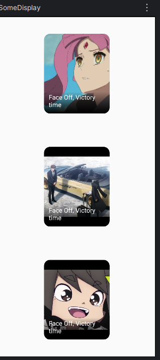
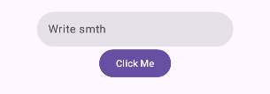
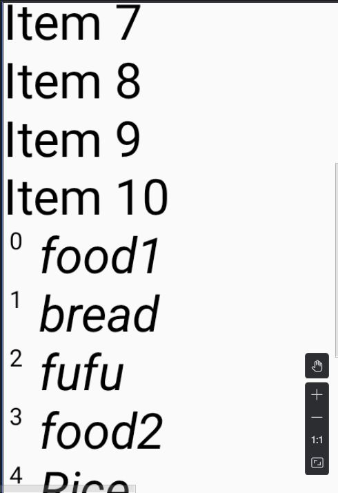
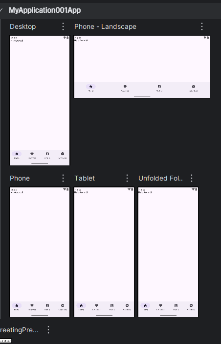

# Android Dev Note

## Importing Image Resources

```js

@Composable
fun ImageCard( painter: Painter, contentDesc: String, title:String,  modifier: Modifier = Modifier){
    Box(modifier = Modifier.fillMaxWidth(.5f).padding(16.dp)) {
        Card(modifier = modifier.fillMaxWidth(), shape = RoundedCornerShape(15.dp)) 
        {
            Box(modifier = Modifier.height(200.dp).fillMaxWidth()) {

                // Image Displayed
                Image( painter = painter, contentDescription = contentDesc, contentScale = ContentScale.Crop)

                // Gradient Background
                Box(
                    modifier = modifier.fillMaxSize().background(
                        Brush.verticalGradient(colors = listOf(Color.Transparent, Color.Black),startY = 400f)
                        )
                )

                // Image Title
                Box(
                    modifier = modifier.fillMaxSize().padding(12.dp),
                    contentAlignment = Alignment.BottomStart
                ) {
                    Text(title, style = TextStyle(Color.White), fontSize = 16.sp)
                }
            } // Box

        } // Card
    }// end Box
}

// Usage of function
    @Composable
    fun SomeDisplay(){

        val desc = "This is the face of victory"
        val title = "Face Off, Victory time"
        val face1 = painterResource(id = R.drawable.face_a)
        val car1 = painterResource(id = R.drawable.car_a)
        val face2 = painterResource(id = R.drawable.face_b)

        Column(modifier = Modifier.fillMaxSize(), verticalArrangement = Arrangement.SpaceAround, horizontalAlignment = Alignment.CenterHorizontally) {

                ImageCard(painter =face1, contentDesc = desc, title = title)
                ImageCard(painter =car1, contentDesc = desc, title = title)
                ImageCard(painter =face2, contentDesc = desc, title = title)
        }
    }


```



## Basic Scaffolding w/ Topbar

### Basic 1

```js
 Scaffold(
        modifier = Modifier.fillMaxSize(),

        topBar = { TopAppBar(
            title = { Text("TextQ") } ,
            navigationIcon = {Icon(imageVector = Icons.Default.Home, contentDescription = null)  },
            actions ={
                IconButton(onClick = {}) {Icon(imageVector = Icons.Default.Search, contentDescription = null)}
                IconButton(onClick = {}) {Icon(imageVector = Icons.Default.AddCircle, contentDescription = null)}
            }
            ) },

           bottomBar = {
            NavigationBar() {
                NavigationBarItem(
                    selected = false, onClick = {},
                    icon = { Icon(imageVector = Icons.Filled.Create, contentDescription = null) }
                )
                NavigationBarItem(
                    selected = false, onClick = {},
                    icon = { Icon(imageVector = Icons.Filled.Build, contentDescription = null) }
                )
            }
        },
                    },
        snackbarHost = {SnackbarHost(hostState = snackBar, modifier = Modifier.imePadding())}

    ){ /* paddingValues -> */
        Column(
            modifier = Modifier
                .padding(top = it.calculateTopPadding()).fillMaxHeight(.2f),
            verticalArrangement = Arrangement.Center,
            horizontalAlignment = AbsoluteAlignment.Right
        ) {
            ...
        }
    }
```


## Fields

### TextFields and Button

```js

    val snackbar = remember{ SnackbarHostState() }
    var textField by remember{ mutableStateOf("")}
    val scope = rememberCoroutineScope()
...

    TextField(
        modifier = Modifier.fillMaxWidth().height(50.dp),
        value = textField,
        onValueChange = {textField = it},
        label = {Text("Input your name")},
        singleLine = true
    )

    Spacer(modifier = Modifier.height(20.dp).fillMaxWidth())
    Button(
        onClick = {
            scope.launch {
                snackbar.showSnackbar("Hello $textField")
            }
        }){ Text("Click Me!") }
```



## LazyColumn List Loading

```js
class MainActivity : ComponentActivity() {
    override fun onCreate(savedInstanceState: Bundle?) {
        super.onCreate(savedInstanceState)
//        enableEdgeToEdge()
        setContent {
            ListFoodItems()
        }
    }
}


@Composable
fun ListTask(){
    Column(modifier = Modifier.fillMaxSize(), 
    verticalArrangement = Arrangement.Center,
     horizontalAlignment = Alignment.CenterHorizontally){
        for (i in 1 ..50)
        {
            Text("Item $i",
                fontWeight = FontWeight.ExtraBold,
                fontSize = 50.sp)
        }
    }
}

@Preview(showBackground = true)
@Composable
fun ListFoodItems(){
    val itemsIndxList = listOf("food1", "bread", "fufu","food2", "Rice", "Bread", "Egusi", "Ogbono", "Ewedu", "Ajekuke")
    LazyColumn(modifier = Modifier.fillMaxWidth())
    {
        items(50){
            val i1 = it + 1
            Text("Item $i1", fontSize = 25.sp)
            
        }
       itemsIndexed(itemsIndxList) {ind, str ->
           Row() {
               Text(" $ind ", fontSize = 12.sp)
               Spacer(Modifier.width(5.dp))
               Text( str, fontSize = 25.sp, fontStyle = FontStyle.Italic)

           }
       }
    }
}
```



## New Library catalogue declaration

implementation("androidx.constraintlayout:constraintlayout-compose:1.1.1") in the new library catalog declaration


## Navigation Menu Code

```js

enum class AppDestinations(val label: String, val icon: ImageVector) {
    HOME("Home", Icons.Default.Home),
    FAVORITES("Favorites", Icons.Default.Favorite),
    PROFILE("Profile", Icons.Default.AccountBox),
    ADD("Add Note", Icons.Default.AddCircle )
}

fun MyApplication001App() {
    var currentDestination by rememberSaveable { mutableStateOf(AppDestinations.HOME) }

    NavigationSuiteScaffold(
        navigationSuiteItems = {
            AppDestinations.entries.forEach {
                item(
                    icon = { Icon(imageVector = it.icon, contentDescription = it.label)
                    },
                    label = { Text(it.label) },
                    selected = it == currentDestination,
                    onClick = { currentDestination = it }
                )
            }
        }
    ) {
        Scaffold(modifier = Modifier.fillMaxSize()) { innerPadding ->
            Greeting(
                name = "Android",
                modifier = Modifier.padding(innerPadding)
            )
        }
    }
}

```
<figure markdown='span'>
    
</figure>


## ExposedDropdownMenu - (Spinner)

```js
Column(modifier = modifier.padding(16.dp),
            horizontalAlignment = Alignment.Start, verticalArrangement = Arrangement.SpaceEvenly) {

            var isExpanded by remember { mutableStateOf(false) }
            val priorityList = listOf( "Low", "Medium", "High")
            var priorityText by remember { mutableStateOf(priorityList[0]) }

            var task by remember{mutableStateOf("")}
            // For the input side

                ExposedDropdownMenuBox(
                    modifier = Modifier.height(50.dp),
                    expanded = isExpanded,
                    onExpandedChange = {isExpanded = !isExpanded}
                ) {
                    TextField(
                        value = priorityText,
                        onValueChange = {  },
                        readOnly = true,
                        trailingIcon = { ExposedDropdownMenuDefaults.TrailingIcon(expanded=isExpanded)},
                        colors = ExposedDropdownMenuDefaults.textFieldColors(),
                        modifier = Modifier.menuAnchor(type = ExposedDropdownMenuAnchorType.PrimaryNotEditable, enabled = !isExpanded)
                    )

                    ExposedDropdownMenu(
                        expanded = isExpanded,
                        onDismissRequest = { isExpanded = false}
                    ) {
                        priorityList.forEach { item ->
                            DropdownMenuItem(
                                text = { Text( item, color = MaterialTheme.colorScheme.onSurface) },
                                onClick = {
                                        priorityText = value
                                        isExpanded=false
                                },
                                contentPadding = ExposedDropdownMenuDefaults.ItemContentPadding
                            )
                        }

                    }
                }
            

            Spacer(Modifier.height(10.dp))

            Text("Currently Selected Priority = $priorityText" )


```
