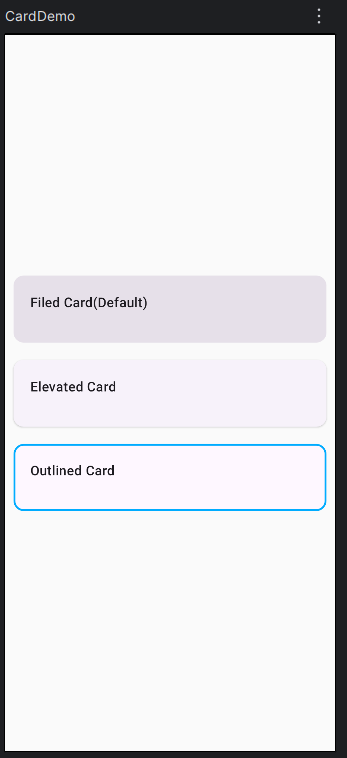

# Material3 UI Documentation

## NavigationDrawer

```kotlin

@Serializable
data object ListInternalRoute : NavKey

@Serializable
data object ListRootRoute : NavKey

@Serializable
data object BoxTestRoute: NavKey


@Composable
fun NavDrawerDemo(){

    val drawerState = rememberDrawerState(initialValue = DrawerValue.Closed)
    val scope = rememberCoroutineScope()
    var currentRoute: NavKey by remember { mutableStateOf(BoxTestRoute) }

//    val backStack = rememberNavBackStack(BoxTestRoute)
    val backStack = remember{ mutableStateListOf<NavKey>(BoxTestRoute) }

    ModalNavigationDrawer(

        drawerState = drawerState,
        drawerContent = {
            ModalDrawerSheet {

                Column(
                    modifier = Modifier
                        .verticalScroll(rememberScrollState()).padding(12.dp)
                ) {
                    // Header
                    Spacer(Modifier.height(12.dp))
                    Text("Nav Drawer Demo", style = MaterialTheme.typography.titleLarge)
                    HorizontalDivider()

                    //Section - 1
                    Text("Section 1", style = MaterialTheme.typography.titleMedium)
                    // Item 1
                    NavigationDrawerItem(
                        selected = currentRoute == ListInternalRoute,
                        onClick = {
                            currentRoute = ListInternalRoute
                            backStack.add(ListInternalRoute)
                            scope.launch { drawerState.close() }

                        },
                        label={Text("List Internal")},
                    )

                    // Item 2
                    NavigationDrawerItem(
                        selected = currentRoute == ListRootRoute,
                        onClick={
                            currentRoute = ListRootRoute
                            backStack.add(ListRootRoute)
                            scope.launch { drawerState.close() }
                        },
                        label = {Text("List Root -(File Manager)")}
                    )

                    // Item 3
                    NavigationDrawerItem(
                        selected = currentRoute == BoxTestRoute,
                        onClick={
                            currentRoute = BoxTestRoute
                            backStack.add(BoxTestRoute)
                            scope.launch { drawerState.close() }
                        },
                        label = {Text("Box Test")}
                    )

                    HorizontalDivider(Modifier.padding(vertical = 12.dp))

                    //Section - 2
                    Text("Section 2", style = MaterialTheme.typography.titleMedium)
                    // Item 4 - Setting
                    NavigationDrawerItem(
                        selected = false,
                        onClick={},
                        label = {Text("Settings")},
                        icon = { Icon(Icons.Filled.Settings, "Settings") }
                    )

                    // Item 5 - User Profile
                    NavigationDrawerItem(
                        selected = false,
                        onClick={},
                        label = {Text("User Profile")},
                        icon = { Icon(Icons.Filled.Person, "User Profile") }
                    )

                } // Col
            } // end Sheet
        }, // end DrawContent
    ) {
        Box(Modifier.fillMaxSize().background(Color.DarkGray),
            Alignment.TopEnd){

            IconButton(modifier = Modifier.size(50.dp).offset(x=(-30).dp, 30.dp),
                onClick = {
                    scope.launch {
                        if(drawerState.isClosed) drawerState.open()
                        else drawerState.close()
                    }
                }) {
                Icon(Icons.Filled.Add, null)
            }
        }


        NavDisplay(
            backStack = backStack,
            onBack = {backStack.removeLastOrNull()},
            entryProvider = entryProvider {
                entry<ListRootRoute> {
                    ListRootFoldersAndFiles()
                }
                entry<ListInternalRoute>{
                    ListInternal()
                }
                entry<BoxTestRoute> {
                    BoxTest()
                }
            }
        )
    } // end ModalNavigationDrawer

}
```

## NavDisplay Example

```kotlin

@Serializable
sealed interface NavRoute : NavKey{
    val label: String
    val selIcon: ImageVector
    val unselIcon: ImageVector

    companion object{
        val entries = listOf(HOME, EMAILDETAILS, NEWEMAIL, SEARCH, SETTINGS )
    }
}
@Serializable
data object HOME : NavRoute {
    override val label = "Home"
    override val selIcon = Icons.Filled.Home
    override val unselIcon = Icons.Outlined.Home
}

@Serializable
data object EMAILDETAILS : NavRoute {
    override val label="Emails"
    override val selIcon=Icons.Filled.Email
    override val unselIcon=Icons.Outlined.Email
}

@Serializable
data object NEWEMAIL: NavRoute {
    override val label="New"
    override val selIcon=Icons.Default.Add
    override val unselIcon=Icons.Outlined.Add
}

@Serializable
data object SEARCH: NavRoute {
    override val label="Search"
    override val selIcon=Icons.Default.Search
    override val unselIcon=Icons.Outlined.Search
}

@Serializable
data object SETTINGS: NavRoute {
    override val label="Settings"
    override val selIcon=Icons.Default.Settings
    override val unselIcon=Icons.Outlined.Settings
}


@OptIn(ExperimentalMaterial3Api::class)
@Composable
fun MainScreen(
toSettingsMenu : ()->Unit
){


    val navbs = remember { mutableStateListOf<NavKey>(HOME) }
    Scaffold(
        modifier = Modifier.fillMaxSize(),
        topBar = { TopAppBar(
            title = { Text("Home", textAlign = TextAlign.Center, modifier = Modifier.fillMaxWidth()) },
        )},
        bottomBar = {
            NavigationBar {
                NavRoute.entries.forEach { route ->
                    val isSelected = navbs.lastOrNull() == route
                    NavigationBarItem(
                        selected = isSelected,
                        onClick = { navbs.add(route)},
                        icon = {
                            Icon(imageVector = if(isSelected) route.selIcon else route.unselIcon,
                                contentDescription = route.label) },
                        label = { Text(route.label)}
                    )
                }
            }
        }

    ) {innerpad->
        Column(
            modifier = Modifier
                .fillMaxSize()
                .padding(innerpad), verticalArrangement = Arrangement.Center, horizontalAlignment = Alignment.CenterHorizontally
        ) {
            NavDisplay(
                backStack = navbs,
                onBack = {navbs.removeLastOrNull()},
                entryProvider = entryProvider{
                     entry <HOME> { HomeScreen() }
                    entry <EMAILDETAILS>{ EmailDetailsScreen() }
                    entry <NEWEMAIL>{ NewEmailScreen()  }
                    entry <SEARCH>{ SearchScreen() }
                    entry <SETTINGS>{ SettingsScreen(onClickSettingsMenu =toSettingsMenu )}
                }
            )
        }
    }

}

```

## Box Example

In Jetpack Compose, the `Box` layout is used to stack elements on top of each other,
similar to a `FrameLayout` in traditional Android Views. When using Material 3,
you typically use Box to position Material components like Buttons, Cards, or Icons in specific locations using alignments.

Basic Box Implementation
A `Box` allows you to align children globally using `contentAlignment` or individually using 
the `.align()` modifier on children

```kotlin
@Composable
fun Material3BoxExample() {
    // Surface provides the Material 3 background color and elevation
    Surface(
        color = MaterialTheme.colorScheme.background
    ) {
        Box(
            modifier = Modifier.fillMaxSize(),
            contentAlignment = Alignment.Center // Centers children by default
        ) {
            // Background element
            Box(
                modifier = Modifier
                    .size(100.dp)
                    .background(MaterialTheme.colorScheme.primaryContainer)
            )
                // This image will be at the bottom layer
                Image(
                    painter = painterResource(id = R.drawable.profile),
                    contentDescription = null
                )
                // This text will be centered on top of the image
                Text("User Profile")
                        
            // Text stacked on top
                Text(
                    text = "Centered Text",
                    color = MaterialTheme.colorScheme.onPrimaryContainer
                )
                
                // Element positioned at a specific corner
                Text(
                    text = "Top Start",
                    modifier = Modifier.align(Alignment.TopStart),
                    style = MaterialTheme.typography.labelSmall
                )
        }
    }
}
```

## Card Example

In Jetpack Compose, the Material 3 Card serves as a flexible container to group related information. 
Material 3 offers three main card variants: `Filled`, `Elevated`, and `Outlined`

<figure markdown='span'>

</figure>

```kotlin
@Composable
fun CardDemo(){

    val modifier = Modifier.fillMaxWidth().height(100.dp).padding(horizontal = 10.dp, vertical = 10.dp)
    val style = MaterialTheme.typography.titleMedium
    val texModifier = Modifier.padding(start = 20.dp, top = 20.dp)


    Box(modifier = Modifier.fillMaxSize(),
        contentAlignment = Alignment.Center
    ){

        Column() {
            Card(modifier=modifier){
                Text("Filed Card(Default)", modifier=texModifier, style=style)
            }

            ElevatedCard(modifier=modifier) {
                Text("Elevated Card", modifier=texModifier, style=style)
            }

            OutlinedCard(modifier=modifier, border = BorderStroke(2.dp, Color(0xFF00ACFF))) {
                Text("Outlined Card", modifier=texModifier, style=style)
            }

        }
    }

}
```
