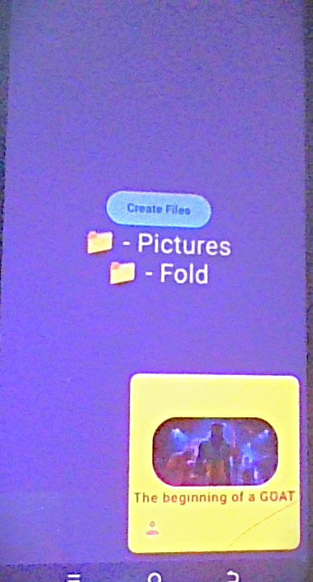

# Android UI Basic Examples

# Box Usage example

<figure markdown='span'>

</figure>

```kotlin
 // Main Box For Framing Inner Box
   Box(
       contentAlignment = Alignment.Center,
       modifier=Modifier.fillMaxHeight().fillMaxWidth().background(Color.Black.copy(alpha = 0.3f))
   ){
       
       // Box to be Positioned 
       Box(
           contentAlignment = Alignment.Center,
           modifier = Modifier.size(200.dp)
               .offset(y= (-50).dp, x=(-10).dp)
               .background(color= Color(0xFFFFAC00), shape = RoundedCornerShape(10.dp))
               .align (Alignment.BottomEnd)
       ) {
           Column(horizontalAlignment = Alignment.CenterHorizontally) {
               Image(painter = painterResource(R.drawable.pose_pic),
                   contentDescription = "Pose Pic",
                   // Basic Tint
                   colorFilter = ColorFilter.tint(color=Color.Blue.copy(alpha=0.5f), blendMode = BlendMode.Multiply),
                   contentScale = ContentScale.Crop,
                   modifier = Modifier.size(width = 150.dp, height = 80.dp).clip(RoundedCornerShape(30.dp))
               )
               Text("The beginning of a GOAT", color = Color.DarkGray, fontWeight = FontWeight.Bold)
           }

           Icon(imageVector = Icons.Filled.Person, contentDescription = null,
               tint = Color.Gray,
               modifier= Modifier.align(Alignment.BottomStart).offset(x=(15.dp), y=(-15).dp)
           )

       }
   }
```