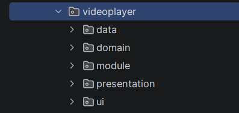
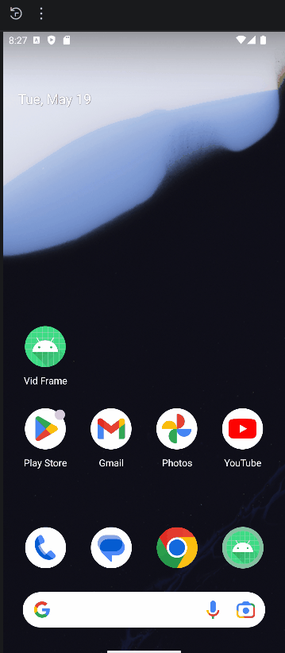

# Video Frame App Documentation

## Video Frame App Basics

Here we are going to just handle add only uri to the database.

!!! Note
    Android studio Panda 4 is used. the version of gradle processor(agp) version 9 `agp=9.x.x`  


### Setting Up Dependencies

1. Setup dependencies in `lib.versions.toml`

    ```toml

    [versions]
    agp = "9.2.1"
    # . . . Other Versions 

    # version variables
    kotlin = "2.3.0"
    kspVersion = "2.3.7"
    hiltVersion = "2.59.2"
    hiltNav="1.3.0"
    roomVersion = "2.8.4"

    materialIcons = "1.7.8" # Default material Icons


    [libraries]

    # Map your variables to actual dependencies
    # . . . Other Libraries
    hilt-android = {module="com.google.dagger:hilt-android", version.ref="hiltVersion"}
    hilt-compiler = {module="com.google.dagger:hilt-compiler", version.ref="hiltVersion"}
    hilt-nav-compose = {group="androidx.hilt", name="hilt-navigation-compose", version.ref="hiltNav"}

    androidx-room-runtime = { group = "androidx.room", name = "room-runtime", version.ref = "roomVersion" }
    androidx-room-compiler = { group = "androidx.room", name = "room-compiler", version.ref = "roomVersion" }
    androidx-room-ktx = { group = "androidx.room", name = "room-ktx", version.ref = "roomVersion" }

    androidx-material-icons = { group = "androidx.compose.material", name="material-icons-core", version.ref = "materialIcons" }

    # . . . Remaining Others


    [plugins]
    # Define your Gradle plugins
    # . . . Other Plugins

    kotlin-android = {id="org.jetbrains.kotlin.android", version.ref="kotlin"}
    hilt-android = {id="com.google.dagger.hilt.android", version.ref="hiltVersion"}
    ksp = {id="com.google.devtools.ksp", version.ref="kspVersion"}

    ```

2. In your `build.gradle.kts` (Project: Your Project) Level add the following Alias

    ```kts
        // Necessary Plugins
        alias (libs.plugins.kotlin.android) apply false
        alias (libs.plugins.ksp) apply false
        alias (libs.plugins.hilt.android) apply false

    ```

3. Then in your `build.gradle.kts` (Module: App) Level add the following:

    ```kts
        plugins {

        //. . . others

            alias (libs.plugins.ksp)
            alias (libs.plugins.hilt.android)
        
        }

        android {. . . }

        dependencies {

            // . . . others

            implementation(libs.hilt.android)
            ksp(libs.hilt.compiler)
            implementation(libs.hilt.nav.compose)


            implementation(libs.androidx.room.runtime)
            ksp(libs.androidx.room.compiler)
            implementation(libs.androidx.room.ktx)
        }

    ```

### Setting Up Hilt Basics

1. Create Android App Class Level for Context accessing

    ```kotlin title='VideoFrameApp.kt'
    //...Imports
    @HiltAndroidApp
    class VideoFrameApp: Application() {
    }
    ```

2. In Manifest add `android:name ='.VideoFrameApp'` in your `<application>...</aplication>` xml

    ```xml
        <application
        android:name=".VideoFrameApp"
        ...>
        </application>
    ```

3. Add Android Entry point to MainActivity

    ```kotlin title="MainActivity.kt"
    //...imports

    @AndroidEntryPoint
    class MainActivity : ComponentActivity() {
        ...
    }
    ```

### Basic Database Setup

First let create necessary packages that we will use for now, namely:
**data, domain, presentation, module and ui** packages



### Necessary Room Setups

1. in **data** package create Database and Entity(table) with minimal fields

    ```kotlin title="VideoEntity.kt"
    package com.esenla.vidframe.videoplayer.data
    // ... imports

    @Entity(tableName = "videos")
    data class VideoEntity(
        @PrimaryKey(autoGenerate = true)
        val id : Int = 0,
        val uri : Uri
    )

    class UriConverters {
        @TypeConverter
        fun fromUri(uri: Uri?): String? = uri?.toString()

        @TypeConverter
        fun toUri(uriString: String?): Uri? = uriString?.toUri()
    }


    ```

2. Create basic Data Access Objects (Dao) for editing the uri passed

    ```kotlin title="VideoDao.kt"
    package com.esenla.vidframe.videoplayer.data

    // ...imports

    @Dao
    interface VideoDao {

        @Query("SELECT * FROM videos")
        fun getAllVideos(): Flow<List<VideoEntity>>

        @Upsert
        suspend fun insert(vid: VideoEntity)

        @Update
        suspend fun update(vid: VideoEntity)

        @Delete
        suspend fun delete(vid: VideoEntity)
    }
    ```

3. create Database for the table and dao

```kotlin title="VideoDatabase.kt"
package com.esenla.vidframe.videoplayer.data

//...imports

@Database(entities = [VideoEntity::class], exportSchema = false, version = 1)
@TypeConverters(UriConverters::class)
abstract class VideoDatabase: RoomDatabase() {
    abstract fun videoDao() : VideoDao
}
```

### Repository to access data

first in your **domain** package, create:

* `Video` data class: this will hold Video Metadata. for now we will just add `uri`
* `VideoRepo` Interface: the interface for access data

    ```kotlin title="Video.kt"
        package com.esenla.vidframe.videoplayer.domain
        import android.net.Uri

        data class Video(
            val id : Int = 0,
            val uri : Uri
        )

    ```

* Then create your `VideoRepo`

    ```kotlin title="VideoRepo.kt"
        package com.esenla.vidframe.videoplayer.domain

        //...imports

        interface VideoRepo {
            fun getVideoList() : Flow<List<Video>>

            suspend fun addVideo( vidUri: Uri)
            suspend fun updateVideo(vid : Video)
            suspend fun deleteVideo(vid: Video)
        }
    ```

Go back to **data** package and add `VideoRepoImpl` Implementation of our interface

```kotlin title="VideoRepoImpl.kt"
    package com.esenla.vidframe.videoplayer.data

    //...imports

    class VideoRepoImpl @Inject constructor(
        private val videoDao: VideoDao
    ): VideoRepo {
        override fun getVideoList(): Flow<List<Video>> {
            return videoDao.getAllVideos().map { flow ->
                flow.map { entity ->
                    Video( 
                    id = entity.id,
                    uri = entity.uri
                    )
                }
            }
        }

        override suspend fun addVideo(vidUri: Uri) {
            videoDao.insert(VideoEntity(uri = vidUri))
        }

        override suspend fun updateVideo(vid: Video) {
            videoDao.update(VideoEntity(id=vid.id, uri=vid.uri))
        }

        override suspend fun deleteVideo(vid: Video) {
            videoDao.delete(VideoEntity(id=vid.id, uri = vid.uri))
        }
    }
```

For our `@Inject` to work, we need to let hilt know how to handle it.
Goto our **module** package add:

```kotlin title="VideoPlayerAppModule.kt" hl_lines="20-22"
package com.esenla.vidframe.videoplayer.module
//...imports

@InstallIn(SingletonComponent::class)
@Module
object VideoPlayerAppModule {

    // VideoDatabase is needed by VideoDao, so we let hilt know
    @Provides
    fun provideVideoDatabase(@ApplicationContext app: Context) : VideoDatabase{
        return Room.databaseBuilder(
            app,
            VideoDatabase::class.java,
            "videos_db"
        ).build()
    }

    // This is VideoDao that VideoRepoImpl injects
    @Provides
    fun provideVideoDao(videoDatabase : VideoDatabase) : VideoDao{
        return  videoDatabase.videoDao()
    }
}
```

!!! Note
    its Generally, any name works  so far it has `AppModule` as part of it (I think)

### ViewModel to Access Repository

In our **presentation** package, create ViewModel class:

```kotlin title="VideoViewModel.kt"
    package com.esenla.vidframe.videoplayer.presentation

    //...imports

    @HiltViewModel
    class VideoViewModel @Inject constructor(
        private val videoRepo: VideoRepo): ViewModel() {

        // read all videos
        val video_list = videoRepo.getVideoList().stateIn(
            viewModelScope, SharingStarted.Lazily, emptyList())


        // write to database
        fun addVideo(uri: Uri){
            viewModelScope.launch{
                videoRepo.addVideo(uri)
            }
        }

    }
```

Again for hilt to understand our `@Inject` code, we need to create a `Repo Binds` in our **module** package

```kotlin title="VideoPlayerRepoModule.kt"
package com.esenla.vidframe.videoplayer.module

//...imports

@InstallIn(SingletonComponent::class)
@Module
abstract class VideoPlayerRepoModule {

    // let ViewModel know what we are binding
    @Binds
    abstract fun bindVideoRepo(imp: VideoRepoImpl): VideoRepo
}
```

### UI access to our ViewModel

in our **ui** package, let add a Screen to display our uris

```kotlin title="VideoListScreen.kt"
package com.esenla.vidframe.videoplayer.ui

//...imports


@Composable
fun VideoListScreen(
    videoViewModel: VideoViewModel = hiltViewModel()
){
    val allvideos by videoViewModel.video_list.collectAsStateWithLifecycle()

    val videoPick = rememberLauncherForActivityResult(
        contract = ActivityResultContracts.PickVisualMedia()
    ) { uri ->

        uri?.let {
                videoViewModel.addVideo(uri)
            }

    }

    Scaffold(
        floatingActionButton = {
            FloatingActionButton(onClick = {
                videoPick.launch(
                    input = PickVisualMediaRequest(mediaType = ActivityResultContracts.PickVisualMedia.VideoOnly)
                )
            }) {
                Icon(imageVector = Icons.Default.Add , contentDescription = "Add")
            }
        }
    ) { innerPadding ->
        LazyColumn(modifier = Modifier.padding(innerPadding)) {
            items(allvideos){  vid ->
                Text("${vid.uri }")
                HorizontalDivider(thickness = 2.dp, color = DividerDefaults.color)

            }
        }

    }

}

```

!!! Note
    for `videoViewModel: VideoViewModel = hiltViewModel()` to work in your injection,
    make sure you have **hilt navigation compose** in your gradle build
    `hilt-nav-compose = {group="androidx.hilt", name="hilt-navigation-compose", version.ref="hiltNav"}`

### Launch the App

<figure markdown='span' style="width: 250px">

</figure>
