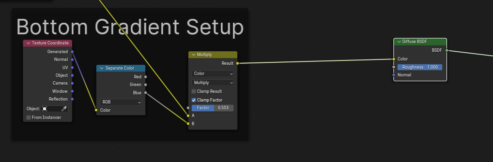
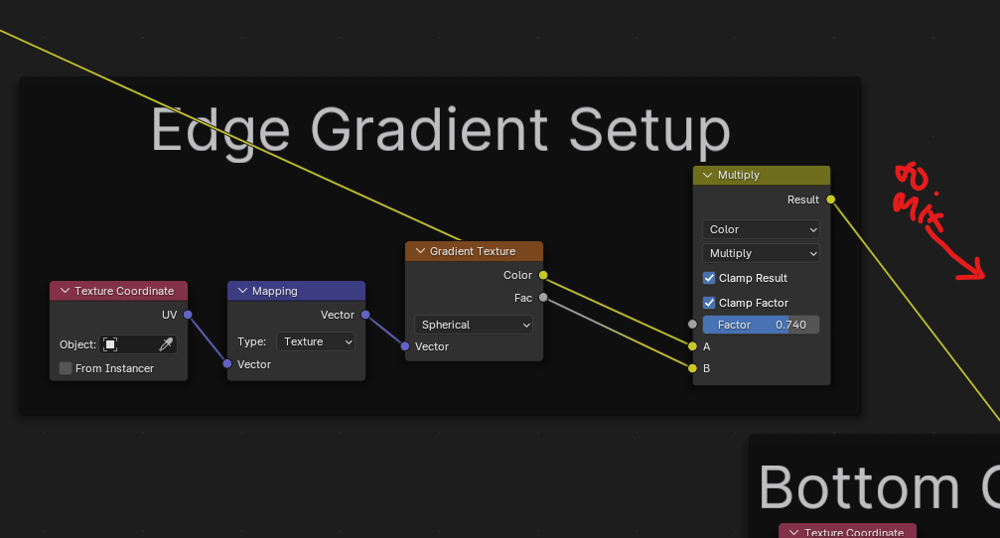
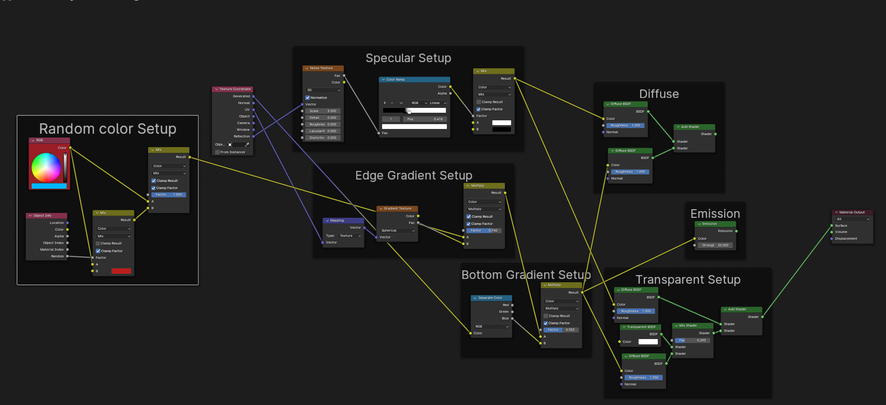

# Blender Node

This documents the knowledge applicable to all the node views

* Shader Node
* Geometry Node
* Compositor Node

## CW Shader Connection

Bottom Gradient Connection

Edge gradient connection

All the setup connected

## SHORT CUTS

| Short Cut   | Description                          |
| :---------- | :----------------------------------- |
| CTR+J       | Add Frame Node to selection of Node(s)  |
| ALT+P       | Remove Frame Node from Node(s) |
| ALT+S       | Switch Connect inputs |
| CTR+H   | Hide Unused input/outputs values in sel. node |
| CTR+ SHT +RM Drag   | Lazy connect and Create a Mix node|
| CTR + RM Drag   | Cut Connect link|
| ALT + RM Drag   | Lazy connect link|
| SHT + RM Drag   | Create re-route node link|