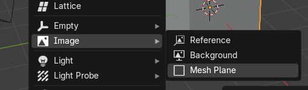

# Blender Rigs

## Face Rig with Textures

* Shift + A  - Image > Mesh Plane

* Make sure they read up in order and check `Detect image sequence` is checked then click import **image as plane button**

* Image Mesh Plane with Material is created.
  
Go to you shader editor, change from `single image` to `image sequence`

We will be changing the offset for the animation to happen