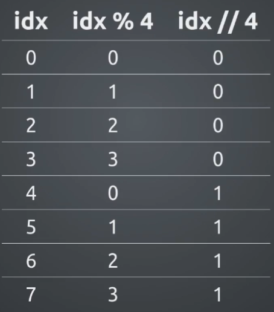
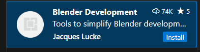
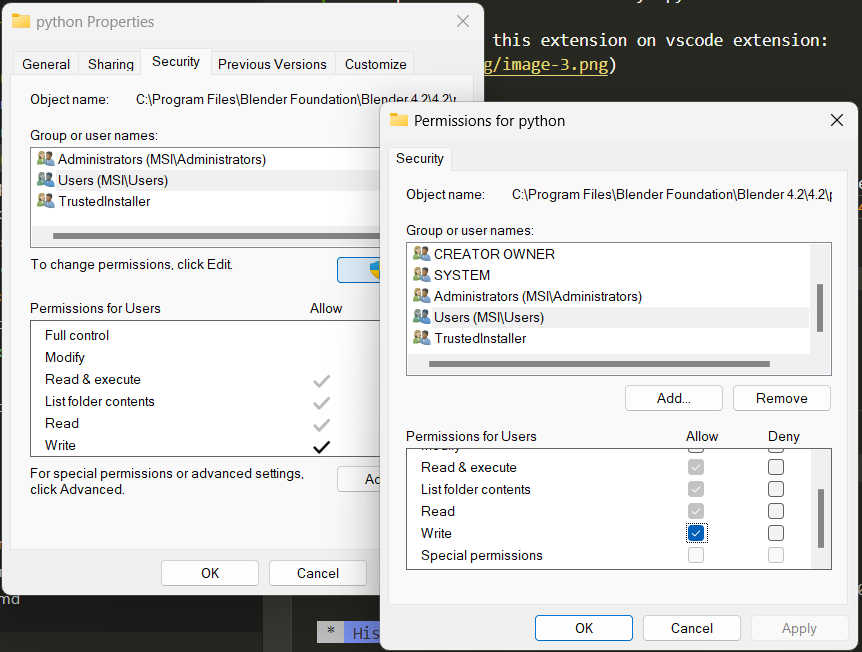
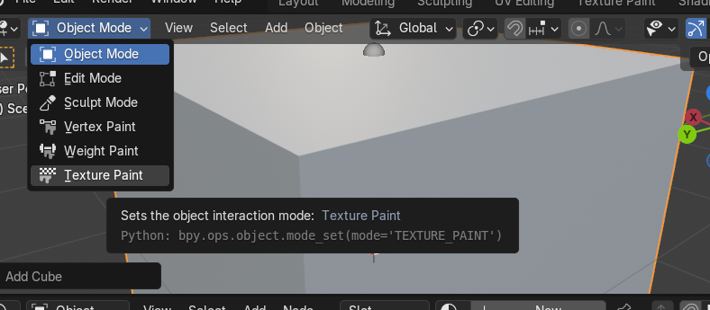
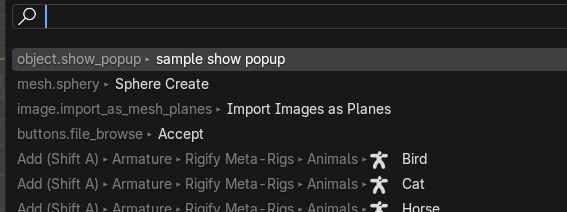

# Blender Scripting

## Useful tricks

### align objects in a Grid of interval

<figure markdown="span">
{width=300px}
<figcaption> example of 8 items in interval of 4</figcaption>
</figure>

say if you have total object 24, to be arranged in 4 rows

```py
for idx in range(24):
    x = idx % 4
    y = idx // 4 # math.floor(idx/4)
```


## BLENDER SETUP

### Making blender work on Vscode

For Vscode to be able to read blender codes

```bash
pip install fake-bpy-module-latest
```

this provides all the necessary bpy module-like

- Then install this extension on vscode extension:


- CTRL + SH + P - blender : start
  incase you run into an error, do the follow

  goto your directory where blender python is installed:
    `C:\Program Files\Blender Foundation\Blender 4.2\4.2\python`
  - R+CLK - `properties > security`
  - Under (group or user) scrolled down to `User` and click `Edit` button
  - check the option to `write` then ok it



### Getting Started with blender Addons

minimum file structure

```bash

my_extension-0.0.1.zip
├─ __init__.py
├─ blender_manifest.toml
└─ (...)

```

## BASIC & GENERIC SCRIPTS

The first thing to understand is that everything created in the view port is an object.


The first goto is the `bpy.context` this gives you access to the current selection objects.

### Accessing active object

To access a select single object use `bpy.context.object` or `bpy.context.active_object`

```bash
>>> bpy.context.object #bpy.data.objects['sq_00']
>>> bpy.context.object #bpy.data.objects['Cube']
```


### Accessing all selected objects

for multiple selected objects use `bpy.context.selected_objects`
it returns a list of select objects

```bash
bpy.context.selected_objects
[bpy.data.objects['sq_00'], bpy.data.objects['Cube']]

```

### Making an object active programmatically

```py
bpy.context.view_layer.objects.active = bpy.data.objects['eye_01']
```

### Access DATA-BLOCK of active element

The `bpy.context.object.data` depending on what you select, it gives you access to the data-block item of such selection


```bash
>>> bpy.context.object.data #bpy.data.meshes['Cube.001']
>>> bpy.context.object.data #bpy.data.armatures['Armature']
>>> bpy.context.object.data #bpy.data.meshes['sq_00']
>>> bpy.context.object.data #bpy.data.lattices['Lattice']

```

### Check type of object

```py
bpy.context.object.type # 'ARMATURE'
```


### Switch between modes

you can switch between `OBJECT, EDIT` and other modes.

```bash
    # Enter Edit mode
    >>> bpy.ops.object.mode_set(mode = 'EDIT') 
```

base on the object e.g for bone you have `POSE` and for Meshes you have `VERTEX_MODE` and more. You can check it by hovering over the mode 

<figure markdown="span">
{width: 400px}
</figure>

### Listing all Active objects (DATA)

```py
for n in bpy.data.objects:
    n.name, n.type, n.__class__.__name__
'''
('Camera', 'CAMERA', 'Object')
('Cylinder', 'MESH', 'Object')
('Icosphere', 'MESH', 'Object')
('Light', 'LIGHT', 'Object')
'''
```

### Select all Active objects (OPS)

```py
# action param: TOGGLE, SELECT, DESELECT, INVERT
bpy.ops.object.select_all(action='DESELECT')

```

here item can take any of the following values:

```py
# item param: [‘MESH’, ‘CURVE’, ‘SURFACE’, ‘META’, ‘FONT’, ‘HAIR’, ‘POINTCLOUD’, ‘VOLUME’, 
# ‘GPENCIL’, ‘ARMATURE’, ‘LATTICE’, ‘EMPTY’, ‘LIGHT’, ‘LIGHT_PROBE’, ‘CAMERA’, ‘SPEAKER’]
bpy.ops.object.select_by_type(type=item)
```

### Remove Objects' Meshs(DATA)

```py
for n in bpy.data.objects:
    if n.type == 'MESH':
        bpy.data.objects.remove(n)
```

### Remove all Active  select (OPS)

```py
# bpy.ops.object.select_all() # 'SELECT' is default  
bpy.ops.object.select_all(action='SELECT') # 

bpy.ops.object.delete()
```

### Listing all Active Material nodes

```py
for n in bpy.data.materials[1].node_tree.nodes:
    n.name, n.type, n.__class__.__name__

'''
('Principled BSDF', 'BSDF_PRINCIPLED', 'ShaderNodeBsdfPrincipled')
('Material Output', 'OUTPUT_MATERIAL', 'ShaderNodeOutputMaterial')
'''
```

### Delete active object(s)

```py
 bpy.ops.object.delete()
 # {'FINISHED'}

 ```

## DRIVERS SCRIPTS

### Creating basic driver

Creating new driver on selected object property.
This returns the FCurve of the newly created driver

```py
'''Drivers for x, y, z location'''
bpy.data.objects[0].driver_add('location')
# [bpy.data.objects['Cube']...FCurve,
#  bpy.data.objects['Cube']...FCurve,
#   bpy.data.objects['Cube']...FCurve]

'''Driver for y location only'''
>>> bpy.data.objects[0].driver_add('location', 1)
# bpy.data.objects['Cube']...FCurve

'''Driver for y - euler rotation only'''
### bpy.context.object
>>> bpy.data.objects[0].driver_add('rotation_euler', 1)
# bpy.data.objects['Cube']...FCurve

```

### Simple driver demonstration

```py 

import bpy

#def custom_driver(v):
#    return v * 0.1
#bpy.app.driver_namespace['my_cus_drv'] = custom_driver

drv_z_rot_Fcurve = bpy.data.objects["Cube"].driver_add("location",  2)

# Driver section:
drv_z_rot = drv_z_rot_Fcurve.driver

var1_name = "var"

# DriverVariable section:
drv_z_rot.variables.new()
drv_z_rot.variables[0].name = var1_name
drv_z_rot.expression = f"{var1_name}*0.2"

drv_z_rot

#DriverTarget section:
# Types SINGE_PROP, ROTATION_DIFF, LOC_DIFF and CONTEXT_PROP
drv_z_rot.variables[var1_name].type = 'TRANSFORMS' 
drv_z_rot.variables[var1_name].targets[0].id = bpy.data.objects["Empty"]
drv_z_rot.variables[var1_name].targets[0].transform_type ="ROT_Z"

```
<figure markdown="span">

</figure>

### Driver to move the materials offset

```py
# Add driver to the material
img_offset_Fcurve = img1.active_material.node_tree.nodes["Image Texture"].\
    image_user.driver_add("frame_offset")

img_drv = img_offset_Fcurve.driver

var1 = "img_var"
img_drv.expression = f"abs({var1}*10)"

img_drv.variables.new()
img_drv.variables[0].name = var1

img_drv.variables[var1].type = 'SINGLE_PROP'
# ABS PATH: bpy.data.objects["arm2_obj"].pose.bones["Bone1"].location[1]
img_drv.variables[var1].targets[0].id = arm1 # bpy.data.objects["arm2_obj"]
img_drv.variables[var1].targets[0].data_path = "pose.bones[0].location[1]"
```

<figure markdown="span">
{align="center"}
</figure>


## MATERIAL RELATED SCRIPT


```py title="demo"
# CREATE a new material
mat1 = bpy.data.materials.new (name = "MatBasic")

# ACCESS individual material id or by name
bpy.data.materials[0]   
bpy.data.materials["MAT_01"] 

# CREATE a ndoe type  using 
mat1.node_tree.nodes.new(type="ShaderNodeBsdfDiffuse")

# ACCESS material nodes by index or by name
mat1.node_tree.nodes[0] # "Material Output"
mat1.node_tree.nodes["Diffuse BSDF.001"]
```

### Get the active material of object

```py
bpy.context.object.active_material # bpy.data.materials['eye_01']
```

### Create a Simple Icosphere Principled BDSF applied

```py
import random

def createNewMaterial():
    # create a new material
    mat = bpy.data.materials.new(name = "MatA")
    # enable the created material
    mat.use_nodes = True

    # mat1.node_tree.nodes.new(type="ShaderNodeBsdfDiffuse")

    prinBSDF = mat.node_tree.nodes['Principled BSDF']
    # Set the color of the material
    prinBSDF.inputs["Base Color"].default_value = (0.1, 0.2, 0.3, 1)
    # set the roughness 
    prinBSDF.inputs["Roughness"].default_value = 0.3
    # set the metallic
      prinBSDF.inputs["Metallic"].default_value = random.uniform(0.1, 1.0)

    return mat


''' Creating an Icosphere and apply material '''
def createIcoSphere():
    # create an icosphere and shade smooth it
    bpy.ops.mesh.primitive_ico_sphere_add(subdivisions=3)
    bpy.ops.object.shade_smooth()

    # Get the active object i.e icosphere
    active_object = bpy.context.active_object
    # Add the material to the object material list
    ico_mat = createNewMaterial()
    active_object.data.materials.append(ico_mat)
    
createIcoSphere()
```

## RIG RELATED

### Accessing the PoseBone and EditBones of a rig

Accessing the **Edit bones**

```py
bpy.context.object.data.edit_bones # edit bones list

bpy.context.object.data.edit_bones[0] 
# >>> bpy.data.armatures['arm2']...EditBone

bpy.context.object.data.edit_bones[0].name
# >>> 'Bone1'

bpy.context.object.data.edit_bones[0].tail
# Vector((0.0, 0.0, 0.3))

bpy.context.object.data.edit_bones[0].head
# Vector((0.0, 0.0, 0.0))
```

Accessing the **Pose Bones**

```py
bpy.context.object.pose.bones
# >>> bpy.data.objects['arm2_obj'].pose.bones

bpy.context.object.pose.bones[0] # access first in dict
## >>> bpy.data.objects['arm2_obj'].pose.bones["Bone1"]
```

### remove/delete all amarture in `bpy.data.armartures`

```py
[bpy.data.armatures.remove(a) for a in bpy.data.armatures]
[None, None, None]
```

### Getting location of rig or object

```py
bpy.context.active_object # >>> bpy.data.objects['arm2_obj']

bpy.context.active_object.location # >>>  Vector((0.0, 0.5, 0.0))

bpy.context.active_object.location[1] = .5

```

### Create an bone in a new Armature bone

You can create a new armature object with `bpy.ops`

```py
    bpy.ops.object.armature_add(enter_editmode=False, align='WORLD', 
    location=(0, 0, 0), scale=(1, 1, 1))
```

then get the newly created armature object and data consequently

```py
    bpy.context.active_object # bpy.data.objects['arm2_obj']
    bpy.context.active_object.data # bpy.data.armatures['arm2']
```

But better still is to use the `bpy.data` instead of `bpy.ops`

```py
import bpy, mathutils

def create_bone(name, head_pos, tail_pos):

    arm_name = "arm2"

    # Create object and Data for the armature
    arm_data = bpy.data.armatures.new(arm_name)
    arm_obj = bpy.data.objects.new(f"{arm_name}_obj", arm_data)

    # add it to collection and make active in view layer
    bpy.context.collection.objects.link(arm_obj)
    bpy.context.view_layer.objects.active = arm_obj

    # Enter the edit mode
    bpy.ops.object.mode_set(mode='EDIT')

    new_bone = arm_data.edit_bones.new(name)
    vec = mathutils.Vector(head_pos)
    new_bone.head = vec
    new_bone.tail = vec + mathutils.Vector(tail_pos) # example of how to set tail 
    
    # go back to object mode
    bpy.ops.object.mode_set(mode='OBJECT')
    
    return new_bone


create_bone("Bone1", (0,0,0), (0, 0.5, 1))

```
<figure markdown="span">
{width:100px}
</figure>

### Adding constrainst to a bone

Make sure you are in the pose mode

```py

bpy.context.object.pose.bones[0].constraints.new(type="LIMIT_LOCATION")
# Result: bpy.data.objects['arm2_obj'].pose.bones["Bone1"].constraints["Limit Location"]

cons_name = "Lim_Loc_Bone1" # constraint_name
arm1.pose.bones[0].constraints.new(type="LIMIT_LOCATION")
arm1.pose.bones["Bone1"].constraints[0].name = cons_name
arm1.pose.bones["Bone1"].constraints[cons_name].use_min_y = True
arm1.pose.bones["Bone1"].constraints[cons_name].min_y = -0.5

arm1.pose.bones["Bone1"].constraints[cons_name].use_max_y = True
arm1.pose.bones["Bone1"].constraints[cons_name].max_y = 0.5

arm1.pose.bones["Bone1"].constraints[cons_name].owner_space = 'LOCAL'
arm1.pose.bones["Bone1"].constraints[cons_name].use_transform_limit = True

```

## HELPER FUNCTIONS

### Helper function : DelectAll item

This function will Select and delete all item specified as `item`
if not specified, all selected objects in the scene will be deleted.

```py
'''
Function to Select and delete all selected item specified
if not specified, delete all selected
item can be:

['MESH', 'CURVE', 'SURFACE', 'META', 'FONT', 'HAIR', 'POINTCLOUD', 'VOLUME', 'GPENCIL', 'ARMATURE', 'LATTICE', 'EMPTY', 'LIGHT', 'LIGHT_PROBE', 'CAMERA', 'SPEAKER']
'''
def deleteAll(item = None):
    
    if (item == None):
        # select all objects
        bpy.ops.object.select_all(action='SELECT')
    else:
        # select all by item type
        bpy.ops.object.select_all(action='DESELECT')
        bpy.ops.object.select_by_type(type=item)

    # delete all selected
    bpy.ops.object.delete()

    # Delete unused materials
    bpy.ops.outliner.orphans_purge(do_local_ids=True, do_linked_ids=True, do_recursive=True)

```


### Adding and Removing material from object

```py
# cube = bpy.context.active_object
cube.data.materials.append(ico_mat) # Adding material to object
cube.data.materials.pop(index=0) # Removing material at index
cube.active_material_index #get/set index material
```

## BLENDER SCRIPT REFERENCE

### Node internals

**NodeInternal(Node)**
base classes — bpy_struct, Node  

subclasses — `CompositorNode`, `FunctionNode`, `GeometryNode`, `NodeFrame`, `NodeGroup`, `NodeGroupInput`, `NodeGroupOutput`,` NodeReroute`, `ShaderNode`, `TextureNode`

[https://docs.blender.org/api/current/bpy.types.NodeInternal.html#bpy.types.NodeInternal](https://docs.blender.org/api/current/bpy.types.NodeInternal.html#bpy.types.NodeInternal
)

### Creating a new Node Frame

```py
frame = mat1.node_tree.nodes.new(type="NodeFrame") # New Node frame
glass = mat1.node_tree.nodes.new(type='ShaderNodeBsdfGlass')
trans = mat1.node_tree.nodes.new(type='ShaderNodeBsdfTransparent')
# Adding the node Frame to Nodes
glass.parent = frame
trans.parent = frame

# Slightly different for node group
group = mat1.node_tree.nodes.new(type='ShaderNodeGroup')
group.node_tree = bpy.data.node_groups.new("A Group", "ShaderNodeTree") # New Node
group.node_tree = bpy.data.node_groups["NodeGroup"] # already existing

```

list of shader Nodes  
[https://docs.blender.org/api/current/bpy.types.ShaderNode.html](https://docs.blender.org/api/current/bpy.types.ShaderNode.html)

### Creating a Node Group(globally)

```py
bpy.data.node_groups.new("A Group", "ShaderNodeTree")
# bpy.data.node_groups['A Group']

D.node_groups.new(name = "A Group", type ="ShaderNodeTree")
# bpy.data.node_groups['A Group.001']
```

### Group Node Sample

```py
import bpy

# create a group
test_group = bpy.data.node_groups.new(name='testGroup', type='ShaderNodeTree')

# create group inputs
group_inputs = test_group.nodes.new('NodeGroupInput')
group_inputs.location = (-350,0)
test_group.inputs.new('NodeSocketFloat','in_to_greater')
test_group.inputs.new('NodeSocketFloat','in_to_less')

# create group outputs
group_outputs = test_group.nodes.new('NodeGroupOutput')
group_outputs.location = (300,0)
test_group.outputs.new('NodeSocketFloat','out_result')

# create three math nodes in a group
node_add = test_group.nodes.new('ShaderNodeMath')
node_add.operation = 'ADD'
node_add.location = (100,0)

node_greater = test_group.nodes.new('ShaderNodeMath')
node_greater.operation = 'GREATER_THAN'
node_greater.label = 'greater'
node_greater.location = (-100,100)

node_less = test_group.nodes.new('ShaderNodeMath')
node_less.operation = 'LESS_THAN'
node_less.label = 'less'
node_less.location = (-100,-100)

# link nodes together
test_group.links.new(node_add.inputs[0], node_greater.outputs[0])
test_group.links.new(node_add.inputs[1], node_less.outputs[0])

# link inputs
test_group.links.new(group_inputs.outputs['in_to_greater'], node_greater.inputs[0])
test_group.links.new(group_inputs.outputs['in_to_less'], node_less.inputs[0])

#link output
test_group.links.new(node_add.outputs[0], group_outputs.inputs['out_result'])


```

## OPERATOR CLASS, UI OPERATORS, VIEW CLASS

### Most Basic Class Operator

```py

import bpy
from bpy.types import Operator


class MySimpleOp (Operator):
    bl_idname = "mesh.sphery"
    bl_label = "Sphere Create"


    def execute(self, context):
	# Add a sphere 
        bpy.ops.mesh.primitive_uv_sphere_add() 
        return{'FINISHED'}       


def register():
    bpy.utils.register_class(MySimpleOp)

def unregister():
    bpy.utils.unregister_class(MySimpleOp)


if __name__ == "__main__":
    register()

```

### Another Operator  Class Example

```py
import bpy
from bpy.types import Operator
from bpy.props import (
    IntProperty,
    FloatProperty
)

class MESH_OT_cubeGrid(Operator):
    """ Here is some cube grid """


    bl_idname = "mesh.cube_grid"
    bl_label = "Cube Grid"
    bl_options = {'REGISTER','UNDO'}


    countX: IntProperty( name = 'X',
        description = 'Number of cube in X direction',
        default = 4, min=1, max=20
    )


    countY: IntProperty( name="Y",
        description="Number of cube in Y direction",
        default = 3, min=1, max=10
    )


    size: FloatProperty(name="Size",
        description = "Size of the the cube",
        default = 0.2, min=0.1, max=1
    )


    # Only show in properties editor.
    @classmethod
    def poll(cls, context):
        return context.area.type != 'VIEW_3D'


    def execute(self, context):
        for idx in range(self.countX * self.countY):
            x = idx % self.countX
            y = idx // self.countX
            bpy.ops.mesh.primitive_cube_add(size=self.size, \
             location=(x*0.2, y*0.2, 0),scale=(1,1, \
                (x*x-1)*0.1))
        print("----I AM THE CUBE GRID----")
        return {'FINISHED'}


    # def invoke(self, context):
    #     pass


    # def model(self, context, event):
    #     pass


def register():
    bpy.utils.register_class(MESH_OT_cubeGrid)


def unregister():
    bpy.utils.unregister_class(MESH_OT_cubeGrid)


if __name__ == "__main__":
    register()

```

### UI View/Operator Class Example

```py

import bpy
from bpy.types import Panel, Operator
import mathutils, math


class VIEW3D_PT_Spery(Panel):
    bl_space_type = "VIEW_3D" # Where in the UI it will show up. context.area.type
    bl_region_type = 'UI' # region is UI header or footer
    bl_category = "Spery" # name of the TAB for the panel
    bl_label = "Sphery Sphere" # Name of the label in the UI


    def draw(self, context):
        self.layout.operator('mesh.sphery')
        col = self.layout.column()
        col.operator('armature.create_bone', text="Create bone")


class MEST_OT_MySimpleOp (Operator):
    bl_idname = "mesh.sphery"
    bl_label = "Sphere Create"


    
    @classmethod
    def poll(cls, context):
        # print(f"My context area is : {context.area.type}") 
        # return True

        # Only show in View 3D Area.
        return context.area.type == 'VIEW_3D' 
      

    def execute(self, context):
        bpy.ops.mesh.primitive_uv_sphere_add() 
        return{'FINISHED'}       


class ARMATURE_OT_cb(Operator):
    "Create bone in edit mode at specific location "
    bl_idname = "armature.create_bone"
    bl_label= "New Bone from code"


    def execute(self, context):
        bpy.ops.object.add(type='ARMATURE', enter_editmode=True, location=(0,0,0))
        self.create_bone(context, "Bone1", (0,0,0), (0, 0.5, 1))
        return{'FINISHED'}


    def create_bone(self, ctx, name, head_pos, tail_pos):
        arm = ctx.object.data
        b1 = arm.edit_bones.new(name)
        vec = mathutils.Vector(head_pos)
        b1.head = vec
        b1.tail = vec + mathutils.Vector(tail_pos) # example of how to set tail relative to head


def register():
    bpy.utils.register_class(MEST_OT_MySimpleOp)
    bpy.utils.register_class(VIEW3D_PT_Spery)
    bpy.utils.register_class(ARMATURE_OT_cb)

if __name__ == "__main__":
    register()

```
<figure markdown="span">

</figure>

### PopUp Operator class

```py
import bpy


def draw_popup(self, context):
    col = self.layout.column()
    row = col.row()
    row.label(text = "Hello World")
    row = col.row()
    row.prop(context.scene.render, 'resolution_x')


class ShowPopupOperator(bpy.types.Operator):
    bl_idname = "object.show_popup"
    bl_label = "sample show popup"


    def invoke(self, context, event):
        context.window_manager.popup_menu(draw_popup, title='Test this', icon='INFO')
        return {'FINISHED'}
    
    
def register():
    bpy.utils.register_class(ShowPopupOperator)

if __name__ == '__main__':
    register()

```

<figure markdown="span">


</figure>


### Operator for opening files

```py
import bpy
import os

from bpy.props import StringProperty, BoolProperty
from bpy_extras.io_utils import ImportHelper
from bpy.types import Operator


class VIEW_OT_TestOpenFileBrowser(Operator, ImportHelper):

    bl_idname = "image.open_filebrowser"
    bl_label="Open the file browser"

    # Filter the type of selected file
    filter_glob : StringProperty( default="*.jpg; *jpeg;*.png; *.tif, *.tiff",
                                 options={'HIDDEN'}) 
    
    # Add properties to the file browser window menu
    test_boolean: BoolProperty(name="Check to test", 
                               description="The description to check the something",
                                default=True) 

    
    def execute(self, context):
        "Do something with selected file"
        
        filename, extension = os.path.splitext(self.filepath)
        print('Selected file = ', self.filepath)
        print('File name = ', filename)
        print('File Extension = ', extension)
        
        return {'FINISHED'}


def register():
    bpy.utils.register_class(VIEW_OT_TestOpenFileBrowser)

def unregister():
    bpy.utils.unregister_class(VIEW_OT_TestOpenFileBrowser)

if __name__ == "__main__":
    register()
```

Go to your view 3d press `F3` and type the name in the `bl_idname`
in our case `image.open_filebrowser`

You will have


You will get a file browser file like so:


### Operator Opening Files #2

```py
class VIEW_OT_2D_Facial_Rig(Operator, ImportHelper):

    bl_idname = "mesh.load_2d_facial_rig_image"
    bl_label="Load the 2d Rig"

    # ----------------------
    # File dialog properties
    files: CollectionProperty(type=bpy.types.OperatorFileListElement, options={'HIDDEN', 'SKIP_SAVE'}, ) # type: ignore
    directory: StringProperty(subtype='FILE_PATH', options={'SKIP_SAVE', 'HIDDEN'}) # type: ignore
    
    filter_image: BoolProperty(default=True, options={'HIDDEN', 'SKIP_SAVE'})
    filter_movie: BoolProperty(default=True, options={'HIDDEN', 'SKIP_SAVE'})
    filter_folder: BoolProperty(default=True, options={'HIDDEN', 'SKIP_SAVE'})
    filter_glob : StringProperty( default="*.jpg; *jpeg;*.png; *.tif, *.tiff",
                                 options={'HIDDEN'})  # type: ignore
    
    
    def execute(self, context):
        "List all the 'png' files in the selected directory"
        self.file_list = [os.path.join(self.directory, file) for file in os.listdir(self.directory) if file.endswith(".png")]

        print(self.file_list)
        print("<=== List File Content ===>")
        print(list(find_image_sequences(self.file_list)))
        print("<====================>")

        
        return {'FINISHED'}


def register():
    bpy.utils.register_class(VIEW_OT_2D_Facial_Rig)

def unregister():
    bpy.utils.unregister_class(VIEW_OT_2D_Facial_Rig)

if __name__ == "__main__":
    register()
```

## IMPORT TEXTURE IMAGE AS RIG WORKFLOW

### 1. Custom image as plane

This is a slightly modified to allow our workflow

```py


import bpy


def custom_img_as_plane(image_name, image_dir):
    
    # Import image as mesh plane operator
    bpy.ops.image.import_as_mesh_planes( directory=image_dir, 
                                        filepath=f"{image_dir}{image_name}",
                                        files=[{"name":image_name, "name":image_name}],  
                                        image_sequence=True,relative=False,align_axis='+X')
    
    # Change material Image Texture node to work for animation seq.
    bpy.data.images[image_name].source = 'SEQUENCE'

    image_name_only = image_name.split('.')[0] # split e.g "seq-01.jpg" into ['seq-01', 'jpg'] 
    bpy.data.materials[image_name_only].node_tree.nodes["Image Texture"].image_user.frame_offset = 1


files_data = {
    "sq_00.jpg" : "C:/Projects/Blender/_SandBox/seq1/",
    "eye_01.png" : "C:/Projects/Blender/_SandBox/eye_imgs/"
}

for k, v in files_data.items():
    print(k, v)
    custom_img_as_plane(k, v)

```