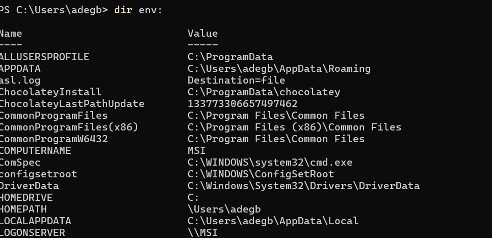
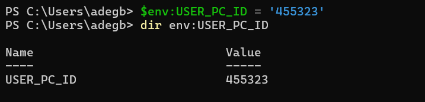

# Basic Commands

- Get the working Directory: `cd` windows, `pwd` linux

- Get the list of directory in current location:
  `dir` windows, `ls` linux

- Creating a folder : `mkdir`
- Navigating through directory with `cd`:
  - `cd folder1` - change current work directory
  - `cd folder1/folder2` - Change directory recursive
  - `cd ..` - one step up directory
  - `cd../..`- two steps up directory
  - `cd /` - Goto root directory

- Create a new file in windows:
  - `cd > file1.txt` - create new file
  - `cd. > file2.txt` - create an **empty** file
  - `del file2.txt` - delete a file
  - `del *` - delete all files (this will ask Y/N prompt)

## Making directory Recursively

MKDIR or MD for cmd.exe

- `mkdir somedir` create a single folder
- `md  some1\some2\some3`  recursive folder creation
- `md  some1\some2\some3_2` create another folder in already created folder

## Move Files/Directory in power shell
cmd - `move-item <source directory or file> -destination <destination directory>`


## Removing directory Recursively

RMDIR or RD if you are using the classic Command Prompt (cmd.exe):
`rd /s /q "path"`
RMDIR [/S] [/Q] [drive:]path
RD [/S] [/Q] [drive:]path

`/S` Removes all directories and files in the **Specified** directory in addition to the directory itself. Used to remove a directory tree.

`/Q` **Quiet mode**, do not ask if ok to remove a directory tree with /S

If you are using PowerShell you can use Remove-Item (which is aliased to `del`, `erase`, `rd`, `ri`, `rm` and `rmdir`) and takes a -Recurse argument that can be shorted to `-r`

`rd -r "path"`

- moving item from on directory to  another
`move-item -path .\dir1\privateFolder -destination .\dir2\`

- Get items that starts with "m"
`D:\> get-childItem -path D:/ms_con/m*`


## Setting/Getting Up environment Variable on Windows

Getting list of environment variable

` dir env: `

<figure markdown="span">

</figure>

Setting environment variable

```shell
>>> $env:USER_PC_ID = '455323'
>>> dir env:USER_PC_ID # check specific env. var
```

<figure markdown="span">

</figure>