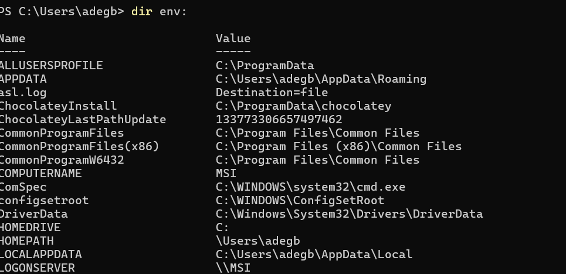
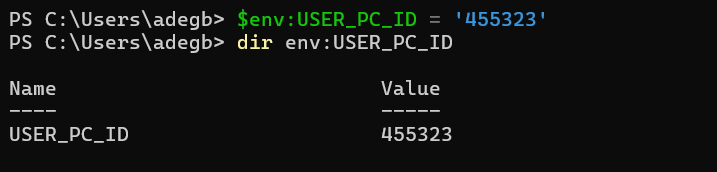

# Basic Commands

- Get the working Directory: `cd` windows, `pwd` linux

- Get the list of directory in current location:
  `dir` windows, `ls` linux

- Creating a folder : `mkdir`
- Navigating through directory with `cd`:
  - `cd folder1` - change current work directory
  - `cd folder1/folder2` - Change directory recursive
  - `cd ..` - one step up directory
  - `cd../..`- two steps up directory
  - `cd /` - Goto root directory

- Create a new file in windows:
  - `cd > file1.txt` - create new file
  - `cd. > file2.txt` - create an **empty** file
  - `del file2.txt` - delete a file
  - `del *` - delete all files (this will ask Y/N prompt)

## Making directory Recursively

MKDIR or MD for cmd.exe

- `mkdir somedir` create a single folder
- `md  some1\some2\some3`  recursive folder creation
- `md  some1\some2\some3_2` create another folder in already created folder

## Move Files/Directory in power shell

cmd - `move-item <source directory or file> -destination <destination directory>`


## Removing directory Recursively

RMDIR or RD if you are using the classic Command Prompt (cmd.exe):
`rd /s /q "path"`
RMDIR [/S] [/Q] [drive:]path
RD [/S] [/Q] [drive:]path

`/S` Removes all directories and files in the **Specified** directory in addition to the directory itself. Used to remove a directory tree.

`/Q` **Quiet mode**, do not ask if ok to remove a directory tree with /S

If you are using PowerShell you can use Remove-Item (which is aliased to `del`, `erase`, `rd`, `ri`, `rm` and `rmdir`) and takes a -Recurse argument that can be shorted to `-r`

`rd -r "path"`

- moving item from on directory to  another
`move-item -path .\dir1\privateFolder -destination .\dir2\`

- Get items that starts with "m"
`D:\> get-childItem -path D:/ms_con/m*`


## Setting/Getting Up environment Variable on Windows

Getting list of environment variable

` dir env: `

<figure markdown="span">

</figure>

### Setting environment variable (TEMPORARY)

```shell
>>> $env:USER_PC_ID = '455323'
>>> dir env:USER_PC_ID # check specific env. var
```

<figure markdown="span">

</figure>

## Setting Permanent Environment Variable

### USER LEVEL

Permanent (User Level)This affects only your Windows user account. It persists across restarts and applies to all new terminal windows. It does not require Administrator privileges.Run these commands sequentially:

```powershell
$currentPath = [Environment]::GetEnvironmentVariable("Path", "User")
[Environment]::SetEnvironmentVariable("Path", $currentPath + ";C:\path\to\your\folder", "User")
```

### SYSTEM WIDE

```powershell
$currentPath = [Environment]::GetEnvironmentVariable("Path", "Machine")
[Environment]::SetEnvironmentVariable("Path", $currentPath + ";C:\path\to\your\folder", "Machine")
```

### Remove from Environment Variable

```powershell
[Environment]::SetEnvironmentVariable("ENV_NAME", "", "Machine") # Set it to "" or $null
```

### Environment Variable for Docker

1. Create the Environment VariablePermanently

  Run this command in PowerShell to save the path into your Windows user environment variables. You only need to run this **once**:
  ```powershell
  [System.Environment]::SetEnvironmentVariable('DOCKER','C:\Program Files\Docker\Docker\Docker Desktop.exe','User') # or Machine
  ```

2. Restart PowerShell

  Close your current PowerShell window and open a new one so it loads the new variable.

3. How to Launch It

  Now that the path is safely stored inside $env:DK, you can launch Docker Desktop using either of these tiny, ultra-short commands:

  - Option A (Using `&`)
    ```powershell
    & $env:DOCKER
    ```
  - Option B (Using `start-process` or `start`):
        ```powershell
      start $env:DOCKER # or Start-Process or start-process
      ```

### Stopping Docker from Running

```powershell
Stop-Process -Name "Docker Desktop" 
Stop-Process -Name "Docker Desktop" -Force

# Alternatively (Short version)
 kill -Name "Docker Desktop" 
 kill -n "Docker Desktop" 

 ## Fancy - (Probably not worth it though)
 kill -n (gi $env:docker).basename 
 ## gi - Get-Item 
 ## Basename -last string after the last '\' without extension name  which is "Docker Desktop" in our case
```


### Modifying the Already Existing Variable Via Powershell

1. Copy and rename the variable 

  This Block of code automatically reads the path stored in your old variable name (e.g., DOCKER_PATH), creates the new one (e.g., DK_PATH), and then safely deletes the old one from Windows:

  ```powershell
  # 1. Get the current value of the old variable
  $oldValue = [System.Environment]::GetEnvironmentVariable('DOCKER_PATH', 'User')

  # 2. Save it under the new variable name
  [System.Environment]::SetEnvironmentVariable('DK_PATH', $oldValue, 'User')

  # 3. Delete the old variable name from Windows
  [System.Environment]::SetEnvironmentVariable('DOCKER_PATH', $null, 'User')

  ```

2. Restart PowerShell

  Close your current terminal window and open a new one. Windows needs this fresh session to drop the old name and register the new one.

3. Verify the change

  To confirm that the rename worked perfectly, you can list out your new variable to see if it holds the correct path:
  
  ```powershell
  $env:DK_PATH
  ```


