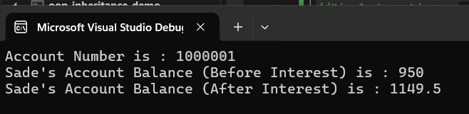
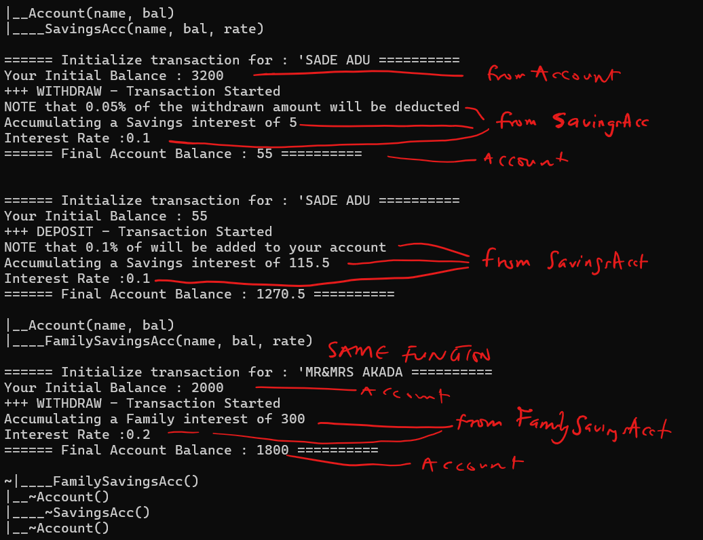

# Working with Basic Inheritance - Accounting as Demo

## Using account class as base and other inherited class

Structure
   ` |_ Account.h , Account.cpp`
   `     |_Savings.h , Savings.cpp`
   `Source.cpp - main()`


### class Account v1 - Without Virtual function - code

```cpp title="Account.h"
#pragma once
#include <iostream>
#include <string>

class Account
{
private:
    std::string m_Name{};
    uint32_t m_AccNo{0};
protected:
    float m_AccBal{};
public:
    static uint32_t s_genAccNum;

    Account(const std::string& name, float balance);

    void Deposit(float amount);
    void Withdrawal(float amount);
    void AccumulateInterest() override;
    float GetInterestRate() override;

    const std::string& GetName() const;
    uint32_t GetAccountNo() const;
    float GetAccountBal() const;

    ~Account();
};


```

```cpp title="Account.cpp"
#include "Account.h"

uint32_t Account::s_genAccNum = 1000000;

Account::Account(const std::string& name, float balance): m_Name(name),m_AccBal(balance){
    if (m_AccNo == 0) m_AccNo = ++s_genAccNum;
  
}


void Account::Deposit(float amount){
    if (amount > 0.0) m_AccBal += amount;
    else std::cout << "Invalid Deposit amount\n";
}


void Account::Withdrawal(float amount){
    if (m_AccBal >= amount) m_AccBal -= amount;
    else std::cout << "Withdraw limit Exceeded\n";
}

void Account::AccumulateInterest(){}

float Account::GetInterestRate(){
    return 0.0f;
    }

const std::string& Account::GetName() const{
    return m_Name;
    }

uint32_t Account::GetAccountNo() const{
    return m_AccNo;
    }

float Account::GetAccountBal() const{
    return m_AccBal;
    }

Account::~Account(){}

```


### class Savings - code

```cpp title="Savings.h"
#pragma once
#include "Account.h"

class Savings : public Account
{
    float m_Rate;
public:
    Savings(const std::string& name, float bal, float rate);

    void AccumulateInterest();
    float GetInterestRate();

    ~Savings();
};


```

```cpp title="Savings.cpp"
#include "Savings.h"


Savings::Savings(const std::string& name, float bal, float rate)
    :Account(name, bal), m_Rate(rate)
{}

void Savings::AccumulateInterest(){
    m_AccBal += (m_AccBal * m_Rate);
}

float Savings::GetInterestRate(){
    return m_Rate;
}

Savings::~Savings(){}

```

```cpp title="Source.cpp"

#include <iostream>
//<ctime> and <cstdio> are already implemented in `iostream`
//#include <ctime> 
//#include <cstdio>
#include "Savings.h"


int main() {
	
    Savings sadeAcc("Sade Adu", 3200, 0.1);

    std::cout << "Account Number is : " << sadeAcc.GetAccountNo() << "\n";
    sadeAcc.Deposit(1200);
    sadeAcc.Withdrawal(3450);
    std::cout << "Sade's Account Balance (Before Interest) is : " << sadeAcc.GetAccountBal() << "\n";
    sadeAcc.AccumulateInterest();
    sadeAcc.AccumulateInterest();
    std::cout << "Sade's Account Balance (After Interest) is : " << sadeAcc.GetAccountBal() << "\n";

return 0;

}
```
<figure markdown='span'>
    
</figure>


### class Checkings

```cpp title="Checkings.h"
#pragma once
#include "Account.h"

class Checkings :public Account
{
public:
    Account::Account;
    //Checkings(const std::string name, float balance);

    void Withdrawal(float amount);

    ~Checkings();
};

```

```cpp title="Checkings.cpp"

#include "Checkings.h"

//Checkings::Checkings(const std::string name, float balance)
//	: Account(name, balance)
//{}

void Checkings::Withdrawal(float amount)
{
    float temp_bal = m_AccBal - amount;
    if (temp_bal > 50)
        Account::Withdrawal(amount);
    else
        std::cout << "The minimum Bal. in Checking should be $50\n";
    }

Checkings::~Checkings(){}

```

!!!Note
    When you just want to inherent the base class default constructor into the derived cpp11 has a simpler approach

<div class='grid' markdown>

```cpp
//instead of :
SomeAccount:public Account{
public: 
    SomeAccount(string name, float amount)
            : Account(name, amount);
    ...
}
```


```cpp
// you can do :
SomeAccount:public Account{
public: 
   using Account::Account
    ...
}
```        

</div>

## Using Virtual Mechanism of Inheritance

The most significant importance of `virtual Mechanism` of Inheritance is when a base class has many derived classes inherited from it. So you can have a say a function that has a **base class pointer as parameter** and when you call the function, **you can pass the different derived class reference** and it will call the override function of the derived classes instead of the base

Example of virtual Member example:

Let say we have this two Account classes `SavingsAcc` and `FamilySavingsAcc` inheriting from `Account` class.

Here is our account class :

### class Account With Virtual function - code

```cpp linenums="1" title="Account.h" hl_lines="17-20 26"

#pragma once
#include <iostream>
#include <string>


class Account
{
private:
    std::string m_Name{};
    uint32_t m_AccNo{0};
    protected:
    float m_AccBal{};
    public:
    static uint32_t s_genAccNum;

    Account(const std::string& name, float balance);

    virtual void Deposit(float amount);
    virtual void Withdrawal(float amount);
    virtual void AccumulateInterest();
    virtual float GetInterestRate();

    const std::string& GetName() const;
    uint32_t GetAccountNo() const;
    float GetAccountBal() const;

    virtual ~Account();
};

```


The 4 class member functions and the Destructor are marked as virtual members. This are the functions that will have different implementations other than the base class.

!!!Warning
    it is important to mark the **destructor function a virtual too**. Or else one will run into issue when switching the different classes 

Nothing really changes in the declaration as it was before

### class SavingsAcc - code

```cpp title="SavingsAcc.h" linenums="1"
#pragma once
#include "Account.h"

class SavingsAcc : public Account
{
	float m_Rate;
public:
	SavingsAcc(const std::string& name, float bal, float rate);

	void Deposit(float amount) override;
	void Withdrawal(float amount) override;
	void AccumulateInterest();
	float GetInterestRate() override;

	~SavingsAcc();
};

```

```cpp title="SavingsAcc.cpp" linenums="1"
#include "SavingsAcc.h"


SavingsAcc::SavingsAcc(const std::string& name, float bal, float rate)
    :Account(name, bal), m_Rate(rate)
{
    std::cout << "|____SavingsAcc(name, bal, rate) \n";
}

void SavingsAcc::Deposit(float amount)
{
    std::cout << "NOTE that 0.1% of will be added to your account\n";
    m_AccBal += (amount * 0.1);

    Account::Deposit(amount);
}

void SavingsAcc::Withdrawal(float amount){
    std::cout << "NOTE that 0.05% of the withdrawn amount will be deducted\n";
    Account::Withdrawal(amount);
    m_AccBal -= (amount * 0.05);

}

void SavingsAcc::AccumulateInterest()
{
    float interest = (m_AccBal * m_Rate);
    std::cout << "Accumulating a Savings interest of " << interest << "\n";
    m_AccBal += interest;
   
}

float SavingsAcc::GetInterestRate(){ return m_Rate;}

SavingsAcc::~SavingsAcc()
{
    std::cout << "|____~SavingsAcc() \n";
}

```

### class FamilySavingsAcc - code

```cpp title="FamilySavingsAcc.h" linenums="1"

#pragma once
#include "Account.h"
class FamilySavingsAcc : public Account
{
	float m_Rate{};

public:

	FamilySavingsAcc(const std::string& FamName, float amount, float rate);
	~FamilySavingsAcc();
};

```

```cpp title="FamilySavingsAcc.cpp" linenums="1"

#include "FamilySavingsAcc.h"

FamilySavingsAcc::FamilySavingsAcc(const std::string& FamName, float amount, float rate)
	:Account(FamName, amount), m_Rate(rate)
{
	std::cout << "|____FamilySavingsAcc(name, bal, rate) \n";
}


void FamilySavingsAcc::AccumulateInterest(){
b
}

FamilySavingsAcc::~FamilySavingsAcc()
{
	std::cout << "~|____FamilySavingsAcc() \n";
}

```

### function Transactions - code

```cpp title="Transactions.h" linenums="1"
#pragma once
#include "Account.h";
#include <ctype.h>;

enum class Transact{ WITHDRAW, DEPOSIT};
enum class Case { UPPER, LOWER };


std::string To(Case c, std::string s);

void Transaction(Transact tType, Account* a, float amount);
```

```cpp title="Transactions.cpp" linenums="1"
#include "Transaction.h"


std::string To(Case c, std::string s) {
    if (c == Case::UPPER)
        for (int i = 0; i < s.length(); i++)
            s[i] = (char)toupper(s[i]);

    if (c == Case::LOWER)
        for (int i = 0; i < s.length(); i++)
            s[i] = (char)tolower(s[i]);

    return s;
}

void Transaction( Transact tType, Account* a, float amount)
{

    std::cout << "\n Initialize transaction for : '" << To(Case::UPPER, a->GetName()) << "\n";
    std::cout << "Your Initial Balance : " << a->GetAccountBal() << "\n";

    if (tType == Transact::WITHDRAW){
        std::cout << "+++ WITHDRAW - Transaction Started \n";
        a->Withdrawal(amount);
        a->AccumulateInterest();
    }
    else if (tType == Transact::DEPOSIT){
        std::cout << "+++ DEPOSIT - Transaction Started \n";
        a->Deposit(amount);
        a->AccumulateInterest();
    }

    std::cout << "Interest Rate :" << a->GetInterestRate() << "\n";
    std::cout << "Final Account Balance : " << a->GetAccountBal() << "\n";
}

```

### Source.cpp

Finally, source for Execution

```cpp title="Source.cpp"


#include <iostream>
#include "SavingsAcc.h"
#include "FamilySavingsAcc.h"
#include "Transaction.h"


int main() {

    // Mrs. Sade Account transactions Details
    SavingsAcc sadeAcc("Sade Adu", 3200.0f, 0.1f);

    Transaction(Transact::WITHDRAW , &sadeAcc, 3000.0f);
    Transaction(Transact::DEPOSIT, &sadeAcc, 1000.0f);

    // The Akada Family transactions
    FamilySavingsAcc akadaFamily("Mr&Mrs Akada", 2000, 0.2f);
    Transaction(Transact::WITHDRAW, &akadaFamily, 500.0f);

    return 0;
}

```

Here is the output



## Working with typeid, class cast - Finding the type of class

### Using type_info

```cpp
#include <typeinfo>

int main(){
    const std::type_info& ti = typeid(sadeAcc);
    std::cout << "The class type is : " << ti.name() << "\n";

    if(typeid(*acc1) == typeid(FamilySavingsAcc))
        std::cout << "This is family Savings " << "\n";
    else 
        std::cout << "This is Account "  << "\n";
}

```

### upcast Examples

```cpp
    // Stack
    FamilySavingsAcc fs0("name1", 323, 0.1);
    Account* acc0 = &fs0;

    // Using heap
    Account* acc1 = new FamilySavingsAcc("name", 300, 0.2); 
    ...
    delete acc1;// rememeber to delete from heap
```

### Downcast Examples

```cpp
    // Downcast using reference
    Account acc2("SomeOneName_Ref", 1500);
    FamilySavingsAcc& fs1 = static_cast<FamilySavingsAcc&>(acc2);
    std::cout << "The family name is : " << fs1.getFamilyName() << "\n";

    // Downcast using pointer
    Account acc3("SomeOneName_Ptr", 1499);
    FamilySavingsAcc* fs2 = static_cast<FamilySavingsAcc*>(&acc3);
    std::cout << "The family name is : " << fs2->getFamilyName() << "\n";
```
