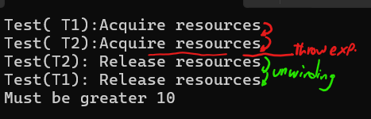
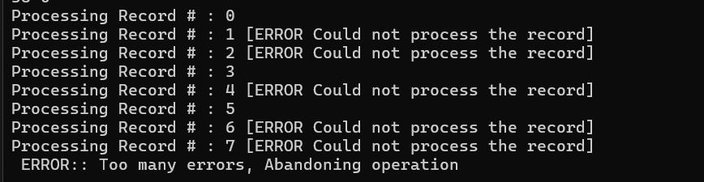

# Exception Handling in CPP

## Basics of Exception Handling

```cpp

#include <iostream>

int ProcessRecords(int count) {
    int* pArr = (int*)malloc(count * sizeof(int));
    if (pArr == nullptr)
        throw std::runtime_error("Failed to allocate memory");
    
    for (int i = 0; i < count; i++)
        pArr[i] = i * 2;
        
    free(pArr);
    return 0;
}


int main() {
    try{
        ProcessRecords(std::numeric_limits<int>::max() * 12000000);
    }
    catch (std::runtime_error& ex){
        std::cout << ex.what() << std::endl;
    }

    return 0;
}

```

## Multi-Exception Handling

### Example I

```cpp
#include <iostream>

int ProcessRecords(uint64_t count) {

    // Count should always greater than 10
    if (count < 10)
        throw std::out_of_range("Count should be greater than 10");

    // Mem. alloc using `malloc`
    int* pArr = (int*)malloc(count * sizeof(int));

    // Mem. alloc using `new`
    int* p = new int[count];

    if (pArr == nullptr)
        throw std::runtime_error("Failed to allocate memory");

    for (int i = 0; i < count; i++)
        pArr[i] = i * 2;
        
    free(pArr);
    return 0;
}


    int main() {
    try{
        uint64_t val = 12233444555555555555;
        constexpr uint64_t val2 = std::numeric_limits<int>::max();

        std::cout << "val2 = " << val2 << "\n";
        ProcessRecords(val);
    }
    // From thrown exception : bad malloc
    catch (std::runtime_error& ex){
        std::cout << ex.what() << std::endl;
    }
    // From thrown exception: Out of Range exception
    catch (std::out_of_range& ex) {
        std::cout << ex.what() << std::endl;
    }
    // Internal exception: Catch Bad memory allocation from `new` keyword
    catch (std::bad_alloc& ex){ 
        std::cout << ex.what() << std::endl;
    }
    catch (std::exception& ex) {
        std::cout << ex.what() << "\n";
    }


	return 0;
}
```

### Example II

```cpp
#include <iostream>
#include <vector>


void ProcessData(int count) {

    // replaces `int* pArray = (int*) malloc(count * sizeof(int));`
    // instead of initializing you could also call `pArray.reserve(count);`
    std::vector<int> pArray(count);

    if (count < 10)
        throw std::out_of_range("must be greater than 10");

    for (size_t i = 0; i < count; i++){
        int val = i * 2;
        std::cout  << val  << " ";
        pArray.push_back(val);
    }
}


int main() {
    try{
        ProcessData(std::numeric_limits<int64_t>::max()); // Throw vector too long
    }
    catch (const std::exception& ex){
        std::cout << " ERROR:: " << ex.what() << std::endl;
    }
    return EXIT_SUCCESS;
}
```

## Stack Unwinding - During throw

```cpp
#include <iostream>
#include <memory>

class Test {
std::string m_Name;
public:
    Test(const std::string& name) : m_Name(name){ std::cout << "Test( "<< name << "):Acquire resources" << std::endl; }
    ~Test() { std::cout << "Test("<<m_Name<<"): Release resources" << std::endl; }
};

void ProcessData(int32_t a) {

    Test t1("T1");
    Test t2("T2");

    // for objects 
    // This replaces `Test* t1 = new Test("T-01")`
    std::unique_ptr<Test> t1(new Test("T-01")); 
    std::unique_ptr<Test> t2(new Test("T-02"));


    std::vector<int> points;
    points.reserve(a); // Reserve mem. space - it throw bad_alloc error if failed


    if (a < 10)
        throw std::out_of_range("Must be greater 10");
}

int main() {

    try{
        ProcessData(9);
    }
    catch (const std::exception& ex){
        std::cout << ex.what() << std::endl;
    }

	return EXIT_SUCCESS;
}
```

<figure markdown='span'>
    
</figure>

## Nesting Exception Handling

```cpp
#include <iostream>
#include <vector>
#include <random>


void ProcessData(int count) {

    // replaces `int* pArray = (int*) malloc(count * sizeof(int));`
    // instead of initializing you could also call `pArray.reserve(count);`
    std::vector<int> pArray(count);

    if (count < 10)
        throw std::out_of_range("must be greater than 10");


    std::default_random_engine eng;
    std::bernoulli_distribution dist;
    int errors{};

    for (size_t i = 0; i < count; i++){
        int val = i * 2;
        std::cout  << val  << " " << dist(eng) <<"\n";
        pArray.push_back(val);
    }

    for (size_t i = 0; i < count; i++)
    {
        try {
            std::cout << "Processing Record # : " << i << " ";
            if (dist(eng)) {
                ++errors;
                throw std::runtime_error("Could not process the record");
            }
            std::cout << std::endl;
        }
        catch (std::runtime_error& ex) {
            std::cout << "[ERROR " << ex.what() << "] " << std::endl;
            if (errors > 4){
                std::runtime_error err("Too many errors, Abandoning operation");
                ex = err;
                throw;
            }
        }
    }
}


int main() {
    try{
        //ProcessData(std::numeric_limits<int64_t>::max()); // Throw vector too long
        ProcessData(20); // Throw vector too long
    }
    catch (const std::exception& ex){
        std::cout << " ERROR:: " << ex.what() << std::endl;
    }
    return EXIT_SUCCESS;
}
```
<figure markdown='span'>
    
</figure>