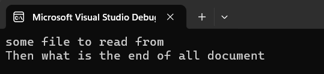
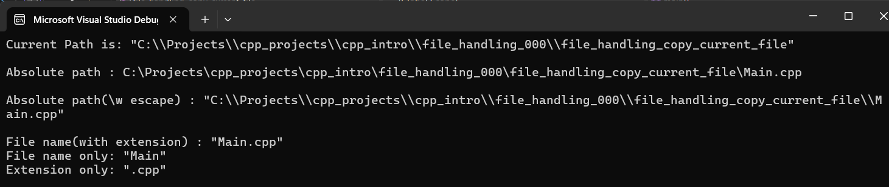
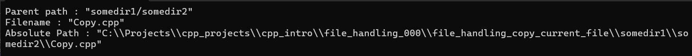
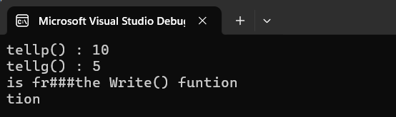
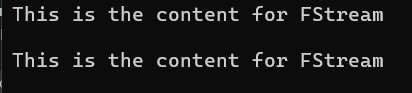
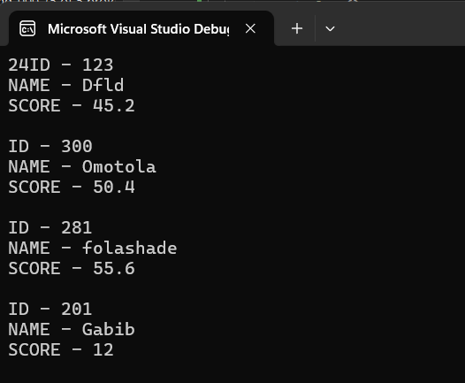
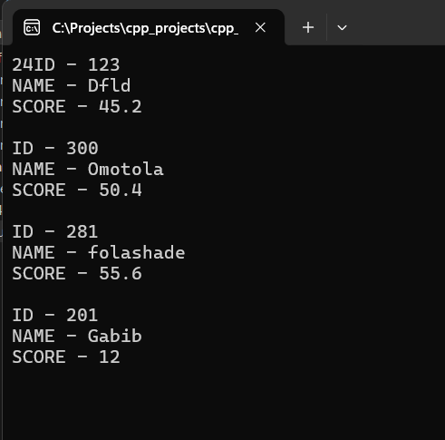

# File Handling in CPP

## Raw string Literals

```cpp
#include <iostream>

int main() {
    std::string file0(R"(C\noname\table\radiation.dll)");
    std::cout << file0 << std::endl;
    file0 = R"(<html>\table too are good \number </html>)";
    std::cout << file0 << std::endl;
    // You can use any reasonable string convention before/after the brackets
    // R"xy(...)xy";
    // R"GLSL(...)GLSL";
    // R"Msc(...)Msc";
    std::string file1{ 
    R"!#(
    C:\users\temp\radar1\newfile.txt;
    C:\users\temp\radar2\newfile2.txt;
    )!#" };


    std::cout << file1.c_str() << std::endl;
    return 0;
}
```

## Reading File basics in CPP

### Reading File Example I

```cpp
#include <iostream>
#include <fstream>

int main() {
    std::ifstream rd("data.txt");
    if (!rd.fail()) 
        std::cout << rd.rdbuf()<< std::endl;

    else std::cout << "fail to read file" << std::endl;

    return 0;
}
```


### Reading and Writing File Basic Example III

```cpp
#include <iostream>
#include <fstream>
#include <string>

void ReadFile(const std::string& filename) {
    std::ifstream in(filename);
    /* You can also do:
        std::ifstream in;
        in.open(filename);*/
    std::string str;
    int val{};
    std::getline(in, str);
    in >> val;
    std::cout << str << " " << val << "\n";
    in.close();
}

void WriteFile(const std::string& filename) {
    std::ofstream out(filename);
    /* You can also do:
        std::ifstream out;
        out.open(filename);*/
    out << "Writing Some Docs \n";
    out << 404 << "\n";
    out.close();
 }

int main() {
    std::string fileStr = "data.txt";
    WriteFile(fileStr);
    ReadFile(fileStr);
    return 0;
}
```

### Reading File Example III

```cpp
#include <fstream>
#include <sstream>

 std::string ReadFile(const std::string& filename) {
    std::ifstream in(filename);
    std::stringstream ss;
    if (!in.fail())
        ss << in.rdbuf();
    else
        std::cout << "fail to load file \n";
    return ss.str();
}
```

## Error Handling during file operation

### Error Handling Example


```cpp
#include <iostream>
#include <fstream>
#include <string>
#include <cstdio>

 void ReadFile(const std::string& filename) {
    std::ifstream in(filename);
    if (in.fail()){
        std::cout << "ERROR:: Could not open the file" << std::endl;
        return;
    }
    std::string str;
    int val{};
    std::getline(in, str);
    in >> val;
    //in >> val;
    if (in.eof()) std::cout << "End of file Encountered" << std::endl;
    if (in.fail()) std::cout << "ERROR:: Could not read" << std::endl;
    if (in.good()) std::cout << "I/O Operation Successful\n";
    else std::cout << "ERROR:: I/O Operation Failed \n";

    std::cout << str << " " << val << "\n";
    in.clear();
    in.close();
    }

    void WriteFile(const std::string& filename) {
        std::ofstream out(filename);
        out << "Writing Some Docs \n";
        out << 888 << "\n";
        out.close();
    }

    int main() {
    std::string fileStr = "Data.txt";
    WriteFile(fileStr);
    ReadFile(fileStr);


    return 0;
}
```


### `is_open()` vs `fail()`

std::ifstream::fail can return true, even if std::ifstream::is_open returns true; they are not the mutually exclusive.

`.fail` will check the overall *"health"* of the stream, which involves things such as checking the stream has currently entered a *fail state* from trying to read an invalid value, whereas `.is_open` will only check if the stream is currently attached to a file, `.is_open` doesn't care if the stream is in a fail state, or not.

But in general use what makes your code most readable.

[FailError source](https://cplusplus.com/reference/ios/ios/fail/) 

Note you can also do this:

```cpp
if (some_stream) {
  // stream is alive and well
} else {
  // something is wrong
}
```


## Deleting File <cstudio>

```cpp
#include <cstdio>

int status = remove("SomeFile.txt");
if (status == 0) 
    std::cout << "File Successfully deleted";
else 
    std::cout << "Error deleting file";

	
```

## Working with `filesystem` in cpp

```cpp title="Main.cpp"
#include <iostream>
#include <filesystem>

using namespace std;
namespace fs = std::filesystem;

int main() {

    fs::path currentFile(__FILE__);
    cout << "Current Path is: " << fs::current_path()<< "\n";
    cout <<"Absolute file path of current File: " << __FILE__ << "\n";
    cout << R"(Absolute path(\w escape) : )" << fs::absolute(currentFile) << "\n";
    cout << "File name(with extension) : " << currentFile.filename() << "\n";
    cout << "File name only: " << currentFile.stem() << "\n";
    cout << "Extension only: " << currentFile.extension() << "\n";
    return 0;
}
```
<figure markdown='span'>
    
</figure>

```cpp
    fs::path dest("somedir1/somedir2/Copy.cpp"); // default to current path

    cout << "Parent path : " << dest.parent_path() << endl;
    cout << "Relative path : " << dest.relative_path() << endl;
    cout << "Parent path (string) : " << dest.parent_path().string() << endl; // `.string()` removes the double quotes
    cout << "Filename : " << dest.filename() << endl;
    cout << "Absolute Path : " << fs::absolute(dest) << endl;
```

<figure markdown='span'>
    
</figure>


### Creating New Directory With FileSystem

```cpp

#include <iostream>
#include <fstream>
#include <filesystem>
using namespace std;
namespace fs = std::filesystem;

int main() {
    string dir = "somedir1/somedir2/";
    fs::path dest;
    if(!fs::exists(dir)){ // check if file exist
        if (fs::create_directories(dir) == 0) // no error creating
            cout << "new dir created ... \n";
    }
    else 
        cout << "existing directory" << endl;

	return 0;
}
```

### Creating new directories / directory with Filesystem

```cpp
#include <iostream>
#include <fstream>
#include <filesystem>
using namespace std;
namespace fs = std::filesystem;

int main() {

	//fs::path source(""); // relative dir.
    string dir = "somedir1/somedir2/";
    fs::path dest(dir); // default to current path

    cout << boolalpha << fs::exists(dest) << endl;
    cout << boolalpha << fs::create_directories(dest) << endl;
    cout << boolalpha << fs::exists(dest) << endl;
    if(!fs::exists(dest)){
        if (fs::create_directories(dest) == false) // no error creating directories
            cout << "new dir created ... \n";
    }
    else cout << "existing directory" << endl;

    if (fs::create_directory(dest / "otherdir") == true) {
        cout << "Extra directory created...\n";
    }

    dest = dest/"data.txt";

    ofstream out(dest);
    if (out.is_open())
        out << "we are writing some \n from File System\n";
    out << 12345 << endl;
    if (out.good())
        cout << "writing successful ... \n";
    return 0;
}
```

## Copy Source File Example v1 (Non-binary)

```cpp
#include <iostream>
#include <fstream>
#include <string>
#include <filesystem>
using namespace std;
namespace fs = std::filesystem;


void CopyFile(const string& srcFile, const string& destFile) {

    fs::path src{ srcFile };
    fs::path dest{ destFile };
    fs::path destPath = dest.parent_path();

    if (!fs::exists(destPath)) { // path does not exist

        if (fs::create_directories(destPath)) // no error creating directories
            cout << "new dir created ... \n";
    }
    else cout << "existing directory" << endl;

    // Read from source file
    std::ifstream in(src);
    if (!in) cout << "Source file not found " << endl; 

    // Write to dest file
    ofstream out(dest);
    string line;

    while (!getline(in, line).eof()) // read each line
        out << line << endl; // write to dest file


    if (out.good()) cout << "Copy successful ... \n";
    in.close();
    out.close();
}


int main() {


    CopyFile(__FILE__, "cppProj/source/Copy3.cpp");

    return 0;

}
```

## Working with seekp/g and tellp/g with file ifstream and ofstream:

[seekp example](https://www.tutorialspoint.com/cpp_standard_library/cpp_ostream_seekp.htm)

```cpp
#include <iostream>
#include <fstream>
#include <string>


void Write() {
    std::ofstream out("data.txt");

    std::string content{ "This is from the Write() funtion " };
    for (char c : content)
        out.put(c);

    out.seekp(10); // pointer jump to 10 character
    std::cout <<"tellp() : " << out.tellp() << std::endl; // Tell where the pointer is
    out << "###";  // write from char 10

    out.close();
}

void Read() {
    std::ifstream in("data.txt");

    char c;
    in.seekg(5); // pointer jump to the 5 character
    std::cout <<"tellg() : " << in.tellg() << std::endl; // Tell where the pointer is
    while(!in.get(c).eof())  std::cout << c;
    std::cout << std::endl;
        
    in.clear(); // go back to begining of file

    in.seekg(-5, std::ios::end); // read from back
    while (!in.get(c).eof())  std::cout << c;
    std::cout << std::endl;

    in.close();
    }

int main() {
    Write();
    Read();
    return 0;
}
```
<figure markdown='span'>
    
</figure>

## Working with seekp/g and tellp/g with fstream

```cpp
void ReadWrite() {
    std::fstream stream("data.txt");
    if (!stream) {
        std::cout << "Creating NEW FILE ... " << std::endl;
        std::ofstream out("data.txt");
        out.close();

        stream.open("data.txt");
    }
    stream << "This is the content for FStream\n";

    stream.seekg(0);
    std::cout << stream.rdbuf() << std::endl;

    stream.seekg(0, std::ios::beg);
    std::string line;
    std::getline(stream, line);
    std::cout << line << std::endl;
}

```

<figure markdown='span'>
    
</figure>

## Reading and write binary files

```cpp
    std::string str = "ABCDEFGHIJ1234567890";
    const char* str_c = str.c_str();
    std::fstream iob{ "data.bin", std::ios::binary | std::ios::out | std::ios::in };
    iob.write((const char*)&str_c, sizeof(str_c));

    iob.clear();
    iob.seekg(0);

    // Read from binary
    const char* str1 = "";
    iob.read((char*)&str1, sizeof(str_c));
    iob.close();

    std::cout << str1 << std::endl;

```

### Reading/Writing Binary Records

```cpp
int main(){
    AssignmentRecord rigAssign;
    rigAssign.as_id = 1340;
    rigAssign.name = "BAC3034 Rigging Progress";
    rigAssign.score = 34.5f;

    std::fstream record1{ "assignment-record.dat", std::ios::binary| std::ios::out | std::ios::in };
    if (!record1){
        std::cout << "File Non-exist creating file...\n";
        std::ofstream out{ "assignment-record.dat", std::ios::binary };
        out.close();

        record1.open("assignment-record.dat");
    }
    record1.write((const char*)&rigAssign, sizeof(AssignmentRecord));
    std::cout << sizeof(AssignmentRecord);

    record1.clear();
    record1.seekg(0);


    /* --- Reading Record from binary --- */
    AssignmentRecord teachersCopy;

    record1.read((char*)&teachersCopy, sizeof(AssignmentRecord));

    std::cout << "\n\nTeachers Copy :\nID - " << teachersCopy.as_id 
    << "\nNAME - " << teachersCopy.name << "\nSCORE: " << teachersCopy.score << "\n";

}
```

### Reading/Writing Multiple Binary Records [USING BASIC ARRAY]

```cpp
constexpr int STUDENTS_NUM = 4;
AssignmentRecord studentsAssignments[STUDENTS_NUM] = {{123, "Dfld", 45.2}, 
                                        {300, "Omotola", 50.4}, 
                                        {281, "folashade", 55.6}, 
                                        {201, "Gabib", 12.0} };

std::fstream record1{ "assignment-record.dat", std::ios::binary| std::ios::out | std::ios::in };
if (!record1){
    std::cout << "File Non-exist creating file...\n";
    std::ofstream out{ "assignment-record.dat", std::ios::binary };
    out.close();

    record1.open("assignment-record.dat");
    }
record1.write((const char*)studentsAssignments, sizeof(AssignmentRecord) * STUDENTS_NUM);
std::cout << sizeof(AssignmentRecord);

record1.clear();
record1.seekg(0);


/* --- Reading Record from binary --- */
AssignmentRecord teachersCopy[STUDENTS_NUM];

record1.read((char*)&teachersCopy, sizeof(AssignmentRecord)* STUDENTS_NUM);

for (auto& assignment : teachersCopy){
    std::cout << "ID - " << assignment.as_id << "\n";
    std::cout << "NAME - " << assignment.name << "\n";
    std::cout << "SCORE - " << assignment.score << "\n\n";

}
```

<figure markdown='span'>
    
</figure>


### Reading/Writing Multiple Binary Records [USING STD::VECTOR]

```cpp
#include <iostream>
#include <fstream>
#include <vector>

struct AssignmentRecord {
    int  as_id{-1};
    const char* name{};
    float score{};
};


int main() {


    /* --- Writing Records to Binary --- */ 

    constexpr int STUDENTS_NUM = 4;
    std::vector<AssignmentRecord> studentAssignments = { {123, "Dfld", 45.2},
                                            {300, "Omotola", 50.4},
                                            {281, "folashade", 55.6},
                                            {201, "Gabib", 12.0} };

    std::fstream record1{ "assignment-record.dat", std::ios::binary| std::ios::out | std::ios::in };
    if (!record1){
        std::cout << "File Non-exist creating file...\n";
        std::ofstream out{ "assignment-record.dat", std::ios::binary };
        out.close();

        record1.open("assignment-record.dat");
    }
    record1.write((const char*)(&studentAssignments), sizeof(AssignmentRecord) * studentAssignments.size());
    std::cout << sizeof(AssignmentRecord);

    record1.clear();
    record1.seekg(0);

    /* --- Reading Record from binary --- */
    //AssignmentRecord teachersCopy[STUDENTS_NUM];
    std::vector<AssignmentRecord> teachersCopy{};
    teachersCopy.resize(STUDENTS_NUM);
    record1.read(reinterpret_cast<char*>(&teachersCopy), sizeof(AssignmentRecord) * teachersCopy.size());
    if(record1.good()){
    for (auto assignment : teachersCopy){
            std::cout << "ID - " << assignment.as_id << "\n";
            std::cout << "NAME - " << assignment.name << "\n";
            std::cout << "SCORE - " << assignment.score << "\n\n";

        }
    }
    else {
        std::cout << "Something Went Wrong!" << std::endl;
    }

}
```
<figure markdown='span'>
    
</figure>

## Reading File with Vector

```cpp

int main() {

    std::ifstream input{ "main.cpp" };
    if (!input) {
        std::cout << "Could not open file\n";
        return -1;
    }
    auto size = fs::file_size("main.cpp");
    std::vector<char> buffer;
    buffer.resize(size);
    input.read(buffer.data(), size);
    std::cout << buffer.data() << "\n";

    return 0;
}
```
