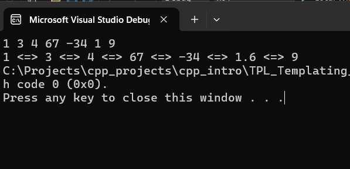
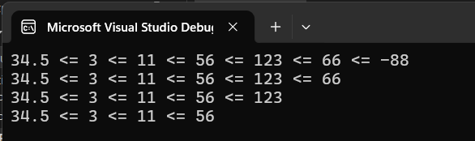

# Templating in CPP

## Introduction to Templating
Example of templating:

```cpp
#include <iostream>

using std::cout, std::cin;

template<typename I>
I Max(I x, I y) {

    return ( x > y) ? x : y;
}

template<>
std::string Max (std::string x, std::string y) {
    return (x.length() > y.length()) ? x : y;
}

int main(int argv, char argc) {
    int x = 4;
    int y = 7;
    cout << " Max of num " << x <<", " << y << " = " << Max<int>(x, y) << "\n";

    float x1 = 4.5;
    float y1 = 8.1;
    cout << " Max of float " << x1 <<", " << y1 << " = " << Max<float>(x1, y1) << "\n";


    std::string x2 = "usomestring1";
    std::string x3 = "tstring2 is the long string here";
    cout << "Max of string = " << Max<std::string>(x2, x3) << "\n";

    return EXIT_SUCCESS;
}
```

## Explicit Specialization 

```cpp

template<typename I>
I Max(I x, I y) {
    return ( x > y) ? x : y;
}

// Explicit Specializatioon
template<>
const char* Max (const char* x, const char* y) {
    return (strcmp(x, y) > 0) ? x : y;
}

int main(int argv, char argc) {


    const char* s = "'AAAB'";  // Max is here because of B in string
    const char* a = "'AAAA'";
    cout << Max(s, a) << "\n";

}
```

## Non-type Template Arguments

### Basic 
Non-type template works usually with arrays and classes.
the `arrSize` in the template is the **non-type argument**.
It must always be constant. We will find an example in the standard cpp template array
`std::array<float, 10> arr3`

```cpp

template<typename T, int arrSize>
T Max(T* pArr) {

    T curr_max = 0;
    for (int i = 0; i < arrSize; i++)
        if (pArr[i] > curr_max) 
            curr_max = pArr[i];

        return curr_max;
}

template<typename T, int size>
T Sum(T* pArr) {
    T sum{};
    for (int i = 0; i < size; i++)
        sum += pArr[i];

    return sum;
}

int main(int argv, char argc) {


    int arr1[]{ 4, 3, 5, 4, 11, -2 };
    cout << Sum<int, 6>(arr1) << "\n";
    cout << Max<int, 6>(arr1) << "\n";

	return EXIT_SUCCESS;
}
```

### Using Ref to an array

With this you don't need to specify the size 

```cpp
template<typename T, int size>
T Sum(T(&rArr)[size]) {
    T sum{};
    for (int i = 0; i < size; i++)
        sum += rArr[i];

    return sum;
}

int main(int argv, char argc) {

    int arr1[] = { 4, 3, 5, 4, 11, -2 };
    int(&rArr)[6] = arr1; // reference to an array
    int* arr2 = arr1;

    cout << Sum(arr1) << "\n"; // No need to specify size

    double arrD[] = { 34.5, 112,45.7, 45.11111, 90.409 };
    cout << Sum<double>(arrD) << "\n";

}
```

## Perfect Forwarding in CPP

This is an example of Perfect Forwarding 

*Not sure I understand this quite well now, but for doc purposes, we move* 

```cpp
#include <iostream>
using std::cout, std::endl, std::string;

class Integer {
    int m_Val;
public:
    Integer(int& n) :m_Val(n) { cout << "Integer(int& )\n"; }
    Integer(int&& n) :m_Val(n) { cout << "Integer(int&& )\n"; }
    ~Integer() {}
};


class Employee {
    string m_Name;
    Integer m_id;
public:
    template <typename T1, typename T2>
    Employee(T1&& name, T2&& id) :
        m_Name{ std::forward<T1>(name) },
        m_id{ std::forward<T2>(id) } {
        cout << "Employee(string&& , Integer&&)\n";
    }
};


template <typename T1, typename T2>
Employee* Create(T1&& a, T2&& b) {
	return new Employee(std::forward<T1>(a), std::forward<T2>(b));
}


int main() {
    Employee emp1{ "Usman ", Integer{100} };
    auto emp = Create("Usman", Integer{ 120 });
}
```

## Variadic Template

### standard initializer_list

```cpp
// Using std::initializer_list
template <typename T>
void Print(std::initializer_list<T> args) {
    for (const auto& x : args) 
        cout << x << " ";

    cout << "\n";
}

int main() {
    Print<int>({ 1, 3, 4, 67, -34, int(1.6), 9 });
}
```

### Using the Variadic template alternative

```cpp
// Using Variadic Template
/*
This is how the function recursion works
Print(1, 3, 4, 67); // first call "1" goes to `a`, "3, 4, 67" goes to `...`
Print(3, 4, 67); // second call
Print(4, 67); // third call
Print(67); // fourth call
Print(); // fifth call
*/
void Print() {}

template<typename T, typename ... Params> // template parameter pack
void Print(const T& a, const Params& ... args) {
    cout << a;

    if (sizeof ...(args) != 0) cout << " <=> ";

    Print(args ...);
}

int main() {

    // Arguments passed with Parameter pack
    Print(1, 3, 4, 67, -34,1.6, 9);
}
```
<figure markdown='span'>
    
</figure>

## Class Template 

```cpp
#include <iostream>
#include <array>

using std::cout, std::endl, std::string;

template <typename T, int size>
class Stack {
    T  mBuffer[size]{};
    int mTop_index{ -1 };

public:
    Stack() = default;

    Stack* push(const T& elem) {
        ++mTop_index;
        mBuffer[mTop_index] = elem;	

        return this;
    }
    Stack* push(std::initializer_list<T> alist);

    T& pop() {
        if (is_Empty()){
            throw std::runtime_error("<== Stack Empty ==>\n");
        }
        T o = mBuffer[mTop_index];
        mBuffer[mTop_index] = 0;
        --mTop_index;
        return o;
    }

    T& top() {
        return mBuffer[mTop_index];
    }

    bool is_Empty() {
        return mTop_index == -1;
    }

    void print() {
        for (int i = 0; i < (mTop_index + 1); i++) {
            cout << mBuffer[i];
            if (i != (mTop_index)) cout << " <= ";
        }
        cout << "\n";
    }

    ~Stack(){}
};

/*
note that the firs :
`Stack<T, size>*` is the return type, and the second
`Stack<T, size>::push(....)` is for the function namespace qualifier
*/
template <typename T, int size>
 Stack<T, size>* Stack<T, size>::push(std::initializer_list<T> alist) {
	return this;
}

int main() {
    try {
        Stack <float, 12>s;
        s.push(34.5)->push(3.0)->push(11)->push(56);
        s.push(123)->push(66)->push(-88);

        s.print();

        s.pop();
        s.print();

        s.pop();
        s.print();

        s.pop();
        s.print();

        Stack< std::array<int, 4>, 20> sArr;
        s.push({ 3, 4, 3, 3 });

    }
    catch (std::exception& ex) {
        cout << ex.what() << endl;
    }

    return EXIT_SUCCESS;
}
```
<figure markdown='span'>
    
</figure>

## Typdef and Type Alias


| `typedef`                    | `type alias`                  |
| -----------------------------|------------------------------ |
|`	typedef unsigned int UNIT;`|  `	using UNIT = unsigned int;` |
|`typedef std::vector<std::map<int, std::string>> ScoreDetails;`|  `using ScoreDetails = std::vector<std::map<int, std::string>>;` |

Here is the full Usage examples

```cpp
#include <iostream>
#include <vector>
#include <map>

using std::cout, std::endl;

const char* GetErrorMessage(int x) {
    return "1";
}

int Max(int x, float y) {
    return std::max(x, int(y));
}

/*
 Typedef and Type Alias - reduce the complexity look of a type (It doesn't change the type)
*/
template <typename T>
using CharNames = std::map <uint32_t, std::vector< std::initializer_list<std::list<T> > >> 

int main() {

    // You can also do t
    CharNames<std::string> characterNames;
    CharNames<CharNames<int>> npcNames;


    //typedef unsigned int UNIT;
    using UNIT = unsigned int;
    UNIT id{};

    //typedef long long LLNG;
    using LLNG = long long;
    LLNG watchViews{};

    //typedef std::vector<std::map<int, std::string>> ScoreDetails;
    using ScoreDetails = std::vector<std::map<int, std::string>>;
    ScoreDetails schDetails;
    ScoreDetails::iterator it = schDetails.begin();

    //typedef const char*(*ErrorFn)(int);
    using ErrorFn = const char* (*)(int);
    ErrorFn pfn = GetErrorMessage;

    //typedef int(&RefFn)(int, float);
    using RefFn = int(&)(int, float);
    RefFn mfn = Max;

    return EXIT_SUCCESS;
}
```

## Type Traits

- Help to deduce the characteristics of types a compile time
- Change / transform the properties of th type

### Example 1 - Check if type is `int`

```cpp
#include <iostream>
#include <type_traits>

int main() {

    using LINT = long long unsigned int;
    std::cout << "type name : `" << typeid(LINT).name() << "`"<< std::endl;
    std::cout << std::boolalpha << "Is  Integer? : " << std::is_integral<LINT>::value << std::endl;

    return EXIT_SUCCESS;
}
```

<figure markdown='span'>
    
</figure>

### Example 2 - Checking if type is `float`

```cpp
#include <iostream>
#include <type_traits>

template<typename T>
T Divide(T&& a, T&& b) {
    if (std::is_floating_point<T>::value != true)
        throw std::logic_error("Should only divide using float type");
    return a / b;
    }

int main() {

    try{
    std::cout << Divide(34.5, 45.3);
    }
    catch (const std::exception& ex){
        std::cout << ex.what() << std::endl;
    }

    return EXIT_SUCCESS;
}
```

#### detecting Error Warnings at Compile time using `static_assert()`

With `static_assert()` the code will only **compile** when the condition of the assertion is true.
otherwise it will prompt the message specified 
```cpp
template<typename T>
T Divide(T&& a, T&& b) {
    static_assert(std::is_floating_point<T>::value, "Using float point value only");
    return a / b;
}

int main() {
    std::cout << Divide(8, 3);
    return EXIT_SUCCESS;
}
```

```cpp
int main() {
    /** Normal if check */
    if (sizeof(void*) == 4) // 4 x 8bits = 32bits (4bytes)
        std::cout << "I am 32bit";
    else  std::cout << " I am 64bit";
}


int main() {
/** Using static_assert(...) */
// 4 x 8bits = 32bits (4bytes)
static_assert(sizeof(void*) == 4, "This only works on 32bits");

std::cout << " I am 32bit";

}
```
