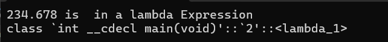
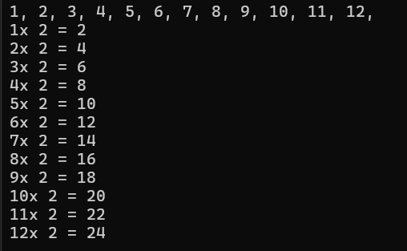

# Lambda Expressions in C++

Basic Sorting Algorithms

```cpp
#include <iostream>

using Comparator = bool(*)(int, int);

template<typename T, int size>
void Sort(T(&arr)[size], Comparator comp) {
    for (int i = 0; i < size-1; ++i){
        for (int j = 0; j < size-1; ++j){
            if (comp(arr[j] , arr[j + 1])) {
                T temp = arr[j];
                arr[j] = arr[j + 1];
                arr[j + 1] = temp;
            }
        }
    }
}

bool Comp1(int x, int y) {
    return x > y;
}

bool Comp2(int x, int y){
    return x < y;

int main() {
    int arrEl[] = { 1, 9, 3,2, 0 };

    for (auto x : arrEl) std::cout << x << " ";
    std::cout << "\n";

    Sort(arrEl);

    for (auto x : arrEl) std::cout << x << " ";
    std::cout << "\n";
    return 0;

}
```

## Working With Function Object and LAMBDAs instead of Function Pointers

Lambda Syntax Generalization:
`[](<args>)<mutable><exception specs>-><return type>{ \* Code here *\};`
*[]* - accept the following `=. &, this`
*args*- can be `int, float, ... or auto` to user defined types.
*mutable*-Lambda is `unmutable` or `const` i.e can't modify variables inside the function by default 
so `mutable` is a key word to remove the `const` ness of the internal member function
*exception specs* - is it `noexception(true|false)`
*return type* - all available types `int,float,..` to user defined types


Note that the `typename Comparator` was added to the `Sort` algoarithm.
```cpp
#include <iostream>

using Comparator = bool(*)(int, int);

template<typename T, int size, typename Comparator>
void Sort(T(&arr)[size], Comparator comp) {
    for (int i = 0; i < size-1; ++i){
        for (int j = 0; j < size-1; ++j){
            if (comp(arr[j] , arr[j + 1])) {
                T temp = arr[j];
                arr[j] = arr[j + 1];
                arr[j + 1] = temp;
            }
        }
    }
}


//bool Comp1(int x, int y) {
//	return x > y;
//}
//
//bool Comp2(int x, int y){
//	return x < y;
//}

    struct Comp3 {
    bool operator () (int x, int y) {
        return x > y;
    }
};

int main() {

    /* ==================== SORTING ARRAY OF INT, FLOAT, DOUBLE =============================*/

    int arrEl[] = { 1, 9, 3,2, 0 , 4, 8, 5};
    for (auto x : arrEl) std::cout << x << " ";
    std::cout << "\n";
    Comp3 comp3;
    //Sort(arrEl, comp3); // USING FUNCTION OBJECT
    Sort(arrEl, [](int x, int y) { return x < y; });

    for (auto x : arrEl) std::cout << x << " ";
    std::cout << "\n";

    /* ==================== SORTING ARRAY OF STRINGS =============================*/
    std::string arrStr[] = { "Ola", "Segun", "Bunmi", "Tolu"};

    for (auto x : arrStr) std::cout << x << " ";
    std::cout << "\n";

    //Sort(arrEl, comp3);
    //Sort(arrStr, [](std::string x, std::string y) { return strcmp(&x.c_str()[0], &y.c_str()[0]) > 0; });
    Sort(arrStr, [](auto x, auto y) { return x > y; });

    for (auto x : arrStr) std::cout << x << " ";
    std::cout << "\n";

    return 0;

}
```

### More Lambda examples

```cpp
    auto fmp = [](auto x) {
        std::cout << x << " is  in a lambda Expression\n";
        };
    fmp(234.678L);

    std::cout << typeid(fmp).name() << std::endl;
```

### Using Parameter Pack and fold expressions 

```cpp
    auto add = [](auto ... args) {
        return (args + ...); // fold expression requires at least C++17
        };
    std::cout << add(3, 4, 6, 11.5, -4, 3, 20);
```

<figure markdown='span'>
    
</figure>

### Working with Fold in cpp

```cpp
    // NOTE: folds requires at least C++17
    auto add = [](auto ... args)->float {
        ((std::cout << args  << ", "), ...);
        std::cout << "\n";
        ((std::cout << args << "x 2 = " << args*2 << "\n"), ...);
        std::cout << "\n";
        return (args + ...); 
        };
    std::cout << add(1, 2, 3, 4, 5, 6, 7, 8, 9, 10, 11, 12);
```
<figure markdown='span'>
    
</figure>