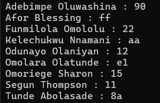

# Standard Template Library in C++

## Introduction

<div class='grid' markdown>

| Sequence  | Header |
|---------------|------------|
|`array`        | `<array>`|
| `vector`      |`<vector>`|
|`list`         |`<list>`|
|`deque`        |`<deque>`|
|`forward_list`|`<forward_list>`|
|`set, multiset`|`<set>`|
|`map, multimap`|`<map>`|
|`unordered_set, unordered_multiset`|`<unordered_set>`|
|`unordered_map, unordered_multimap`|`<unordered_map>`|


```h
    \** == COMMON FUNCTIONS == **\
    - default constructor
    - uniform Init. construction
    -  Copy constructor
    - Iterator constructor
    - size()
    - clear()
    - begin() and end() 
    - default allocator
```

</div>

## Standard Array Template `std::array`

<div class='grid' markdown>

Properties:     
  1. Thin Wrapper over C-style static array    
  2. Supports iterators     
  3. Knows about its **size**       
  4. provides random access     
  5. Can be used with C-FUNCTIONS       
  6. Cannot grow in size

<figure markdown='span'>
    
</figure>

</div>

```cpp
#include <iostream>
#include <array>


void StdArray() {

    // Initializing using STARDARD INITILIZER LIST
    std::array<uint32_t, 6> scores = {35, 89, 15, 99, 56, 47};

    // Initializing using UNIFORM INITIALIZATION 
    std::array<int, 8> usersNo {1, 4, 8, 16, 20, 32, 46, 64}; 

    // accessing with [] operator
    std::cout << scores[5] << std::endl;

    // accessing element : for range loop
    for (auto& el : scores)
        std::cout << el << " ";
    std::cout << "\n";

    // Accessing element : for loop
    for (int i = 0; i < usersNo.size(); i++){
        std::cout << usersNo[i];
        if (i != (usersNo.size() - 1)) std::cout << " => ";
    }

}

int main() {

    StdArray();
}
```

### Standard Array Iterator

- This returns a pointer like object to the current `array`
- User can use this to access the elements by their position
- Iterator also provide overloaded operators such as `++`, `--` and `*`
- You can create it through `begin()` and `end()` functions in all containers

<figure markdown='span'>
    
</figure>

!!! Warning
    Note that `end()` returns an Iterator that **DOES NOT** point to the array (points to **memory beyond the array** )    Therefore, never dereference an `end()` iterator.


```cpp
void StdArrayIter() {

    std::array<int, 8> usersNo = { 10, 4, 8, 16, 20, 32, 46, 64 };

    // Returns pointer to the begin of the std::array
    auto it = usersNo.begin();
    std::cout << " Access element - *it " << *it << std::endl;
    it++; // move to `4`
    ++it; // move to '8'
    std::cout << " Access element - *it " << *it << std::endl;
    it++;
    --it; // go back to `8`
    it--; // go back  to `4`
    std::cout << " Access element - *it " << *it << std::endl;

    std::cout << "\nPrinting with while loop: \n";
    while (it != usersNo.end()){
        std::cout << *it << " ";
        it++;

    std::cout << "\n\n\n\n" ;

    it = usersNo.begin();
    std::cout << &it << std::endl;
    std::cout << usersNo.data()<< std::endl;


}
```

<div class='grid' markdown>
<figure markdown='span'>
    
</figure>

<figure markdown='span'>
    
</figure>

</div>


## Standard Vector Template `std::vector`


- Behaves like a dynamic array
- Grows automatically
- Efficient for addition/removal at the end
- Provides random access
- Not good for insertion/deletion

`std::vector` is basically a Queue - Expands from one end

<figure markdown='span'>
    
</figure>

```cpp
#include <vector>
template <typename ... Param>
void print(Param... lst) {
    ((std::cout << lst << " "), ...);
        std::cout << std::endl;
}

void StdVector() {
    std::vector<int> xPos = {22, 33, 44, 55};
    xPos.push_back(66);
    xPos.push_back(77);
    xPos.push_back(77);

    std::cout << "\nIteration with for loop:\n";
    for (int i = 0; i < xPos.size(); i++) std::cout << xPos[i] << " ";


    std::cout << "\nIteration with for-range loop:\n";
    for (auto& i : xPos) std::cout << i << " ";

    std::cout << "\nIteration with `begin()`:\n";
    auto it = xPos.begin();
    while (it != xPos.end()) std::cout << *it++ << " ";
        

    xPos.pop_back();
    xPos.pop_back();

    std::cout << "\n";
    for (auto& i : xPos) std::cout << i << " ";

    xPos.insert(xPos.begin(), { 34, 8, 23 }); // insert using init-list
    xPos.insert(xPos.begin(), -101); // insert single element
    xPos.insert(xPos.begin()+3, -33); // insert at index 3

    std::cout << "\n";
    for (auto& i : xPos) std::cout << i << " ";

    xPos.erase(xPos.begin() + (xPos.size() - 1) / 2);

    std::cout << "\n";
    for (auto& i : xPos) std::cout << i << " ";

    xPos.erase(xPos.end() - 3);

    std::cout << "\n";
    for (auto& i : xPos) std::cout << i << " ";

    print(3, 4, 3, 78, "344in", 56.78);
}


int main() {

    StdVector();
}
```

## Standard Deque `std::deque`

- Efficient for additional / Removal at both end
- Grows automatically just like vector
- Provides random access (`[]`operator modify element)
- NOT GOOD for insertion / deletion, except at both ends.
  
Basically what `std::vector` can do but with the extra of front operations


```cpp
  #include <iostream>
#include <deque>

void StdDeque() {

    std::deque<int> songsFreq = {21, 31, 41, 55};
    songsFreq.push_back(66);
    songsFreq.push_back(77);

    songsFreq.push_front(77);
    songsFreq.push_front(12);
    songsFreq[6] = 345;
    std::cout << "\nIteration with for loop:\n";
    for (int i = 0; i < songsFreq.size(); i++) std::cout << songsFreq[i] << " ";


    std::cout << "\nIteration with for-range loop:\n";
    // Iterating using for-range
    for (auto& i : songsFreq) std::cout << i << " ";

    // Iterating using `begin()`
    std::cout << "\nIteration with `begin()`:\n";
    auto it = songsFreq.begin();
    while (it != songsFreq.end()) std::cout << *it++ << " ";
        

    std::cout << "\nvalue `at` index 5 :  =" << songsFreq.at(5) << std::endl;

    songsFreq.pop_back();
    songsFreq.pop_front();


    std::cout << "\n";
    for (auto& i : songsFreq) std::cout << i << " ";

    songsFreq.insert(songsFreq.begin(), { 34, 8, 23 }); // insert using init-list
    songsFreq.insert(songsFreq.begin(), -101); // insert single element
    songsFreq.insert(songsFreq.begin()+3, -33); // insert at index 3

    std::cout << "\n";
    for (auto& i : songsFreq) std::cout << i << " ";

    songsFreq.erase(songsFreq.begin() + (songsFreq.size() - 1) / 2);

    std::cout << "\n";
    for (auto& i : songsFreq) std::cout << i << " ";

    songsFreq.erase(songsFreq.end() - 3);

    std::cout << "\n";
    for (auto& i : songsFreq) std::cout << i << " ";
}

int main() {

    StdDeque();
}
```


## Standard List `std::list` / Forward list `std::forward_list`

### List

- Implemented as two way linked list
- Efficient for insertion / deletion
-**DOES NOT provide random accesss (NO `[]`operator modify element)**

Useful when you need a container that you will often insert and delete from FRONT/BACK


```cpp
void List() {
    std::list<float> lf;

    // Populating value using loop
    for (int i = 1; i < 8; i++) 
        lf.push_back(i * 11);

    // Reading value using for-range
    for (auto i : lf) cout << i << " ";
    cout << endl;

    lf.push_front(-11.0);
    lf.push_front(-22.0);
    for (auto i : lf) cout << i << " ";
    cout << endl;

    cout << "insert(..) ONLY at begin() and end() \n";
    lf.insert(lf.begin(), 121);
    lf.insert(lf.end(), 212);
    for (auto i : lf) cout << i << " ";
    cout << endl;

    cout << "erase(..) \n";
    lf.erase(lf.begin());
    lf.pop_front();
    for (auto i : lf) cout << i << " ";
    cout << endl;

    lf.pop_back();
    for (auto i : lf) cout << i << " ";
    cout << endl;

    cout << "clear(..) \n";
    lf.clear();

    cout << "after clearing : ";
    for (auto i : lf) cout << i << " ";
    cout << endl;
}

int main() {
    List();
}
```
<figure markdown='span'>
    
</figure>


### Forward list

- Implemented as one way linked list
- Good for small memory foot print
- Efficient for insertion / deletion
- Does not provide support for size
- Elements are added at the front only
  


```cpp
#include <forward_list>

void ForwardList() {
    std::forward_list<float> fl;

    fl.assign({ 34, 40.0f });

    // Populating value using loop
    for (int i = 1; i < 8; i++)
        fl.push_front(i * 11);

    // Reading value using for-range
    for (auto i : fl) cout << i << " ";
    cout << endl;

    fl.push_front(-11.0);
    fl.push_front(-22.0);
    for (auto i : fl) cout << i << " ";
    cout << endl;

    fl.pop_front();
    for (auto i : fl) cout << i << " ";
    cout << endl;

    cout << "clear(..) \n";
    fl.clear();

    cout << "after clearing : ";
    for (auto i : fl) cout << i << " ";
    cout << endl;

    fl = { 33, 66, 99, 144,169 };
    for (auto i : fl) cout << i << " ";
    cout << "\n\n";

    cout << "insert AFTER begin() : \n";
    fl.insert_after(fl.begin(), 101);
    for (auto i : fl) cout << i << " "; cout << "\n\n";

    cout << "insert AFTER before_begin() : \n";
    fl.insert_after(fl.before_begin(), 202);
    for (auto i : fl) cout << i << " "; cout << "\n\n";

    cout << "erase AFTER begin() : \n";
    fl.erase_after(fl.begin());
    for (auto i : fl) cout << i << " "; cout << "\n\n";

    cout << "erase AFTER before_begin() : \n";
    fl.erase_after(fl.before_begin());
    for (auto i : fl) cout << i << " "; cout << endl;
}

int main() {
    ForwardList();
}
```
<figure markdown='span'>
    
</figure>


## standard Set `std::set` / Multiset `std::multiset`

<div class='grid' markdown>
- Implemented as a binary tree
- Elements are stored and sorted by (< or >)
- Values act as keys
- Fast for search
- No random access
- Elements cannot be modified

<figure markdown='span'>
    {width=70%}
    <figcaption>Binary tree look for `set/multset` <figcaption>
</figure>
</div>


### Inserting and Printing Output

First thing to note is that Set is printed in the sorted order

```cpp
void Set0() {
    std::set<int> scores;
    scores.insert(34);
    scores.insert(67);
    scores.insert(90);
    scores.insert(99);
    scores.insert(0);

    auto it = scores.begin();

    // Element is printed in sorted order (less than by default)
    for (auto i : scores) cout << i << endl;
}
```

Sort the set in the ascending order         


But for you to sort by is greather than, you need to include `std::greater` which is found 
in the `<functional>` header.

```cpp
// Your new definition of scores with `std::greater<int>`
    std::set<int, std::greater<int>> scores;
    scores.insert(34);
    scores.insert(67);
    ...
    for (auto i : scores) cout << i << " ";
```

This sort the set in descending order       


### `erase()` and `find()` with  Set

```cpp
void Set1() {

    std::set<string> students = { "Ngozi", "Fifa", "Ayomide", "Tolulope","Mustapha", "Bolanle"};
    students.insert("Damilola");
    students.insert("Zamani");
    students.insert("Yetunde");

    auto it = students.begin();
    while (it != students.end()) cout << *it++ << "  ";
    cout << "\n";


    /**
    DOES NOT SUPPORT RANDOM ACCESS LIKE - vector, deque
    cout << students[3] << endl;
    *it = 12;
    cout << *it+3 << endl; 
    */

    // Erases use the value itset as key or it
    students.erase("Yetunde");
    students.erase(students.begin());


    for (auto& i : students){
        cout << i << "  ";
    }

    // Search returns the iterator to the key
    auto itr_find = students.find("Zamani");

    if (itr_find != students.end())
        cout << "find: " << *itr_find << " found\n";
    else
        cout << "couldn't find zamani\n";

}
```


### Working with multiset

The main difference for `multiset` is that it allows duplicate of value and you can
also find that duplicated values using `equal_range`.

```cpp

void MultiSet() {

    std::multiset<int> ages{ 5, 6,1, 16, 16, 18, 21, 34, 28, 27, 18, 18, 14 , 16, 0, 1, 16};

    for (auto i : ages) cout << i << "  ";

    // to find multiple occurence of a value

    auto itr_val = ages.find(18);
    if (itr_val != ages.end())
        cout << "\nfound: " << *itr_val << "\n\n";

    // equal range return to iterators as std::pair
    // first - is the iterator of the first found
    // second - the iterator of the element after the last found
    auto itr = ages.equal_range(16);

    while (itr.first != itr.second)
        cout << *itr.first++ << " " ;
    cout << "\n";


}

int main() {
    MultiSet();
}
```


## Standard Map `std::map` / Multimap `std::multimap`
<div class='grid' markdown>
- Implemented as binary tree with Key/Value pair.
- The elements are arranged in sorted order based on the key values
- Best for search (its quite fast)
- No random access allowed (values are immutable)
- Keys cannot be modified directly

<figure markdown='span'>
    
</figure>
    
</div>

### Insertion into a map

```cpp
void Map() {
	
    std::map<int, string> studentsInfo = {
        {0xE1, "Omolara Olatunde"},
        {0x11, "Segun Thompson"},
        {0xff, "Afor Blessing"},
        {0x8A, "Tunde Abolasade"}
    };


    // Insert using std::pair
    studentsInfo.insert(std::pair<int, string>(0xAA, "Abah Inagwelu"));
    studentsInfo.insert(std::pair<int, string>(0x12, "Odunayo Olaniyan"));

    // Insert using std::make_pair
    studentsInfo.insert(std::make_pair(0x22, "Funmilola Omololu"));
    studentsInfo.insert(std::make_pair(0x15, "Omoriege Sharon"));

    // Insert using square bracket operator []
    studentsInfo[0x90] = "Adebimpe Oluwashina";
    studentsInfo[0xAA] = "Kelechukwu Nnamani";


    for (auto& i : studentsInfo)
        cout << std::hex << i.first << " : " << i.second << "\n";
    cout << "\n";
}

```
<figure markdown='span'>
    
</figure>

### Sorting the map base on value

The work around here is to flip the  map so that the key becomes the value and vice versa

```cpp
template<typename A, typename B>
std::pair<B, A> flip_pair(const std::pair<A, B>& p)
{
    return std::pair<B, A>(p.second, p.first);
}

template<typename A, typename B>
std::multimap<B, A> flip_map(const std::map<A, B>& src)
{
    std::multimap<B, A> dst;
    std::transform(src.begin(), src.end(), std::inserter(dst, dst.begin()),
        flip_pair<A, B>);
    return dst;
}

// Usage
void Map{
    std::map<int, string> studentsInfo = {
        {0xE1, "Omolara Olatunde"},
        ...}
        ...
        std::multimap<string, int> dst = flip_map(studentsInfo);

        for (auto& i : dst)
            cout << std::hex << i.first << " : " << i.second << "\n";

 }

```
<figure markdown='span'>
    
</figure>


### Modify & Erase

```cpp

    // Modify Value 
    studentsInfo[0x11] = "Mustapha Al Nurudeen";
    for (auto& i : studentsInfo) cout << std::hex << i.first << " : " << i.second << "\n";
    cout << "\n";

    // Erase by Key
    studentsInfo.erase(0xAA);
    for (auto& i : studentsInfo) cout << std::hex << i.first << " : " << i.second << "\n";
    cout << "\n";


    // Erase at begin()
    studentsInfo.erase(studentsInfo.begin());
    for (auto& i : studentsInfo) cout << std::hex << i.first << " : " << i.second << "\n";
    cout << "\n";


```

### Find and Iterator loop

```cpp
// Searching through map
auto itr = studentsInfo.find(0x90);

if (itr != studentsInfo.end())
    cout << "FOUND : " << itr->second << "\n\n";
else
    cout << "Value not found\n\n";

auto it = studentsInfo.begin();

while (it != studentsInfo.end()){
    cout << it->first << " => " << it->second << "\n";
    it++;
    }

```
<figure markdown='span'>
    
</figure>

### Working with `std::multimap`

This is similar to the `multiset` that it supports same key input and usage of `equal_range` function.

```cpp
void MultiMap() {
    std::multimap <int, string> usersAddr{ {2, "Manny"},{ 5, "Bongo"},{ 1, "Fanaty"}, {2, "Olorunsogo"}, {2, "Jobak"}};

    for (auto i : usersAddr){
        cout << i.first << " " << i.second << "\n";
    }

}
```
<figure markdown='span'>
    
</figure>

with using equal_range

```cpp
void MultiMap() {
    std::multimap <int, string> usersAddr{ {2, "Manny"},{ 5, "Bongo"},{ 1, "Fanaty"}, {2, "Olorunsogo"}, {2, "Jobak"}};

    for (auto i : usersAddr){
        cout << i.first << " " << i.second << "\n";
    }

    // Using equal range
    auto itr = usersAddr.equal_range(2);
    cout << "\nFOUND EQUAL RANGE: \n";
    while (itr.first != itr.second){
        cout << itr.first->first << " = " << itr.first->second << endl;
        itr.first++;
    }

}
```
<figure markdown='span'>
    
</figure>

### MACRO to print variable name

```cpp

#define PRINT(var) cout << #var << " = "<< var << endl;


int score = 50;
PRINT(score);  // score = 50
```

## Unordered containers

- Associative containers implemented as hash tables
- Values are hashed and stored in undefined order
- Fast search, insertion/deletion but may degrade over a period of time
- `std::unordered_set` stores values that act as keys for hashing
- `std::unoredered_map` stores pairs (*first* is used to compute hash)
- Iterators are constant

### Unordered set

```cpp
#include <unordered_set>
void UoSet() {
    std::unordered_set<std::string> sups;
    sups.insert("Hulk");
    sups.insert("Batman");
    sups.insert("Bayrun");
    sups.insert("touchgirl");
    sups.insert("Novacaine");
    sups.insert("NightCrawler");
    sups.insert("Superman");
    sups.insert("ReverseFlash");
    // once the number of element passes 8 the bucket count changes from 8 to 64
    sups.insert("Flash");

    for (auto& i : sups) {
        cout << "Bucket #" << sups.bucket(i) <<" ==> " << i << endl;
    }
    cout << "\nBucket count: " << sups.bucket_count() << endl;
    cout << "Number of elements: " << sups.size() << endl;
    cout << "Load factor: " << sups.load_factor() << endl;

}
```
<figure markdown='span'>
    
</figure>

Unorder multiset allows duplicate

### Unordered Map

```cpp
#include <unordered_map>
void UoMap() {
    std::unordered_map<int, string> powerUsers;

    powerUsers.insert(std::make_pair(20000, "Spiderman"));
    powerUsers.insert(std::make_pair(400000, "Superman"));
    powerUsers.insert(std::make_pair(5670, "Hawkeye"));
    powerUsers.insert(std::make_pair(350000, "Hulk"));
    powerUsers.insert(std::pair<int, string>(6500, "Romanoff"));
    powerUsers.insert(std::pair<int, string>(390000, "SheHulk"));

    powerUsers[12000] = "Dr. Strange";
    powerUsers[22110] = "Capt. America";
    powerUsers[25110] = "Capt. Carter";


    for (auto i : powerUsers) {
        cout << "Bucket #" << powerUsers.bucket(i.first)<< " ==> " << i.first <<", "<< i.second << endl;
    }
    cout << "\nBucket count: " << powerUsers.bucket_count() << endl;
    cout << "Number of elements: " << powerUsers.size() << endl;
    cout << "Load factor: " << powerUsers.load_factor() << endl;

}
```
<figure markdown='span'>
    
</figure>
