# Introduction to CPP

## Reference and Pointers

**Variables or Identifiers** - they are like containers like say - buckets, box, cups etc. that stores
data on the computer memory

```c++
int num = 2;

// Reference is like a LABEL on a container,
//  It cannot exit with assigning a container to it
int& r_num2 = num; 

// Pointer is like a small container ONLY stores in the LABEL of another container
int* p_num = &num; 
```

## Working with strings

### Assignment , copy and concatenate

```c++
using std::string;
string s0{ "Mathematics " };
string s1{ "is the key to theory " };
string s2 = "Bien venue, C++";
string s3("hello Earth");

// assignment/copy
string s4 = s2;
std::cout << s4 << "\n";

// concatenate
string s5 = s0 + s1;
s5 = s2 + " **** " + s3;
std::cout << s5 << "\n";

```

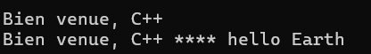

### insert into a string

```c++
using std::string;
string s0{ "Mathematics " };
string s1{ "is the key to theory " };

// insert
string s4 = s0 + s1;

// insert at index 7, it expand the length of the string
s4.insert(7, "TRIX");

std::cout << s4 << "\n";
```

#### Replace with `character`

```c++
using std::string;
string s1{ "the key to theory " };

std::cout << s1 << "\n";
// replace(pos, n, m, c)
// pos - index to start replace from
// n - number of characters to replace, counting from `pos`
// m - how many times should char. be replaced
// c - is the character to add as replacement
 
string s4 = s1;
s4.replace(11, 5, 3, 'X');
std::cout << s4 << "\n";

string s5 = s1;
s5.replace(11, 5, 8, 'X');
std::cout << s5 << "\n";

```

<figure markdown='span'>
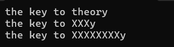
</figure>


#### Replace with `substring`
```c++
	using std::string;
	string s1{ "the key to theory " };

	std::cout << s1 << "\n";

	// Replace using strings

	// replace(pos, n, str)
	// pos - index to start replace from
	// n - number of characters to replace, counting from `pos`
	// str  - strings to replace
 
	string s4 = s1;
	s4.replace(11, 6, "practical");
	std::cout << s4 << "\n";
```
<figure markdown='span'>
  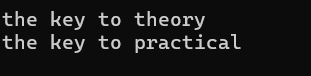
</figure>

#### Replace string with anothe substring
```c++
	using std::string;
	string s2 = "Bien venue, C++";
	string s3{"hello Earth"};

	std::cout << "BEFORE:" << "\n";
	std::cout << s2 << "\n";
	std::cout << s3 << "\n\n";

	// Replace using strings

	// replace(pos1, n1, str, pos2, n2)
	// 
	//		pos1 => index in the main string
	//		n1 => number counting from `pos1`
	//		str  => strings to replace from
	//		pos2 => index in the second string
	//		n2 => number counter from `pos2`
 
	s2.replace(0, 4, s3, 6, 5);

	std::cout << "AFTER:" << "\n";
	std::cout << s2 << "\n";

```
<figure markdown='span'>
  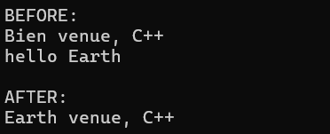
</figure>

### Find and Replace strings Exercise

```c++
using std::string;
string find_and_replace(string search_txt, string &to_find, string &to_replace ) {

	size_t found_pos = search_txt.find(to_find);
	
	// Not found
	if (found_pos == string::npos) return "string not found";

	// While `to_find` string is available
	while (found_pos != string::npos) {

		// Replace the string 
		search_txt.replace(found_pos, to_find.length(), to_replace);

		// move forward in search string, to the character after last found
		found_pos = search_txt.find(to_find, found_pos + to_find.length());
	}

	return search_txt;
}

int main() {

	std::string s1{ "this is Hello You Helligan is the most Hellium\n in afriHell in Hellicarrier famous " };
	std::string str_to_find{ "Hell" };
	std::string str_to_replace{ "Heaven" };
	
	std::cout << "BEFORE: " << s1 << "\n\n";
	std::cout << "AFTER: " << find_and_replace(s1, str_to_find, str_to_replace) << "\n";
	return 0;
}
```

### find string

```c++
using std::string;
string s2 = "Bien venue, C++";
string s3{"C++ is saying hello Earth"};


// find
size_t found = s2.find("C++");
if (found != string::npos) std::cout << " found in `s2` at index " << found << "\n";
else  std::cout << " not found in s2 "<< "\n";

// start search at index 10
found = s3.find("C++", 10); 
if (found != string::npos) std::cout << " found in `s3` at index " << found << "\n";
else std::cout << " not found in s3 " << "\n";
```

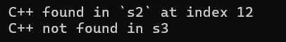

### Erase and Clear

```c++
using std::string;
string s2 = "Bien venue C++";
string s3{"C++ is saying hello Earth"};

// erase(pos, count) just like in the replace(...)
s2.erase(11, 3); // Removes C++ fromm string

std::cout << s2 << "\n";

// clear
std::cout <<"BEFORE s3.clear() s3 is = '" << s3 << "'\n";
s3.clear(); // remove all the strings
std::cout << "AFTER s3.clear() s3 is = '" << s3 << "'\n";

```
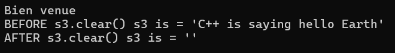

## EXERCISES : String ToUpper and ToLower in C++

```c++
#include <iostream>
#include <ctype.h>

enum class Case { UPPER, LOWER };
std::string To(Case c, std::string s) {
    if (c == Case::UPPER)
        for (int i = 0; i < s.length(); i++)
            s[i] = (char)toupper(s[i]);

    if (c == Case::LOWER)
        for (int i = 0; i < s.length(); i++)
            s[i] = (char)tolower(s[i]);

    return s;
}

int main() {

     std::string name1 = "basement animation";
     std::string name2 = "ADEGBITE ADEOYE";


    // Write C++ code here
    std::cout << name1 << " to upper = " << To(Case::UPPER, name1) << "\n";
    std::cout << name2 << " to lower = " << To(Case::LOWER, name2) << "\n";
    
    return 0;
}
```
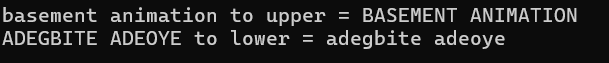

## Working with stringstream

Make sure you include `<sstream>`

### istringstream - Input String to program
```c++
int main() {

std::string hello = "124.12+13 14";

std::istringstream is(hello);

int x{};
int y{};
float z{};
char buf;
is >> z >> buf >> y >> x;

std::cout << is.str() << "\n";
std::cout  << "z=" << z <<", buf=" << buf  << ", y=" << y << ", x=" << x << "\n";
	return 0;
}
```
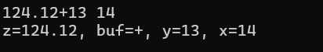

### ostringstream - Output string  from program

```c++
std::ostringstream oss;

int w = 45;
float k = 345.32f;
char div = '/';

float result = static_cast<float>(w / k);

oss << w << div << k << "=" << result;
std::cout << oss.str() << std::endl;

oss << " More content";
std::cout << oss.str() << std::endl;
oss << " + Yet Another ";
std::cout << oss.str() << std::endl;

oss.str(" Replace `oss` content");
std::cout << oss.str() << std::endl;
	
```
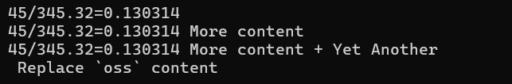

### Read and convert string to other primitive, vice versa

```c++
std::stringstream ss;
std::vector<int> list{};

std::string number_list = "23  35 -23     44 34"; // `ss` will ingnore space
ss.str(number_list);

int num{};
while (ss >> num)
{
	std::cout << num << "\n";
	list.push_back(num);
}

// converting int to string 
double num1 = 345.245;
std::string num1_str = std::to_string(num1);

int num2 = -1222;
std::string num2_str = std::to_string(num2);

// Converting string to other primitive

std::string num3_str = "994.4";
float num3 = std::stof(num3_str);

std::cout << num3 + 111.111 << std::endl;

```
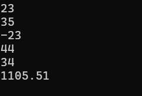


## Data Structures

### The `std::arrays`  and `std::vector`

```c++
float ages4[9]{ 1.0 }; // initialize first element and others to zero
float ages5[9] = { 2.0f, 4.4f,5.0, 5 }; // initialize first four elements

std::array<std::string, 10> ages1{"34", "3"}; // brakect init: fills remain with empty string
std::array<int, 10> ages2 = {3, 4, 3}; // Equals init:  the first 3/10 elements init with equals
std::array<float, 5> ages3 {}; // init all value to 0.0
array<float, 5> scores ={}; // same init all with 0

std::vector<float> age6(5, 3.5f); // fill all 5 init elements with 3.5f
std::vector<int> age7{ 3, 5, 6 }; // bracket init:  with 3 elements 
std::vector<int> age8 = { 13, 15, 26, 5, 11 }; //Equals init: fills with 5 element 
std::vector<int> ageCopy1 (age6); // copy array

ages1[5] = "39";
ages1[9] = "No";
for (auto &i : ages1)
{
 std::cout << i << " ";
}

// Passing an `auto => std::initializer_list<int> li `
auto li = { 4, 0, 200, 45 }; 
std::vector<int> liVec(li.begin(), li.end());
for (auto var : liVec)
 std::cout << var << " ";

std::cout << "\n";

// Passing array as an initializer
float ages[10] = { 3.0f };
std::vector<float> agesf(ages, ages + sizeof(ages)/sizeof(float));

for (auto& i : agesf)
 std::cout << i << " ";

std::cout << "\n";
```

## Memory copy function

```cpp
#include <iostream>
#include <array>

int main() {

  std::array <float, 10> score{3.0f, 5.0f, 8.2f, 5.5f};
  std::array <float, 15> xp{};

  memcpy(xp.data(), score.data(), sizeof(score));

  std::cout << xp[0] << std::endl;
  std::cout << xp[1] << std::endl;
  std::cout << xp[2] << std::endl;

  // This returns the count - 10
  std::cout << "score.size() = " << score.size() << "\n";

  // returns the total bytes = 10 x 4 bytes
  std::cout << "sizeof(score) = " << sizeof(score) << std::endl;

  return 0;
}
```
<figure markdown='span'>
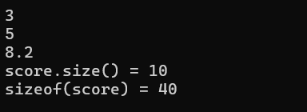
</figure>


### The most Basic Multithread Example : Part 1

```cpp

#include <iostream>
#include <thread>
#include <chrono>

void func1(char char1){
 for (size_t i = 0; i < 1000; i++)
  std::cout << char1;
}

void func2() {
 int i = 0;
 while (i < 1000){
  std::cout << "X";
  i++;
 }
}

int main()
{
 std::thread t1{ func1, '0' };
 std::thread t2(func2);

 t1.join();
 t2.join();

 return 0;
}
```

### The Most Basic Multithread Example : Part 2


```cpp

#include <iostream>
#include <map>
#include <thread>
#include <chrono>
#include <string>

using namespace std::chrono_literals;


void refresh_focast(std::map<std::string, float> cityForecast) {

 while (true) {
  std::cout << "===========================\n";
  for (auto& forecast: cityForecast)
  {
   forecast.second++;
   std::cout << "City : " << forecast.first << 
    ", \nTemperature: " << forecast.second << "\n\n";

  }

  std::this_thread::sleep_for(2000ms);
 }
}


int main()
{
 std::map<std::string, float> cityTempList{
  {"Lagos", 24.0f},
  {"Abuja", 15.7f},
  {"Adamawa", 10.0f},
  {"Jos", 2.9f}
 };

 std::thread worker1(refresh_focast, cityTempList);

 worker1.join();

 return 0;
}
```

## Classes and Template

When you create a function in a class and put the declaration and definition together, the compiler implicitly create an inline function.

this is the standard way

```c++ title="A.h"
template <class T>
Class A {
  public
  T a_func();

  private:
  T a{};
}

template <class T>
inline T A::a_func(){  return ...; }
```

But you can also put the definition and declaration together

```c++ title="A.h"
template <class T>
Class A {
  public
  // the complier IMPLICITLY call :
  // template <class T> inline T A::a_func()
  T a_func(){  return ...; }

  private:
  T a{};
}


```

## Namespaces demonstration

Namespaces helps use `Modularize` Code
Namespaces are used to avoid name clashes either within your program or with the built in C++ functions and classes

```c++

#include <iostream>
#include <cstdio>
using std::cout, std::endl, std::cin; // using the C++17

namespace dst1{
 float Distance(int s, int r) { return (s * r) / 2; }
 int max(int a, int b) { return (a > b) ? a : b; }
}

namespace dst2{
 float Distance(int x, int y) { return (x * x + y * y) / 2; }

}

int main() {
 std::string name;
 cout << "Enter your name: ";
 cin >> name;
 cout << "Ahoyy, Your name is "<< name << endl;

 // Calling from 'dst1' namespace
 cout << dst1::Distance(34, 12) << endl;
 cout << dst1::max(45, 500) << endl;

 // Calling from 'dst2' namespace
 cout << dst2::Distance(23, 50) << endl;
 
 return EXIT_SUCCESS;
}

```

Example of namespace Nesting

```c++
#include <iostream>
using std::cout, std::endl;


namespace sort {
 /** Sorting Algoorithms */
 void QuickSort() {cout << "Q-sort" << endl;}

 void InsertSort() {cout << "I-sort" << endl;}

 void BinarySort() {cout << "Bi-sort" << endl;}

 namespace comp {
  /** Comp - stands for `comparison` */
  void LessThan() {cout << "Less than " << endl;}

  void GreaterThan() {cout << "Greater than " << endl;}
 } // nested 
}

int main() {
 
 sort::BinarySort();
 sort::InsertSort();
 sort::comp::LessThan();
 sort::comp::GreaterThan();

 return EXIT_SUCCESS;
}
```

## Using Getline to read lines

`Getline`is part of `string` library

```c++
#include <iostream>
#include <string>

int main() {
 std::string name;
 std::cout << "What is your name: ";

 std::getline(std::cin, name);

 if (name.find(' ') == 0) { // check for space
  std::cout << "Space found \n";
  return EXIT_FAILURE;
 }

 std::cout << "Hello, " << name << std::endl;

 return EXIT_SUCCESS;
}
```

## Using Cmath to work math in C++

```c++

#include <iostream>
#include <iomanip> // for `std::setprecision`
#include <cmath>
using std::cout, std::endl;

int main() {

 cout << " sqrt of 25 = " << std::sqrt(25.0f) << endl;
 cout << " Max of 6, 4 = " << std::max(6, 4) << endl;
 cout << "Min of 45, 78 = " << std::min(45, 78) << endl;
 cout << "floor of 45.95 = " << std::floor(45.95) << endl;
 cout << "ceil of 20.41 = " << std::ceil(20.41) << endl;
 float var1 = 54.34454f;
 cout << " Round "<<var1<<" to two decimal = " 
  << std::fixed << std::setprecision(2) << var1 << endl;


}

```


## Classes Basics

### Example 1

#### Base.h

```c++ title="Base.h"
#pragma once

#include <string>
#include <iostream>

class Car {

private:
 std::string name= std::string("Unknown"); // set default name
 float fuel{ 0.0f }; // {} to initialier
 float speed{ 0.0f };
 int passenger{ 0 };

public:
 Car();
 Car(std::string name, float amount);
 void fillFuel(float amount);
 void accelerate();
 void breake();
 void addPassenger(int passenger);
 void dashboard();
 ~Car();
};
```

#### Base.cpp

```c++ title="Base.cpp"
#include "Base.h"

Car::Car(){
 dashboard();
}

Car::Car(std::string name, float amount){
 this->name = name;
 fuel = amount;

 dashboard();

}

void Car::fillFuel(float amount){
 fuel += amount;
}

void Car::accelerate(){
 speed++;
 fuel -= 0.5f;
}

void Car::breake(){
 speed = 0;
 fuel -= 0.5f;
}

void Car::addPassenger(int passenger){
 this->passenger += passenger;
}

void Car::dashboard(){
 std::cout << "< ===   DASHBOARD === >\n";
 std::cout << "Car name: " << name << "\n";
 std::cout << "Car fuel: " << fuel << "\n";
 std::cout << "Car passenger: " << passenger << "\n\n";
 std::cout << "Speed: " << speed << "\n";
}

Car::~Car(){}

```

#### Main.cpp

```c++ title="Main.cpp"
#include <iostream>
#include <vector>
#include <array>

#include "Base.h"

using std::array;
using std::vector;


int main() {

 Car c1;
 int x = 40; // fuel
 Car c2("Xp90", 30);

 c2.addPassenger(4);
 c2.dashboard();

 c2.fillFuel(x);
 c2.dashboard();

 c2.accelerate();
 c2.accelerate();
 c2.accelerate();
 c2.accelerate();

 c2.dashboard();

 return 0;
}
```

## Basic Dynamic Memory allocation

### Working with Malloc

```c++
#include <stdio.h>
#include <stdlib.h>

int main() {
  int* p = (int*)malloc(sizeof(int)); // allocate memory
  *p = 5;
  *p = *p + 7;
  printf("%d", *p); // print value
  free(p);
}
```

### Working with Calloc

```c++
float* prices = (float*)calloc(5, sizeof(float));

for (size_t i = 0; i < 5; i++)
{
  float val = 56.65;
  prices[i] += val * i;
  printf("%f\n", prices[i]);
}

free(prices);
prices = nullptr;
```

### Allocating memory with 'new' operator

```cpp

/*** 
  Allocating memory through `new` Operator:
  Computer knows exactly what size 'int' so it allocate it automatically
  One can assign default value for new allocator unlike 'malloc' 
  */
int* p0 = new int;
int* p1 = new int{}; // default 0
int* p2 = new int{45}; // default 45
int* p3 = new int(23); // default 23


*p0 = 110;

std::cout << *p0 << "\n";
std::cout << *p1 << "\n";
std::cout << *p2 << "\n";
std::cout << *p3 << "\n";

delete p1, p2, p3, p0;
p1 = p2 = p3 = p0 = nullptr;

// More Examples
void String() 
{
    int LENGTH = 5;
    char* lang = new char[LENGTH];
    strcpy_s(lang, LENGTH, "Pyth"); // Alloc one extra bite
    std::cout << lang << "\n";
}

```

# Constant Member Functions

* Member functions qualified with `const` keyword
* Both declaration and definition is qualified
* Such functions **cannot change value of any member variables**
* Useful for creating read-only functions
* Constant objects can invoke only constant member functions.
  * This means all its members identifiers(variables) are also constant

```c++ titlle="Person.h"
#pragma once
#include <iostream>

class Person
{
  std::string username{};
  bool isHealthy{};
  float eneryStored{};
  static int userCount;

public:
  Person();
  Person(std::string);
  void walk();
  void displayPersonDetails() const;
  static void showUserCount();
};
```

```c++ title="Person.cpp"
#include "Person.h"

int Person::userCount = 0;

Person::Person(){
  userCount++;
}

Person::Person(std::string name) : username(name){
  userCount++;
}

void Person::walk(){
  this->eneryStored += 3.4f;
}

void Person::displayPersonDetails() const{
  std::cout << "This person " << this->username << " has  " << this->eneryStored << " Energy.\n";
}

void Person::showUserCount() {
  std::cout << "Total users = " << userCount << "\n";
}
```

```c++ title="Main.cpp"
#include "Person.h"


int main() {

  Person p1, p2, p3;
  const Person p4("Pastor Iwo");
  //p4.walk();
  //p4.walk();
  //p4.walk();
  p4.displayPersonDetails(); // read-only 
  Person::showUserCount();
  return 0;
}
```

## workning With Constructors and Copy Constructor

Remember "**RULE OF 3**" if you have to implement say Destructor then all implement all of the other 2 listed and vice versa:
- `Destructor`
- `Copy constructor`
- `Copy assignment operator`

```c++ title="Integer.h"
#pragma once
#include <iostream>
class Integer
{
	int* m_pInt;

public:
  Integer();
  Integer(int val);
  Integer(const Integer& other);
  int getValue() const;
  void setValue(int val);
  int operator+(const Integer& other);
  friend std::ostream& operator<<(std::ostream& s, const Integer& val);
  ~Integer();
};

```

```c++ title="Integer.cpp"
#include "Integer.h"

Integer::Integer(){
  m_pInt = new int(0);
}

Integer::Integer(int val){
  m_pInt = new int(val);
}

Integer::Integer(const Integer& other){
  m_pInt = new int(other.getValue());
}

int Integer::getValue() const{
  return *m_pInt;
}

void Integer::setValue(int val){
  *m_pInt = val;
}

int Integer::operator+(const Integer& other){
  return getValue() + other.getValue();
}

Integer::~Integer(){
  delete m_pInt;
}

std::ostream& operator<<(std::ostream& s, const Integer& val){
  s << val.getValue();
  return s;
}

```

```c++ title="Source.cpp"
#include "Integer.h"
#include <iostream>

void print(Integer x) {
	std::cout << x.getValue() << std::endl;
}

Integer sum(Integer x, Integer y) {
 return x + y;
}


int main() {

  Integer i1(245);
  Integer i2(55);
  Integer i3 = i2;
  std::cout << i1.getValue() << std::endl;
  std::cout << sum(i1, i2) << std::endl;
  std::cout <<  i2 + i3  << std::endl;

}

```

## Delegating Constructor

Here is basically re-use of constructors

```c++
//Person() with No parameter
Person::Person(): Person("Anonymous", 0)
{
}

// Person(name) with "name" parameter
Person::Person(std::string name) : Person(name, 0)
{
}

// Person with multiple param
Person::Person(std::string name, float eneryStored)
{
  this->username = name;
  this->eneryStored = eneryStored;
  userCount++;
}
```

This helps avoid code duplications

## Default and Delete Function

`default` is good instruct compiler to automatic invoke default construct while the `delete` prevent a member function from being called by the compiler

```c++
class Animal {
	int legs{ 4 };

public:
  // Compiler generate default construct implicitly
  Animal() = default; 

  Animal(int no_of_legs) {
  legs = no_of_legs;
  }

  void setLegs(int l) {
  legs = l;
  }
  // Compiler should reject this func. overload
  void setLegs(float l) = delete;
};

```

## L-Values, R-values and R-Values References

| L-value | R-value
|---------|------------
|Has a name |Does not have a name
|All variables are l-values |R-value is a temp.value
|Can be assigned values |cannot to assigned value(They are the value passed)

```c++
int x = 5;
float price = 45.99f;
```

Here `x` and `price` are L-Values, they can be assigned value, while `5` and `45.99f` are R-Values, they are temporary values.
