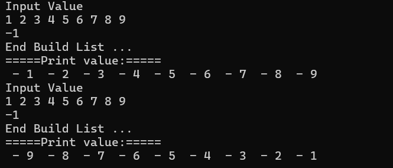

# Introduction to nextedList

This function demonstrate how you build and nexted list both forward and Backward

```cpp
#include <iostream>

template <class T>
struct Node {
 T data{};
 Node* next{};

 Node(T data) {
  this->data = data;
 }
};

void printData(Node<int> *head) {

 Node<int> *current = head;
 if (current == nullptr) {
  std::cout << "The list is empty " << std::endl;
  return ;
 }

 std::cout << "=====Print value:==e===\n";
 while (current != nullptr) {
  std::cout << " - " << current->data << " ";
  current = current->next;
 }
}

void buildForward() {
 Node<int>* newNode{}, * first{}, * last{}, * current{};
 int val;

 // get input
 std::cout << "Input Value" << std::endl;
 std::cin >> val;

 while (val != -1) {

  // create a NewNode
  newNode = new Node<int>(int(val));
  newNode->next = nullptr;

  // insert a newNode
  if (first == nullptr) {
   first = newNode;
   last = newNode;
  }
  else {
   // Insert new node at end of last 
   last->next = newNode;
   last = newNode;
  }

  // get input
  std::cin >> val;

 } // end While loop
 std::cout << "End Build List ..." << std::endl;

 // Print the forward data
 printData(first);
 
} // End buildForward

void buildBackward() {
 Node<int>* newNode{}, * first{}, * last{}, * current{};
 int val;
 // get input
 std::cout << "Input Value" << std::endl;
 std::cin >> val;

 while (val != -1) {

  // create a NewNode
  newNode = new Node<int>(int(val));

  // insert a newNode
  if (first == nullptr) {
   first = newNode;
   last = newNode;
  }
  else {
   // Insert new node at the beginning of first
   newNode->next = first;
   first = newNode;
  }

  // get input
  std::cin >> val;

 } // end While loop
 std::cout << "End Build List ..." << std::endl;

 // Print the forward data
 printData(first);
}


int main() {

 // Building FORWARD =>
 buildForward();

 // Building BACKWARD =>
 buildBackward();

 return 0;
}
```

Result :


## Demonstration of use nextedListIterator

Trying to see how this individual methods in the `nextedListIterator` class plays out

```cpp
#include <iostream>

/**
* Quick take on the Interator class
*/

template <class T>
struct Node {
 T data{};
 Node<T> *next{};

 Node(T data) {
  this->data = data;
 }
};

void printData(Node<int>* head) {

 Node<int>* current = head;
 if (current == nullptr) {
  std::cout << "The list is empty " << std::endl;
  return;
 }

 std::cout << "=====Print value:=====\n";
 while (current != nullptr) {
  std::cout << " - " << current->data << " ";
  current = current->next;
 }
 std::cout << "\n";
}

// A class that produces each element of a container such as a nextedList
template <class T>
class nextedListIterator {
public: 
 nextedListIterator() {
  current = nullptr;
 }

 nextedListIterator(Node<T>* ptr) {
  current = ptr;
 }

 T operator*() {
  if (current != nullptr)
   return current->data;
  else
   return -1;
 }

 nextedListIterator<T> operator++() {
  current = current->next;
  return *this;
 };


 bool operator==(const nextedListIterator& right) const {
  return (current == right.current) ;
 }
 bool operator!=(const nextedListIterator& right) const {
  return (current != right.current) ;
 }
private:
 Node<T>* current; // Point to the current node in nexted list
};

int main() {
 Node<int>* first, *last, *newNode;

 // Initial node
 newNode = new Node<int>(55);
 first = newNode;
 last = newNode;
 
 // insert at back
 newNode = new Node<int>(50);
 last->next = newNode;
 last = newNode;

 newNode = new Node<int>(45);
 last->next = newNode;
 last = newNode;

 // inser in front
 newNode = new Node<int>(40);
 newNode->next = first;
 first = newNode;

 newNode = new Node<int>(35);
 newNode->next = first;
 first = newNode;


 nextedListIterator <int> l1(first);
 printData(first);
 std::cout << "Print Current Data: " << *l1 << std::endl;
 ++l1; // increment the next
 std::cout << "Print (next)Current Data: " << *l1 << std::endl;

 nextedListIterator <int> l2(l1); // copy l1 into l3
 nextedListIterator <int> l3; // 

 std::cout << "is l2 equals l1 => " << (l2 == l1) << "\n";
 std::cout << "is l3 equals l1 => " << (l3 == l1) << "\n";
 std::cout << "l3 value: " << *l3 << std::endl;
 return 0;
}


```