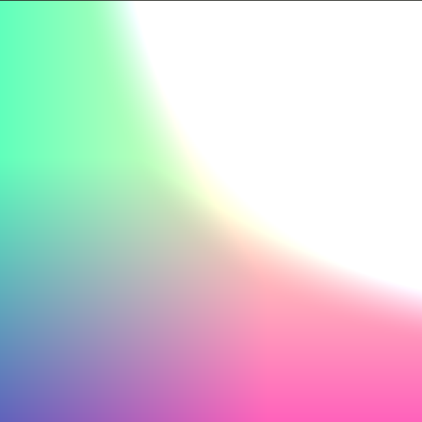

# Shader Learning Process

```glsl
#ifdef GL_ES
precision mediump float;
#endif 

uniform vec2 u_resolution;
uniform vec2 u_mouse;
uniform float u_time;

void main() {   
    
    vec2 st = gl_FragCoord.xy / u_resolution.xy;
    st.x *= u_resolution.x/u_resolution.y;
    
    // Base color of some sort
    vec3 color = vec3(st.x,st.y,abs(sin(u_time)));;
    
    // some kind of  value:
    //      (1) Linear: st.x
    //      (2) Linear: st.y - st.x
    //      (3) curve: st.y * st.x
  
    float x_val =   abs(smoothstep(0.2, 0.5, st.y * st.x)) ; 
    
    color = color + (sin(u_time +  (x_val)) ) ;
    
    gl_FragColor = vec4(color, 1.0);
}
```

Result: 

