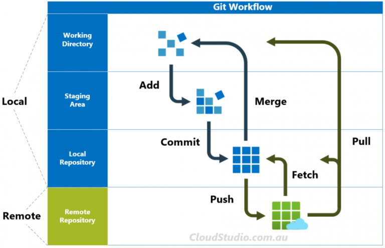
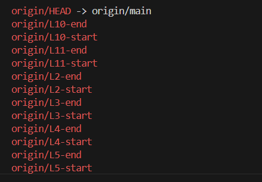

# Git Documentation

General flow of info
<figure markdown='span'>

</figure>

## Git Basics commands

Get started with git 

```bash
git init # to initial git repo.
```

once changes has been made in the working directory 
call:

```bash
git add <file_name or folder_name> # To Add file staged directory
git add * # to add all

git restore --staged <file_name or folder_name> # To remove from Stage back to workdir
git restore --staged * # to restore all to workdir

# once you are done staging and you are satisfied
git commit -m "Your commit msg goes here"
```

```bash
git commit --amend # add recent staged changes 
git commit --amend --no-edit # no need to edit message
git commit --amend -m "An updated message for commit" # Add updated message
```

## Branching

```bash
git branch dev_codes # Creating a new branch "dev_codes"
git checkout dev_codes # Switch to the new branch "dev_codes"

git checkout -b dev_codes2 # Create & switch to new branch "dev_codes2"

```

### Checkout Fetched Content (into a new local branch)

```bash
git checkout -b <new_local_branch_name> <origin/remote_branch_name>
## for example 
git checkout -b L11-start origin/L11-start
```

Use `git branch -d <branch_name>` to delete a merged branch.
USe `git branch -D <branch_name>` to force delete an unmerged branch

## Remote Information

```bash
git remote # show origin name
git remote rename <old_name> <new_name> # eg. 
git remote --help # loads help page with command

# To obtain only the remote URL:
git config --get remote.origin.url

# If you require full on a network of remote repo where the origin resides:
git remote show origin

# This will print all your remotes' fetch/push URLs:
git remote -v   

# Add remote to your remote list
git remote add <name> <url>
```

## fetch, merge and pull

```bash
git fetch <remote> # fetch all remote
git fetch <remote> <branch> # fetch only specific branch
# use `git fetch origin <remote-branch-name>`  fetching from the remote branch without merge
git fetch origin L8-start # fetch from L8-start branch

#After fetching, you need to merge the changes from the remote-tracking branch
#into your current local branch.
git merge origin/L8-start
git merge --abort # to abort merge

# combined fetch & merge from origin
git pull <remote_name> <branch_name>
git pull origin L8-start

# Updated file from the origin
git push <remote_name> <branch_name>
git push origin main
```

## Undo a Git merge COMMIT that hasn't been pushed yet

if you accidentally merge a branch or you just want to under branch that has been **merged and commited
**

```bash
git reset --hard <commit_sha>

git reset --hard HEAD~1 # There's also another way:
```

## Git fetch continuation

run  `git fetch origin` to pull all branches from the remote
or `git fetch origin <branch_name>` to fetch specific branch

run `git branch -r` to show the remote branches

<figure markdown='span'>

</figure>


### Inspect Specific Fetched Content:

To examine the content of a specific fetched branch or commit without merging it into your local branch, you can use `git log` or `git show`
 with the remote-tracking branch name:

**View commit history of a remote branch:**

```bash
    git log origin/your_remote_branch_name
    
    # Git log range
    git log HEAD..origin/your_local_branch_name 
```

**Inspect a specific commit from a remote branch:**

```bash
git show origin/your_remote_branch_name^ #replace ^ with HEAD~N

# for Example
git show origin/L10-end HEAD~2   # show all changes from HEAD~0 to HEAD~2
```

### Compare Local and Remote Branches:

To see the differences between your local
l branch and the corresponding remote-tracking branch after a fetch, use git difference:

```bash
git diff origin/<remote_branch_name>
## for example 
git diff origin/L10-start
```

## Git stash

My use case: Want to create a new branch but I have not commited currently staged changes

so I call :

```bash
git stash # keep my changes for later saving
git checkout -b L11-start origin/L11-start # create local from remote

## Once I have checked out all I needed to do,
git checkout L10-start # Previous branch
git stash pop # Retrieve kept changes

```
