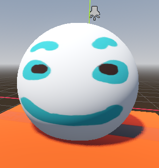

# Godot Shader Docs

## Scrolling Image


```c

    shader_type spatial;

    uniform sampler2D imgTex: source_color;
    uniform vec3 color : source_color;

    void vertex() {
    }

    void fragment() {
        vec2 base_uv = UV;
        base_uv.y += TIME * 0.5; // Translate the image
        vec4 img_tex = texture(imgTex, base_uv);
        ALBEDO = color * img_tex.rgb;
    }

```

### Changing the color and scrolling image

```c

shader_type spatial;

uniform sampler2D imgTex: source_color;
uniform vec3 color : source_color = vec3(0.5, 1.0, 1.0);

void vertex() {
// Called for every vertex the material is visible on.
}

void fragment() {
    // Called for every pixel the material is visible on.
    vec2 base_uv = UV;
    vec3 base_color = color;

    base_uv.y += TIME * 0.5; // Translate the image
    vec4 img_tex = texture(imgTex, base_uv);

    // Normalize stuff
    base_color.rb *= (sin(TIME*2.0) + 1.0) / 2.0;

    ALBEDO = base_color * img_tex.rgb;

}

```

### Moving the Vertex in sinosidal


```c
void vertex() {
    // Called for every vertex the material is visible on.
    VERTEX.y += cos(4.0 * VERTEX.x + TIME * 2.0)  *  0.2;
}

```

### Loading only the texture



```c
uniform sampler2D img_tex2 : source_color;

void fragment() {
    vec4 tex1 = texture(img_tex2, UV);
    ALBEDO = tex1.rgb;
}
```

## Working with Images


```c
uniform sampler2D img_tex2 : source_color;
uniform sampler2D img_tex2_alpha : source_color;

uniform vec3 header_color : source_color;
uniform vec3 face_color : source_color;

void fragment() {
    vec4 tex1 = texture(img_tex2, UV);
    //vec4 tex2 = texture(img_tex2_alpha, UV);

    vec3 channel_1 = tex1.r * header_color;
    vec3 channel_2 = tex1.g * face_color ;
    vec3 outcolor = smoothstep(channel_1, channel_2, vec3(0.1, 0.1, 0.1));

    ALBEDO = outcolor;
}

```

### Distort the image uv coords


```c linenums="1" hl_lines="2-4"

void fragment() {
    vec2 base_uv = UV;
    base_uv.y += sin(100.0 * UV.x + TIME*5.0) * 0.01;
    vec4 tex1 = texture(img_tex2, base_uv);
    //vec4 tex2 = texture(img_tex2_alpha, UV);

    vec3 channel_1 = tex1.r * header_color;
    vec3 channel_2 = tex1.g * face_color ;
    vec3 outcolor = smoothstep(channel_1, channel_2, vec3(0.1, 0.1, 0.1));

    ALBEDO = outcolor;
}

```

### Mixing colors in Black and White Image


```c

uniform vec3 header_color : source_color;
uniform vec3 face_color : source_color;

void fragment() {
    vec2 base_uv = UV;
    base_uv.y += sin(100.0 * UV.x + TIME*5.0) * 0.01;
    vec4 tex1 = texture(img_tex2, base_uv);
    vec3 outcolor = mix(header_color, face_color, tex1.rgb);
    ALBEDO = outcolor;

```

## Creating Fire Fx


```c
shader_type spatial;
render_mode cull_disabled, unshaded, shadows_disabled, ambient_light_disabled;

uniform vec3 fire_color : source_color;
uniform sampler2D tex1Img : source_color, repeat_enable;
uniform sampler2D gradImg : source_color;


void fragment() {
    vec2 b_uv = UV;
    b_uv.y += TIME*2.0;


    vec4 tex1 = texture(tex1Img, b_uv); // Fire texture (BW)
    vec4 grad1 = texture(gradImg, UV); // Gradient 2d

    ALBEDO = fire_color;
    // Clamp the value between 0.0 and 1.0
    ALPHA =  clamp((tex1.r - grad1.r), 0.0, 1.0 )* 4.0;
    }


```

### Basic Fresnel Shader

```c
shader_type spatial;
render_mode cull_disabled, unshaded, shadows_disabled, ambient_light_disabled, depth_prepass_alpha;

uniform vec3 fire_color : source_color;
uniform vec3 fresnel_color : source_color;
uniform float amo : hint_range(0.1, 10.0, 0.1);
uniform float inten: hint_range(0.1, 5.0, 0.1);

vec3 fresnel_glow(float amount, float intensity, vec3 color,   vec3 normal, vec3 view){
    return pow(1.0 - dot(normalize(normal), normalize(view)), amount) * color * intensity;
}


void fragment() {
    vec3 fresnel = fresnel_glow(amo, inten, fresnel_color, NORMAL, VIEW);
    ALBEDO = fire_color + fresnel;
    ALPHA =  clamp(fresnel.r, 0.0, 1.0);
}

```
