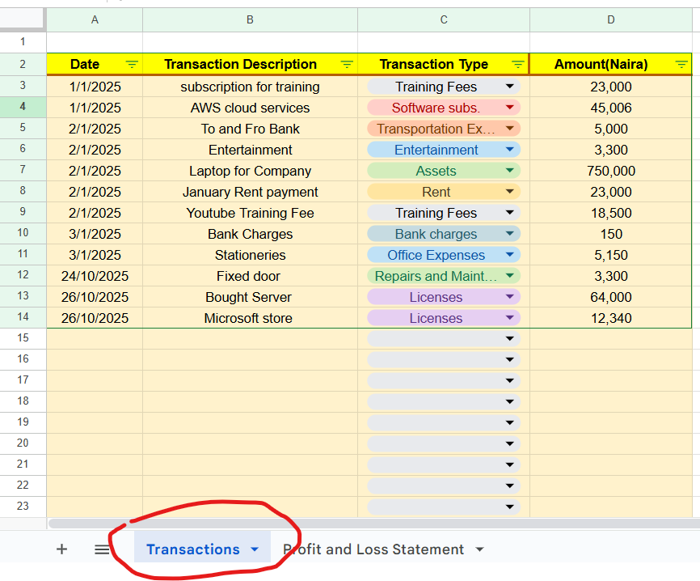
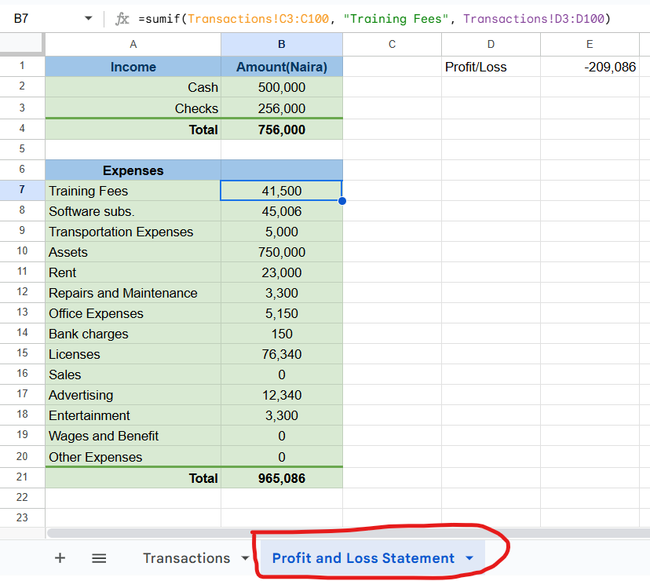

# GOOGLE SHEETS

It reads:

if any **column** in `Transactions!C3:C100`  contains `Training Fees`, **SUM** the equivalent column in `Transactions!D3:D100`

```js
=sumif(Transactions!C3:C100, "Training Fees", Transactions!D3:D100)
```
<div class='grid' markdown>
<figure markdown='span'>

</figure>

<figure markdown='span'>
{width=310px}
</figure>

</div>
