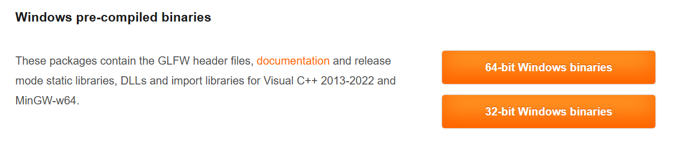

# Setting Up OpenGL

## Setting Up Basic Window
* Go to [glfw download](https://www.glfw.org/download.html){target=blank} and download the 32bit binary. 
<figure markdown="span">
{width=70%}
</figure>

* create a new Empty Project in Visual Studio
* In the solution directory, create a folder called `dependency`
   this is where your `GLFW` will be located
<figure markdown="span">
{ width=70%}
</figure>

* In your extracted `GLFW` binary directory, copy `include` and `lib-vc2022` and paste it in the `dependency > glfw` directory of your project
<figure markdown="span">
{width=60%}
</figure>

* In your project dir, create an entry source file. in the `src` directory
then `Main.cpp` for your entry point:


<figure markdown="span">
{width=80%}
</figure>

## Getting GLFW to Run Window

- Go to [GLFW Documentation](https://www.glfw.org/documentation.html){target=blank} copy the source code and paste it in your `Main.cpp`.  you will get a number of errors,
 
```c++
#include <GLFW/glfw3.h>

int main(void)
{
    GLFWwindow* window;

    /* Initialize the library */
    if (!glfwInit())
        return -1;

    /* Create a windowed mode window and its OpenGL context */
    window = glfwCreateWindow(640, 480, "Hello World", NULL, NULL);
    if (!window){
        glfwTerminate();
        return -1;
    }
   
    glfwMakeContextCurrent(window);  /* Make window's context current */

    while (!glfwWindowShouldClose(window)){ /* Loop until the user closes win */

        /* Render here */

        glClear(GL_COLOR_BUFFER_BIT);

        glfwSwapBuffers(window); /* Swap front and back buffers */
        
        glfwPollEvents(); /* Poll for and process events */
    }

    glfwTerminate();
    return 0;
}
```

  - So Next Step is:
    - Go to your Project Property `ALT + ENTER`
  
    - Make sure your program is in `all cofiguration` and `All Platforms`
      
    
    - Under `C/C++ > General > Additional Include Directories > ⬇️ Edit` add `$(SolutionDir)\dependency\glfw\include`
        <figure markdown="span">
        {width=90%}
        </figure>

    - Under `Linker > General > Additional Libary Directories ` add `$(SolutionDir)\dependency\glfw\lib-vc2022`
        <figure markdown="span">
        {width=90%}
        </figure>
    - Under same `Linker` go to `Input > Additional Dependencies` add `glfw3.lib;opengl32.lib`.  
    !!! Note
        `glfw3`is located in your `$(SolutionDir)\dependency\glfw\lib-vc2022`
        While `opengl32.lib` is windows dependent
    <figure markdown="span">
    
    </figure>
    - Finally, Remember to Change your architecture you are rendering in to `x86`
    <figure markdown="span">
    {width=70%}
    </figure>

## Using GLEW for Opengl functions

* Download from [here](https://glew.sourceforge.net/) and copy to `dependency` directory
* Add the `include` and `lib` then link the `glew32s.lib` on your Visual studio.
* Under `C/C++ > Preprocessor > preprocessor def` add `GLEW_STATIC` macro
  
<figure markdown="span">
{width=70%}
</figure>

The following are very important for `glew` to function properly:

- make sure you include `#include <GL/glew.h>` before any opengl include
- An **opengl context** must be called before calling `glewInit()`

```c++ hl_lines="1 22-26"

#include <GL/glew.h>
#include <GLFW/glfw3.h>
#include <iostream>

int main(void)
{
    GLFWwindow* window;

    /* Initialize the library */
    if (!glfwInit())
        return -1;

    /* Create a windowed mode window and its OpenGL context */
    window = glfwCreateWindow(640, 480, "Hello World", NULL, NULL);
    if (!window) {
        glfwTerminate();
        return -1;
    }

    glfwMakeContextCurrent(window);  /* Make window's context current */

    if (glewInit() != GLEW_OK)
        std::cout << "Error! at GLEW " << std::endl;

    // Get the OPENGL VERSION 
    std::cout << glGetString(GL_VERSION) << std::endl;
...
    glfwTerminate();
    return 0;
}
```

