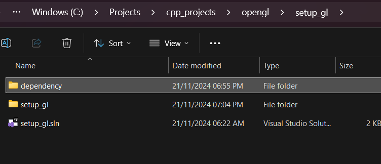
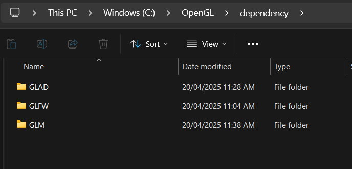

# Setting Up OpenGL

## GLFW / GLEW Setting Up Basic Window
* Go to [glfw download](https://www.glfw.org/download.html){target=blank} and download the 32bit binary. 
<figure markdown="span">
{width=70%}
</figure>

* create a new Empty Project in Visual Studio
* In the solution directory, create a folder called `dependency`
   this is where your `GLFW` will be located
<figure markdown="span">
{ width=70%}
</figure>

* In your extracted `GLFW` binary directory, copy `include` and `lib-vc2022` and paste it in the `dependency > glfw` directory of your project
<figure markdown="span">
{width=60%}
</figure>

* In your project dir, create an entry source file. in the `src` directory
then `Main.cpp` for your entry point:


<figure markdown="span">
{width=80%}
</figure>

### Getting GLFW to Run Window

- Go to [GLFW Documentation](https://www.glfw.org/documentation.html){target=blank} copy the source code and paste it in your `Main.cpp`.  you will get a number of errors,
 
```c++
#include <GLFW/glfw3.h>

int main(void)
{
    GLFWwindow* window;

    /* Initialize the library */
    if (!glfwInit())
        return -1;

    /* Create a windowed mode window and its OpenGL context */
    window = glfwCreateWindow(640, 480, "Hello World", NULL, NULL);
    if (!window){
        glfwTerminate();
        return -1;
    }
   
    glfwMakeContextCurrent(window);  /* Make window's context current */

    while (!glfwWindowShouldClose(window)){ /* Loop until the user closes win */

        /* Render here */

        glClear(GL_COLOR_BUFFER_BIT);

        glfwSwapBuffers(window); /* Swap front and back buffers */
        
        glfwPollEvents(); /* Poll for and process events */
    }

    glfwTerminate();
    return 0;
}
```

  - So Next Step is:
    - Go to your Project Property `ALT + ENTER`
  
    - Make sure your program is in `all cofiguration` and `All Platforms`
      
    
    - Under `C/C++ > General > Additional Include Directories > ⬇️ Edit` add `$(SolutionDir)\dependency\glfw\include`
        <figure markdown="span">
        {width=90%}
        </figure>

    - Under `Linker > General > Additional Libary Directories ` add `$(SolutionDir)\dependency\glfw\lib-vc2022`
        <figure markdown="span">
        {width=90%}
        </figure>
    - Under same `Linker` go to `Input > Additional Dependencies` add `glfw3.lib;opengl32.lib`.  
    !!! Note
        `glfw3`is located in your `$(SolutionDir)\dependency\glfw\lib-vc2022`
        While `opengl32.lib` is windows dependent
    <figure markdown="span">
    
    </figure>
    - Finally, Remember to Change your architecture you are rendering in to `x86`
    <figure markdown="span">
    {width=70%}
    </figure>

### Using GLEW for Opengl functions

* Download from [here](https://glew.sourceforge.net/) and copy to `dependency` directory
* Add the `include` and `lib` then link the `glew32s.lib` on your Visual studio.
* Under `C/C++ > Preprocessor > preprocessor def` add `GLEW_STATIC` macro
  
<figure markdown="span">
{width=70%}
</figure>

The following are very important for `glew` to function properly:

- make sure you include `#include <GL/glew.h>` before any opengl include
- An **opengl context** must be called before calling `glewInit()`

```c++ hl_lines="1 22-26"

#include <GL/glew.h>
#include <GLFW/glfw3.h>
#include <iostream>

int main(void)
{
    GLFWwindow* window;

    /* Initialize the library */
    if (!glfwInit())
        return -1;

    /* Create a windowed mode window and its OpenGL context */
    window = glfwCreateWindow(640, 480, "Hello World", NULL, NULL);
    if (!window) {
        glfwTerminate();
        return -1;
    }

    glfwMakeContextCurrent(window);  /* Make window's context current */

    if (glewInit() != GLEW_OK)
        std::cout << "Error! at GLEW " << std::endl;

    // Get the OPENGL VERSION 
    std::cout << glGetString(GL_VERSION) << std::endl;
...
    glfwTerminate();
    return 0;
}
```


## GLFW / GLAD Setting Up

## Dependency Setup Folder

Since you will be build a lot of small OpenGL projects, Its advicable to have a general *dependency* directory where you will always refer to your `includes`, `libraries` and `binaries` when you create new projects. This will saves you from have multiple copies on every projects.

Here is my preferred setup is:



You can add more as times goes by, eg. the asset importer `assimp`, font library and video library like `ffmpeg` etc.


### Building GLFW

Here we are going to download and compile the source code ourself. This is important because not all the library we will be working with will have a precompile binary for use we will have to do that ourself. So the earlier the better.

- Download the the *source package* code from [GLFW repository site](https://www.glfw.org/download.html){target='blank'} and the extract the folder.
  
### Building GLFW with CMake

The next step involves the use of `CMake` to build our source code

- Inside your newly extracted `glfw3+` folder. create a new `build` folder


- right Click inside your current `build` folder RIGHT+CLICK and `Open in Terminal`


What this means is build the `glfw3.4` folder inside the `build` folder

then you will get the following output


Then all you have to do is lunch `GLFW.sln` and build it in Visual Studio 


The library we need is located in the following folder


copy the *glfw include* folder (`glfw3.4/include`) and your *glfw library*(`glfw3.4/build/src/Debug/glfw3.lib`) , inside your *dependency* directory in the *OpenGL* folder


### Getting Glad file

visit [https://glad.dav1d.de/](https://glad.dav1d.de/){target='blank'} for glad zip

Important setup:

* Language **(C/C++)**, Specification **(OpenGL)**
* API - `gl : Version 3.3 and above`
* Profile - `Core` dropdown
* Options - Check Generate a loader (checked by default)
  
  Then click **GENERATE**

Download the glad.zip file

when you extract you will find `src` and `include` folder

- The `include` will be in `C:/OpenGL/dependency/GLAD/include`
- The `src/glad.c` will be in your `${ProjectDir}/src` where your `main.cpp` is located


### Setting up Visual Studio 

Select your Program solution and **ALT + ENTER**

1. Visual Studio directory setup


2. Linking library in ***Linker > Input***


### Run Basic Code

```cpp title="Main.cpp"
#include <iostream>
#include <glad/glad.h>
#include <GLFW/glfw3.h>


void processInput(GLFWwindow* window){
    if (glfwGetKey(window, GLFW_KEY_ESCAPE) == GLFW_PRESS)
        glfwSetWindowShouldClose(window, true);
}

void framebuffer_size_callback(GLFWwindow* window, int width, int height){
    glViewport(0, 0, width, height);
}

// settings
const unsigned int S_W = 800;
const unsigned int S_H = 600;


int main()
{ 
    // glfw: initialize and configure
    //--------------------------------
    glfwInit();
    glfwWindowHint(GLFW_CONTEXT_VERSION_MAJOR, 3);
    glfwWindowHint(GLFW_CONTEXT_VERSION_MINOR, 3);
    glfwWindowHint(GLFW_OPENGL_PROFILE, GLFW_OPENGL_CORE_PROFILE);

    /* Create a windowed mode window and its OpenGL context */
    GLFWwindow* window = glfwCreateWindow(S_W, S_H, "Testing Scene", NULL, NULL);
    if (!window) {
        std::cout << "Failed to create GLFW window" << std::endl;
        glfwTerminate();
        return -1;
    }
    glfwMakeContextCurrent(window); /* Make window's context current */
    glfwSetFramebufferSizeCallback(window, framebuffer_size_callback);


    // glad: load all OpenGL function pointers
    // ---------------------------------------
    if (!gladLoadGLLoader((GLADloadproc)glfwGetProcAddress))
    {
        std::cout << "Failed to initialize GLAD" << std::endl;
        return -1;
    }

    while (!glfwWindowShouldClose(window)) { /* Loop until the user closes win */

        // input
        processInput(window);

        // render
 // ------
        glClearColor(0.7f, 0.3f, 0.7f, 1.0f);
        glClear(GL_COLOR_BUFFER_BIT);

        glfwSwapBuffers(window); /* Swap front and back buffers */

        glfwPollEvents(); /* Poll for and process events */
    }

    glfwTerminate();
    return 0;
}
```

<figure markdown='span'>
    {width='75%'}
</figure>