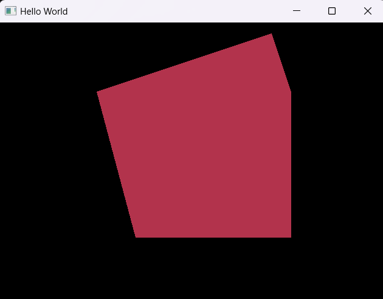
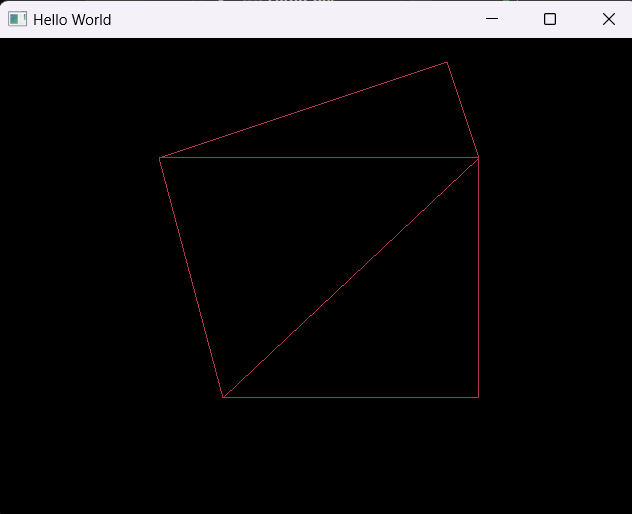
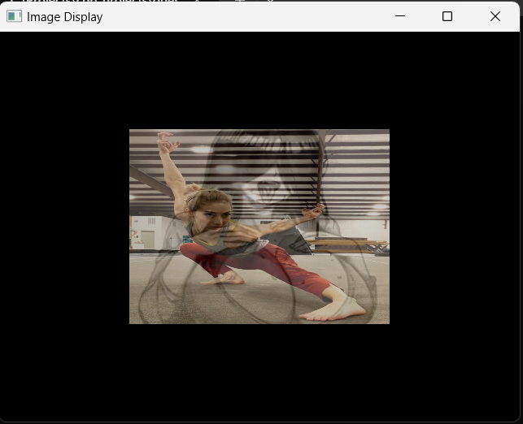
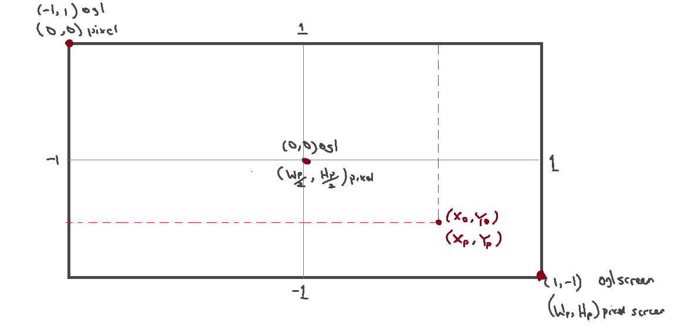
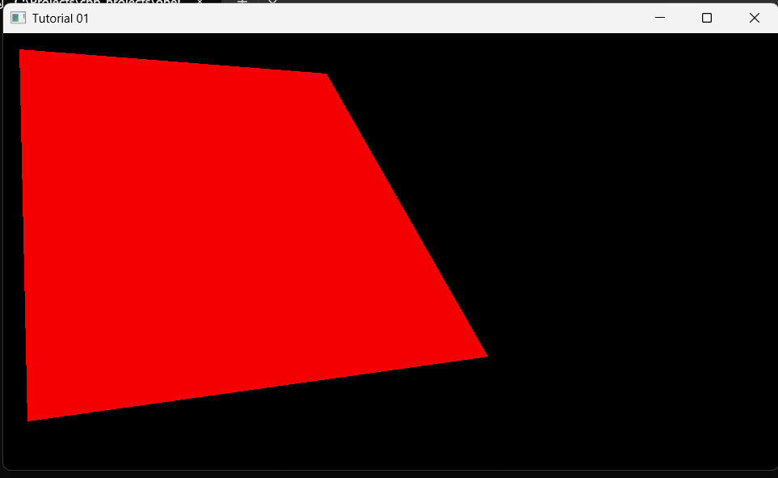

# How to draw Quad better option

<div class="grid" markdown>

<figure markdown="span">

<figcaption> using `GL_TRIANGLES`</figcaption>
</figure>

<figure markdown="span">
{width=96%}
<figcaption> using `GL_LINE_STRIP`</figcaption>
</figure>

</div>

## Basic Shader

```glsl title="basic.shader"
#shader vertex
#version 330 core
layout(location = 0) in vec4 pos;
void main(){
    gl_Position = pos;
}

#shader fragment
#version 330 core
layout(location=0) out vec4 color;
uniform vec4 new_color;

void main(){
    // color = vec4(1.0, 1.0, 0.5, 1.0);
    color = new_color;
}
```

### ShaderProgram Class 

```c++ title="ShaderProgram.h"
#pragma once
#include <iostream>
#include <sstream>
#include <fstream>

struct ShaderSource {
	std::string VertSource;
	std::string FragSource;
};

class ShaderProgram {
	unsigned int vbo{}, vao{};
	unsigned int sh_id{}, prog_id{}; // Shader and Program id

	ShaderSource ParseShader(const std::string& filePath)
	{
		enum class shType { NONE = -1, VERT = 0, FRAG = 1 };
		shType type = shType::NONE; // use to seperate lines of shaders

		std::stringstream ss[2]; // array to hold  the shaders
		std::ifstream stream(filePath); // load the file src in stream
		std::string line{}; // holder for each line

		while (getline(stream, line)) {

			if (line.find("#shader") != std::string::npos) {

				if (line.find("vertex") != std::string::npos)
					type = shType::VERT;

				else if (line.find("fragment") != std::string::npos)
					type = shType::FRAG;

			}
			else {
				ss[(int)type] << line << "\n";
			}
		}

		return { ss[0].str(), ss[1].str() };
	}// end ParseShader

	unsigned int CompileShader(unsigned int type, const std::string& source) {

		sh_id = glCreateShader(type);

		const char* shader_src = source.c_str();
		glShaderSource(sh_id, 1, &shader_src, nullptr);

		glCompileShader(sh_id);

		int success;
		glGetShaderiv(sh_id, GL_COMPILE_STATUS, &success);

		if (success == GL_FALSE) {
			int length;
			glGetShaderiv(sh_id, GL_INFO_LOG_LENGTH, &length);
			char* msg = (char*)alloca(length * sizeof(char));
			glGetShaderInfoLog(sh_id, length, &length, msg);

			/*char msg[1024];
			glGetShaderInfoLog(shader_id, 1024, NULL, msg);*/

			std::cout << (type == GL_VERTEX_SHADER ? "vertex" : "fragment") << " Shader Error:  \n" << msg << "\n";
			std::cout << msg << std::endl;
			glDeleteShader(sh_id);
			return 0;
		}
		return sh_id;
	}// end CompileShader

	unsigned int CreateShaderProgram(const std::string& vertShader, const std::string& fragShader) {

		prog_id = glCreateProgram();
		unsigned int vs = CompileShader(GL_VERTEX_SHADER, vertShader);
		unsigned int fs = CompileShader(GL_FRAGMENT_SHADER, fragShader);

		glAttachShader(prog_id, vs);
		glAttachShader(prog_id, fs);

		glLinkProgram(prog_id);
		glValidateProgram(prog_id);

		glDeleteShader(vs);
		glDeleteShader(fs);

		return prog_id;
	}// end CreateShaderProgram : vs, fs

	unsigned int CreateShaderProgram(const std::string& filePath) {
		ShaderSource shaderSource = ParseShader(filePath);
		return CreateShaderProgram(shaderSource.VertSource.c_str(), shaderSource.FragSource.c_str());
	} // end CreateShaderProgram : filepath


	void init() {};

public:
	ShaderProgram(const std::string& filePath) {
		CreateShaderProgram(filePath);
	};
	ShaderProgram(const std::string& vertShader, const std::string& fragShader) {
		CreateShaderProgram(vertShader, fragShader);
	}

	void useProgram() {
		glUseProgram(prog_id);
	}

	void Uniform4f(const char* uniform_string, float x, float y, float z, float w) {
		unsigned int u_id = glGetUniformLocation(prog_id, uniform_string);
		glUniform4f(u_id, x, y, z, w);
	}

	unsigned int getShaderID() const { return sh_id; }
	unsigned int getProgramID() const { return prog_id; }
};
```

### Main Class

```cpp title="main.cpp"
#include <GL/glew.h>
#include <GLFW/glfw3.h>
#include "ShaderProgram.h"


int main(void)
{
	GLFWwindow* window;

	/* Initialize the library */
	if (!glfwInit())
		return -1;


	/* Create a windowed mode window and its OpenGL context */
	window = glfwCreateWindow(640, 480, "Hello World", NULL, NULL);
	if (!window) {
		glfwTerminate();
		return -1;
	}

	glfwWindowHint(GLFW_CONTEXT_VERSION_MAJOR, 3);
	glfwWindowHint(GLFW_CONTEXT_VERSION_MINOR, 3);
	glfwWindowHint(GLFW_OPENGL_PROFILE, GLFW_OPENGL_CORE_PROFILE);


	glfwMakeContextCurrent(window);  /* Make window's context current */

	if (glewInit() != GLEW_OK)
		std::cout << "Error! at GLEW " << std::endl;

	// Get the OPENGL VERSION 
  /*  std::cout << glGetString(GL_VERSION) << std::endl;
*/


	float position[10] =
	{
		 -0.3f, -0.5f,   // point 0
		  0.5f, -0.5f,   // point 1
		  0.5f,  0.5f,   // point 2
		 -0.5f,  0.5f,   // point 3
		  0.4f, 0.9f     // point 4
	};

	unsigned int pos_index[9] =
	{
		0, 1, 2,
		2, 3, 0,
		2, 4, 3
	};

	unsigned int va_id, vb_id, ib_id;
	glGenVertexArrays(1, &va_id);
	glBindVertexArray(va_id);

	glGenBuffers(1, &vb_id);
	glBindBuffer(GL_ARRAY_BUFFER, vb_id);
	glBufferData(GL_ARRAY_BUFFER, 10 * sizeof(float), position, GL_STATIC_DRAW);

	glGenBuffers(1, &ib_id);
	glBindBuffer(GL_ELEMENT_ARRAY_BUFFER, ib_id);
	glBufferData(GL_ELEMENT_ARRAY_BUFFER, 9 * sizeof(unsigned int), pos_index, GL_STATIC_DRAW);


	glEnableVertexAttribArray(0);
	glVertexAttribPointer(0, 2, GL_FLOAT, GL_FALSE, sizeof(float) * 2, 0);


	ShaderProgram sProg("src/basic.shader");

	sProg.useProgram();

	sProg.Uniform4f("new_color", 0.7f, 0.2f, 0.3f, 1.0f);


	while (!glfwWindowShouldClose(window)) { /* Loop until the user closes win */

		/* Render here */

		glClear(GL_COLOR_BUFFER_BIT);


		glBindVertexArray(va_id);

		glDrawElements(GL_LINE_STRIP, 9, GL_UNSIGNED_INT, nullptr); // Draw strip
		//glDrawElements(GL_TRIANGLES, 9, GL_UNSIGNED_INT, nullptr);

		glfwSwapBuffers(window); /* Swap front and back buffers */

		glfwPollEvents(); /* Poll for and process events */
	}


	glfwTerminate();
	return 0;
}

```

## Texture drawing class

```cpp title="Texture.h"
#pragma once
#include <iostream>
#include <GL/glew.h>

class Texture
{
private:
	unsigned int texture_id; // Load and create image
	unsigned int m_glTexture_num{ GL_TEXTURE0 };
	
public:
	static int texture_count;
	Texture(std::string texturePath);

	void Bind() const;
};
```

```cpp title="Texture.cpp"
#include "Texture.h"

#define STB_IMAGE_IMPLEMENTATION
#include "stb_image.h"

int Texture::texture_count = 0;

Texture::Texture(std::string texturePath) {

	texture_count ++;

	// Switch the OpenGl texture, i.e. (GL_TEXTURE0 -> GLTEXTURE1 -> GL_TEXTURE2 ...)
	//  if more texture detected
	if (texture_count > 1 ) 
		m_glTexture_num = m_glTexture_num + texture_count - 1;

	// Load and create image
	texture_id;
	// texture 1
	// ---------
	glGenTextures(1, &texture_id);
	glBindTexture(GL_TEXTURE_2D, texture_id);
	// set the texture wrapping parameters
	glTexParameteri(GL_TEXTURE_2D, GL_TEXTURE_WRAP_S, GL_REPEAT);	// set texture wrapping to GL_REPEAT (default wrapping method)
	glTexParameteri(GL_TEXTURE_2D, GL_TEXTURE_WRAP_T, GL_REPEAT);
	// set texture filtering parameters
	glTexParameteri(GL_TEXTURE_2D, GL_TEXTURE_MIN_FILTER, GL_LINEAR);
	glTexParameteri(GL_TEXTURE_2D, GL_TEXTURE_MAG_FILTER, GL_LINEAR);
	// load image, create texture and generate mipmaps
	int width, height, nrChannels;
	stbi_set_flip_vertically_on_load(true); // tell stb_image.h to flip loaded texture's on the y-axis.

	unsigned char* data = stbi_load(texturePath.c_str(), &width, &height, &nrChannels, 0);
	if (data)
	{
		glTexImage2D(GL_TEXTURE_2D, 0, GL_RGB, width, height, 0, GL_RGB, GL_UNSIGNED_BYTE, data);
		glGenerateMipmap(GL_TEXTURE_2D);
	}
	else
	{
		std::cout << "Failed to load texture" << std::endl;
	}
	stbi_image_free(data);
}

void Texture::Bind() const
{
	// bind textures on corresponding texture units

	glActiveTexture(m_glTexture_num);
	glBindTexture(GL_TEXTURE_2D, texture_id);
}
```

### Modifying the Shader

```glsl title="basic.shader"
#shader vertex
#version 330 core

layout (location = 0) in vec3 aPos;
layout (location = 1) in vec2 aTexCoord;

out vec2 TexCoord;

void main()
{
	gl_Position = vec4(aPos, 1.0);
	TexCoord = vec2(aTexCoord.x, aTexCoord.y);
}

#shader fragment
#version 330 core

out vec4 FragColor;
in vec2 TexCoord;

uniform sampler2D texture1;
uniform sampler2D texture2;

void main()
{

	FragColor = mix(texture(texture1, TexCoord), texture(texture2, TexCoord), 0.5);
}
```

### Using the Texture Class

```cpp title="main.cpp"

... 

glVertexAttribPointer(1, 2, GL_FLOAT, GL_FALSE, 5 * sizeof(float), (void*)(3 * sizeof(float)));
glEnableVertexAttribArray(1);

Texture tex1("imgs/download.jpg");
Texture tex2("imgs/avatar200.jpg");

ShaderProgram sProg("src/basic.shader");

sProg.useProgram();
sProg.SetInt("texture1", 0);
sProg.SetInt("texture2", 1);

	while (!glfwWindowShouldClose(window)) { /* Loop until the user closes win */

		...
		tex1.Bind();
		tex2.Bind();
		...

```

<figure markdown='span'>
	
</figure>

Here is the full srcs:  
- [ `Texture.h`](code/src_v1_tex/Texture.h){target=blank}  
- [ `Texture.cpp`](code/src_v1_tex/Texture.cpp){target=blank}  
- [ `ShaderProgram.h`](code/src_v1_tex/ShaderProgram.h){target=blank}  
- [ `ShaderProgram.cpp`](code/src_v1_tex/ShaderProgram.cpp){target=blank}  
- [ `basic.shader`](code/src_v1_tex/basic.shader){target=blank}  
- `stb_image.h` github repo [here](https://raw.githubusercontent.com/nothings/stb/refs/heads/master/stb_image.h){target=blank}  

## Open GL Screen normalization, coordinate convertion 

The goal here is to convert the opengl coordinate to pixel based.



where, 

- $X_o$, $Y_o$ are current point openGl screen coordinate
- $X_p$, $Y_p$ are current point Pixel screen coordinate
- $W_p$, $H_p$ pixel screen width and height resolution


### Find the OpengGl X coord

Finding $X_o$,

$$\frac{X_o-(-1)}{X_p - 0} = \frac{1-(-1)}{W_p - 0}$$

$$\frac{X_o + 1}{X_p} = \frac{2}{W_p}$$

$$\boxed{X_o = \frac{2X_p}{W_p} - 1 --- (1)}$$

### Find the OpengGl Y coord

Finding $Y_o$,

$$\frac{Y_o-(1)}{Y_p - 0} = \frac{-1 - 1}{W_h - 0}$$

$$\frac{Y_o - 1}{Y_p} = \frac{-2}{W_h}$$

$$\boxed{ X_o = \frac{-2X_p}{W_p} + 1 --- (2)}$$

## Implementing it in OpenGL

This are the basic representation in cpp

```cpp

float coordConvert(int dim, DimType type) {
    if (type == X) return static_cast<float>(((2.0 * dim) / Width) - 1);
    else if (type == Y) return static_cast<float>(((-2.0 * dim) / Height) + 1);
}

Position Point(int Xdim, int Ydim) {
    return { coordConvert(Xdim, X), coordConvert(Ydim, Y) };
}
...
// we call it here like so
    std::vector<Position> vert_p;
    vert_p.push_back(Point(20, 20));
    vert_p.push_back(Point(400, 50));
    vert_p.push_back(Point(600, 400));
    vert_p.push_back(Point(30, 480));

```

This is the full implementation

```cpp
#include <iostream>
#include <GL/glew.h>
#include <GLFW/glfw3.h>
#include <fstream>
#include <sstream>
#include <vector>

int Width = 960;
int Height = 540;


enum DimType { X, Y };
struct Position {float x; float y;};

float coordConvert(int dim, DimType type) {
    if (type == X) return static_cast<float>(((2.0 * dim) / Width) - 1);
    else if (type == Y) return static_cast<float>(((-2.0 * dim) / Height) + 1);
}

Position Point(int Xdim, int Ydim) {
    return { coordConvert(Xdim, X), coordConvert(Ydim, Y) };
}

struct ShaderSource {std::string VertSource; std::string FragSource;};
static ShaderSource ParseShader(const std::string& filePath){. . . .}
static unsigned int CompileShader(unsigned int type, const std::string& source) { . . . . }// end CompileShader
static unsigned int CreateShaderProgram(const std::string& vertShader, const std::string& fragShader) { . . . . }

static unsigned int CreateShaderProgram(const std::string& filePath) {
    ShaderSource shaderSource = ParseShader(filePath);
    return CreateShaderProgram(shaderSource.VertSource.c_str(), shaderSource.FragSource.c_str());
}


int main(void)
{
    GLFWwindow* window;

    /* Initialize the library */
    if (!glfwInit()) return -1;

    /* Create a windowed mode window and its OpenGL context */
    window = glfwCreateWindow(Width, Height, "Tutorial 01", NULL, NULL);

    if (!window){
        glfwTerminate();return -1;
    }

    //glfwSwapInterval(1);

    /* Make the window's context current */
    glfwMakeContextCurrent(window);

    if (glewInit() != GLEW_OK) {
        std::cout << " Glew Error \n";
    }


    std::vector<Position> vert_p;
    vert_p.push_back(Point(20, 20));
    vert_p.push_back(Point(400, 50));
    vert_p.push_back(Point(600, 400));
    vert_p.push_back(Point(30, 480));


    int indices[6] = {
        0, 1, 3,
        1, 2, 3
    };

    unsigned int vao, vbo, ibo;

    glGenVertexArrays(1, &vao);
    glGenBuffers(1, &vbo);
    glGenBuffers(1, &ibo);

    glBindVertexArray(vao);

    glBindBuffer(GL_ARRAY_BUFFER, vbo);
    glBufferData(GL_ARRAY_BUFFER,vert_p.size() * sizeof(Position), vert_p.data(), GL_STATIC_DRAW);

    glBindBuffer(GL_ELEMENT_ARRAY_BUFFER, ibo);
    glBufferData(GL_ELEMENT_ARRAY_BUFFER, 6 * sizeof(int), indices, GL_STATIC_DRAW);

    glEnableVertexAttribArray(0);
    glVertexAttribPointer(0, 2, GL_FLOAT, GL_FALSE, 2 * sizeof(float), 0);

    glBindVertexArray(0);


    //Linking the program
    GLuint prog = CreateShaderProgram("res/shader/basic1.shader");

    glUseProgram(prog);

 /*   glUniform4f(glGetUniformLocation(prog, "u_color"),0.9f, 0.9f, 0.1f, 3.0f);*/
    glUniform2f(glGetUniformLocation(prog, "u_resolution"), Width, Height);

    /* Loop until the user closes the window */
    float time_step = 0.0001f;
    float current_time = 0.0f;
    while (!glfwWindowShouldClose(window))
    {
        /* Render here */
        glClear(GL_COLOR_BUFFER_BIT);

        glBindVertexArray(vao);

        glUniform1f(glGetUniformLocation(prog, "u_time"), current_time); 
        current_time += time_step;

        glDrawElements(GL_TRIANGLES, 6, GL_UNSIGNED_INT, 0);

        /* Swap front and back buffers */
        glfwSwapBuffers(window);

        /* Poll for and process events */
        glfwPollEvents();
    }

    glfwTerminate();
    return 0;
}
```
<figure markdown='span'>
	
</figure>