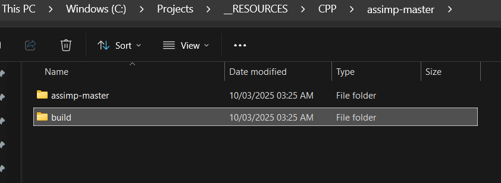
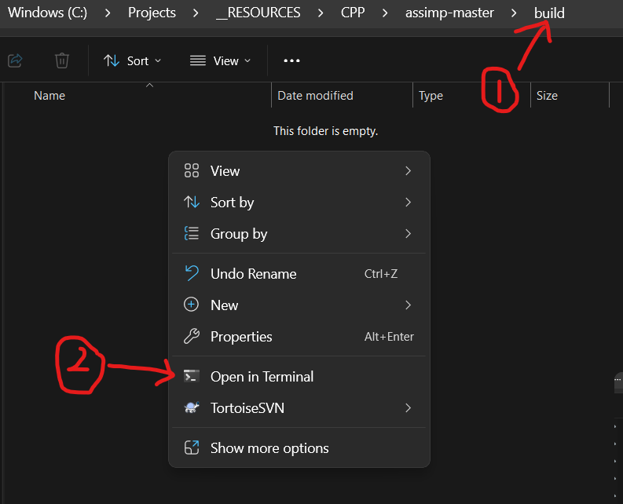
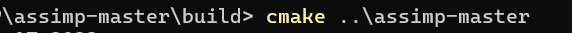
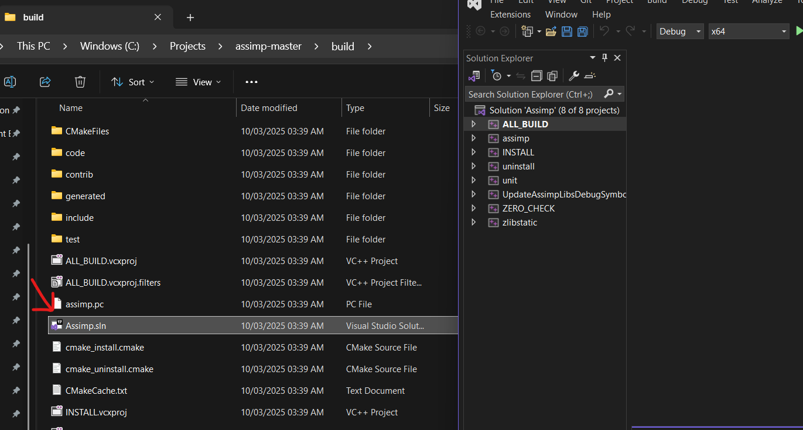

# ASSIMP (Open Asset Import Library) Setup

- Download and Install Cmake if not already available
- Download `Assimp` for its [github](https://github.com/assimp/assimp){target="blank"} repository 
- Extract your assimp into the "**assimp-master**" and create a "**build**" folder.
  Inside your "**build**" folder, open terminal
    <figure markdown='span'>
    {width="70%"}
    </figure>

    <figure markdown='span'>    
    {width="70%"}
    </figure>

- in your terminal type `cmake ..\assimp-master` and wait for the build to finish processing
  

- Once done building, in same build folder, you open ***Assimp.sln*** in the visual studio
- <figure markdown='span'>
   
</figure>

- Right click on the `ALL BUILD > Build`, wait a while for it to finish processing and you will be good.