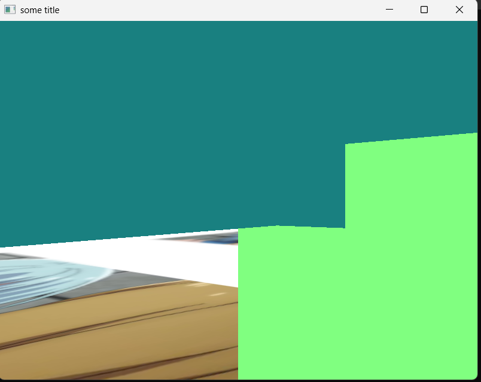
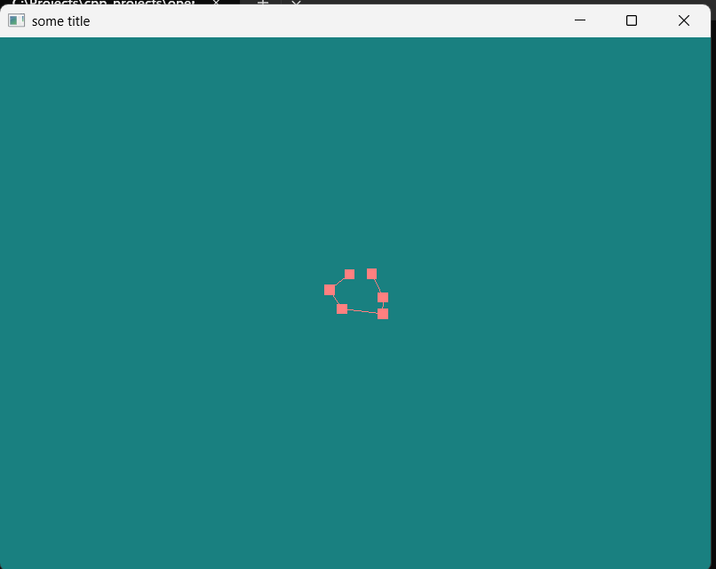
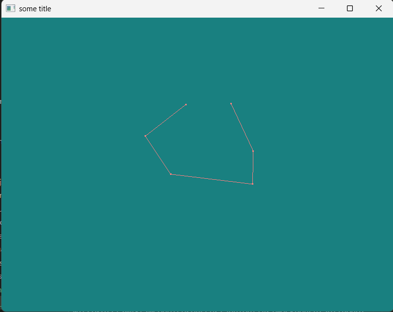

# Advance glsl

## Rendering part of base on `gl_FragCoord`

```c
void main(){
	if(gl_FragCoord.x < 400)
		FragColor = texture(texture1, uTexcoord);
	else 
		FragColor = vec4(0.5, 1.0, 0.5, 1.0);
}
```
<figure markdown='span'>
{width="50%"}
</figure>

## Zooming in and scaling vertex point using `gl_PointSize`

```cpp
...
// Key is call both draw GL_POINTS and GL_LINE_STRIP
glBufferSubData(GL_ARRAY_BUFFER, 0, vertices.size() * sizeof(Position), vertices.data());
glDrawArrays(GL_POINTS, 0, vertices.size());
glDrawArrays(GL_LINE_STRIP, 0, vertices.size());
glBindVertexArray(0);
```
Vertex Shader
```c
	gl_Position = u_projection * u_view * u_model * vec4(aPos, 1.0);
	gl_PointSize = gl_Position.z;
```
<div class='grid' markdown>

<figure markdown='span'>

<figcaption>When zoomed out</figcaption>
</figure>

<figure markdown='span'>
    
    <figcaption>When zoomed in </figcaption>
</figure>

</div>
