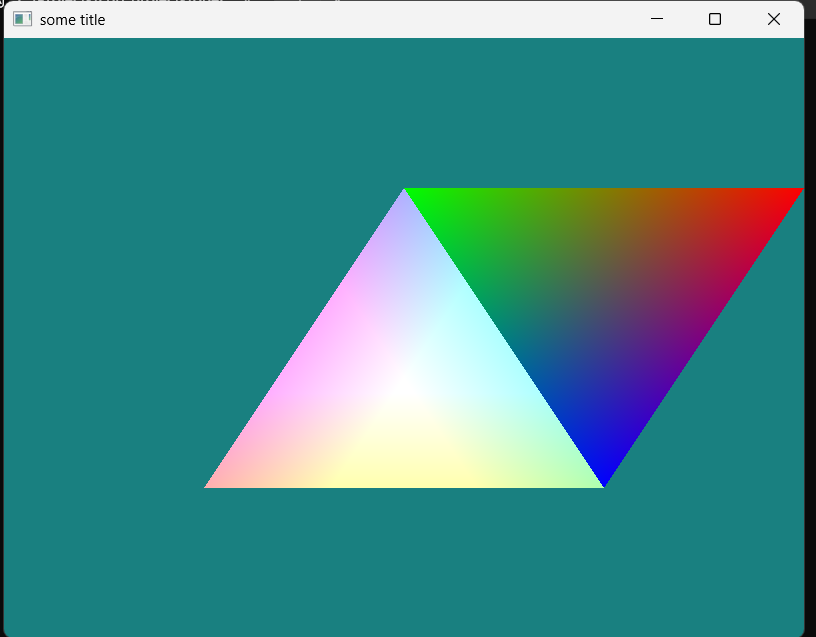

# Quick Documentation for the level of Abstraction

## VertexInfo 

What I initial had was a `Vertex` struct which holds all the layout attribute like so:

```c++
struct Vertex{
    glm::vec3 position;
    glm::vec2 texcoord;
    glm::vec3 normal;
    glm::vec3 tangent;
    ...
}
```

but after some trials and looking on how I can best represent I arrived at this (which might definitely change later)

This is located in the `GraphicsObject` class
```c++ 
struct LayoutInfo {
    unsigned int count;
    unsigned int offset;
};

struct VertexInfo {

    // store the actual vertex data
    vector<float> vertex{};


    // attribute index of layout 
    // NOTE : This can actual be removed, but I kept it for easy readability
    //e.g index:		0		    1		    2
    //                position  texcoord      normal
    static inline unsigned int index{}; 

    // attribute count as in the coordinate x, y, z
    // e.g count       3            2           3
    //             0.5, 0.2, 0.4,  1.0, 1.0,  0.5, 0.5, 0.0
    vector<unsigned int> count;

    // layoutInfo stores:
    //  the `vertex attribute component count` as in 3 for (x, y, z), 2 for (x, y) etc.
    // and `attribute offset` from another attribute
    static inline vector<LayoutInfo> layoutInfo;

    // total attribute byte count of layout
    static inline unsigned int stride{};

    VertexInfo() {};

    // With this we can initialize each vertex like so
    // Vertex v1 = {0.5f, 0.0f, 0.3f} 
    // Vertex v1 = {-0.1f, 0.2f, 1.0f, 1.0f, 0.0f} etc
    VertexInfo(std::initializer_list<float> v) : vertex(v){

        // position 2D ===============================
        if (vertex.size() == 2) {
            stride = vertex.size() * sizeof(float);
            index = 0;
            // count and offset
            layoutInfo.push_back({2, 0}); // layout position 2d
        }
        else if (vertex.size() == 4) {
            stride = vertex.size() * sizeof(float);
            index = 1;
            // count and offset
            layoutInfo.push_back({2, 0}); // layout position 2d
            layoutInfo.push_back({2, 2}); // layout texcoord
        }

        // position 3D ================================
        else if (vertex.size() == 3) {
            stride = vertex.size() * sizeof(float);
            index = 0;
            // count and offset
            layoutInfo.push_back({3,0}); // layout position 3d
        }

        // position , texcoord
        else if (vertex.size() == 5) {
            stride = vertex.size() * sizeof(float);
            index = 1;
            // count and offset
            layoutInfo.push_back({3, 0}); // layout position 3d
            layoutInfo.push_back({2, 3}); // layout texcoord
        }

        // position , color or normal
        else if (vertex.size() == 6) {
            stride = vertex.size() * sizeof(float);
            index = 1;
            // count and offset
            layoutInfo.push_back({ 3, 0 }); // layout position 3d
            layoutInfo.push_back({ 3, 3 }); // layout texcoord
        }

        // position , texcoord, normal
        else if (vertex.size() == 8) {
            stride = vertex.size() * sizeof(float);
            index = 2;
            // count and offset
            layoutInfo.push_back({3, 0}); // layout position 3d
            layoutInfo.push_back({2, 3}); // layout texcoord
            layoutInfo.push_back({3, 5}); // normal
        };
    }
    };

```

## GraphicObject Class

This is going to handle the individual object render.

here is the definitions:

```cpp
class GraphicObject
private:
    vector<VertexInfo> verticesInfo;
    vector<float>vertices;
    vector<unsigned int>indices;
    unsigned int VBO{}, IBO{};
    bool hasIBO{}; // in case of Index Buffer specified

    glm::mat4 projection, view, model;
    void setupVBO()
    void setupIBO()
    void setupObject()

public:
    unsigned int VAO;
    Shader* objShader;
    std::unique_ptr <Texture> tex1, tex2;

    GraphicObject(vector<VertexInfo> verticesInfos) 
    GraphicObject(vector<VertexInfo>verticesInfos, vector<unsigned int>indices) {
    void initShader(const char* shaderPath)

    GraphicObject& setProjection(glm::mat4 projection = glm::mat4(1.0f)) 
    GraphicObject& setView(glm::mat4 view = glm::mat4(1.0f)) 
    GraphicObject& setModel(glm::mat4 model = glm::mat4(1.0f))

    void translate(glm::vec3 position = glm::vec3(0.0f, 0.0f, 0.0f)) 
    void rotate(const float angle = 0.0f, glm::vec3 rotateAround = glm::vec3(0.0f, 0.0f, 1.0f))

    void bindVertex() const 
    void unbindVertex()const
    void draw()

```

```cpp title="GraphicObject.h"

class GraphicObject{
    vector<VertexInfo> verticesInfo;
    vector<float>vertices{};
    vector<unsigned int>indices{};

    unsigned int VBO{}, IBO{};

    bool hasIBO{};

    glm::mat4 projection{};
    glm::mat4 view{};
    glm::mat4 model{};

    void setupVBO() {

        glGenBuffers(1, &VBO);
        glBindBuffer(GL_ARRAY_BUFFER, VBO);
        glBufferData(GL_ARRAY_BUFFER, vertices.size() * VertexInfo::stride, vertices.data(), GL_STATIC_DRAW);


    }

    void setupIBO() {

        glGenBuffers(1, &IBO);
        glBindBuffer(GL_ELEMENT_ARRAY_BUFFER, IBO);
        glBufferData(GL_ELEMENT_ARRAY_BUFFER, indices.size() * VertexInfo::stride, indices.data(), GL_STATIC_DRAW);

    }

    void setupObject() {

        glGenVertexArrays(1, &VAO);
        glBindVertexArray(VAO);

        setupVBO();
        if(hasIBO) setupIBO();

        // for all layout
        for (int i = 0; i <= VertexInfo::index; i++){
            glVertexAttribPointer(
                i,									// index
                VertexInfo::layoutInfo[i].count,	// component count
                GL_FLOAT,							// component type
                GL_FALSE,							// Normalize?
                VertexInfo::stride,					// vertex attributes stride
                (void*)(VertexInfo::layoutInfo[i].offset * sizeof(float))); // vertex attribute offset

            glEnableVertexAttribArray(i);
        }

        glBindVertexArray(0);
    }


    public:
    unsigned int VAO;
    Shader* objShader;
    std::unique_ptr <Texture> tex1, tex2;

    GraphicObject(vector<VertexInfo> verticesInfos) {
        this->verticesInfo = verticesInfos;

        //append the vertices
        for (size_t i = 0; i < verticesInfos.size(); i++)
            vertices.insert(vertices.end(), verticesInfos[i].vertex.begin(), verticesInfos[i].vertex.end());

        this->vertices = vertices;
        hasIBO = false;

        setupObject();
    };


    GraphicObject(vector<VertexInfo>verticesInfos, vector<unsigned int>indices) {
        this->verticesInfo = verticesInfos;

        //append the vertices
        for (size_t i = 0; i < verticesInfos.size(); i++)
            vertices.insert(vertices.end(), verticesInfos[i].vertex.begin(), verticesInfos[i].vertex.end());

        this->vertices = vertices;
        this->indices = indices;
        hasIBO = true;

        setupObject();
    }

    void initShader(const char* shaderPath){

    objShader = new Shader(shaderPath);

    objShader->useProgram();

    //tex1 = std::make_unique <Texture>("imgs/picture1.png");
    //tex1->bindTexture(0);

    //tex2 = std::make_unique <Texture>("imgs/picture2.png");
    //tex2->bindTexture(1);

    // objShader->setInt("texture1", 0);
    // objShader->setInt("texture2", 1);

        this->model = glm::mat4(1.0f);
        this->view = glm::mat4(1.0f);
        this->projection = glm::perspective(glm::radians(45.0f), (float)800 / (float)600, 0.1f, 100.0f);
        this->setProjection(projection);

    }

    GraphicObject& setProjection(glm::mat4 projection = glm::mat4(1.0f))  {

        this->projection = projection;
        objShader->useProgram();
        objShader->setMat4("projection", this->projection);
        return *this;
    }

    GraphicObject& setView(glm::mat4 view = glm::mat4(1.0f)) {

        this->view = view;
        objShader->useProgram();
        objShader->setMat4("view", this->view);

        return *this;
    }

    GraphicObject& setModel(glm::mat4 model = glm::mat4(1.0f)) {

        objShader->useProgram();
        objShader->setMat4("model", this->model);

        return *this;
    }

    void translate(glm::vec3 position = glm::vec3(0.0f, 0.0f, 0.0f)) {
        // calc. the model matrix for each object and pass it to shader before drawing
        this->model = glm::translate(this->model, position);
        this->setModel();
    }

    void rotate(const float angle = 0.0f, glm::vec3 rotateAround = glm::vec3(0.0f, 0.0f, 1.0f)) {
        this->model = glm::rotate(this->model, glm::radians(angle), rotateAround);
        this->setModel();
    }

    void bindVertex() const {
        glBindVertexArray(VAO);
    }

    void unbindVertex()const {
        glBindVertexArray(0);
    }

    void draw(){

        // render boxes
        this->bindVertex();
        if (!hasIBO) glDrawArrays(GL_TRIANGLES, 0, verticesInfo.size());
        else		 glDrawElements(GL_TRIANGLES, (int)indices.size(), GL_UNSIGNED_INT, 0);

    }


    ~GraphicObject() {
        delete objShader;
    }

};

```

## Shader Class update

Tried going through the shader class presented by [learnOpenGl](https://learnopengl.com/){target="blank"} and the one I preferred from [the Cherno yt channel](https://www.youtube.com/@TheCherno){target="blank"}, I get to modify the `Shader` class combining this knowledge.

```cpp


struct ShaderSources {string vertexSource; string fragmentSource;};
enum shaderType { VERT, FRAG };

class Shader
{

public:
    unsigned int programID;
    /
    Shader()
    Shader(const char* ShaderPath, const char* geometryPath = nullptr)

    Shader& operator () (const char* ShaderPath)

    void useProgram()

    void setBool(const std::string& name, bool value) const
    void setInt(const std::string& name, int value) const 
    void setFloat(const std::string& name, float value) const
    // ------------------------------------------------------------------------
    void setVec2(const std::string& name, const glm::vec2& value) const
    void setVec2(const std::string& name, float x, float y) const
    // ------------------------------------------------------------------------
    void setVec3(const std::string& name, const glm::vec3& value) const
    void setVec3(const std::string& name, float x, float y, float z) const
    // ------------------------------------------------------------------------
    void setVec4(const std::string& name, const glm::vec4& value) const
    void setVec4(const std::string& name, float x, float y, float z, float w)
    // ------------------------------------------------------------------------
    void setMat2(const std::string& name, const glm::mat2& mat) const
    // ------------------------------------------------------------------------
    void setMat3(const std::string& name, const glm::mat3& mat) const
    // ------------------------------------------------------------------------
    void setMat4(const std::string& name, const glm::mat4& mat) const

private:
    // utility function for checking shader compilation/linking errors.
    // ------------------------------------------------------------------------
    void checkCompileErrors(GLuint shader, std::string type)
    ShaderSources ParseShaderCode(const string& path) 
    unsigned int CompileShader(unsigned int type, string& shaderSrc) 
    
```

```cpp
#ifndef SHADER_H
#define SHADER_H

#include <glad/glad.h>
#include <glm/glm.hpp>

#include <string>
#include <fstream>
#include <sstream>
#include <iostream>

using std::string;

struct ShaderSources {
    string vertexSource;
    string fragmentSource;
};

enum shaderType { VERT, FRAG };

class Shader
{
    ShaderSources ParseShaderCode(const string& path) {
        std::ifstream shaderCode(path);
        std::stringstream ss[2];
        int type = -1;
        string line{};

        while (std::getline(shaderCode, line)) {
            if (line.find("#vertex") != std::string::npos) type = VERT;
            else if (line.find("#fragment") != std::string::npos) type = FRAG;
            else ss[(int)type] << line << "\n";
        }


        return { ss[0].str(), ss[1].str() };

    } // End ParseShaderCode

    unsigned int CompileShader(unsigned int type, string& shaderSrc) {

        unsigned int shaderID = glCreateShader(type);

        const char* shaderCode = shaderSrc.c_str();
        glShaderSource(shaderID, 1, &shaderCode, NULL);

        glCompileShader(shaderID);

        int success;
        glGetShaderiv(shaderID, GL_COMPILE_STATUS, &success);

        if (!success) {
            int length;
            glGetShaderiv(shaderID, GL_INFO_LOG_LENGTH, &length);
            char* msg = (char*)alloca(length * sizeof(char));
            glGetShaderInfoLog(shaderID, length, &length, msg);

            std::cout << ((type == GL_VERTEX_SHADER) ? "vertex " : "fragment ") << "shader error :\n" << msg << std::endl;
            glDeleteShader(shaderID);
            return -1;
        }

        return shaderID;
    }


public:
    unsigned int programID;
    // constructor generates the shader on the fly
    // ------------------------------------------------------------------------
    Shader() {}

    Shader(const char* ShaderPath, const char* geometryPath = nullptr)
    {

        ShaderSources shaderSources = ParseShaderCode(ShaderPath);
        // 1. retrieve the vertex/fragment source code from filePath
        std::string geometryCode;
        std::ifstream gShaderFile;

        // convert stream into string
        string vertexCode = shaderSources.vertexSource;
        string fragmentCode = shaderSources.fragmentSource;


        // if geometry shader path is present, also load a geometry shader
        if (geometryPath != nullptr)
        {
            gShaderFile.open(geometryPath);
            std::stringstream gShaderStream;
            gShaderStream << gShaderFile.rdbuf();
            gShaderFile.close();
            geometryCode = gShaderStream.str();
        }

        // 2. compile shaders
        unsigned int vertex, fragment;
        vertex = CompileShader(GL_VERTEX_SHADER, vertexCode);
        fragment = CompileShader(GL_FRAGMENT_SHADER, fragmentCode);

        // if geometry shader is given, compile geometry shader
        unsigned int geometry;
        if (geometryPath != nullptr)
        {
            const char* gShaderCode = geometryCode.c_str();
            geometry = glCreateShader(GL_GEOMETRY_SHADER);
            glShaderSource(geometry, 1, &gShaderCode, NULL);
            glCompileShader(geometry);
            checkCompileErrors(geometry, "GEOMETRY");
        }
        // shader Program
        programID = glCreateProgram();
        glAttachShader(programID, vertex);
        glAttachShader(programID, fragment);
        if (geometryPath != nullptr) glAttachShader(programID, geometry);

        glLinkProgram(programID);
        glValidateProgram(programID);

        checkCompileErrors(programID, "PROGRAM");
        // delete the shaders as they're linked into our program now and no longer necessary
        glDeleteShader(vertex);
        glDeleteShader(fragment);
        if (geometryPath != nullptr) glDeleteShader(geometry);

    }
    // activate the shader
    // ------------------------------------------------------------------------

    Shader& operator () (const char* ShaderPath) {
        return *this;
    }

    // activate the shader
    // ------------------------------------------------------------------------
    void useProgram()
    {
        glUseProgram(programID);
    }
    // utility uniform functions
    // ------------------------------------------------------------------------
    void setBool(const std::string& name, bool value) const{
        glUniform1i(glGetUniformLocation(programID, name.c_str()), (int)value);
    }
    // ------------------------------------------------------------------------
    void setInt(const std::string& name, int value) const{
        glUniform1i(glGetUniformLocation(programID, name.c_str()), value);
    }
    // ------------------------------------------------------------------------
    void setFloat(const std::string& name, float value) const{
        glUniform1f(glGetUniformLocation(programID, name.c_str()), value);
    }
    // ------------------------------------------------------------------------
    void setVec2(const std::string& name, const glm::vec2& value) const{
        glUniform2fv(glGetUniformLocation(programID, name.c_str()), 1, &value[0]);
    }
    void setVec2(const std::string& name, float x, float y) const{
        glUniform2f(glGetUniformLocation(programID, name.c_str()), x, y);
    }
    // ------------------------------------------------------------------------
    void setVec3(const std::string& name, const glm::vec3& value) const{
        glUniform3fv(glGetUniformLocation(programID, name.c_str()), 1, &value[0]);
    }
    void setVec3(const std::string& name, float x, float y, float z) const{
        glUniform3f(glGetUniformLocation(programID, name.c_str()), x, y, z);
    }
    // ------------------------------------------------------------------------
    void setVec4(const std::string& name, const glm::vec4& value) const{
        glUniform4fv(glGetUniformLocation(programID, name.c_str()), 1, &value[0]);
    }
    void setVec4(const std::string& name, float x, float y, float z, float w){
        glUniform4f(glGetUniformLocation(programID, name.c_str()), x, y, z, w);
    }
    // ------------------------------------------------------------------------
    void setMat2(const std::string& name, const glm::mat2& mat) const{
        glUniformMatrix2fv(glGetUniformLocation(programID, name.c_str()), 1, GL_FALSE, &mat[0][0]);
    }
    // ------------------------------------------------------------------------
    void setMat3(const std::string& name, const glm::mat3& mat) const{
        glUniformMatrix3fv(glGetUniformLocation(programID, name.c_str()), 1, GL_FALSE, &mat[0][0]);
    }
    // ------------------------------------------------------------------------
    void setMat4(const std::string& name, const glm::mat4& mat) const{
        glUniformMatrix4fv(glGetUniformLocation(programID, name.c_str()), 1, GL_FALSE, &mat[0][0]);
    }

private:
    // utility function for checking shader compilation/linking errors.
    // ------------------------------------------------------------------------
    void checkCompileErrors(GLuint shader, std::string type)
    {
        GLint success;
        GLchar infoLog[1024];
        if (type != "PROGRAM")
        {
            glGetShaderiv(shader, GL_COMPILE_STATUS, &success);
            if (!success)
            {
                glGetShaderInfoLog(shader, 1024, NULL, infoLog);
                std::cout << "ERROR::SHADER_COMPILATION_ERROR of type: " << type << "\n" << infoLog << "\n -- --------------------------------------------------- -- " << std::endl;
            }
        }
        else
        {
            glGetProgramiv(shader, GL_LINK_STATUS, &success);
            if (!success)
            {
                glGetProgramInfoLog(shader, 1024, NULL, infoLog);
                std::cout << "ERROR::PROGRAM_LINKING_ERROR of type: " << type << "\n" << infoLog << "\n -- --------------------------------------------------- -- " << std::endl;
            }
        }
    }
};
#endif

```
## Texture Implementation

```cpp
#ifndef  TEXTURE
#define TEXTURE

#include <glad/glad.h>

#include <string>
#include <iostream>

#define STB_IMAGE_IMPLEMENTATION
#include "stb_image.h"

using std::string, std::cout, std::endl;

class Texture {
    unsigned int textureID;
    public:
    Texture(){}
    Texture(const string& path) {

        glGenTextures(1, &textureID);
        
        int w, h, ncomp;
        unsigned char* data = stbi_load(path.c_str(), &w, &h, &ncomp, 0);
        if (data) {
            
            glBindTexture(GL_TEXTURE_2D, textureID);

            GLenum format{};
            if (ncomp == 1) format = GL_RED;
            else if (ncomp == 3) format = GL_RGB;
            else if (ncomp == 4) format = GL_RGBA;
            
            glTexImage2D(GL_TEXTURE_2D, 0, format, w, h, 0, format, GL_UNSIGNED_BYTE, data);
            glGenerateMipmap(GL_TEXTURE_2D);

            glTexParameteri(GL_TEXTURE_2D, GL_TEXTURE_WRAP_S, GL_REPEAT);
            glTexParameteri(GL_TEXTURE_2D, GL_TEXTURE_WRAP_T, GL_REPEAT);

            glTexParameteri(GL_TEXTURE_2D, GL_TEXTURE_MIN_FILTER, GL_LINEAR);
            glTexParameteri(GL_TEXTURE_2D, GL_TEXTURE_MAG_FILTER, GL_LINEAR);

            stbi_image_free(data);
        }
        else {
            cout << " Texture Failed to load at path: " << path << endl;

        }

    }

    Texture* operator() (const string& path) {
        return this;
    }

    unsigned int getTextureID() const {
        return textureID;
    }

    void bindTexture(const unsigned int texSlot = 0) const {
        glActiveTexture(GL_TEXTURE0 + texSlot);
        glBindTexture(GL_TEXTURE_2D, textureID);
    }


};


#endif // ! TEXTURE


```

## Renderer Structure

This is a basic class for all different stuff to render

```cpp
#ifndef RENDERER_H
#define RENDERER_H

#include <glad/glad.h>
#include <GLFW/glfw3.h>
#include <glm/glm.hpp>
#include <glm/gtc/matrix_transform.hpp>
#include <glm/gtc/type_ptr.hpp>

#include "Shader.h"
#include "Texture.h"

#include "GraphicObject.h"

class Renderer {

public:
    GLFWwindow* win{};
    Renderer() {}
    void init(int scr_W, int scr_H, const char* title) {
        glfwInit();
        glfwWindowHint(GLFW_CONTEXT_VERSION_MINOR, 3);
        glfwWindowHint(GLFW_CONTEXT_VERSION_MAJOR, 3);
        glfwWindowHint(GLFW_OPENGL_PROFILE, GLFW_OPENGL_CORE_PROFILE);

        win = glfwCreateWindow(scr_W, scr_H, title, NULL, NULL);
        if (!win) {
            std::cout << "GLFW failed to load" << std::endl;
            glfwTerminate();

        }

        glfwMakeContextCurrent(win);

        if (!gladLoadGLLoader((GLADloadproc)glfwGetProcAddress)) {
            std::cout << "GLAD failed to load" << std::endl;

        }
    }

    GLFWwindow* getWindow() {
        return win;
    }
    virtual void setupDraw() {};

    virtual void draw() {}

    virtual ~Renderer() {
        glfwTerminate();
    }


};


#endif // RENDERER_H
```

## Main Structure

```cpp
#include <iostream>

#include <sstream>
#include <fstream>
#include <string>

#include "Renderer.h"


class RenderTriangle : public Renderer {

public:
    unique_ptr<GraphicObject> graphicObject;
    unique_ptr<GraphicObject> graphicObject1;
    
    Renderer::Renderer;

    void setupDraw() override{
        Renderer::setupDraw();

        // Vertices
        vector<VertexInfo> triangleVertices;
                                        // Position      // color
        triangleVertices.push_back({ -0.5f, -0.5f, 0.0f, 1.0f , 0.0f, 0.0f});
        triangleVertices.push_back({ 0.5f, -0.5f, 0.0f, 0.0f, 1.0f, 0.0f });
        triangleVertices.push_back({ 0.0f, 0.5f, 0.0f, 0.0f, 0.0f, 1.0f});


        graphicObject = make_unique<GraphicObject>(triangleVertices);
        graphicObject->initShader("src/basic01.shader");


        graphicObject1 = make_unique<GraphicObject>(triangleVertices);
        graphicObject1->initShader("src/basic02.shader");

        graphicObject->translate(glm::vec3(0.5f, 0.0f, 0.0f));
        graphicObject->rotate(180.0f, glm::vec3(0.0f, 0.0f, 1.0f));
        

    }

    void draw() override {
        Renderer::draw();

        glClearColor(0.1f, 0.5f, 0.5f, 1.0f);
        glClear(GL_COLOR_BUFFER_BIT | GL_DEPTH_BUFFER_BIT);

        // Upside down triangle

        graphicObject->setModel();
        graphicObject->draw();
        graphicObject->unbindVertex();
        
        double time = glfwGetTime();
        float color_offset = static_cast<float>(cos(time)/2.0 + 0.5);
        graphicObject1->setModel();
        graphicObject1->objShader->setFloat("c_offset", color_offset);
        graphicObject1->draw();

        glfwSwapBuffers(win);
        glfwPollEvents();

    }

    virtual ~RenderTriangle(){
        
    }
};


int main()
{
    RenderTriangle triangle;
    triangle.init(800, 600, "some title");
    triangle.setupDraw();
    while (!glfwWindowShouldClose(triangle.getWindow()) ) {
        triangle.draw();
    }

}
```

## Full Code list

The full codes can be found here:       
 [GraphicObject.h](099_abstraction01_src/GraphicObject.h){target="blank"}       
 [Shader.h](099_abstraction01_src/Shader.h){target="blank"}         
 [Texture.h](099_abstraction01_src/Texture.h){target="blank"}         
 [Renderer.h](099_abstraction01_src/Renderer.h){target="blank"}         
 [Main.cpp](099_abstraction01_src/Main.cpp){target="blank"}         
 [basic01.shader](099_abstraction01_src/[basic01.shader){target="blank"}         
 [basic02.shader](099_abstraction01_src/[basic02.shader){target="blank"}         

