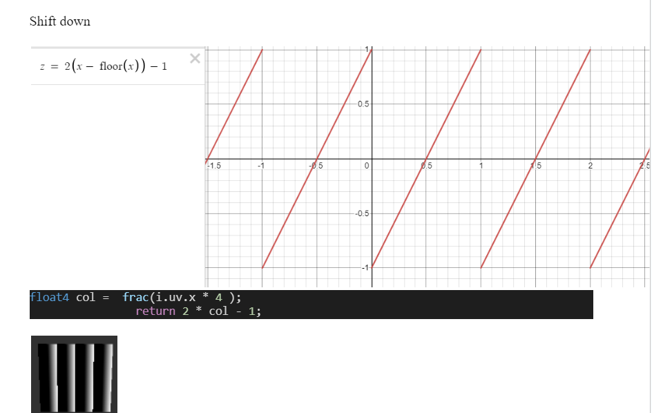
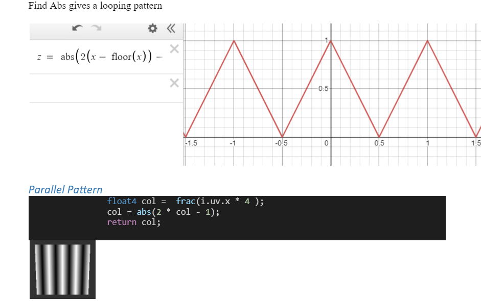
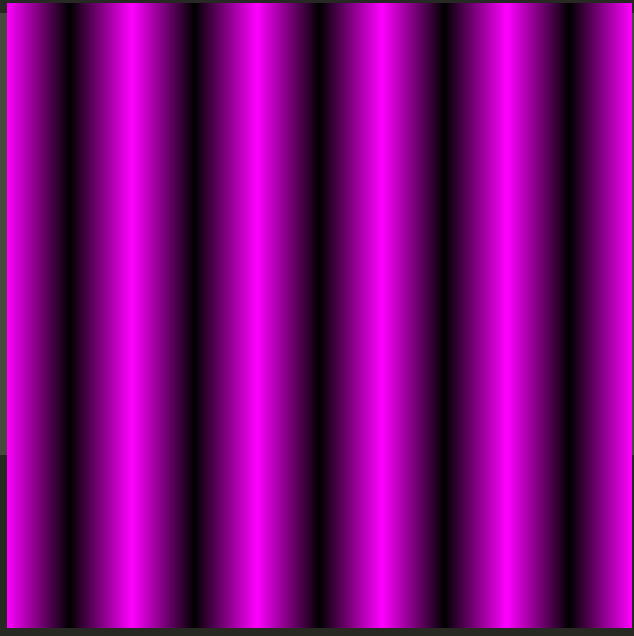
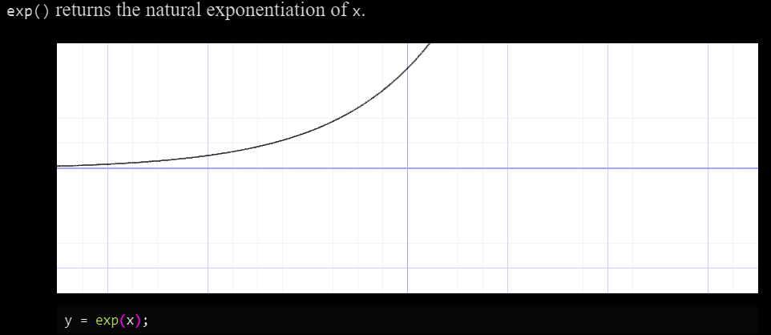

# Shader Learning Process

## Introductions to Shaders

```glsl
#ifdef GL_ES
precision mediump float;
#endif 

uniform vec2 u_resolution;
uniform vec2 u_mouse;
uniform float u_time;

void main() {   
    
    vec2 st = gl_FragCoord.xy / u_resolution.xy;
    st.x *= u_resolution.x/u_resolution.y;
    
    // Base color of some sort
    vec3 color = vec3(st.x,st.y,abs(sin(u_time)));;
    
    // some kind of  value:
    //      (1) Linear: st.x
    //      (2) Linear: st.y - st.x
    //      (3) curve: st.y * st.x
  
    float x_val =   abs(smoothstep(0.2, 0.5, st.y * st.x)) ; 
    
    color = color + (sin(u_time +  (x_val)) ) ;
    
    gl_FragColor = vec4(color, 1.0);
}
```

Result: Is some kind of animation


### Basic Shader Drawing

```glsl
/**

 */
void main() {
    
    vec2 st = gl_FragCoord.xy / u_resolution.xy;
 
    vec3 color = vec3(0.0);
    
    color = vec3(st.xx, 0.0); // using swizzle
    gl_FragColor = vec4(color, 1.0);
}
```

```glsl
void main() {
    
    vec2 st = gl_FragCoord.xy / u_resolution.xy;
    
    vec3 color = vec3(st.xy, 0.0);
    gl_FragColor = vec4(color, 1.0);
}
```
Result: 


### Draw some graph of sort

```glsl

void main() {
    
    vec2 st = gl_FragCoord.xy / u_resolution.xy;
 
    vec3 color = vec3(0.0);
    
    //when value is < 0.5 = 0, value > 0.5 = 1
    //The boundary is 0.5(a constant) along x axis
    float x = step(0.5, st.x);
    
    //when you do it like this plot an equation in boundary,
    
    //: Graph of x against y - diagonal
    float x1 = step(st.x, st.y);
    
    // Graph of x*x against y - a curve
    float x2 = step(st.x * st.x , st.y);
    
    color = vec3(x2);
    
    gl_FragColor = vec4(color, 1.0);
}
```

### Explaining Fract






More code to support:

```glsl

#ifdef GL_ES
precision mediump float;
#endif

uniform vec2 u_resolution;

void main() {
    
    vec2 st = gl_FragCoord.xy / u_resolution.xy;
 
    vec3 color = vec3(0.0);
    
    color.rb = abs( 2.0 * fract(vec2(st.x) * 5.0) - 1.0);
    
    gl_FragColor = vec4(color, 1.0);
}

```

Result:


## Mixing shaders

### Example 1 : Mixing with sin waves

```glsl
#ifdef GL_ES
precision mediump float;
#endif

uniform vec2 u_resolution;
uniform float u_time;

vec3 colorA = vec3(1.000,0.511,0.000);
vec3 colorB = vec3(0.348,0.282,0.680);

void main() {
    
    vec2 st = gl_FragCoord.xy / u_resolution.xy;
 
    vec3 color = vec3(0.0);
    
    // use mix_val values between 0 and 1.0 to mix
    float mix_val = abs(sin(u_time)); 
    color = mix(colorA, colorB, mix_val);
    
    gl_FragColor = vec4(color, 1.0);
}
```

The Result is a continuous mixture between the two colors

### Example 2 : mixing with step function

```glsl
vec3 colorA = vec3(1.000,0.511,0.000);
vec3 colorB = vec3(0.348,0.282,0.680);

void main() {
    
    vec2 st = gl_FragCoord.xy / u_resolution.xy;
 
    vec3 color = vec3(0.0);
    
    color = mix(colorA, colorB, step(0.5, st.x));
    
    gl_FragColor = vec4(color, 1.0);
}
```


### Example 3: mixing with smoothstep

```glsl
vec3 colorA = vec3(1.000,0.511,0.000);
vec3 colorB = vec3(0.348,0.282,0.680);

void main() {
    
    vec2 st = gl_FragCoord.xy / u_resolution.xy;
 
    vec3 color = vec3(0.0);
    
    color = mix(colorA, colorB, smoothstep(0.25, 0.75, st.x));
    
    gl_FragColor = vec4(color, 1.0);
}
```


### Example 4: A little more complex mix

```glsl
define PI 3.14159265359

uniform vec2 u_resolution;
uniform vec2 u_mouse;
uniform float u_time;

vec3 colorA = vec3(0.149,0.141,0.912);
vec3 colorB = vec3(1.000,0.833,0.224);

void main() {
    vec2 st = gl_FragCoord.xy/u_resolution.xy;
    vec3 color = vec3(0.0);

    vec3 pct = vec3(st.x);
    float exp_val = abs(exp((st.x * st.y ) - 0.5));
    
    // Use different value to change the value of rb
    pct.r = abs(sin(u_time));
    pct.b = abs(fract(exp_val * 5.0) - 1.0);

    color = mix(colorA, colorB, pct);

    gl_FragColor = vec4(color,1.0);
}

```


## SHADER VOCAB

This section is dedicated to this like spontaneous discovery or some form of beautiful mistake of some sort.



