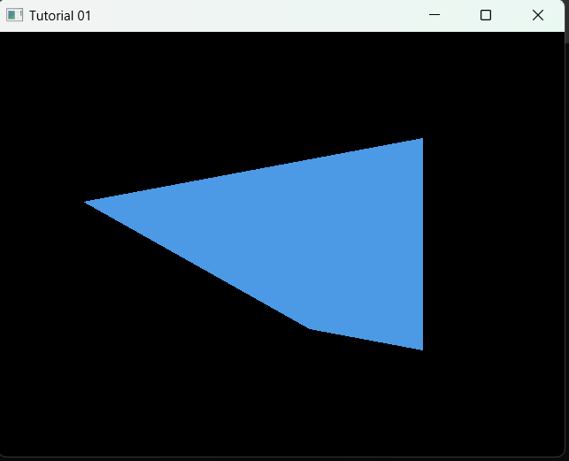

# Drawing OpenGL Quad

So here is the quad that will be rendered

<figure markdown=span>
{width="400"}
 <figcaption>Drawn Quad</figcaption>
</figure>


## Parse Fragment and Vertex Shader

There are various approach to parse your shaders and you can start by creating things like `basic.shader` located in `$(ProjectDir)res/shader/` to serve as your default shader.

``` glsl title="basic.shader"
#shader vertex
#version 330 core
layout(location = 0) in vec4 pos;
void main(){
    gl_Position = pos;
}

#shader fragment
#version 330 core
layout(location=0) out vec4 color;
void main(){
    color = vec4(0.3, 0.6, 0.9, 0.5);
}
```

* We start by creating a struct to hold the vertex and Fragment shader
  
```c++ linenums='8'
struct ShaderSource {
    std::string VertSource;
    std::string FragSource;
};


static ShaderSource ParseShader(const std::string& filePath)
{
    enum class shType{ NONE = -1, VERT = 0, FRAG = 1};
    shType type = shType::NONE; // use to seperate lines of shaders

    std::stringstream ss[2]; // array to hold  the shaders
    std::ifstream stream(filePath); // load the file src in stream
    std::string line{}; // holder for each line

    while (getline(stream, line)) {

        if (line.find("#shader") != std::string::npos){

            if (line.find("vertex") != std::string::npos)
                type = shType::VERT;

            else if (line.find("fragment") != std::string::npos)
                type = shType::FRAG;

        }
        else {
            ss[(int)type] << line << "\n";
        }
    }

    return { ss[0].str(), ss[1].str() };
} // end ParseShader
```

This is the function we use to read our shaders from the `basic.shader` file.

## The Shader Compiler function

Up next is the code for compiling  the shader

```c++ linenums='41' hl_lines="51 52 53"
tatic unsigned int CompileShader(unsigned int type, const std::string& source) {
    GLuint shader_id = glCreateShader(type);

    const char* shader_src = source.c_str();
    glShaderSource(shader_id, 1, &shader_src, nullptr);

    glCompileShader(shader_id);

    int success;
    glGetShaderiv(shader_id, GL_COMPILE_STATUS, &success);
    /* int length;
     glGetShaderiv(shader_id, GL_INFO_LOG_LENGTH, &length);
     char* msg = (char*)alloca(length * sizeof(char));
     glGetShaderInfoLog(shader_id, length, &length, msg);*/
    if (success == GL_FALSE) {
        char msg[1024];
        glGetShaderInfoLog(shader_id, 1024, NULL, msg);

        std::cout << " VERTEX:  \n" << msg << "\n";
    }
    return shader_id;
}// end CompileShader
```

## The Create shader function

This will be responsible for creating the shaders bring all the above functions together and to use

```c++ linenums="64"
static unsigned int CreateShaderProgram(const std::string& filePath) {
    ShaderSource shaderSource = ParseShader(filePath);

    // shaders compilation
    GLuint vid = CompileShader(GL_VERTEX_SHADER, shaderSource.VertSource.c_str());
    GLuint fid = CompileShader(GL_FRAGMENT_SHADER, shaderSource.FragSource.c_str());

    //Linking the program
    GLuint prog = glCreateProgram();

    glAttachShader(prog, vid);
    glAttachShader(prog, fid);

    glLinkProgram(prog);
    glValidateProgram(prog);

    glDeleteShader(vid);
    glDeleteShader(fid);

    return prog;
}

```

## Bring All together in Main Function

Finally we bring them all together in the main function

```c++ linenums="86"
int main(void)
{
    GLFWwindow* window;

    /* Initialize the library */
    if (!glfwInit())
        return -1;

    /* Create a windowed mode window and its OpenGL context */
    window = glfwCreateWindow(640, 480, "Tutorial 01", NULL, NULL);
    if (!window)
    {
        glfwTerminate();
        return -1;
    }

    /* Make the window's context current */
    glfwMakeContextCurrent(window);

    if (glewInit() != GLEW_OK) {
        std::cout << " Glew Error \n";
    }

    float vert_pos[8] = {
        0.1f, -0.4f,
        -0.7f, 0.2f,
        0.5f, 0.5f,
        0.5f, -0.5f
    };

    int indices[6] = {
        0, 1, 3,
        1, 2, 3
    };

    unsigned int vao, vbo, ibo;

    glGenVertexArrays(1, &vao);
    glGenBuffers(1, &vbo);
    glGenBuffers(1, &ibo);

    glBindVertexArray(vao);

    glBindBuffer(GL_ARRAY_BUFFER, vbo);
    glBufferData(GL_ARRAY_BUFFER, 8 * sizeof(float), vert_pos, GL_STATIC_DRAW);

    glBindBuffer(GL_ELEMENT_ARRAY_BUFFER, ibo);
    glBufferData(GL_ELEMENT_ARRAY_BUFFER, 6 * sizeof(int), indices, GL_STATIC_DRAW);

    glEnableVertexAttribArray(0);
    glVertexAttribPointer(0, 2, GL_FLOAT, GL_FALSE, 2 * sizeof(float), 0);

    glBindVertexArray(0);


    //Linking the program
    GLuint prog = CreateShaderProgram("res/shader/basic.shader");

    /* Loop until the user closes the window */
    while (!glfwWindowShouldClose(window))
    {
        /* Render here */
        glClear(GL_COLOR_BUFFER_BIT);


        glUseProgram(prog);

        glBindVertexArray(vao);

        glDrawElements(GL_TRIANGLES, 6, GL_UNSIGNED_INT, 0);

        /* Swap front and back buffers */
        glfwSwapBuffers(window);

        /* Poll for and process events */
        glfwPollEvents();
    }

    glfwTerminate();
    return 0;
}

```
