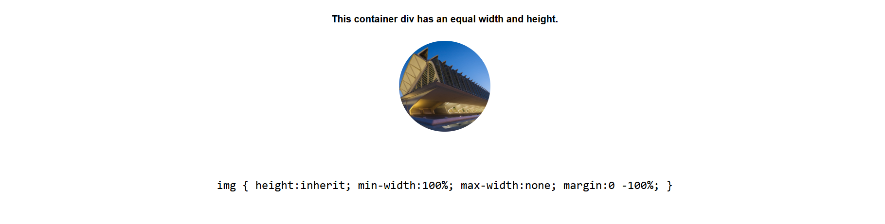

# Css Documentation

## Centralizing an image

<figure markdown='span'>
{width=70%}
</figure>

```html
<h1>Centre an Image in a div with overflow</h1>

<div class="pod">
<h5>This container div has an equal width and height.</h5>
<div class="container">
	
</div>
	
</div>
<code>
    img {
    height:inherit;
    min-width:100%;
    max-width:none;
    margin:0 -100%;
    }
</code>
```

```scss

body {
    margin:4% auto;
    font-size:1.2em;
    text-align: center;
}

.pod {
    width:100%;
    text-align: center;
    margin-top:4em;
    margin-bottom:4em;
}

$size: 150px;

.container {
border-radius: $size / 2;
height:$size;
width:$size;
overflow:hidden;
text-align: center;
margin:0 auto;

    img {
        height:$size;
        min-width:100%;
        max-width:none;
        margin:0 -100%;
    }
}

```


## Grid layout V1

```html
<div class='grid'>

... 
<article class="card product-item">
    <header class="card__header">
        <h1 class="product__title">Yet Another book for you</h1>
    </header>
    <div class="card__image">
        
    </div>
    <div class="card__content">
        <h2 class="product__price">$343.99</h2>
        <h2 class="product__grade">Fairly Used</h2>
        <p class="product__description">Tempora esse...</p>
    </div>
    
    <div class="card__actions">
        <button class="btn">Add to Cart</button>
    </div>
</article>
...

</div>  <!-- End div -->
```

### Css Styling - Basic 001

```css
/* ======== Grid - Card Styling ========= */

/* Display Grid */
.grid{
    display: flex;
    flex-wrap: wrap;
    justify-content: center;
    align-items: center;
    }
.grid article{
    margin-left: 10px;
}


/* Display Card */
.card h1.product__title{
    font-size: 20px;
    color: #dedede;
}

.card .card__image{
    width: 250px;
    height: 200px;
    overflow-y: hidden;
}
.card .card__image img{
    width: 100%;
    
}
```