# Flexbox Doc

Flex is a better way of setting up your webpage layout display or a more comtemporary way of setting it up for responsiveness.

### Setting display `flex` and gap

<div class="grid" markdown>

```css
.container {
    display: flex;
    gap: 5px;
}

.section{
    background-color: #eee;
    padding: 5px;
}
```

```html
<div class="container">
<section class="section">
Lorem ipsum dolor sit amet, ... 
</section>

<section class="section">
Aliquam erat volutpat. Nullam ...
</section>

<section class="section">
Curabitur varius sagittis quam, ...
</section>
</div>
```

Before `flex`


After `flex`

</div>

- By default, `flex` container displays its element in a **column format**.
- Flex will try to display all of your content no matter the content ('div', 'span', 'images') in one line while putting into consideration the content of the html elements.
  
<figure markdown>

</figure>

### Setting up  display `inline-flex`

Just like when you have display block, and inline-block, by default flex container is a kind of block form. so you can so set it to `inline-flex`

```css
.container {
    display: inline-flex;
    gap: 5px;
    border: 2px dashed green;
}

```

before


after


#### Example - Work with flex and Justify

What we know so far
```css
nav > ul{
background-color: orange;
display: flex; gap:5px; 
height: 40px;
}
```


With `justify-content` you can have more flexiblity in the content

```css
nav > ul{
background-color: orange;
display: flex; gap:5px; 
height: 40px;
justify-content: center; /* center ther content of container */
}
```


## Setting the Flex direction

This is basically the **direction** along which flex is stacking up the html elements. By default `flex-direction` is set to `row` this is the  **Main axis,** which is along **X-axis**. Here the **Cross axis** is along the **Y-axis** 

```css
/* This is the default behaviour */
 section.color{
display:flex; 
background-color: aquamarine;   
margin-top: 20px;        
}

section.color > div{
border: 1px solid #eee;
width: 100%; height: 50px;
}
```


The second and obvious alternative is setting the `flex-direction` to `column` which is now makes the the **Main-axis** in Y-direction, column direction and the **Cross-axis** along the X-direction basically flipping it.

```css
 section.color{
display:flex; 
flex-direction: column;  /* This is what changed */
background-color: aquamarine;   
margin-top: 20px;        
}
```
<figure markdown style="width: 400px">

</figure>

<figure markdown style="max-width: 300px">
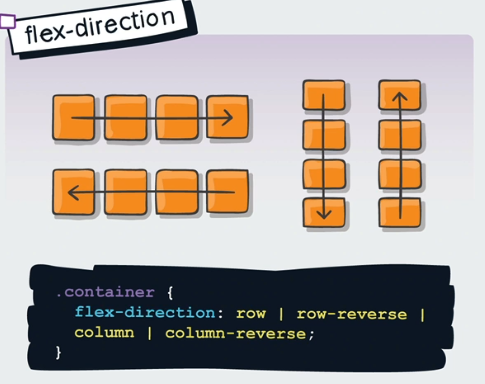
</figure>

### Flex Basis

So if we set thing like the `flex-basic` it is basically setting the width (or height) of each flexbox container item and it does so along the `Main-axis` so depending on weather the `flex-direction` is `row or column`, it will expand them in their respective direction. In other word, **we are flexing along the Main Axis**

```css
 section.color{
display:flex; 
/* flex-direction: column; */
background-color: aquamarine;          
}
section.color > div{
    flex-basis: 100px;
}
```


```css
 section.color{
display:flex; 
flex-direction: column;
background-color: aquamarine;          
}
section.color > div{
    flex-basis: 100px;
}
```
<figure markdown style="width: 400px">

</figure>

### Flex order

Flex order basically re-order the item in your flexbox, by stacking the highest
order item at the far end of the items. All items has a defaults 
`order: 0` if you  set an item order higher than 0, it stacks it to the far left.

!!! Note
    - This is an **ITEM property**
    - It operates along the **MAIN-AXIS direction**

Example:

<div class="grid" markdown>

```css
.box .green{
background-color: #00ff7b;
/* order:1; */
}
```

<figure markdown>

</figure>


```css
.box .green{
background-color: #00ff7b;
order:1;
}
```

<figure markdown>

</figure>

</div>

Just as the order can be set to positive values, It can also be set to negative values.


<div class="grid" markdown>

```css
.box .img{width: 100%;
max-width: 200px;
order: -1;
 }

```


</div>

The higher the order number, the higher the stacking

```css
.box .img{width: 100%;
max-width: 200px;
order: -2;
}
.box .green{
background-color: #00ff7b;
order:1;
}
.box .orange{
background-color: orange;
order:3;
}
```


<figure markdown="span" style="max-width:300px">

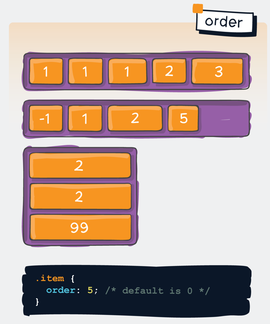

</figure>

## Flex Wrap

This is useful when the container items exceed what the window can container. E.g. In case
of say mobile devices with low screen dimension.

By default, the `flex-wrap` property is set to `nowrap`. 

!!! Note
    - This is a **COINTAINER/PARENT property**
    - It works along the **MAIN-AXIS**

```css
.box{
display: flex;

flex-direction: row;
flex-wrap: wrap;

/* Short-hand form */
flex-flow: row wrap;

}
```

On a wide screen


On a low dimension screen
<figure markdown="span" style="width: 500px">

</figure>

there is also a property called `wrap-reverse` which layout the items from the bottom up.

<figure markdown style="width:500px">

</figure>

### important Note
Depending on how the content is written flex wrap may work differently.

Look at this Example

This is the default  `nowrap` for this flex box:

<figure markdown style="width:400px">

</figure>

The moment it changes to `wrap` it behaves differently:
The expectation might be that I will still layout in a column along the row.

<figure markdown style="width:400px">

</figure>

The problem stems from the fact that the content is written in **one line**.
To make this behave in a more desirable way, one will need to break the text content in a more
manageable lines using the `br` tag. Rather than it being one line. 

<figure markdown style="width:400px">

</figure>

However, breaking using `br` tag diffinitely work, but the best solution method will be
to use the `@media` query to change the flex from `nowrap` to `wrap` after a certain width condition.

```css
 .container {
display: flex;
flex-wrap: nowrap;
}


@media screen and (max-width: 800px) {
.container{
    flex-wrap: wrap;
}
}
```
<div class="grid" markdown>

<figure markdown>
width `> 800px`

</figure>

<figure markdown style="width:250px">
width `< 800px`

</figure>
</div>

### flex-flow

This is a shorthand for the `flex-direction` and `flex-wrap` properties, which together define the flex container’s main and cross axes. The default value is `row nowrap`.

```css
.container {
  flex-flow: column wrap;
}
```


## Justify content

This help arrange the html items along the  main-axis in the contain.

!!! Note
    - this is property on the **COINTAINER**
    - It applied along the **MAIN-AXIS** weather `row` or `column`


<figure markdown="span" style="width:300px">

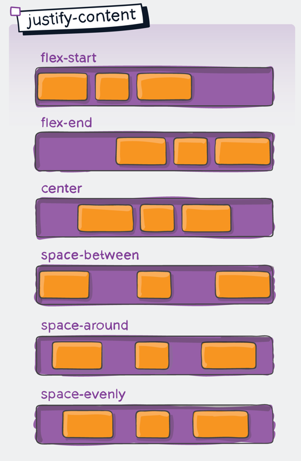

</figure>

## Align items

This help arrange/align items along the **cross-axis** when the `flex-wrap` is set to `nowrap`

!!! Note
    - this is property on the **COINTAINER**
    - It applied along the **CROSS-AXIS** 

!!! Warning 
    it only work when the **`flex-wrap: nowrap`** and when the container `height` is set say `px, vh, rem, %` etc.

<figure markdown="span" style="width:300px">
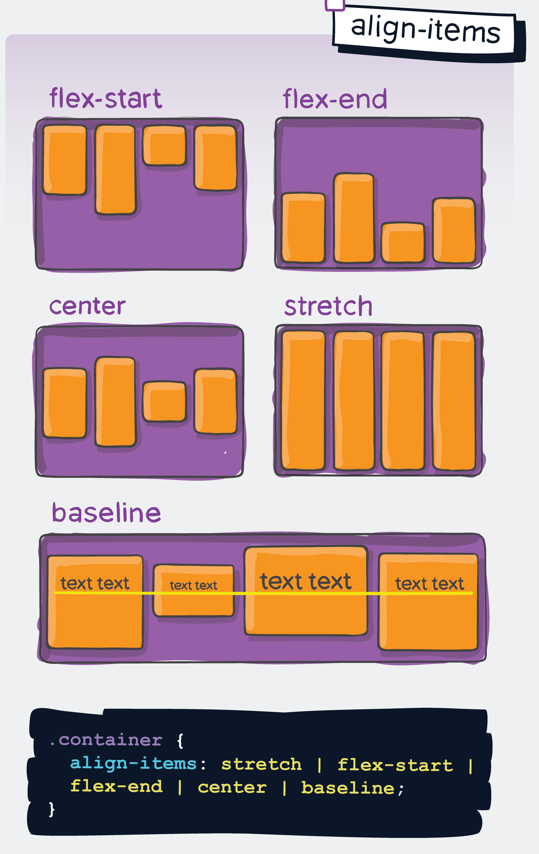
</figure>

### Align self

This is if you want to change the postioning of the **child item** from the other elements

```css

section.color{
    display:flex; 
    flex-flow: row nowrap;
    justify-content: center;
    align-items:center;
}

section.color > div:nth-child(even){
    ...
    align-self: flex-end
;}
```

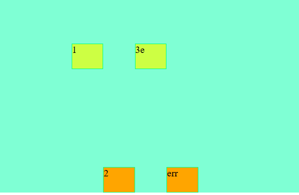

### Align content

This is similar to `align-items` item help arrange/align items along the **cross-axis** when the `flex-wrap` is set to `wrap`

!!! Note
    - this is property on the **COINTAINER**
    - It applied along the **CROSS-AXIS** 

!!! Warning
    it only work when the **`flex-wrap: wrap`** and when the container `height` is set say `px, vh, rem, %` etc.

<figure markdown="span" style="max-width:400px">

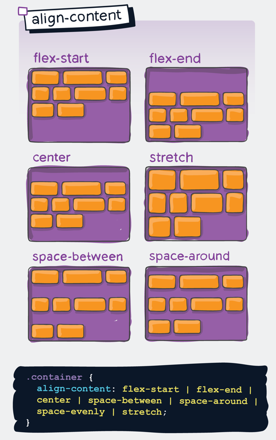

</figure>


### Flex-shrink, flex-grow & flex-basis

This is applied across the individual element along the main-Axis

!!! Note
    - this is property on the **ITEM** elements
    - It applied along the **MAIN-AXIS** 


<figure markdown="span" style="max-width:400px">
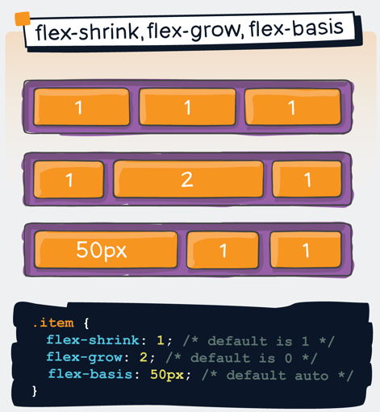
</figure>

#### flex-grow 

It tries to redistribute the remaining space in the container base on the  grow size set

<div class="grid" markdown>


```css
section.color > div:nth-child(2){
    /* flex-grow: 1; */
}
```

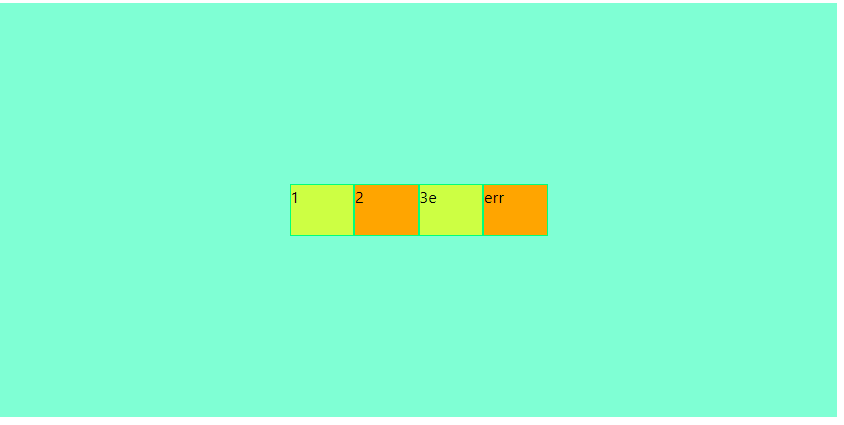

```css
section.color > div:nth-child(2){
    flex-grow: 1;
}
```

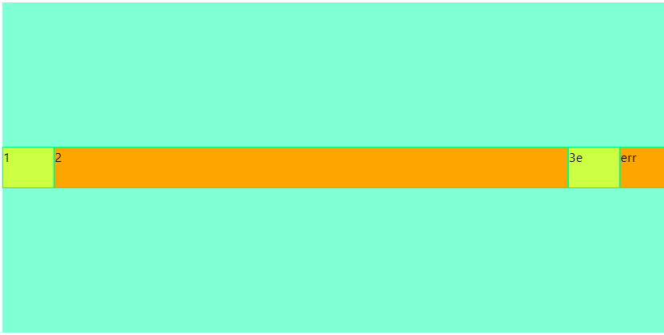


```css
 section.color > div:nth-child(2){
    flex-grow: 0.5; /* now have the yellow*/
}

section.color > div:nth-child(3){
    flex-grow: 1;
}
```

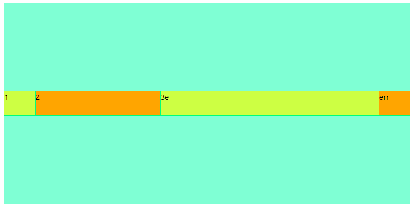

</div>

### flex

This is the shorthand for `flex-grow`, `flex-shrink` and `flex-basis` combined. The second and third parameters (`flex-shrink` and `flex-basis`) are optional. The default is 0 1 auto, but if you set it with a single number value, like `flex: 5;`, that changes the `flex-basis` to 0%, so it’s like setting `flex-grow: 5; flex-shrink: 1; flex-basis: 0%`;.

```css
.item {
  flex: none | [ <'flex-grow'> <'flex-shrink'>? || <'flex-basis'> ]
}

.box .item{
    flex: 1 1 0; /* Very common */
    flex : 1 /* Same as flex : 1 1 0 */
}
```

## flex sizing

the order by which the flexbox algorithm determine the size is this:

<figure markdown="span">

</figure>

It first check for the `min-width/max-width`, if not available then goes on to check if there is `flex-basis` set if not available It check if `width` is set  else is check for the `content-width`

<figure markdown="span" style="max-width: 500px">


<figcaption> How `min-width/max-width` where determined </figcaption>
</figure>

Note that when you have a `flex-basis` set, It is going to ignore the `width` property on the item

<figure markdown="span" style="max-width: 300px">
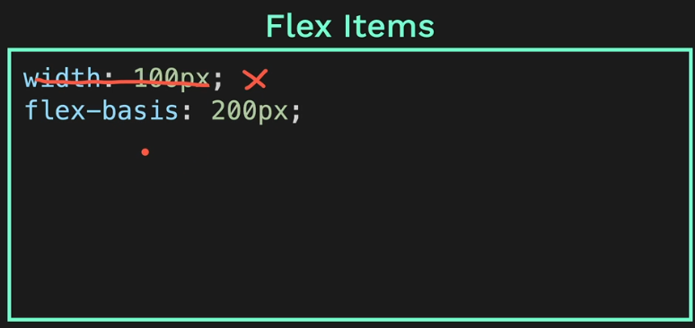
</figure>

Consequent if the `max-width` is set to say `100px` and `flex-basis` is `200px`, the algo. picks the `max-width` dimension over `flex-basis`. Unless the `flex-basis` is set to say `50px` that it will read it over `max-width`.

Sametime happens when the `min-width` is set. It takes preference for that over `flex-basis` and `width`
