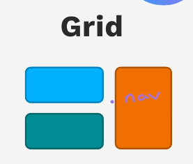
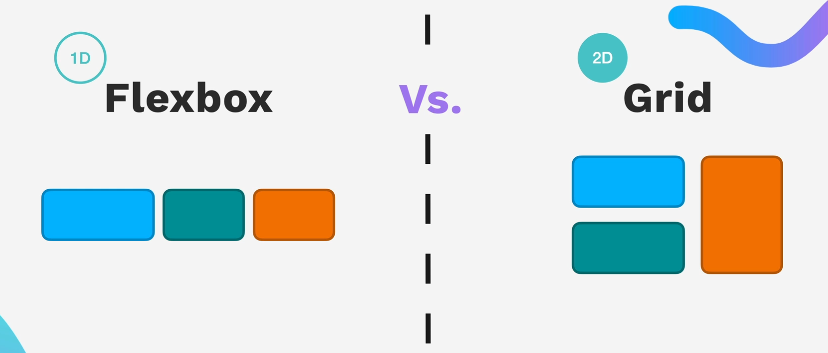
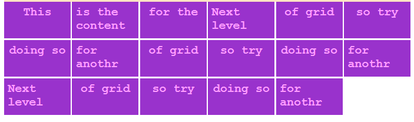
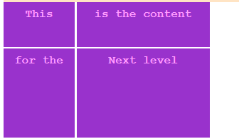
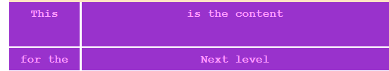
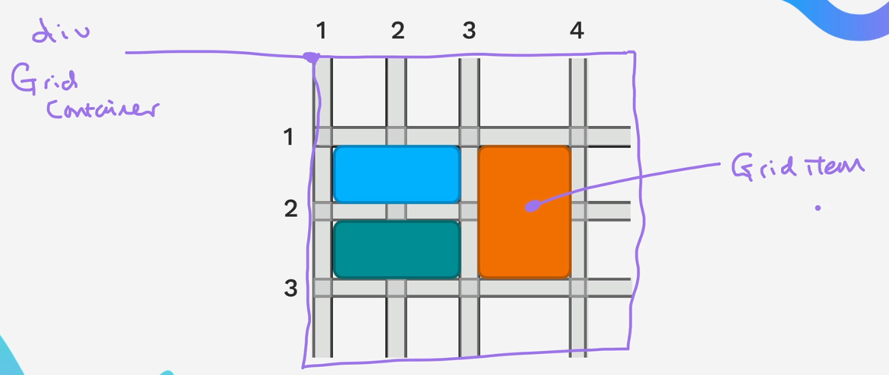
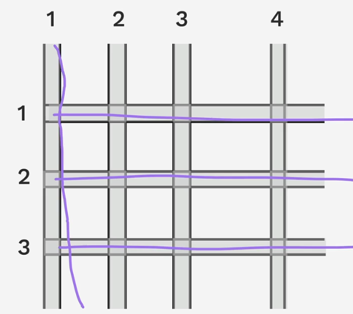
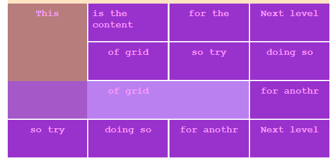

# Grid Box

## Introduction

Grid is another useful Html layout with css. Just like flexbox, it makes arrangement of html much easier to use.

It gives use capacity to layout out html elements in "2D" i.e along the `row` and `column` of the grid

<figure markdown="span">

</figure>

In general flexbox is good for 1D and grid in 2D



### Do I have to Choose?

The truth is you will mostly use a combination of the while working on a project.

<figure markdown="span">

</figure>

## Flexbox Example 


```css
  .grid-box{
display: grid;

/* repeat(number_of_repeats, value_to_repeat) - Repeat value a number of times*/
/* minmax(min_value, max_value) - Value ranging between min and max*/
grid-template-columns: repeat(auto-fill, minmax(80px,1fr));
grid-auto-rows: 50px;
gap: 2px;
        }
```

```html
 <section class="grid-box">
            <div>This</div>
            <div>is the content</div>
            <div>for the </div>
            <div>Next level</div>
            <div>of grid </div>
            ...
            ...
</section>
```


## Grid Sizing

### Fixed Sized Grid

This involves setting a fixed size on grid. It is not responsive.
<div class="grid" markdown>

```css
.grid-box{
  display: grid;
  grid-template-rows: 50px 100px;
  grid-template-columns: 80px 150px;
  gap: 2px;
}
```



</div>

!!! Note
    You can write a short-hand form of the `grid-template-row` and `grid-template-column` like this

    ```css
    .grid-box{
      grid-template: 50px 100px / 80px 150px;
    }
    ```

### Auto for Sizing

It gives your element room to fill up the width.

<div class="grid" markdown>

```css
.grid-box{
  display: grid;
  grid-template-rows: 50px auto;
  grid-template-columns: 80px auto;
  gap: 2px;
}
```



</div>

!!! Note
    When you do `auto` for `grid-template-columns` it tries to fill the width of parent.  
    However, for `grid-template-rows` it tries to fit to content

### Ratio for Sizing

This is done by using `fr` to qualify the ratio you want

```css
  .grid-box{
  display: grid;
  grid-template-rows: 2fr 1fr;
  grid-template-columns: 1fr 2fr;
  gap: 2px;
}
```
<figure markdown="span">

</figure>

Most of the time, this is what you will probably want to use.

### using minmax()

This you basically create a minium and maximum stop dimension especially in the column when shrinking or expanding.

```css
  .grid-box{
  display: grid;
  grid-template-rows: 2fr 1fr;
  grid-template-columns: 1fr minmax(50px, 300px);
  gap: 2px;
}
```

### using repeat()
Instead of writing all the row or column individual dimension, repeat helps **repeat** the value

```css
  .grid-box{
  display: grid;
  grid-template-rows: 2fr 1fr;
  grid-template-columns: repeat(7, 100px);
  gap: 2px;
}
```

### Grid Auto rows and columns
If you create an html group that does not later fit into your dimension set by  
`grid-template` you can add `grid-auto-rows` or `grid-auto-columns` to give them  
a default value


## Grid Placement

The containing html element is the **grid container** and the children html elements are the **grid items**



<div class="grid" markdown>

Grid rows and columms


Grid lines

</div>


### Grid overlapping 

Here is the grid container css for the overlapping grids

```css
.grid-box{
  display: grid;
  grid-template-columns:  repeat(4, 1fr);
  grid-auto-rows: 50px;
  gap: 2px;
}
```

<div class="grid" markdown>

```css
 .grid-box .this{
/* grid-column: span 4; */
grid-area: 3 / 1 / 4 / 4;
background-color: rgba(156, 74, 233, .7);
}

.grid-box .that{
/* grid-row:span 4; */
grid-area: 1 / 1 / 4 / 2;
background-color: #933939a9; 
}
```



</div>