# Introduction to HTML and CSS

<div class="grid" markdown>
<figure markdown="span"  style="width:200px">

</figure>
```css
font-family: 'Montserrat', sans-serif;
```
</div>

<div class="grid" markdown>
<figure markdown="span"  style="width:300px">
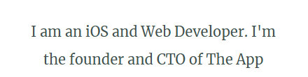
</figure>

```css
font-family: 'Merriweather', serif;
```
</div>

<div class="grid" markdown>
<figure markdown="span" style="width:400px">

</figure>

```css
font-family: 'Sacramento', cursive;
```
</div>

!!! note
    Note that this are all [google fonts](https://fonts.google.com/) and you will need to include the link below in your head tag:
    ```html
    <link href="https://fonts.googleapis.com/css?family=Merriweather|Montserrat|Sacramento" rel="stylesheet">
    ```


## Basic Example Css

<figure markdown="span" style ="width:400px">
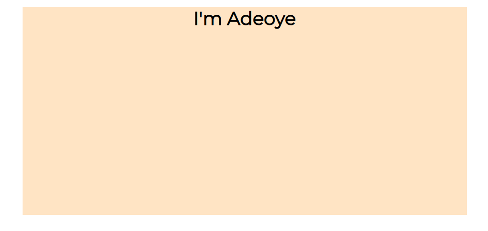 
</figure>

```css
.container{
    /* position: relative; */
    margin: auto 100px;
    background-color: bisque;
    height: 50vh;
}

.container h1{
    text-align: center;
    font-family: 'Montserrat', serif;;
}
```

### Control the font with `font-size`

<div class="grid" markdown>

```css
 body {
     font-size: 14px; 
     }
```

<figure markdown="span">
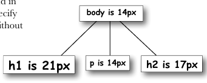
</figure>
</div>

### affect weigth with `font-weight`

<div class='grid' markdown>

```css
body {
    font-weight: bold;
    }
```


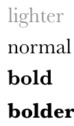


</div>


<div class='grid' markdown>
</div>


### Style your text more with `text-decoration`

<div class='grid' markdown>

```css
body {
 text-decoration: underline;
 }
```


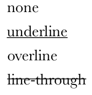

</div>

### More styling wiht `font-style`

<div class="grid" markdown>

```css
font-style: italic;
```

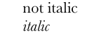

</div>

## Working with font-family

#### serif

<div class='grid' markdown>

Serif are words that has sharp, edges - This fonts are similar to the newspaper fonts.
   Examples - `Times, Times New Roman, Georgia, Savannah, Palomino, Quarter`

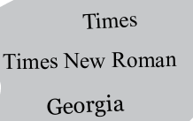
</div>


#### san-serif
<div class='grid' markdown>

The word "San" is a french word meaning "without". This has no serif basicly, no sharp edges
Examples `Verdana, Geneva, Arial, Arial Black, Trebuchet MS, Iceland, Angel, Nautica`

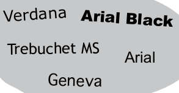
</div>

#### Monospace
<div class='grid' markdown>

This are fonts that has constant width characters. Eg. horizontal space in "i" take same as in "w". The are primary used for codes too.
Examples `Courier, Courier New, Andele Mono, Messenger, Bainbridge`

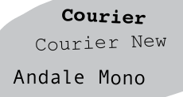

</div>

#### Cursive
<div class='grid' markdown>

This are font that looks like handwritten. This fonts are sometimes used in headings.
Examples `Comic Sans, Apple Chancery, Cartoon`


</div>

#### Fantasy Family

<div class='grid' markdown>

This are fancy and fantansy styled fonts
Examples - `Last Ninja, Impact, Crush`


</div>

### Using Font family

Most of the time when specifying font family, you make looks like so:

```css
/* Suggetst options to fallback to */
 font-family: Verdana, Geneva, Arial, sans-serif; 

 /* one prefers */
 font-family: Verdana, sans-serif;

/* Use the default font family from device */
 font-family:  sans-serif;
```

### Changing Font size

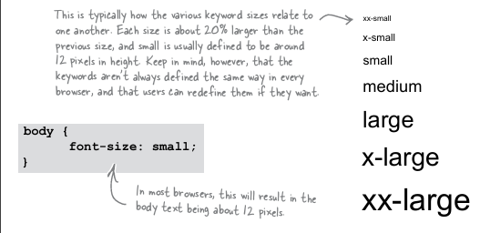
Picture from **Head First Html and Css**

The 3 major font-changing css are:
`px`,`em` and `%`

```css
body { font-size: 15px; } /* Using the screen pixel */
 h1 { font-size: 2em; } /* 2 the size of parent size */
 h2 { font-size: 150%; } /* 150% of the parent size  */
 h3{font-size: large} /* or small */

```

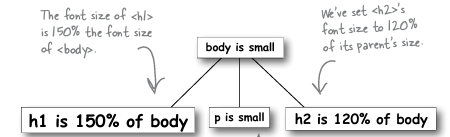