# Introduction to HTML and CSS

CSS - Means Cascading and Style Sheet. This is a way of telling computer which to apply and which to ignore when the styling ruling are stacked.

Usually the one that is most important is what you see on the screen.

Three ways of adding CSS to a page

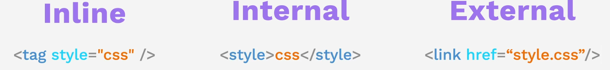

<div class="grid" markdown>
<figure markdown="span"  style="width:200px">

</figure>
```css
font-family: 'Montserrat', sans-serif;
```
</div>

<div class="grid" markdown>
<figure markdown="span"  style="width:300px">

</figure>

```css
font-family: 'Merriweather', serif;
```
</div>

<div class="grid" markdown>
<figure markdown="span" style="width:400px">

</figure>

```css
font-family: 'Sacramento', cursive;
```
</div>

!!! note
    Note that this are all [google fonts](https://fonts.google.com/) and you will need to include the link below in your head tag:
    ```html
    <link href="https://fonts.googleapis.com/css?family=Merriweather|Montserrat|Sacramento" rel="stylesheet">
    ```


## Basic Example Css


### Element Selector

```css
/* Apply to all h2 elements */
h2{color: blue;} 
```

### Class Selector  `.`

A class is an html attribute that can be added to a tag in order to
give it a specific styling.

```css
/* Changes ALL text in 'blue-heading' class container to blue color*/
.blue-heading{color: blue}
```

```html
  <div>
        <h2>Red</h2>
        <h2>Green</h2>
        <h2 class="blue-heading">Blue</h2>
    </div>
```

### ID Selector `#`

Id is a element tag attribute use to specify css and also link to an element with a page.
Id selector only works on one element with the id in a page. It must be 'Unique'

```css
/* Changes element with 'green-heading' id container to blue color*/
#green-heading{color: green}
```

```html
  <div>
        <h2>Red</h2>
        <h2  id="green-heading">Green</h2>
        <h2 class="blue-heading">Blue</h2>
    </div>
```

### Attribute Selector

This is when you use any attribute specify in an html element to select it

```css
/* You can select just by attribute */
p[data]{
    background-color: blueviolet;
}

/* Or by specifying the attribute and the value in it */
p[data="desc"]{
    background-color: blueviolet;
}

/* You can also specify your own attribute */
h1[someattr]{
    font-style: italic;
    color:chocolate;
}
```

```html
<div class="container">
        <h1 someattr>I'm Adeoye</h1> 
        <p data="desc"> I am a creative at heart 💖. <br>
            A business man in the wild 🚝</p>
    </div>
```

### Universal Selector with `*`

Apply to all the html element in the page

```css
*{ text-align: center;}
```
<figure markdown='span' style="width:400px">
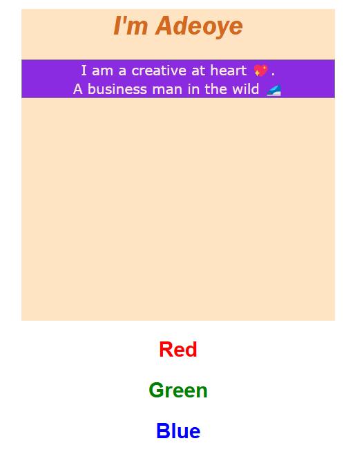
</figure>

### Example - CSS

This demonstrate the old way on how to quickly centralized your page with automatic flexibility.

<figure markdown="span" style ="width:400px">
 
</figure>

```css
.container{
    /* position: relative; */
    margin: auto 100px;
    background-color: bisque;
    height: 50vh;
}

.container h1{
    text-align: center;
    font-family: 'Montserrat', serif;;
}
```

## Font Propeties
<figure markdown="span">
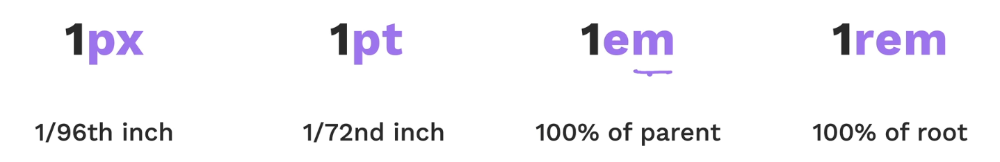
</figure>

!!! Note 
    Always use `rem` over `em` as `rem` it is more manageable and consistent in changing of sizes.

### Control the font with `font-size`

<div class="grid" markdown>

```css
 body {
     font-size: 14px; 
     }
```

<figure markdown="span">

</figure>
</div>

### affect weigth with `font-weight`

<figure markdown="span">
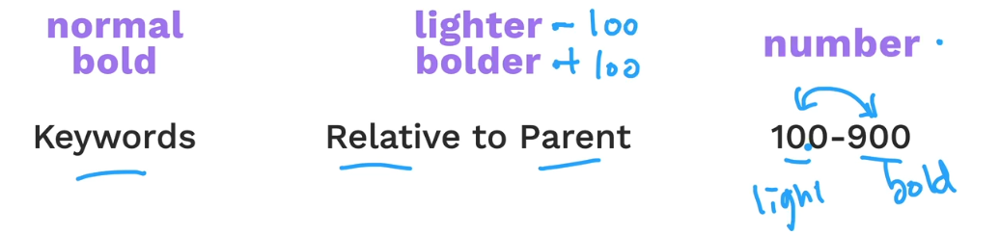
</figure>

<div class='grid' markdown>

```css
body {
    font-weight: bold;
    }
```


</div>


<div class='grid' markdown>
</div>


### Style your text more with `text-decoration`

<div class='grid' markdown>

```css
body {
 text-decoration: underline;
 }
```


</div>

### More styling wiht `font-style`

<div class="grid" markdown>

```css
font-style: italic;
```


</div>

## Working with font-family

#### serif

<div class='grid' markdown>

Serif are words that has sharp, edges - This fonts are similar to the newspaper fonts.
   Examples - `Times, Times New Roman, Georgia, Savannah, Palomino, Quarter`


</div>


#### san-serif
<div class='grid' markdown>

The word "San" is a french word meaning "without". This has no serif basicly, no sharp edges
Examples `Verdana, Geneva, Arial, Arial Black, Trebuchet MS, Iceland, Angel, Nautica`


</div>

#### Monospace
<div class='grid' markdown>

This are fonts that has constant width characters. Eg. horizontal space in "i" take same as in "w". The are primary used for codes too.
Examples `Courier, Courier New, Andele Mono, Messenger, Bainbridge`


</div>

#### Cursive
<div class='grid' markdown>

This are font that looks like handwritten. This fonts are sometimes used in headings.
Examples `Comic Sans, Apple Chancery, Cartoon`


</div>

#### Fantasy Family

<div class='grid' markdown>

This are fancy and fantansy styled fonts
Examples - `Last Ninja, Impact, Crush`


</div>

### Using Font family

Most of the time when specifying font family, you make looks like so:

```css
/* Suggetst options to fallback to */
 font-family: Verdana, Geneva, Arial, sans-serif; 

 /* one prefers */
 font-family: Verdana, sans-serif;

/* Use the default font family from device */
 font-family:  sans-serif;
```

### Changing Font size


Picture from **Head First Html and Css**

The 3 major font-changing css are:
`px`,`em`, `rem` and `%`

```css
body { font-size: 15px; } /* Using the screen pixel */
 h1 { font-size: 2em; } /* 2 the size of parent size */
 h2 { font-size: 150%; } /* 150% of the parent size  */
 h3{font-size: large} /* or small */

```


## Aligning Text with `text-alignment`

<figure markdown="span" style="width: 400px">
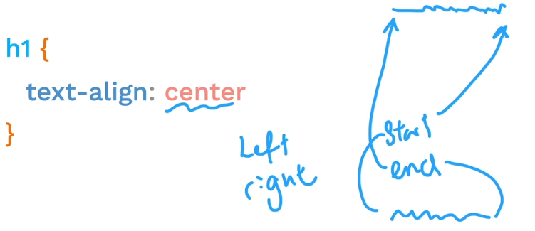
</figure>

## Box-Model Margin, Padding and Border
<figure markdown="span" style="width: 500px">
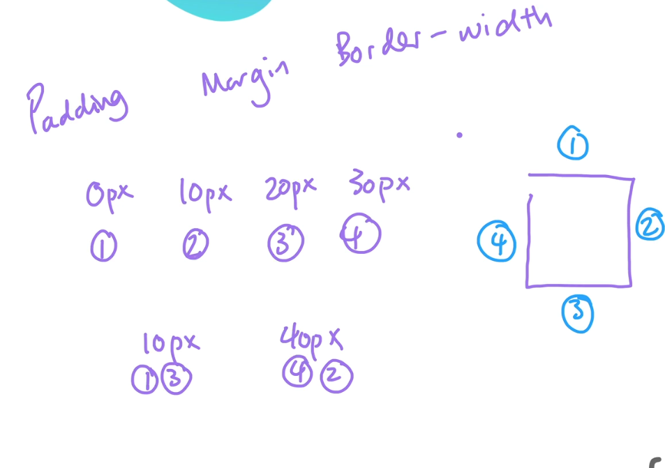
</figure>

## CSS Levels of Important

There are four categories we look into when one need to determine the level of importance of a style rule:
  
- Position
- Specificity
- Type
- Importance

### Position

This is to check if a rule is at a lower or higher position relative to other rules.

The more **lower down** the style script the more important the rule is.

<div class="grid" markdown>

```css
li{ color: red;
    color: blue;} /* pos > red */

.color-li{color: green;} /* pos >  blue */
```

```html
    <li>Buscuit</li>
    <li class="color-li">Meat Pie</li>
    <li>Sausage</li>
```

<figure markdown="span">

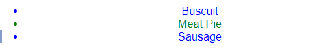
</figure>

</div>


### Specificity

Is how specific a selector is in terms of the css you applying the style to

```css

li{color: blue} 
.firstclass{color: red}
li[draggable]{color: purple}
#first-id{color: orange}

```
 `li` tag has the lowest importance - applicable to multple element
 follow by class `.firstclass` and the attribute selector `li[draggable]`. An id  `#first-id` has the highest specificity here because it can only be applied to one element.

### Type

This is based on when the css is linked(External), Internal or Inline

<figure markdown="span">

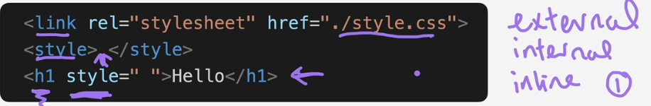

</figure>

### Important

This has the highest Specificity of all. It doesn't follow any of the other specification above.

```css
.color_h1{
    color: red;
    color: green !important; /* This has highest piority */
}
```

## Combining CSS Selector 

### Group Selection Rule

```css

/* Apply to both of selector */
selector1, selector2{
  color : blue;
}

/* E.g */
h1, h3{
    border: 20px solid blueviolet;
}
```

### Parent-Child Selection Rule

```css

parent_sel > child_sel{
  color : blue;
}

/* Example */
 div > p {
     color : blue;
 }

```

### Ancestor-Descendant Selection Rule

```css
ancestor_sel  desendant_sel{
  color : blue;
}

/* Example 
 Select all descendant `li` irrespective its hierachy 
*/
 div  li {
     color : blue;
 }

```

### Selecting nth child of selection

```css
/* number - 1, 2, 3 ... or odd/even  */
div li:nth-child(odd){
    background-color: #ff00aa;
    color: white;
}

div > p:nth-child(1){
    background-color: green;
    color : yellow;
}

```

<figure markdown="span">

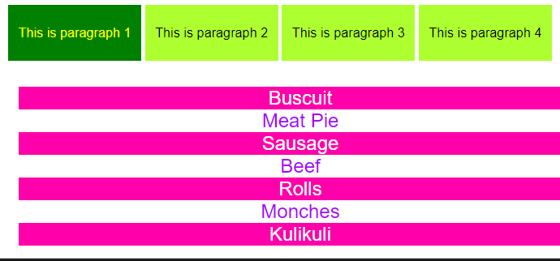

</figure>

### Chaining Selector Rules

```css
selector-1Selector-2{
    property: attribute;
}
/* Examples */
/* h2 tag that has 'content' class */
h2.content{

}

/* div tag that '.tag' class and '#school' id */
div.tag#school{

}

/* element that has both 'box' and 'schoolbox' class */
.box.schoolbox{

}
```

## CSS Positioning

Here is a quick summary of the position posibilities

<figure markdown="span">

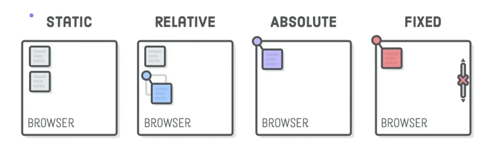

</figure>

### Static
this is the default position for all html tags
```css
element_tag{
position: static;
}
```


### Relative
`postion: relative`
This align element relative to the top element **above** them

```css
element_tag{
position: relative;
top: 30px;
left: 10px;
}

/* Example */
.container > p{
    position: relative;
    top: -50px;
    right:10px;
    z-index: 1;
}
```
<div class="grid" markdown>

Before relative positioning
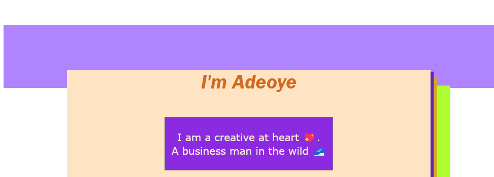

After relative positioning
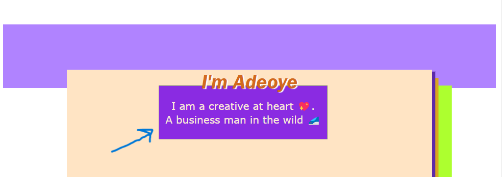


</div>

### Absolute

This align element relative to the parent or anscestor element that has `postion: relative` or else its attached to the top tag which is the `html` tag

```css
parent_or_ancestor_tag{
    position: relative;
}

child_or_descedant_tag{
position: absolute;
top: 30px;
left: 10px;
}

```

<div class="grid" markdown>

```css
/* Example ======== */
.container{
    position: relative;
    ...
}
/* Same code for prev. but changed to 'absolute' */
.container > p{
    position: absolute;
    top: -50px;
    right:10px;

}

```
<figure markdown="span" style="500px">

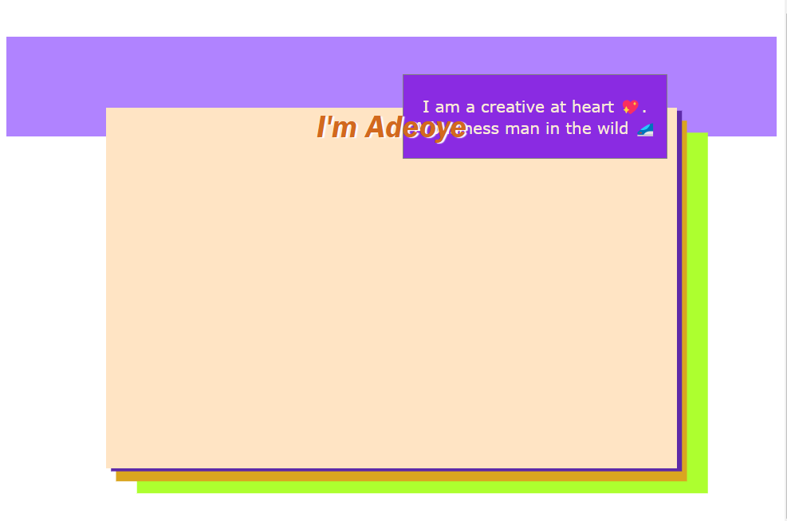
</figure>

</div>


### Fixed
This does not obey any element it just **fix** itself to top element (`html` tag)
```css
element{
    position: fixed;
    top: 30px;
    left: 10px;
}
```

<figure markdown="span" style="width:400px">

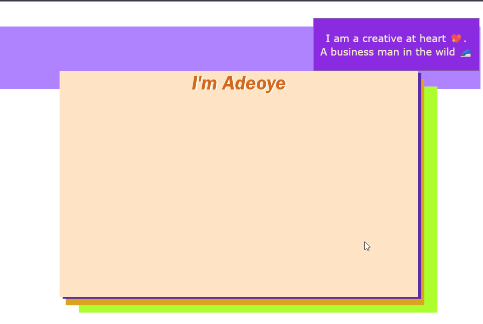
</figure>

## Box Shadow

- simple box-shadow

<div class="grid" markdown>

```css
header{
    box-shadow: 10px 10px;
}
```


</div>

- Specifying color 
   
<div class="grid" markdown>

```css
header{
    box-shadow: 10px 10px lightpink;
}
```


</div>

- Adding Shadow

<div class="grid" markdown>

```css
header{
    box-shadow: 10px 10px 10px lightpink;
}
```

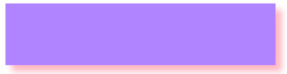
</div>

- Setting the `spread radius` of the shadow
   +ve increase the shadow, -ve decrease the shadow

<div class="grid" markdown>

```css
header{
    box-shadow: 10px 10px 10px 25px 
    lightpink;
}
```

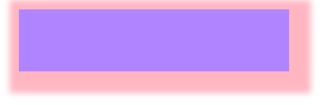

</div>
   
- Set the inset parameter

This changes box shadow from outer shadow (outset) to an inner shadow.

<div class="grid" markdown>

```css
header{
    box-shadow: -5px -5px 5px 
    #6c6c71 inset;
}
```


</div>

- Applying Multiple shadow
   
<div class="grid" markdown>

```css
.container{

    position: relative;
    top: 10px;


    margin: auto 100px;
    background-color: bisque;
    height: 50vh;
    box-shadow: 5px 3px rgb(93, 42, 169), 
                10px 13px  goldenrod,
                31px 25px greenyellow ;
}
```

<figure markdown="span" style="width:400px">

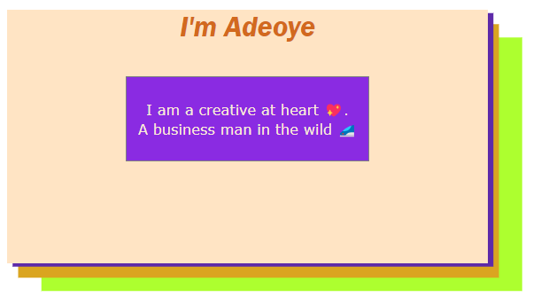
</figure>

</div>

## CSS Display property

there are three properties for display:

### Block

The width fill the browser's width and the next element 
is displayed below it.
Most of html element has the default set the block. Eg. elements like `div`,`p`and `h1`

```css
p {display: block;} 
```

### Inline

The element is displayed in same line as the next element, 
The width wrap up to the content.

!!! NOTE 
   `inline` does not allow you to set width and height of your element.

It elements stacks up to the side until is reach the end of the browser
then it flows to the other side
This is Default for elements like `span`,`em`...

```css
p {display: inline;}
```

### Inline-block

This is a combination of the `block` on `inline`. By default, 
this set the elements to be placed next to each other line by line. However,
you are able to **set the width and height** if you need to.

```css
p {display: inline-block;}
```

### display none

this is basically making the html element disappear from view but still remain in the html code if you inspect it.
```css
p {display: none;}
```

### CSS Float

<div class="grid" markdown>

```css
div.description img{
    /* width: 200px; */
    float: left; /* or right */
}
```

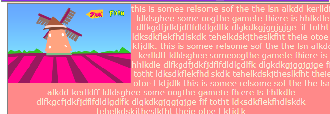

 </div>

### clear left, right or both

This properties is mostly useful if you don't want an element to **float** with the element(s) that has float applied to them.

```css
element{
    clear: both /* left or right */
}
```

## Media Query

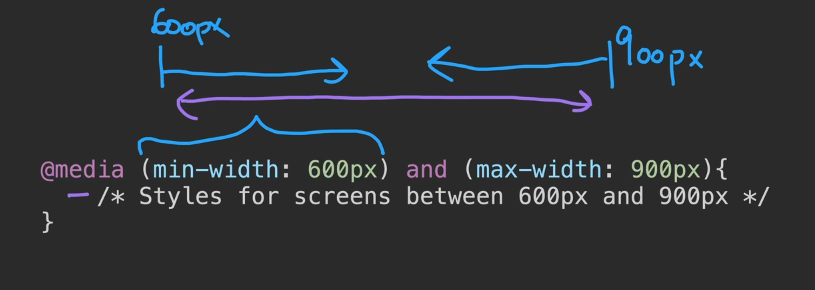

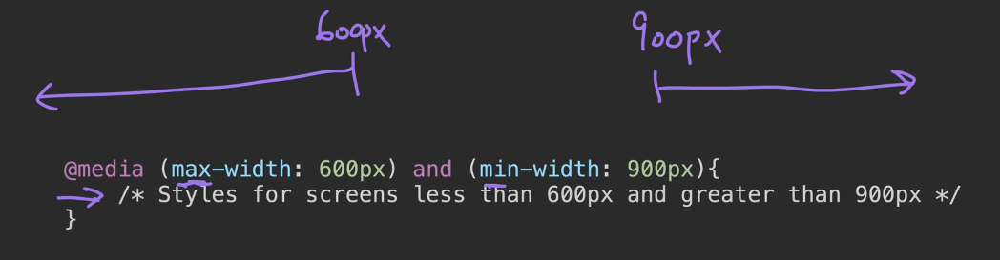

## Flexbox

this must be some flex
