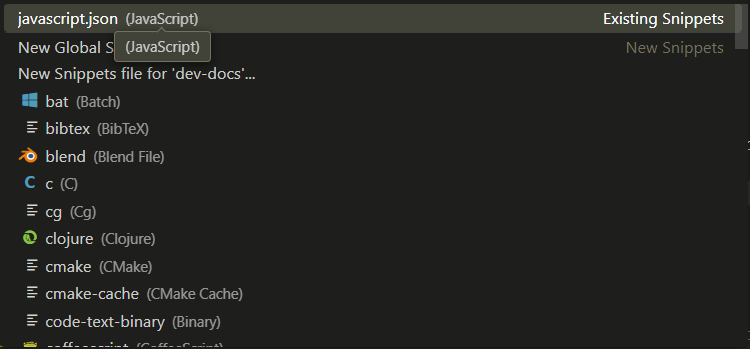

# Making code Snippet in VsCode


First go to *File > Preference > configure Snippets* or *CTRL + SHIFT + P* > type **'snippet' select (Snippets:Configure Snippets)**

<figure markdown="span">

</figure>


Select the language you will like make snippet for or if you want it applicable globally.

```json
{
	// Place your snippets for javascript here. Each snippet is defined under a snippet name and has a prefix, body and 
	// description. The prefix is what is used to trigger the snippet and the body will be expanded and inserted. Possible variables are:
	// $1, $2 for tab stops, $0 for the final cursor position, and ${1:label}, ${2:another} for placeholders. Placeholders with the 
	// same ids are connected.
	// Example:
	// "Print to console": {
	// 	"prefix": "log",
	// 	"body": [
	// 		"console.log('$1');",
	// 		"$2"
	// 	],
	// 	"description": "Log output to console"
	// }

	"Anonymous function for route ": {
		"prefix": "afr",
		"body" : [
			"(req, res)=>{",
			"\tres.send($0);",
			"}"
		],
		"description": "add anonymous function callback"
	},

	"General anonymous function":{
		"prefix": "af",
		"body":[
			"($1)=>{$2}$0"
		],
		"description": "create basic anonymous funciotn"
	}
}
```

## Bind to Key shortcut : Additional step for difficult setup

In situation where you are having difficulty with code snippet. You can bind to keyboard shortcut

*CTRL + SHIFT + P >* type *"Open Keyboard Shortcuts (JSON)"*