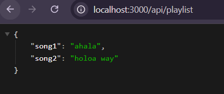

# Getting Started with Express

Running basic `get`

```js
import express from 'express';
// express = require("express");
const app = express();


// Arg: path_url, callback function
app.get('/', (req, res)=>{
    res.send("Hello from Express");
});

// Creating more route
// Creating more route
app.get('/api/playlist', (req, res)=>{
    res.send({song1: "ahala", song2: "holoa way"});
})

// Pass callback to display on console
app.listen(3000, ()=>{
    console.log("listening on port 3000...")
});

```


Note install `nodemon` package to avoid having to restart everytime

`npm i -g nodemon` 

## creating environment variable for the Port

```js
// PORT for server
const port = process.env.PORT;
app.listen(port, ()=>{
    console.log(`listening on port ${port}..`)
});
```

set environment variable

`>>> $env:PORT=5000`

## Route Parameters

```js
// Defining a parameter in a route
app.get('/api/playlist/:idx', (req, res)=>{
    res.send(req.params.idx);
})
```