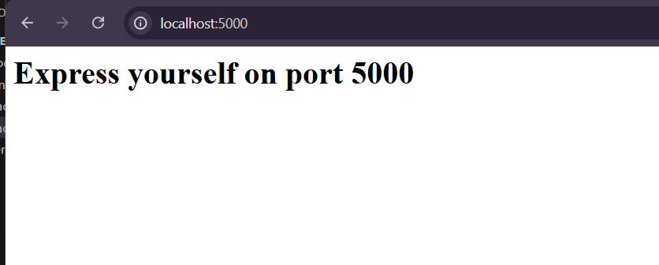
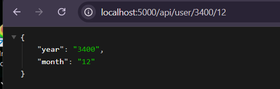
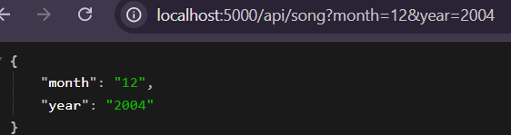
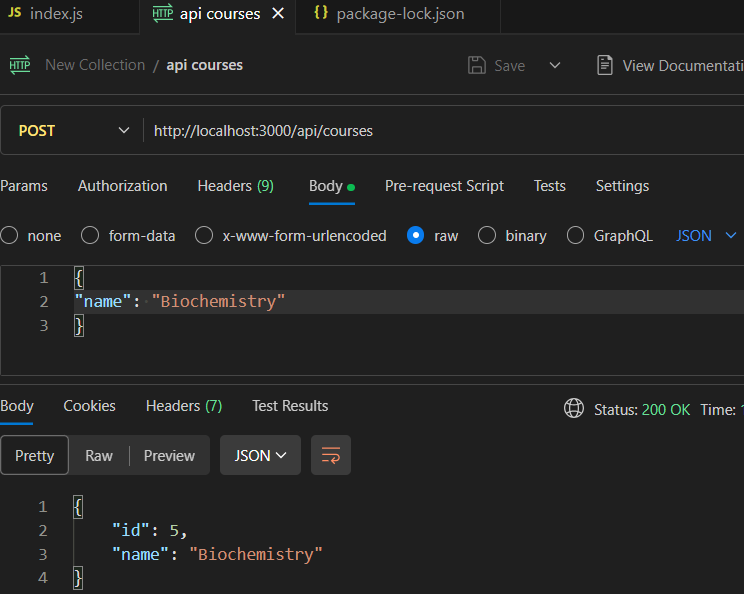
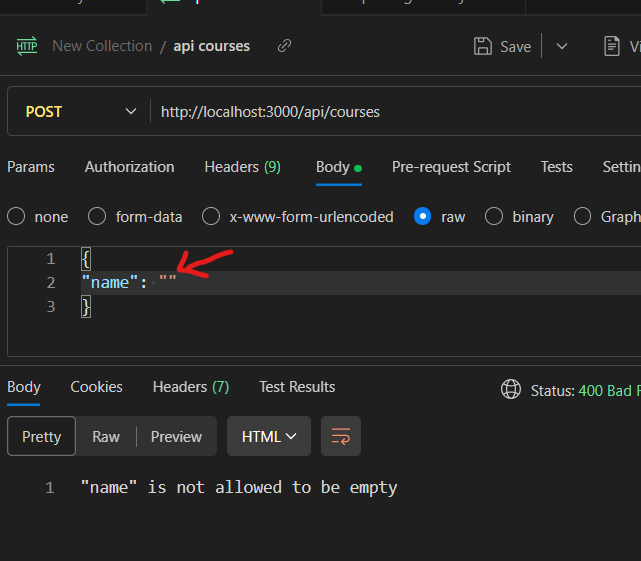
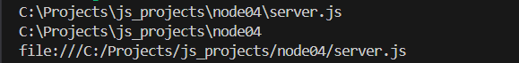
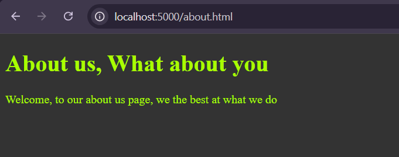

# Getting Started with Express

## Setup 

Make a new directory for your file and do `npm init` to follow step by step instruction
 or `npm init -y` for default settings.

main change is  the  *package.json*

```json title="package.json" hl_lines="5 7"
{
  "name": "node04",
  "version": "1.0.0",
  "main": "server.js",
  "type": "module", // use es6 syntax
  "scripts": {
    "start": "node --watch server", // auto update
    "dev" : "node <some-command>"
  },
...
  "dependencies": {
    "express": "^4.21.2"
  }
}

```

* Here you call on console `npm start`  
* Or call `npm run dev` for any other than `start`

## Running basic `get`

```js
import express from 'express';
// express = require("express");
const app = express();


// Arg: path_url, callback function
app.get('/', (req, res)=>{
    res.send("Hello from Express");
});

// Creating more route
// Creating more route
app.get('/api/playlist', (req, res)=>{
    res.send({song1: "ahala", song2: "holoa way"});
})

// Pass callback to display on console
app.listen(3000, ()=>{
    console.log("listening on port 3000...")
});

```


Note install `nodemon` package to avoid having to restart everytime

`npm i -g nodemon` 

## creating environment variable for the Port

```js
// PORT for server
const port = process.env.PORT;
app.listen(port, ()=>{
    console.log(`listening on port ${port}..`)
});
```

### Method 1

set environment variable in your console  `>>> $env:PORT=5000`

### Method 2 (Recommended)

- Create an *.env* file in your working directory, here is where you store your port `PORT=5000` environment variable
- Then in your *package.json* file, append a flag `--env-file=.env` to your scripts

```json hl_lines="6"
{
  "name": "node04",
  "main": "server.js",
...
  "scripts": {
    "start": "node --watch --env-file=.env server"
  },
...

}
```

#### Full Basic Code

```bash title=".env"
PORT=5000
```

```json title="package.json"
{
  "name": "node04",
  "version": "1.0.0",
  "main": "server.js",
  "type": "module",
  "scripts": {
    "start": "node server",
    "dev": "node --watch --env-file=.env server"
  },
...
  "dependencies": {
    "express": "^4.21.2"
  }
}

```

```js title="server.js"
import express from 'express';
const port = process.env.PORT || 3000;

const app =  express();

app.get('/', (req, res)=>{
    res.send(`<h1>Express yourself on port ${port}</h1>`);
});

app.listen(port, ()=>console.log("listening on port "+port));
```


<figure markdown='span'>
    
    <figcaption> Response from server </figcaption>
</figure>


## Route Parameters

```js
// Defining a parameter in a route
app.get('/api/playlist/:idx', (req, res)=>{
    res.send(req.params.idx);
})
```

### Reading multiple Params

```js
// reading multiple params
app.get("/api/user/:year/:month", (req, res)=>{
    res.send(req.params);
});
```
<figure markdown='span'>
    
</figure>


## Reading Query Parameters

```js
// reading Query params
app.get("/api/song", (req, res)=>{
    res.send(req.query);
})
```

<figure markdown='span'>
    
</figure>

## Handing GET in express

```js
const courses = [
    {id:1, name : "Math"},
    {id:2, name : "English"},
    {id:3, name : "Further Math"},
];

// Arg: path_url, callback function
app.get("/", (req, res)=>{
    res.send("Hello from Express");
});

// course route
app.get('/api/courses', (req, res)=>{
    res.send(courses);
 })

// course route handling get
app.get('/api/courses/:id', (req, res)=>{
   let course = courses.find(c=>c.id === parseInt(req.params.id))
   if(!course) res.status(404).send('The given course ID not found');
   res.send(course);
})

```

## Basics of POST in express

```js
const courses = [
    {id:1, name : "Math"}, 
    {id:2, name : "English"},
    {id:3, name : "Further Math"},
];

...

app.use(express.json()); // Add middleware 

app.post('/api/courses', (req, res)=>{
    let course = {
        id : courses.length + 1,
        name : req.body.name
    };

    // Add to database
    courses.push(course);

    // send new course for user to see
    res.send(course);
});
```

### Input Valiation using Joi

Make sure you have postman vscode install

```js
// ============ POST ===================

import Joi from 'joi';

app.use(express.json()); // Add middleware 

app.post('/api/courses', (req, res)=>{

    const schema = Joi.object({name: Joi.string().min(3).required()});
    
    //using object destructuring on `req.error` to get `error`
    const {error} = schema.validate(req.body); 
    
    if(error) {
        res.status(400).send(error.details[0].message);
        return;
    }

    let course = {
        id : courses.length + 1,
        name : req.body.name
    };

    // Add to database
    courses.push(course);

    // send new course for user to see
    res.send(course);
});
```
<div class='grid' markdown>
    
<figure markdown='span'>
    
</figure>

<figure markdown='span'>
    
</figure>
</div>

## Put and Delete in node

```js
// ============ PUT ===================

function validateCourse(course){
    // Create validation criterias
    const schema = Joi.object({name: Joi.string().min(3).required()});
    //using spread operator on `req.error` to get `error`
    return schema.validate(course); 
}

function checkUserId(req, res){
    let cs = courses.find(c=>c.id === parseInt(req.params.id))
   if(!cs) {
        res.status(404).send('The given course ID not found');
    }
   else return cs;
}
. . .

app.put('/api/courses/:id', (req, res)=>{
    // Look up the course - If not exisiting, return 404
    let course = checkUserId(req, res);
    
    // Validate - If invalid, return 400 - Bad request
    const {error} = validateCourse(req.body); 
    if(error) {
        res.status(400).send(error.details[0].message);
        return;
    }
    // Update course
    course.name = req.body.name;
    // Return the updated course
    res.send(course);
})

//========== DELETE ================
app.delete("/api/courses/:id", (req, res)=>{
    // Look up the course - If not exisiting, return 404
    let course = checkUserId(req, res);

    let index = courses.indexOf(course);
    courses.splice(index, 1);
    
    res.send(`${course} course has been removed`);
})

```

## Sending a static file with express

In your current directory, create a *public* folder where you will store all your static files.  

!!! Note
    As of Node v21.2.0 and 20.11.0, you can access yor `__dirname` and `__filename` like so:
    ```js
    const __filename = import.meta.filename;
    const __dirname = import.meta.dirname;

    console.log(__filename);
    console.log(__dirname);
    console.log(import.meta.url);
    ```
    <figure markdown='span'>
        {width=70%}
    </figure>

```js
import express from 'express';
import url from 'url';
import path from 'path';
const port = process.env.PORT || 3000;

const __dirname = path.dirname(url.fileURLToPath(import.meta.url));

const app =  express();

// Get HomePage
app.get('/', (req, res)=>{
    res.sendFile(path.join(__dirname, "public", "index.html"));
});

app.listen(port, ()=>console.log("listening on port "+port));
```

Working on a more ***express*** way:

```js
import express from 'express';
import path from 'path';

const port = process.env.PORT || 3000;

const __dirname = import.meta.dirname;

const app =  express();

app.use(express.static(path.join(__dirname, "public")));

app.listen(port, ()=>console.log("listening on port "+port));
```

all you need to this time is just load with `.html`
<figure markdown='span'>
    
</figure>

