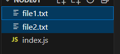
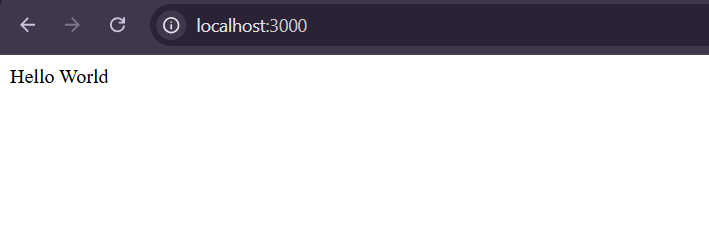
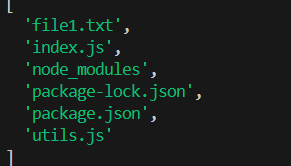

# Basics of NodeJs

Creating a new node app

```sh
# Require you answer follow up quest
>>> npm init 

# Use default info
>>> npm init -yes 

>>> npm install < package_name >
# or 
>>> npm i < package_name >

```

## intro `hello node`

First node code

```js
console.log("Hello node");
```

in console run : `node dir/index.js`


## copying file in node

This will copy the file in our current directory

```js
const fs = require("fs")

fs.copyFileSync("file1.txt", "file2.txt")
```



## Using the basic express js

```js
import express from 'express'

const app = express()

app.get('/', (req, res) =>{
  res.send('Hello World')
})

app.listen(3000)
```
<figure markdown="span">
{width=50%}
</figure>
<hr>

## Basic Import/export in NodeJs

This demonstrate import using both commonjs(cjs) and Esmacript 6(es6) syntax

=== "es6"

    ```js title="utils.js"
    export function randNumGen(){
        return Math.floor(Math.random() * 100) + 1;
    }
    ```

    ```js title="index.js"
    import { randNumGen } from "./utils.js";
    console.log(randNumGen());
    ```


=== "cjs"

    ```js title="utils.js"
    function randNumGen(){
        return Math.floor(Math.random() * 100) + 1;
    }
    module.exports = randNumGen;
    ```

    ```js title="index.js"
    randNumGen = require("./utils");
    console.log(randNumGen());
    ```

!!!Note
    When export using the ES6 module you can use this two option

    ```js
    // A - utils.js - attact export to function
    export function randNumGen(){...}

    // B - utils.js - put function object at end
    function randNumGen(){...} 
    export {randNumGen};

    // For both of this scenerio, use {} when import
    // index.js
    import {randNumGen} from 'utils.js'
    ```
   
    Export with `default` option
    ```js
    
    function randNumGen(){...}
    export default randNumGen;

    // index.js - Here you don't need to add {}
    import randNumGen from 'utils.js'

    ```

To export multiple function export

=== "es6"

    ```js title="utils.js"
    function randNumGen(){
    return Math.floor(Math.random() * 100) + 1;}

    function getBMI(mass, height){
    return (mass/ Math.pow(height, 2));}

    export {randNumGen, getBMI};
    ```

    ```js title="index.js"
    import {randNumGen, getBMI} from "./utils.js";

    console.log(`Get random ${randNumGen()}`);
    console.log(`Get BMI: ${getBMI(100, 30)}`);
    ```


=== "cjs"

    ```js title="utils.js"
    function randNumGen(){
    return Math.floor(Math.random() * 100) + 1;}

    function getBMI(mass, height){
        return (mass/ Math.pow(height, 2));}

    module.exports = {randNumGen, getBMI};
    ```

    ```js title="index.js"
    const {randNumGen, getBMI}  = require("./utils");

    console.log(`Get random ${randNumGen()}`);
    console.log(`Get BMI: ${getBMI(100, 30)}`);
    ```

## File System module

### Read from directory `readdir`

```js

import {readdir} from 'node:fs/promises'

try {
    const files = await readdir('./node01');
    console.log(files);

} catch (error) {
    console.error(`${error}`);
}

```

Returns a list of files in directory


### Append Text to file `appendFile`

If file does not exist in the directory, it creates a new one
```js
import { appendFile } from 'node:fs';

 appendFile(`node01/${file}`, "\nsome more text from Index.js paw!", (err)=>{
                if (err) throw err;
                console.log(`Text append to ${file} successfully.`);
            });
```

## Work with Events

### Basics of EventLister `EventEmitter` and `emit`

```js
import {EventEmitter} from 'node:events';

const emitter = new EventEmitter();

// Register a listener
emitter.on("myLogMessage", ()=>{
    console.log('Listening to you Mehn!!\n');
});

// Raise an event, {iterate over all the event an calls)
emitter.emit('myLogMessage');
```

### Passing Argument to Emitter

```js
import {EventEmitter} from 'node:events';

const emitter = new EventEmitter();

// Register a listener
emitter.on("myLogMessage", (e)=>{
    console.log('Listening to you Mehn!!');
    console.log(`Here is your info `, e);
});

// Passing an Argument to logger msg
emitter.emit('myLogMessage', {user_id : 12312, url: "https://url.by"});

```

## Extending Event Emitter

```js title="logger.js"
import {EventEmitter} from 'node:events';


class LogEmitter extends EventEmitter{

    user_name = "Oluwafunmilola Iretioluwa";
    url = "https://url.by";

    logMsg(msg) {

        console.log(`SomeMsg from Logger: ${msg}`);

        // Passing an Argument to logger msg
        this.emit('myLogMessage', {user_id : 12312, url: this.url});
    }
}// end class

export {LogEmitter}

```

```js title="index.js"

import { LogEmitter} from "./logger.js";

const logEmit = new LogEmitter();

// Register a listener
logEmit.on("myLogMessage", (e)=>{
    console.log('Listening to you Mehn!!');
    console.log(`Here is your info `, e);
});

logEmit.logMsg("MY-EMITTER-WELCOMES-YOU!!!!!!");
console.log(logEmit.user_name);

```

### Personal Example of Extending Emitter

```js title="speaker.js"
import {EventEmitter} from 'node:events'

class SpeakerEvent extends EventEmitter{

    id = 0x53445;
    emit_name = "SpeakLog";

    says(msg){

        console.log(msg);

        // note: ONLY Emitter Name and Argument 
        this.emit(this.emit_name, {id : this.id, details: "Unknown"});
    }
}

export default SpeakerEvent;
```

```js title="index.js"

import SpeakerEvent from "./speaker.js";

const speaker = new SpeakerEvent();

// This is the listener
speaker.on(speaker.emit_name, (e)=>{
    console.log(`Message from speak! `, e);
})

speaker.says("Bien Venue et Merci Beaucoup!");
```