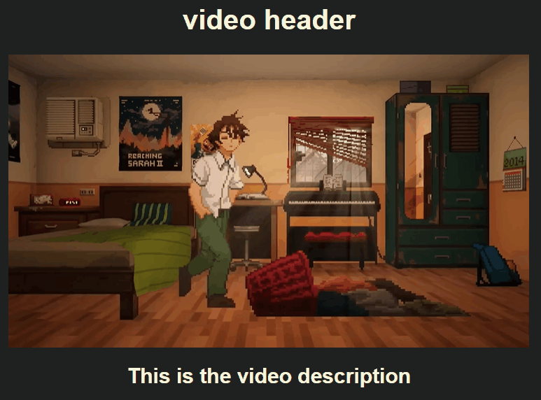

# Video Player Documentation

## Getting the Basics Down


```html
<!DOCTYPE html>
<html lang="en">
<head>
    <meta charset="UTF-8">
    <meta name="viewport" content="width=device-width, initial-scale=1.0">
    <title>Video Player </title>
    <link rel="stylesheet" href="style.css">
</head>
<body>

    <h1>video header</h1>

    
    <div class="video-container">
        <video src="assets/video.mp4" control ></video>
    </div>


</body>
</html>
```

```css

*, *::before, *::after{
    box-sizing: border-box;
}

body{
    margin: 0;
    background-color: #202020;
    color: beige;
    font-family: sans-serif;
}

body{
     /* basic flex settings for child components */
    display: flex;
    justify-content: center;
    flex-direction: column;


    /* Specific generic setting for whole body */
    margin-inline: auto;
    width: 90%;
    max-width: 1000px;
    


}

video{ width: 100%; }


```


## Setting up play and pause button

### Preparing for hover on video container

```html
 <div class="video-container">
            <!-- Handles All controls -->
            <div class="video-controls-container">
    
                <div class="timeline-container"></div>
    
                <div class="controls-container">
    
                    <button class="play-pause-btn">Play</button>
    
                </div>
            </div>
            <video src="assets/videos/video_1.mp4" ></video>
        </div>
```

```css
...
.video-controls-container{
    position: absolute;
    right: 0;
    left: 0;
    bottom: 0;
    color: white;
    z-index: 100;
    opacity: 0;
    transition: opacity 500ms ease-in-out;
}

/* When over video-container, display video controls */
.video-container:hover .video-controls-container{
    opacity: 1;
}
```
<figure markdown='span'>
    
</figure>

## Play Pause Setup

You can use the play / pause button. You can also use the **"Spacebar"**, **"K"** keyboard and click on the video element itself to play and pause

```html
 <div class="video-container paused" >
            <!-- Handles All controls -->
    <div class="video-controls-container">

        <div class="timeline-container"></div>
    
        <div class="controls">
    
            <button class="play-pause-btn">
                    <svg class="play-icon"  viewBox="0 0 24 24">
                        <path d="M8,5.14V19.14L19,12.14L8,5.14Z" fill="currentColor"/>
                    </svg>
      
                    
                </button>
                   
    
            </div>
        </div>
        <video id="video" src="assets/videos/video_1.mp4" ></video>
    </div>
```

```css

...

/* Add black gradient for ease visibility of control */
.video-controls-container::before {
    content: "";
    position: absolute; bottom: 0;
    background: linear-gradient(to top, rgba(0,0,0,1), transparent);
    width: 100%; aspect-ratio: 6 / 1;
    z-index: -1;
    pointer-events: none;
}

/* When over video-container, display video controls */
.video-container.paused .video-controls-container,
.video-container:focus-within .video-controls-container,    
.video-container:hover .video-controls-container{
    opacity: 1;
}

.video-controls-container .controls{
    display: flex;
    gap: .5rem;
    padding: .25rem;
    align-items: center;
}


.video-controls-container .controls button{
    background: none;
    border:none; color:inherit;
    padding: 0;
    width: 30px; height: 30px;
    font-size: 1.1rem;
    cursor: pointer;
    opacity: 0.75; transition: opacity 100ms ease-in-out;
}

.video-controls-container .controls button:hover{
    opacity: 1;
}

/* When PAUSED, Show the Play icon and hide the Pause Icon */
.video-container.paused .pause-icon{
 display: none;
}

/* When PLAYING (not PAUSED) hide the Play icon and show the Pause Icon */
.video-container:not(.paused) .play-icon{
    display: none;
   }

```


## Ponter-events in Css

this allows you to layer elements in html without affecting the interactive ones with events

```css
div.ex1 {
  /* Removes interactivity from element  */
  pointer-events: none; 
}

div.ex2 {
    /* Default:  Allows element be interactive */
  pointer-events: auto;
}
```


