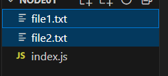

# Basics of NodeJs

Creating a new node app

```sh
# Require you answer follow up quest
>>> npm init 

# Use default info
>>> npm init -yes 

>>> npm install < package_name >
# or 
>>> npm i < package_name >

```

## intro `hello node`

First node code

```js
console.log("Hello node");
```

in console run : `node dir/index.js`


## copying file in node

This will copy the file in our current directory

```js
const fs = require("fs")

fs.copyFileSync("file1.txt", "file2.txt")
```



## Writing to file

```js
import * as fss from 'node:fs'
import fs from 'node:fs/promises'

fss.writeFileSync('somefile.txt', 'TO-DO CONTENT')
fs.writeFile('somefile-async.txt', 'ASYNC-CONTENT', function(err){console.log(err)})
```

!!!Note
        This will create the file if its not already existing

## getting filePath and directory

```js
import path from 'path';
import {fileURLToPath} from 'url';

// absolute path to filename, get the directory name 
const file_name = fileURLToPath(import.meta.url);
const file_dir= path.dirname(filename);
```

## Working with path.resolve()

```js
const path = require('path');

// Example 1: Resolving to an absolute path
console.log(path.resolve('/foo', '/bar', 'baz')); // Output: /bar/baz (on Unix-like) or C:\bar\baz (on Windows)

// Example 2: Using a relative path and current working directory
// Assuming current working directory is C:/user/myproject
console.log(path.resolve('src', 'components', 'button.js')); 
// Output: C:/user/myproject/src/components/button.js (on Unix-like)

// Example 3: Resolving with '..'
console.log(path.resolve('/foo/bar', '../baz')); 
// Output: /foo/baz (on Unix-like)
```

### Usage in webdev?

```js
import { fileURLToPath } from 'url';
import path from 'path';

const __filename = fileURLToPath(import.meta.url);
const __dirname = path.dirname(__filename);
const appRoot = path.resolve(__dirname, '..', '..'); // Adjust '..' based on your file's depth
console.log('Application Root:', appRoot);
```

## Resolve Vs Path

**Absolute vs. Relative:**

`path.resolve()` always returns an absolute path, while `path.join()` returns a path that can be either absolute or relative, depending on the input segments.

**Resolution Logic:**

`path.resolve()` uses a right-to-left resolution process that considers absolute path segments and the current working directory, whereas `path.join() `simply concatenates and normalizes segments.