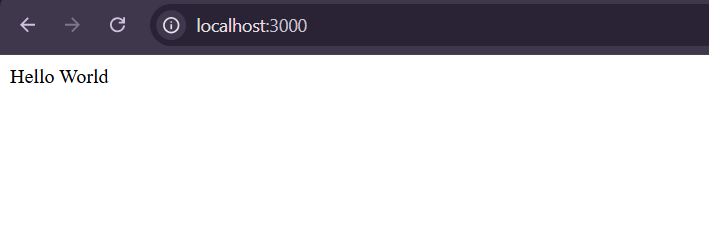
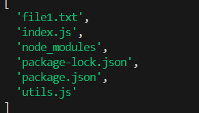
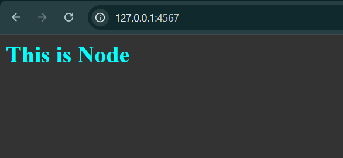
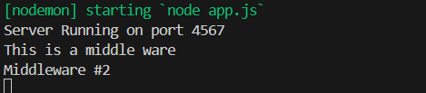
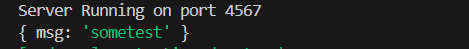
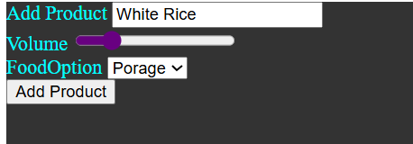

# Web development with Nodejs

## Writing content from Web page to a file

```js title='app.js'

import {createServer} from 'node:http'
import fs from 'node:fs/promises'

const port = 4567
const hostname = "127.0.0.1"

const server = createServer((req, res)=>{

    const url = req.url
    const method = req.method

    if(url === '/'){
        res.writeHead(200, {'content-type': 'text/html'})
        res.write(`
            
                <html>
            <head><title>Home Page</title></head>
                <body style="background: #333; color: aqua">
                    <div>
                        <h1>Input data </h1>
                        <form action='/message' method="POST">
                        <input type="text" name="msg"  placeholder="Put your info"/>
                        <button type="submit">Add Info</button>
                        </form>
                    </div>
                </body>
            </html> 
            `)
        
        return res.end()
        
    }

    if(url === '/message' && method === 'POST'){

        const postData = [] // stores post data

        // streaming the file data
        req.on('data', (chunk)=>{ postData.push(chunk)})

        // end of file stream
        return req.on('end', ()=>{
            // Bring the buffer content together
            const parseBody = Buffer.concat(postData).toString();

            // output : <name>=<value> format so we are taking the value part
            const msg = parseBody.split('=')[1].replaceAll('+', ' ')

            // Write data file
            fs.writeFile('message.txt', msg, (err)=>{
                console.log(err)
            }) // end writeFile

            // Redirect the file to home
            res.statusCode = 302
            res.setHeader('Location', '/')
            return res.end()

        })// end req. on

    }// url & method

})

server.listen(port, hostname, ()=>{console.log(`Server Running on port ${port} with, ${hostname}`)})

```

## Using the basic express js

```js
import express from 'express'

const app = express()

app.get('/', (req, res) =>{
  res.send('Hello World')
})

app.listen(3000)
```
<figure markdown="span">
{width=50%}
</figure>
<hr>

## Basic Import/export in NodeJs

This demonstrate import using both commonjs(cjs) and Esmacript 6(es6) syntax

=== "es6"

    ```js title="utils.js"
    export function randNumGen(){
        return Math.floor(Math.random() * 100) + 1;
    }
    ```

    ```js title="index.js"
    import { randNumGen } from "./utils.js";
    console.log(randNumGen());
    ```


=== "cjs"

    ```js title="utils.js"
    function randNumGen(){
        return Math.floor(Math.random() * 100) + 1;
    }
    module.exports = randNumGen;
    ```

    ```js title="index.js"
    randNumGen = require("./utils");
    console.log(randNumGen());
    ```

!!!Note
    When export using the ES6 module you can use this two option

    ```js
    // A - utils.js - attact export to function
    export function randNumGen(){...}

    // B - utils.js - put function object at end
    function randNumGen(){...} 
    export {randNumGen};

    // For both of this scenerio, use {} when import
    // index.js
    import {randNumGen} from './utils.js'
    ```
   
    Export with `default` option
    ```js
    
    function randNumGen(){...}
    export default randNumGen;

    // index.js - Here you don't need to add {}
    import randNumGen from './utils.js'

    ```

To export multiple function export

=== "es6"

    ```js title="utils.js"
    function randNumGen(){
    return Math.floor(Math.random() * 100) + 1;}

    function getBMI(mass, height){
    return (mass/ Math.pow(height, 2));}

    export {randNumGen, getBMI};
    ```

    ```js title="index.js"
    import {randNumGen, getBMI} from "./utils.js";

    console.log(`Get random ${randNumGen()}`);
    console.log(`Get BMI: ${getBMI(100, 30)}`);
    ```


=== "cjs"

    ```js title="utils.js"
    function randNumGen(){
    return Math.floor(Math.random() * 100) + 1;}

    function getBMI(mass, height){
        return (mass/ Math.pow(height, 2));}

    module.exports = {randNumGen, getBMI};
    ```

    ```js title="index.js"
    const {randNumGen, getBMI}  = require("./utils");

    console.log(`Get random ${randNumGen()}`);
    console.log(`Get BMI: ${getBMI(100, 30)}`);
    ```

### Example 2


## File System module

### Read from directory `readdir`

```js

import {readdir} from 'node:fs/promises'

try {
    const files = await readdir('./node01');
    console.log(files);

} catch (error) {
    console.error(`${error}`);
}

```

Returns a list of files in directory


### Append Text to file `appendFile`

If file does not exist in the directory, it creates a new one
```js
import { appendFile } from 'node:fs';

 appendFile(`node01/${file}`, "\nsome more text from Index.js paw!", (err)=>{
                if (err) throw err;
                console.log(`Text append to ${file} successfully.`);
            });
```

## Work with Events

### Basics of EventLister `EventEmitter` and `emit`

```js
import {EventEmitter} from 'node:events';

const emitter = new EventEmitter();

// Register a listener
emitter.on("myLogMessage", ()=>{
    console.log('Listening to you Mehn!!\n');
});

// Raise an event, {iterate over all the event an calls)
emitter.emit('myLogMessage');
```

### Passing Argument to Emitter

```js
import {EventEmitter} from 'node:events';

const emitter = new EventEmitter();

// Register a listener
emitter.on("myLogMessage", (e)=>{
    console.log('Listening to you Mehn!!');
    console.log(`Here is your info `, e);
});

// Passing an Argument to logger msg
emitter.emit('myLogMessage', {user_id : 12312, url: "https://url.by"});

```

## Extending Event Emitter

```js title="logger.js"
import {EventEmitter} from 'node:events';


class LogEmitter extends EventEmitter{

    user_name = "Oluwafunmilola Iretioluwa";
    url = "https://url.by";

    logMsg(msg) {

        console.log(`SomeMsg from Logger: ${msg}`);

        // Passing an Argument to logger msg
        this.emit('myLogMessage', {user_id : 12312, url: this.url});
    }
}// end class

export {LogEmitter}

```

```js title="index.js"

import { LogEmitter} from "./logger.js";

const logEmit = new LogEmitter();

// Register a listener
logEmit.on("myLogMessage", (e)=>{
    console.log('Listening to you Mehn!!');
    console.log(`Here is your info `, e);
});

logEmit.logMsg("MY-EMITTER-WELCOMES-YOU!!!!!!");
console.log(logEmit.user_name);

```

### Personal Example of Extending Emitter

```js title="speaker.js"
import {EventEmitter} from 'node:events'

class SpeakerEvent extends EventEmitter{

    id = 0x53445;
    emit_name = "SpeakLog";

    says(msg){

        console.log(msg);

        // note: ONLY Emitter Name and Argument 
        this.emit(this.emit_name, {id : this.id, details: "Unknown"});
    }
}

export default SpeakerEvent;
```

```js title="index.js"

import SpeakerEvent from "./speaker.js";

const speaker = new SpeakerEvent();

// This is the listener
speaker.on(speaker.emit_name, (e)=>{
    console.log(`Message from speak! `, e);
})

speaker.says("Bien Venue et Merci Beaucoup!");
```


## Creating A Node Server

Basic Node server creation

Remember to set `type` to `module` in the *package.json* file
 
```js title="app.js"
import {createServer} from 'node:http'
import { hostname } from 'node:os'

const port = 4567
// const hostname = "127.0.0.1"
const server = createServer((req, res)=>{
    res.statusCode = 200
    res.setHeader('Content-Type', 'text/plain')
    res.end('Some Nodes Text')

})

server.listen(port, hostname, ()=>{console.log(`Server Running on port ${port}`)})
```
To run this snippet, save it as a `app.js` file and run `node app.js` in your terminal.

Whenever a new request is received, the request event is called, providing two objects: a request (an **`http.IncomingMessage`** object) and a response (an **`http.ServerResponse`** object).


## Serving Html Content

```js
import {createServer} from 'node:http'
// import { hostname } from 'node:os'

const port = 4567
const hostname = "127.0.0.1"

const server = createServer((req, res)=>{

    // let it serve html content
    res.setHeader('Content-Type', 'text/html')
    res.write(`
        <html>
        <head><title>Some Node Page</title></head>
            <body style="background: #333; color: aqua">
                <div>
                    <h1>This is Node </h1>
                </div>
            </body>
        </html>`)
    
    res.end()


})

server.listen(port, hostname, ()=>{console.log(`Server Running on port ${port} with, ${hostname}`)})
```

then run `node app.js`

<figure markdown='span'>

</figure>

## Express as a middleware demo

```js
import express from 'express'

const port = process.env.PORT || 4567

const app = express();

// Middleware #1
app.use((req, res, next)=>{
    res.send("<h1>From middleware 2</h1>");
    console.log('This is a middle ware');

    // allow to go to the next middleware
    next(); 
})

// Middleware #2
app.use((req, res)=>{
    console.log('Middleware #2');
})

app.listen(port, ()=>{console.log(`Server Running on port ${port}`)});
```
<figure markdown='span'>
    

</figure>

## Basic routing with Express

```js
const app = express();

// Add product page
app.use('/add-product', (req, res, next)=>{
    res.send("<h1>Adding Product Page</h1>");
})

// Middleware #1
app.use('/', (req, res, next)=>{
    res.send("<h1>Some Express Hello</h1>");
})

app.listen(port, ()=>{console.log(`Server Running on port ${port}`)});
```

## Getting form value from Express

Using *body-parser* to get value from app.js.
install it `npm -i --save body-parser`.

```js
import express from 'express'
import bodyParser from 'body-parser'

const port = process.env.PORT || 4567

const app = express();
app.use(bodyParser.urlencoded());

// Add product page
app.use('/add-product', (req, res)=>{
    res.send(
        `  <div style="background: #333; color: aqua; height: 100vh">
                <label for="msg"> Add Product</label>
                <form action='/product' method="POST">
                <input type="text" name="msg"  placeholder="Put your info"/>
                <button type="submit">Add Product</button>
                </form>
            </div>`
    );
})

app.use('/product', (req, res)=>{
    console.log(req.body);
    res.redirect('/');
})

// Middleware #1
app.use('/', (req, res, next)=>{
    res.send("<h1>Some Express Hello</h1>");
})

app.listen(port, ()=>{console.log(`Server Running on port ${port}`)});
```
It returns a javascript object as the parsed value

<figure markdown='span'>

</figure>

### Another example

<figure markdown='span'>

</figure>

output

```bash
Server Running on port 4567
{ msg: 'White Rice', vol: '19', foodOption: 'porage' }
```

### Limiting to GET and POST request

```js
// Add product page, this is a get
app.get('/add-product', (req, res)=>{
    res.send(
  ` ...<form action='/product' method="POST">
    ...`
    );
})

app.post('/product', (req, res)=>{
    console.log(req.body);
    res.redirect('/');
})


app.get('/', (req, res)=>{
    res.send("<h1>Some Express Hello</h1>");
})

app.listen(port, ()=>{console.log(`Server Running on port ${port}`)});
```

## Using the Express Router

The main goal here is  to separate the different routes logic

```js title="admin.js"
import express from 'express'

const router = express.Router();

// Add product page
router.get('/add-product', (req, res)=>{
    res.send(
        `  
        <div style="background: #333; color: aqua; height: 100vh">
                <h2>From Admin Route Page </h2>
                <form action='/product' method="POST">
                   ...
                </form>
            </div>`
    );
})

router.post('/product', (req, res)=>{
    console.log(req.body);
    res.redirect('/');
})

export { router }
```

```js title="shop.js"
import express from 'express';

const router = express.Router();

router.get('/', (req, res, next)=>{
    res.send("<h1>Some Express Hello</h1>");
})

export {router }
```

```js title="app.js"

import express from 'express'
import bodyParser from 'body-parser';

import {router as adminRoute} from './routes/admin.js';
import {router as shopRoute} from './routes/shop.js';

const port = process.env.PORT || 4567

const app = express();
app.use(bodyParser.urlencoded({extended: false}));

app.use(adminRoute);
app.use(shopRoute);


app.listen(port, ()=>{console.log(`Server Running on port ${port}`)});
```

### Adding Page not Found (Basic)

In our *app.js* add the following code:

```js title='app.js'

...
const app = express();
app.use(bodyParser.urlencoded({extended: false}));

app.use(adminRoute);
app.use(shopRoute);

// page not found
app.use((req, res)=>{
    res.status(404).send("<h1>Page Not Found</h1>")
})

app.listen(port, ()=>{console.log(`Server Running on port ${port}`)});

```

### Filter Path

This helps to be more specific with our routes

```js title="app.js"
...
app.use('/admin',adminRoute);

```

```js title="admin.js" hl_lines="5"
// remember to change path in admin
router.get('/add-product', (req, res)=>{
    res.send(
        `   <h2>From Admin Route Page </h2>
                <form action='/admin/product' method="POST">
```

so now what was formally, 
 `localhost/add-product` will now be `localhost/admin/add-product`

## Serving HTML Pages

- Create a *view* folder where you store all your html pages that needs serving.

- instead of using `res.send()` use `res.sendFile()`

Example

```js
import path from 'path';

// admin/add-product => GET
router.get('/add-product', (req, res)=>{
    res.sendFile(path.resolve('views', 'add-product.html'));
})
```

the `path.resolve()` always ensure the argument strings are concate from right to left and if no absolute path is found `resolve()` makes sure to attach one.

The alternative will be

```js
import path from 'path';
import {fileURLtoPath} from 'url'';

const __filename = fileURLToPath(import.meta.url);

// NOTE: We assume we are current in root directory
const rootdir = path.dirname(__filename);

router.get('/add-product', (req, res)=>{
    res.sendFile(path.join(rootDir, 'views', 'add-product.html'));
})
```

## Serving CSS and Other static Elements

Make sure you have a folder in the root directory. The standard way to create a `public` folder, and the put your css in there.

In your main app access call `express.static(...)`

```js title="app.js" hl_lines="4"
...
const app = express();
app.use(bodyParser.urlencoded({extended: false}));
app.use(express.static(path.resolve('public')))
...
```

then in your html attach css link to it

```html title="index.html" hl_lines="6"
...
<head>
    <meta charset="UTF-8">
    <meta name="viewport" content="width=device-width, initial-scale=1.0">
    <title>Add Product Page</title>
    <link rel="stylesheet" href="css/main-style.css">
</head>
...
```

## Working with Dynamic Content & Adding Templating Engine

<figure markdown='span'>
    

<figcaption>Overview of Adding Template and Rendering Dynamic Content </figcaption>
</figure>

### Javascript Files

```js title="app.js"
import path from 'path';

import express from 'express'
import bodyParser from 'body-parser';

import {admin as adminRoute} from './routes/admin.js';
import {router as shopRoute} from './routes/shop.js';

const port = process.env.PORT || 4567

const app = express();

app.set('view engine', 'ejs');
app.set('views',`views`);

app.use(bodyParser.urlencoded({extended: false}));
app.use(express.static(path.resolve('public')));

app.use('/admin', adminRoute);
app.use(shopRoute);

// page not found
app.use((req, res)=>{
    res.render('404', {pageTitle: 'Page not found'});
});

app.listen(port, ()=>{console.log(`Server Running on port ${port}`)});
```

```js title="admin.js"
/**
 * Located in `routes` directory
 */
import express from 'express';
import path from 'path';

const admin = express.Router();
admin.use(express.static(path.resolve('public')));

const products = [];

// admin/add-product => GET
admin.get('/add-product', (req, res)=>{
    // res.sendFile(path.resolve('views', 'add-product.html'));
    res.render('add-product', 
        {
            pageTitle : "Add Product Page",
            path: '/admin/add-product'
        }
    );
})
  
// admin/product => POST
admin.post('/add-product', (req, res)=>{

    // console.log(req.body);
    products.push({title: req.body.title});
    res.redirect('/');
})

export { admin, products }
```

```js title="shop.js"
/**
 * Located in `routes` directory
 */
import express from 'express';
import path from 'path';

import {products} from './admin.js';

const router = express.Router();

router.get('/', (req, res, next)=>{
    // res.sendFile(path.resolve('views', 'shop.html'));

    res.render('shop', 
        {
            pageTitle: "Shop - Shop for Items",
            prods: products,
            path: '/'
        }
    );
})

export {router }
```

### EJS Files

All Ejs files are found in `views` directory

```html title="shop.ejs"
<%- include('includes/head.ejs') %>
<body>

    <%- include('includes/navigation.ejs') %>

    <main>
        <div class="main-content__desc">
            <% if (prods.length > 0) {%>
            <h1>My Products</h1>
            <!-- <p>List of all the products...</p> -->
            <div class="grid">
                <% for (let product of prods) {%>
                <article class="card product-item">
                    <header class="card__header">
                        <h1 class="product__title"><%= product.title%></h1>
                    </header>
                    <div class="card__image">
                        
                    </div>
                    <div class="card__content">
                        <h2 class="product__price">$19.99</h2>
                        <p class="product__description">A very interesting book about so many even more interesting things!</p>
                    </div>
                    <div class="card__actions">
                        <button class="btn">Add to Cart</button>
                    </div>
                </article>
                <% } %>
            </div>
            <% } else {%>
                    <h2>No Product in Cart</h2>
                    <div><button class="btn__add_item">Add Item</button></div>
                <% } %>
        </div>
    </main>
    
    <%- include('includes/end.ejs')%>
</body>
</html>
```

```html title="add-product.ejs"
<%- include('includes/head.ejs') %>

    <body>
        <%-include('includes/navigation.ejs')%>

        <main class="main-content">
            <div class="main-content__desc">
                <h1>Enter order Product details: </h1>
                <form class="main-content__form" action='/admin/add-product' method="POST">
                    <label for="msg"> Add Product</label>
                    <input id="msg" type="text" name="title"  placeholder="Put your info"/>
                    </br>
    
    
                    <label for="foodOption"> FoodOption </label>
                    <select id="foodOption" name='foodOption'>
                        <option value='bread'>Bread </option>
                        <option value='beans'>Bean </option>
                        <option value='porage'>Porage </option>
                    </select>
                    </br>
    
                    <button type="submit">Add Product</button>
                </form>
            </div>
           
            
        </main>
    <%- include('includes/end.ejs')%>
```

```html title="404.ejs"
<%- include('includes/head.ejs') %>
<body>

    <%- include('includes/navigation.ejs')%>

    <main>
        <h1>Sorry ^_^ - Page not Found :( </h1>
    </main>
    
</body>
<%- include('includes/end.ejs')%>
</html>
```

```html title="navigation.ejs"

<header class="main-header">
    <nav class="main-header__nav">
        <ul class="main-header__item-list">
            <li class="main-header__item"><a class="<%= (path === '/') ? 'active' : '' %>"  href="/">Shop</a></li>
            <li class="main-header__item"><a class="<%= (path === '/admin/add-product') ? 'active' : '' %>"  href="admin/add-product">Add Product</a></li>
        </ul>
    </nav>
</header>

```