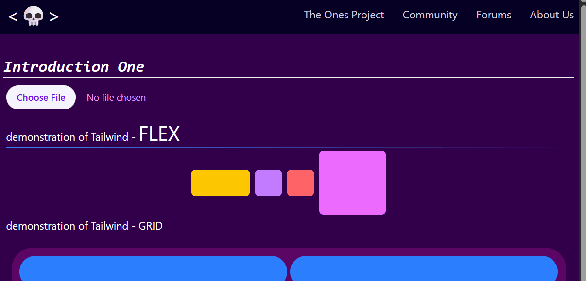
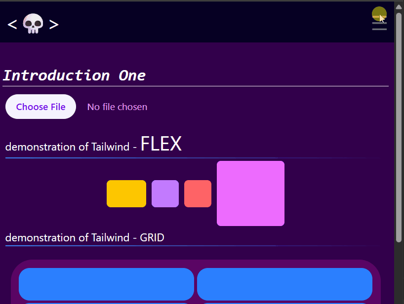

# UI Documentation

## Navigation Bar with Side Bar on Mobile

<figure markdown='span'>
 
</figure>

```html
<script setup>
import { ref } from 'vue'

const isOpen = ref(false)
const navItems = [
  { name: 'The Ones Project', href: '#' },
  { name: 'Community', href: '#' },
  { name: 'Forums', href: '#' },
  { name: 'About Us', href: '#' },
]
</script>
...
  <nav class="flex justify-around items-center h-full">
    <div>
      <h1 class="text-3xl w-30 p-3"><💀></h1>
    </div>

    <!-- Hidden on mobile (default), flex on md -->
    <ul class="hidden md:flex gap-3 h-6">
      <li v-for="item in navItems" :key="item.name" class="px-2 border-gray-600">
        <a :href="item.href">{{ item.name }}</a>
      </li>
    </ul>

    <!-- Mobile Toggle Button: Visible only on mobile (< md) -->
    <button @click="isOpen = !isOpen" class="md:hidden p-2 text-gray-500 ml-3 focus">
      <span class="text-3xl">
        {{ isOpen ? '✕' : '☰' }}
      </span>
    </button>
  </nav>

  <!-- Mobile Sidebar : off-screen by default, Slides in -->
  <div
   :class="isOpen ? 'translate-x-full' : 'translate-x-0'"
    class="md:hidden fixed top-0 -left-64 h-full w-64 bg-gray-300
    p-8 transition-transform duration-300 ease-in-out z-50">

    <ul class="flex flex-col gap-3 mt-12">
      <li v-for="item in navItems" :key="item.name">
        <a @click="isOpen = false" :href="item.href">{{ item.name }}</a>

      </li>
    </ul>
   </div>

   ....
```

## Navigation v2

<div class='grid' markdown>

<figure markdown='span'>  

</figure>

```html
...

<nav class="relative z-10 bg-navbgprimary" ... ></nav>

  <div
    :class="[
      isOpen ? 'h-50' : 'h-0' ,
      ' md:hidden w-full bg-fuchsia-900 text-fuchsia-300',
      'transition-[height] duration-1000 ease-in-out m-0'
    ]"
  >
    <ul :class="[ isOpen ? 'translate-y-0' : '-translate-y-60' ,
    'transition-transform duration-1000 ease-in-out',
    'flex flex-col gap-3 p-4',
    ]">
      <li v-for="item in navItems" :key="item.name">
        <a @click="isOpen = false" :href="item.href" class="text-lg block hover:text-blue-400">{{
          item.name
        }}</a>
      </li>
    </ul>
  </div>

  ...
```
</div>

## Handling Tabs

```html
<script setup>
  // Tab list
const tabList = [
  { name: 'Tab 1', content: Tab1 },
  { name: 'Tab 2', content: Tab2 },
  { name: 'Tab 3', content: Tab3 },
  { name: 'Tab 4', content: Tab4 },
]

const activeTab = shallowRef(tabList[0])
const activeClicked = (tab) => {
  activeTab.value = tab
}
</script>

<!-- HTML -->

     <!-- Tabs Nav-->
    <div class="w-auto mt-2">
      <ul class="relative z-10 flex flex-row justify-center w-full">
        <li
          class="relative items-stretch min-w-30"
          v-for="tab in tabList"
          :key="tab.name"
          @click="activeClicked(tab)"
        >
          <!-- :class="{ 'active': tab.name === activeTab.name, 'tabBtn': true }" -->
          <button :class="[tab.name === activeTab.name ? 'active' : '', 'tabBtn']">
            {{ tab.name }}

            <span
              :class="[
                tab.name === activeTab.name ? 'relative top-1 block w-full h-2 bg-white' : '',
                'h-0',
              ]"
            ></span>
          </button>
        </li>
      </ul>
    </div>

    <!-- Tabs Content -->
    <div class="relative z-5 flex justify-center border-2 border-gray-400 rounded-2xl w-full p-5">
      <div>
        <component :is="activeTab.content" />
      </div>
    </div>

```