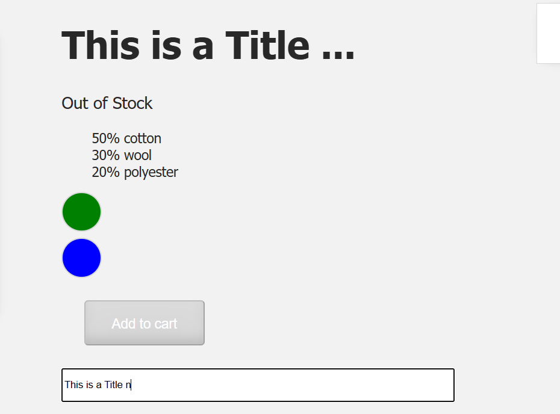

# introduction to Vue

Getting started

- `npm create vue@latest`
- Set your project name
- Just press enter for the remaining options
Once all the necessary installations is done

Do the following:

```bash
cd <new_project_name>
npm install
npm run dev
```


<figure markdown='span'>
<figcaption> Then you will get a localhost Address </figcaption>
  {width="70%"}
</figure>


<figure markdown='span'>
    <figcaption> Click on the localhost, you will have a default view of vue </figcaption>
    
</figure>

## Computed Properties example 1

```js
import { ref, computed } from 'vue'

const product = ref('Socks')
const brand = ref('Vue Mastery')
const newTitle = ref('')


// Methods 
const title = computed(()=>{
  return brand.value + " " + product.value
})

const updateTitle = computed(()=>{
  // return default
  if (newTitle.value.length === 0) return title.value
  // trucate if too long
  else if(newTitle.value.length > 15) return newTitle.value.slice(0, 15) + " ... "
  // return length of string
  else return newTitle.value
})
```

```html
  ...
  <h1>{{ updateTitle}}</h1>
  ...
  ...
  ...

  <form @submit.prevent="updateTitle">
          <input type="text" placeholder="Write New Title..." v-model="newTitle"/>
          <!-- <button type="submit" >set name</button> -->
        </form>
```

<figure markdown='span'>
  
</figure>


## Computed Properties Example 2

```js
import { ref, computed } from 'vue'
import socksGreenImage from './assets/images/socks_green.jpeg'
import socksBlueImage from './assets/images/socks_blue.jpeg'


// Selected 
const selVariant = ref(0)
  
const details = ref(['50% cotton', '30% wool', '20% polyester'])

const variants = ref([
  { id: 2234, color: 'green', image: socksGreenImage, quantity: 50 },
  { id: 2235, color: 'blue', image: socksBlueImage, quantity: 0 },
])

...

const image = computed(()=> variants.value[selVariant.value].image)
const inStock = computed(()=> variants.value[selVariant.value].quantity > 0)


// Updates index value when Hover
const updateVariant = (index) => {
  selVariant.value = index
 }
```

```html
<div class="product-container">
      <div class="product-image">    
        
      </div>
      <div class="product-info">
        <!-- <h1>{{ title}}</h1> -->
        <h1>{{ updateTitle}}</h1>
        <p v-if="inStock">In Stock</p>
        <p v-else>Out of Stock</p>
        <ul>
          <li v-for="detail in details">{{ detail }}</li>
        </ul>
        <div v-for="(variant, idx) in variants" 
          key="variant.key"
          @mouseover="updateVariant(idx)"
          class="color-circle"
          :style="{ backgroundColor: variant.color }"
        >
        </div>
        <button
          class="button" 
          :class="{ disabledButton: !inStock }"
          :disabled="!inStock"
          v-on:click="addToCart"
        >
          Add to cart
        </button>
```


<figure markdown='span'>

</figure>


## components and Props

```html title="App.vue"
<script setup>
import { ref} from 'vue'
import ProductDisplay from '@/components/ProductDisplay.vue'
const cart = ref(0)
const premiumData = ref(0)
const productDetails = ref([
  {name: "LongSocks", desc: "The best in town ", date: "23-05"},
  {name: "NothingSocks", desc: "Theirs nothing like it ", date: "11-07"},
  {name: "SnowSocks", desc: "Going for a snowy day", date: "02-08"},
])

</script>
  
<template>
  <div class="nav-bar">
    <div class="cart">Cart({{ cart }})</div>
  </div>
<ProductDisplay 
  :premiumUser ="premiumData" 
  :details="productDetails[0]" ></ProductDisplay>

<ProductDisplay 
  :premiumUser = "true"
  :details="productDetails[1]" ></ProductDisplay>

  <ProductDisplay premiumUser = "Omololu"
  :details="productDetails[2]" ></ProductDisplay>
  
</template>
```

Everything from the previous code applys here,
Think of it like a function but for frontEnd user.

We `props` are like the **parameters** and when we call the
`<ProductDetail>`, we pass the arguments *prop* to it.

```html title="ProductDisplay.vue"
<script setup>
import { ref, computed } from 'vue'
import socksGreenImage from '@/assets/images/socks_green.jpeg'
import socksBlueImage from '@/assets/images/socks_blue.jpeg'

const props = defineProps({
  "premiumUser": {type: Boolean, required: true},
  "details": {type: Object, required: true}
})


const product = ref('Socks')
const brand = ref('Vue Mastery')
const selectedVariant = ref(0)
const details = ref(['50% cotton', '30% wool', '20% polyester'])

const variants = ref([
  { id: 2234, color: 'green', image: socksGreenImage, quantity: 50 },
  { id: 2235, color: 'blue', image: socksBlueImage, quantity: 0 },
])

const title = computed(() => brand.value + ' ' + product.value)
const image = computed(() =>  variants.value[selectedVariant.value].image)
const inStock = computed(() =>  variants.value[selectedVariant.value].quantity > 0)
const shippingValue = computed(() => {
  if(props.premiumUser) return 'Free'
  else                  return '$2.99'
})
const productDetailInfo = computed(()=>return `${props.details.name}, ${props.details.desc},
  ${props.details.date}`)

const addToCart = () => cart.value += 1
const updateVariant = (index) => selectedVariant.value = index


</script>

<template>
      <div class="product-display">
    <div class="product-container">
      <div class="product-image">    
        
      </div>
      <div class="product-info">
        <h1>{{ title }}</h1>
        <p v-if="inStock">In Stock</p>
        <p v-else>Out of Stock</p>
        <p>shipping : {{ shippingValue }}</p>
        <p>{{productDetailInfo}}</p>
        <ul>
          <li v-for="detail in details">{{ detail }}</li>
        </ul>
        <div 
          v-for="(variant, index) in variants" 
          :key="variant.id"
          @mouseover="updateVariant(index)"
          class="color-circle"
          :style="{ backgroundColor: variant.color }"
        >
        </div>
        <button
          class="button" 
          :class="{ disabledButton: !inStock }"
          :disabled="!inStock"
          v-on:click="addToCart"
        >
          Add to cart
        </button>
      </div>
    </div>
  </div>
</template>

```

## Using onMounted in Vue

### Use case example, fetching data from an API

```html
<script setup>
import {ref, onMounted} from 'vue';

...

// Base content
const tasks = ref(["buy Book", "Read a lesson", "Sweep floor", "Watch movies"]);

const buttonStyle = ref({float:"right", borderRadius: "20px", backgroundColor:"#777"})


// some form of counter with `setInterval`
onMounted(()=>{
  setInterval(()=>{ secs.value++ },1000)
})

// Requesting from API
onMounted(async ()=>{
  try {
    const res = await fetch('https://jsonplaceholder.typicode.com/todos')
    const data = await res.json()
    tasks.value = data.map((task) => task.title)
    
  } catch (error) {
    console.error("ASYNC_ERROR::FAILED TO FETCH TASK")
  }
})

</script>


<template>
  <header>

  <h1>Hello Vue<span>{{ secs % 30 }}</span></h1>
</header>

...

<ul>
  <li v-for="(task, index) in tasks" :key="task" style="width: 50%">
   <span>{{ task }}</span> 
   <button 
   :style="buttonStyle" 
   @click="deleteTask(index)">x</button>
  </li>
</ul>

</template>
```


## Setting Up tailwind CSS

1. Install tailwind and its peer dependency

    ```bash
    npm install tailwindcss @tailwindcss/vite
    ```

2. In your `vite.config.js`

    ```bash title="vite.config.js" hl_lines="2 6"
    import { defineConfig } from 'vite'
    import tailwindcss from '@tailwindcss/vite'

    export default defineConfig({
      plugins: [
        tailwindcss(),
      ],
    })
    ```

3. import tailwind in your css file

    ```css
    @import 'tailwindcss';

    ```

## Setting up `Hero.vue` components adding props

1. In the `Hero.vue` component

    ```html title="Hero.vue"
    <script setup>

    const props = defineProps({
        heroData:{
            type: Object,
            default: 
            {
              title: "Become a Vue Dev", 
              desc: "Vue jobs that fits your skills and needs" 
            }
        }
    })

    </script>

    <template>
          <!-- Hero -->
          <section class="bg-green-700 py-20 mb-4">
          ...
                {{heroData.title}}
              </h1>
              <p class="my-4 text-xl text-white">
                {{heroData.desc}}
              </p>
        ...
        </section>
    </template>
    ```

2. In the `App.vue`

    ```html title="App.vue"
    <script setup>
    import {ref} from 'vue'
    import Navbar from '@/components/Navbar.vue';
    import Hero from './components/Hero.vue';


    const heroData = ref({ title : "World best Jobs",
      desc: "Become the world best Dev. in Tech world"
      })
    </script>

    <template>
      <Navbar />
      <Hero :hero-data = "heroData"/>  <!-- Show passed data -->
      <Hero />                         <!-- show the default title -->

    </template>
    ```

We see that we have two hero files right now

<figure markdown='span'>

</figure>

## Working with `HomeCard.vue` and 'Card' setup 

Here is the `Card.vue` template
```html title="Card.vue"
<script setup>
const props = defineProps({
    bgColor : {
        type: String,
        default: "bg-gray-100"
    }
});
</script>

<template>
    <div :class="`${bgColor} p-6 rounded-lg shadow-md`">
        <slot></slot>
    </div>
</template>
```

```html title="HomeCard.vue"
<script setup>
import Card from "@/components/Card.vue"
</script>

<template>

<Card bg-color="bg-purple-200">
    <!-- Here is the <Slot> Content-->
    <h2 class="text-2xl font-bold">For Developers</h2>
            <p class="mt-2 mb-4">
              Browse our Vue jobs and start your career today
            </p>
            <a href="jobs.html" class="inline-block bg-black text-white rounded-lg px-4 py-2 hover:bg-gray-700">
              Browse Jobs
            </a>    
        <!-- End <Slot>-->
</Card>

<Card bg-color="bg-cyan-100">
    <!-- Here is the <Slot> Content-->
    <h2 class="text-2xl font-bold">For Employers</h2>
            <p class="mt-2 mb-4">
              List your job to find the perfect developer for the role
            </p>
            <a
              href="add-job.html"
              class="inline-block bg-green-500 text-white rounded-lg px-4 py-2 hover:bg-green-600"
            >
              Add Job
            </a>
    <!-- End <Slot>-->
</Card>

</template>
```
<figure markdown='span'>
  
</figure>

## Fetch basic Json Data from src

```html title="JobListings.vue"
<script setup>
import {ref} from 'vue'
import jobData from '@/jobs2.json'

const jobs = ref(jobData)

</script>

<template>
    Job Listings
    <p v-for = "job in jobs" :key="job.id">
        {{job.id +" - "+ job.title }}
    </p>
</template>
```

<figure markdown='span'>
  
</figure>

### Styling the Data with Basic tailwind

```html
<template>
    <section class="bg-blue-50 px-4 py-10">
        <div class="container-xl lg:container m-auto">
            <h2 class="text-3xl font-bold text-green-500 mb-6 text-center">
                Browse Jobs
            </h2>
            <div class="grid grid-cols-1 md:grid-cols-3 gap-6">

                <div v-for = "job in jobs" :key="job.id">
                    {{job.id +" - "+ job.title }}
                </div>

            </div>
        </div>
    </section>
</template>
```

<figure markdown='span'>
  
</figure>

### Finalising the Joblisting Styling

Individual Job Listings

```html title="JobListing.vue"
<script setup>
import { defineProps } from 'vue';

defineProps({
    jobData : Object
})
</script>

<template>
      <div class="bg-white rounded-xl shadow-md relative">
           ...
              <div class="mb-5">
                {{jobData.description.slice(0, 105) + " ..."}}
              </div>

              ...
              <i class="fa-solid fa-location-dot text-lg"></i>
                  {{jobData.location}}
                </div>
                <a
                  :href="`/jobs/${jobData.id}`"
                  class="h-[36px] bg-green-500 hover:bg-green-600 text-white px-4 py-2 rounded-lg text-center text-sm"
                >
                  Read More
                </a>
            ...
          </div>
</template>
```

All the JobListing display

```html title="JobListings.vue"
<script setup>
import {ref, defineProps} from 'vue'
import jobData from '@/jobs2.json'
import JobListing from '@/components/JobListing.vue'

const jobs = ref(jobData)

defineProps({
    limit: Number,
    showAllJobs: {type: Boolean, default: false}
})


</script>

<template>
    <section class="bg-blue-50 px-4 py-10">
        <div class="container-xl lg:container m-auto">
            <h2 class="text-3xl font-bold text-green-500 mb-6 text-center">
                Browse Jobs
            </h2>
            <div class="grid grid-cols-1 md:grid-cols-3 gap-6">
                <!-- Display on limit amount -->
                <JobListing v-for="job in jobs.slice(0, limit || jobs.length)" :job-data="job" />
            </div>
        </div>
    </section>

    <section v-if="showAllJobs" class="m-auto max-w-lg my-10 px-6">
      <a
        href="jobs.html"
        class="block bg-black text-white text-center py-4 px-6 rounded-xl hover:bg-gray-700"
        >View All Jobs</a
      >
    </section>
</template>
```

Displaying JobListing in Main vue

```html title="App.vue"
<script setup>
import {ref} from 'vue'
...
import JobListings from './components/JobListings.vue';

</script>

<template>
...

  <JobListings :limit="3" :show-all-jobs="true"/>

</template>

```

<figure markdown='span'>
  
</figure>

### Implementing Toggle full description

```html
<script setup>
import {ref, defineProps, computed } from 'vue';

const props = defineProps({
    jobData : Object
})

const showFullDescription = ref(false)

const toggleFullDescription = () =>{
    showFullDescription.value = !showFullDescription.value
}

const truncatedDescription = computed(()=>{
    let description = props.jobData.description
    if(!showFullDescription.value)
        description = description.substring(0, 90) + " ..."
    return description
})
</script>

<template>
      <div class="bg-white rounded-xl shadow-md relative">
          ...

              <div class="mb-5">
                <div>
                    {{truncatedDescription}}
                </div>
                <button 
                class="text-green-500 hover:text-green-600 mb-5"
                @click="toggleFullDescription"
                >
                    {{ showFullDescription ? 'Less' : 'More' }}
                </button>
              </div>

              ...

          </div>
</template>
```

<figure markdown='span'>
  
</figure>

## Router Setup in Vue App

!!! Note
    This setup will have been done if you select the router option during your first installations

1. First install the router in the `npm`

    ```bash
    npm install vue-router
    ```

2. Create a **views** directory in the src folder
   and create a`HomeView.vue` copy the code from `App.vue` except the `Navbar` 

      ```html title="homeView.vue"
        <script setup>

        import Hero from '@/components/Hero.vue';
        import HomeCard from '@/components/HomeCard.vue';
        import JobListings from '@/components/JobListings.vue';

        </script>

        <template>
          <Hero 
          hero-title = "World best Jobs" 
          hero-desc="Become the world best Dev. in Tech world"/>  <!-- Show passed data -->
          <HomeCard />
          <JobListings :limit="3" :show-all-jobs="true"/>

        </template>
      ```

3. Next make sure you import `createRouter, createWebHistory` in index.js

    ```js title="index.js"
    import {createRouter, createWebHistory} from 'vue-router'
    import HomeView from '@/views/HomeView.vue'

    const router = createRouter({
        history: createWebHistory(import.meta.BASE_URL),
        routes: [
            {
                path: '/',
                name: 'home',
                component: HomeView
            }
        ]
    })

    export default router
    ```

4. In your `main.js` restructure it to use router

   ```js title="main.js"
      import './assets/main.css'
      import 'primeicons/primeicons.css'

      import { createApp } from 'vue'

      import router from './router'
      import App from './App.vue'

      const app = createApp(App)

      app.use(router)
      app.mount('#app')

   ```

   5. Finally in your `App.vue`, import `RouterView` and call it in the template

  ```html title="App.vue"
    <script setup>
    import { RouterView } from 'vue-router';
    import Navbar from '@/components/Navbar.vue';

    </script>

    <template>
        <Navbar /> 
        <RouterView />
    </template>

  ```
