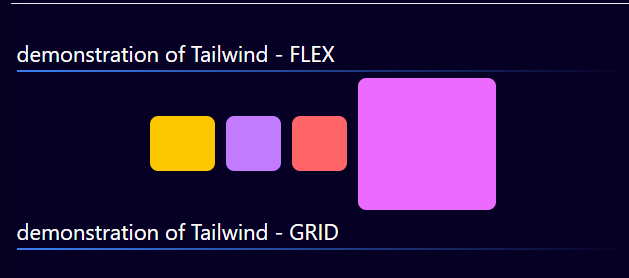

# Tailwind CSS Documentation

Visit tailwind css [site](https://tailwindcss.com/){target=blank}

<div class='grid' markdown>

<figure markdown='span'>
    
</figure>
   
```html

        <section class="section-main mt-6">
            <div class="section-head">
            <h1>Introduction One</h1>
            </div>
            <div class="main-content">
            <h2 class="text-green-500">Work on the Head</h2>
            <p class="text-white">Some content Goes here</p>
            </div>

            <div class="main-content">
            ...
            </div>
        </section>

        <section class="section-main">
            <div class="section-head">
            <h1>Introduction Two</h1>
            </div>
            <div class="main-content p-1">
            <div class="flex">
                <div class="my-3">
                
                </div>
                <div class="flex flex-col justify-center items-left ml-3">
                ...
                <span>And yet this is a <span class="text-green-300">SPAN!!</span></span>
                </div>
            ... <!-- End tags-->

```

</div>

## Modifying CSS

you can modify your css like so especially for re-usability

```css
@import 'tailwindcss';

:root {
  --base-bg-color: #060024;
}

body {
  background-color: var(--base-bg-color);
}

.section-main {
  @apply text-white;
}

.section-head {
  @apply border-b-1 border-b-[#eee] m-2;
}
.section-head h1 {
  @apply text-left text-2xl font-bold font-mono italic;
}

.main-content {
  @apply flex flex-col justify-center 
  items-center border-2 rounded-2xl border-[#efefef]/20  mx-4 my-8;
}

h2 {
  @apply text-center text-xl font-medium;
}
```

## Modifying Border Gradient



### in vanilla Css

```css
.gradient-border {
  /* 1. Define a border width and solid style */
  border: 4px solid transparent; 
  
  /* 2. Apply the gradient and the '1' slice value */
  border-image: linear-gradient(to right, #3b82f6, #9333ea) 1;
}
```

### in tailwind css

```html
<!-- border-4 sets width, border-solid sets style -->
<div class="border-4 border-solid [border-image:linear-gradient(to_right,#3b82f6,#9333ea)_1]">
  Your content here
</div>
```
