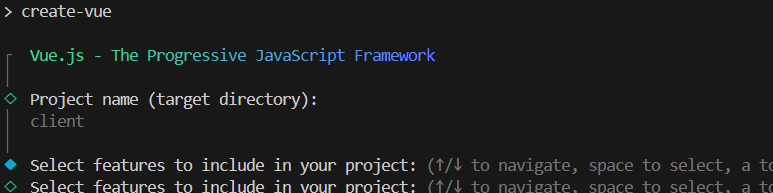
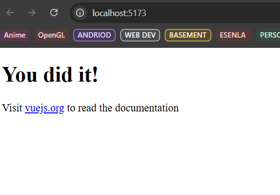
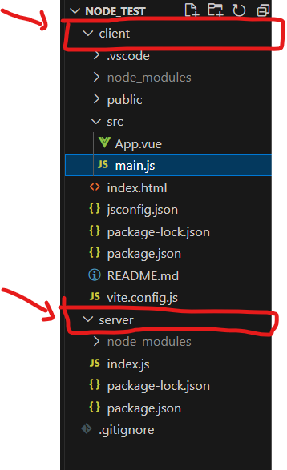

# Basic Setup for Vue Express

First create a `server` and `client` folder to hold the different respective codes

## Create Express Backend

Navigate to your server folder to initialize Node.js and install Express.

- Initialize: Run `npm init -y` inside the server directory.(Get Package install)
- Install Express: Use `npm install express`.
  - other packages needed : `nodemon`(node monitor), `cors`(Cross-Origin Resources Sharing)
Create Server File: Create `main.js` and add a basic route javascript

In your server side package manager, remember to:

- Change js type from commonjs to module `"type":"module"`
- Add `"start":"nodemon main.js"` under the `test` categories 


```js
import express from "express"

const SERVER_PORT = process.env.port || 3000
const app = express()
// app.use(cors())
// app.use(express.json())

app.get('/api/hello', (req, res)=>{
 res.json({hello: "Server says Hello"})

app.listen(SERVER_PORT, ()=>console.log(`running Server on port ${SERVER_PORT}`))

```

Run `npm start` nodemon will start the server.

## Create Vue Frontend

Navigate to your client folder and scaffold a new Vue project using the `official Vue starter.`

Generate Project: In your root folder, Run `npm create vue@latest ` and follow the prompts.

<figure markdown='span'>
    
    <figcaption>Use your client folder as project name </figcaption>
</figure>

Install Dependencies: Run `npm install` to install dependencies
cd into your `client` folder and Run the boilerplate: `npm run dev`

You should basic Vue running on `localhost:5173`
<figure markdown='span'>
    
    <figcaption> basic Vue Page </figcaption>
</figure>

Directory setup
<figure markdown='span'>
    
</figure>

## Connecting your Server to Client

- Install `Axios` for fetch data
- In your server make sure you have `cors` activated in your express

```js title="server/main.js" hl_lines="2 6"
import express from "express"
import cors from "cors"

const SERVER_PORT = process.env.port || 3000
const app = express()
app.use(cors())
app.use(express.json())

app.get('/api/hello', (req, res)=>{
 res.json({hello: "Server says Hello"})
})

```

in your client side.

```js title="client/src/main.js"

import { createApp } from 'vue'
import App from './App.vue'

const app = createApp(App)
app.mount('#app')

```

in your `App.vue`

```html title="App.vue"
<script setup>
import { onMounted,ref } from 'vue';
import axios from 'axios';


const SERVER_BASE_URL = "http://localhost:3000"
const hello_msg = ref('')

onMounted(async ()=>{
  const res = await axios.get(`${SERVER_BASE_URL}/api/hello`)
  hello_msg.value  = res.data.hello
})

</script>

<template>
  <h1>{{hello_msg}}</h1>
  <p>
    Visit <a href="https://vuejs.org/" target="_blank" rel="noopener">vuejs.org</a> to read the
    documentation
  </p>
</template>

<style scoped></style>

```

## Proxy for CORS localhost

In Vite, you can configure a dev server proxy in your `vite.config.js (or .ts)` file. This intercepts requests starting with a specific prefix (like /api) and forwards them to your Express server, making the browser think the request is coming from the same origin as your frontend.

1. Update vite.config.js

Add the server.proxy configuration to your Vite file:

```js title="vite.config.js"

import { defineConfig } from 'vite'
import vue from '@vitejs/plugin-vue'

export default defineConfig({
  plugins: [vue()],
  server: {
    proxy: {
      // Any request starting with /api will be proxied
      '/api': {
        target: 'http://localhost:3000', // Your Express server address
        changeOrigin: true,             // Recommended for CORS
        // Use rewrite if your Express routes DON'T start with /api
        // rewrite: (path) => path.replace(/^\/api/, '') 
      }
    }
  }
})
```

2. Update your API calls in Vue

Instead of using the full URL `(e.g., http://localhost:3000/api/users)`, use a relative path. Vite will automatically prepend the proxy target. 

javascript
```js 
// Inside a Vue component or Axios setup
import axios from 'axios';

// This is automatically proxied to http://localhost:3000/api/users
const response = await axios.get('/api/users');

```

### Our final Script code could look like so

```html title="src/App.vue" hl_lines="5"
<script setup>
...

onMounted(async ()=>{
  const res = await axios.get('/api/hello')
  hello_msg.value  = res.data.hello
})
...
</script>

```

## Loading , Reloading

### 1. The "Vue Way": Refresh the Data (Recommended)

Instead of reloading the page, simply call your data-fetching function again. This is faster and smoother for the user.

```js
const products = ref([]);

const fetchCart = async () => {
  const response = await axios.get('/api/cart');
  products.value = response.data;
};

const addToCart = async (id) => {
  const res = await axios.post('/api/cart', { productId: id });
  if (res.status === 200) {
    // Just refresh the list, don't reload the page!
    await fetchCart(); 
  }
};
```

### 2. The "Hard" Reload (F5 Style)

If you absolutely must reload the entire browser window (e.g., to reset a complex global state or legacy reasons), use the standard Web API Location: reload() method:

```js
const createOrder = async () => {
  const res = await axios.post('/create-order');
  if (res.status === 200) {
    window.location.reload();
  }
};

```
