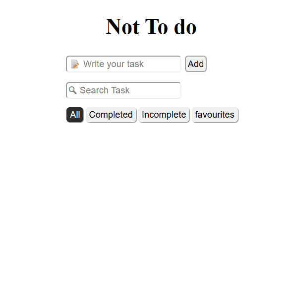

# Vue ToDo App Code

<figure markdown='span'>

</figure>

```html
<script setup lang="ts">
import { ref, computed, watch, onMounted } from 'vue'
import type { Directive } from 'vue'
import type { Task } from '@/types/task.js'

const taskItem = ref('')
const tasks = ref<Task[]>([])

// Creating New Task =======================
//AddTask() : handle the task sent to via form
function addTask() {
  // clear trailing white space
  const taskText = taskItem.value.trim()
  if (!taskText) return

  // add task to item list
  tasks.value.push({
    id: Date.now(),
    text: taskText,
    bookmark: false,
    completed: false,
  })

  taskItem.value = ''
}

// Delete selected task
function deleteTask(id: number) {
  // Revome item that is selected
  tasks.value = tasks.value.filter((t) => t.id !== id)
}

// Editing Task ============================
const editingId = ref(-1)
const editingTask = ref('')

function startEdit(task: Task) {
  editingId.value = task.id
  editingTask.value = task.text
}

function cancelEdit() {
  editingId.value = -1
  editingTask.value = ''
}

function endEdit(task: Task) {
  console.log('editing value = ', editingId.value)
  if (editingId.value !== task.id || editingTask.value === '') return

  const trimmed = editingTask.value.trim()

  // if (!trimmed) deleteTask(task.id)
  task.text = trimmed

  // reset everything back to its original state
  cancelEdit()
}

/** Handle Boolean when editing */
function isEditing(id: Number): Boolean {
  return editingId.value === id
}

// v-focus custom directive
const vFocus: Directive<HTMLInputElement> = {
  mounted: (el) => el.focus(),
}

// handle bookmark toggle
function toggleFav(task: Task) {
  task.bookmark = !task.bookmark
}

// Handle the search values
const search = ref('')
const filters = ['All', 'Completed', 'Incomplete', 'favourites']
const activeFilter = ref(filters[0])

const filteredTask = computed(() => {
  return tasks.value
    .filter((t) => t.text.toLowerCase().includes(search.value.toLowerCase()))
    .filter((t) => {
      if (activeFilter.value === 'Completed') return t.completed
      if (activeFilter.value === 'Incomplete') return !t.completed
      if (activeFilter.value === 'favourites') return t.bookmark
      return true
    })
})

watch(
  tasks,() => {
    localStorage.setItem('tasks-local', JSON.stringify(tasks.value))
  },
  { deep: true },
) // prettier-ignore

onMounted(() => {
  try {
    const stored = localStorage.getItem('tasks-local')
    tasks.value = stored ? JSON.parse(stored) : []
  } catch (error) {
    console.error('Failed to parse localTask: ', error)
  }
})
</script>

<template>
  <main>
    <div class="wrapper">
      <h1>Not To do</h1>
      <div class="input-content">
        <div class="input-item">
          <input
            type="text"
            placeholder="📝 Write your task"
            v-model="taskItem"
            @keyup.enter="addTask"
          />
          <button @click="addTask">Add</button>
        </div>
        <div class="input-item">
          <input type="text" placeholder="🔍︎ Search Task" v-model="search" />
        </div>
        <div class="input-item">
          <button
            class="filter-btn"
            :class="{ active: activeFilter == f }"
            v-for="f in filters"
            :key="f"
            @click="activeFilter = f"
          >
            {{ f }}
          </button>
        </div>
      </div>

      <ul class="task-list">
        <li
          class="task"
          v-for="task in filteredTask"
          :key="task.id"
          :class="{ done: task.completed, editing: editingId === task.id }"
        >
          <template v-if="editingId !== task.id">
            <!-- once the completed checkbox is true, 2-WAY binding ... -->
            <input class="check" type="checkbox" v-model="task.completed" />

            <button class="fav-btn" :class="{ fav: task.bookmark }" @click="toggleFav(task)">
              {{ task.bookmark ? ' ★ ' : '  ☆' }}
            </button>

            <!-- ...the "done" class is actived -->
            <span class="td-text" @click="startEdit(task)">{{ task.text }}</span>

            <button class="delete hover-btn" @click="deleteTask(task.id)">X</button>
          </template>
          <template v-else>
            <input
              type="text"
              class="edit-input"
              name="edit-input"
              v-model="editingTask"
              @keyup.enter="endEdit(task)"
              @keydown.esc="cancelEdit"
              @blur="endEdit(task)"
              v-focus
            />
          </template>
        </li>
      </ul>
    </div>
  </main>
</template>

<style scoped>
.wrapper {
  display: flex;
  justify-content: center;
  align-items: center;
  flex-direction: column;
}

.done {
  text-decoration: line-through;
  color: gray;
}

.input-content {
  display: flex;
  flex-direction: column;
  gap: 10px;
  flex-wrap: nowrap;
}

input[type='text'] {
  border-color: #efefef;
  border-radius: 5px;
  margin: 2px;
  min-height: 20px;
}

.input-content button {
  border: 2px solid #a4a4a4;
  padding: 2.5px;
  border-radius: 5px;
  margin-left: 3px;
}

.input-item .filter-btn {
  border: 0px solid white;
  padding: 3px 5px;
  box-shadow: 1px 1px 1px #7a7a7a;
}

.filter-btn.active {
  background-color: #2f2f2f;
  color: white;
}

ul.task-list {
  display: flex;
  justify-content: center;
  flex-direction: column;
  padding-left: 0;
  min-width: 200px;
}

.task-list li {
  display: flex;
  justify-content: flex-start;
  align-items: center;
  gap: 10px;
  list-style: none;
  border: 1px solid rgb(193, 193, 193);
  border-radius: 3px;
  padding: 2px;
}

.task-list li .delete {
  margin-right: 10px;
  background-color: brown;
  color: wheat;
  max-width: 30px;
  max-height: 30px;
  border-radius: 5px;
  margin-left: auto;
}

.task-list li .td-text {
  max-width: 70px;
  flex-grow: 2;
  overflow: hidden;
}

.hover-btn {
  opacity: 0;
  visibility: hidden;
  transition:
    visibility 0.3s,
    opacity 0.3s;
}

.task:hover .hover-btn {
  opacity: 1;
  visibility: visible;
}

.task {
  background-color: azure;
  transition: background-color 0.3s;
}

.task:hover {
  background-color: bisque;
}

.fav-btn {
  background: none;
  border: none;
  cursor: pointer;
  font-size: 1.2rem;
  color: rgb(149, 149, 149);
}

.fav {
  color: #f6c90e;
}

.fav-btn:hover,
.fav:hover {
  transform: scale(1.2);
}
</style>

```
