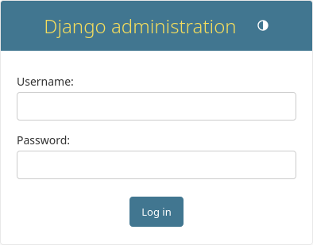

# Getting Started with Django

## Install python on your machine

-  Ensure that python is properly installed

## Creating First Django Project 

!!! note
    This part is following [tutorial from official django](https://docs.djangoproject.com/en/6.1/intro/tutorial01/) page
        
In directory you want to work in run the following command:

```powershell
    django-admin startproject prodman djangotutorial
```

Let’s look at what startproject created:

```
djangotutorial/
    manage.py
    prodman/
        __init__.py
        settings.py
        urls.py
        asgi.py
        wsgi.py

```

- Run `python manage.py runserver`  and ignore any warning about migration etc,
You will have access to launch from a port `http://127.0.0.1:8000/`


## Creating the Poll app

`python manage.py startapp poll`

directory structure:
```
poll/
    __init__.py
    admin.py
    apps.py
    migrations/
        __init__.py
    models.py
    tests.py
    views.py
```

### Writing first View

```py title="views.py"
from django.http import HttpResponse


def index(request):
    return HttpResponse("Hello, world. You're at the polls index.")
```

To define a URLconf for the **polls** app, create a file **polls/urls.py** with the following content:

```py title="poll/urls.py"
from django.urls import path

from . import views

urlpatterns = [
    path("", views.index, name="index"),
]
```

Configure the root URLconf in the mysite project to include the URLconf defined in **polls.urls**. To do this, add an import for **django.urls.include** in **mysite/urls.py** and insert an `include()`

```py title="prodman/urls.py"
from django.contrib import admin
from django.urls import include, path

urlpatterns = [
    path("polls/", include("polls.urls")),
    path("admin/", admin.site.urls),
]
```
View the Index : ` python manage.py runserver`

## Basic Database Setup

By default, the **DATABASES** configuration uses SQLite. If you’re new to databases, or you’re just interested in trying Django, this is the easiest choice. SQLite is included in Python, so you won’t need to install anything else to support your database.

!!! warning "Important Edit"
    While you’re editing **mysite/settings.py**, set **`TIME_ZONE`** to your time zone.

### Creating Models

In our poll app, we’ll create two models: `Question` and `Choice`. A `Question` has a question and a publication date. A `Choice` has two fields: the text of the choice and a vote tally. Each `Choice` is associated with a `Question`.

```py title="polls/models.py"
from django.db import models


class Question(models.Model):
    question_text = models.CharField(max_length=200)
    pub_date = models.DateTimeField("date published")


class Choice(models.Model):
    question = models.ForeignKey(Question, on_delete=models.CASCADE)
    choice_text = models.CharField(max_length=200)
    votes = models.IntegerField(default=0)
```

To include the app in our project, we need to add a reference to its configuration class in the `INSTALLED_APPS` setting. The `PollsConfig` class is in the **polls/apps.py** file, so its dotted path is **'polls.apps.PollsConfig'**. Edit the **mysite/settings.py** file and add that dotted path to the `INSTALLED_APPS` setting. It’ll look like this:

```py title="prodman/settings.py"
INSTALLED_APPS = [
    "polls.apps.PollConfig",
    "django.contrib.admin",
    "django.contrib.auth",
    "django.contrib.contenttypes",
    "django.contrib.sessions",
    "django.contrib.messages",
    "django.contrib.staticfiles",
]
```
Now Django know to include the **polls** app

```powershell
python manage.py makemigrations polls
python manage.py migrate
```
If you’re interested, you can also run `python manage.py check`; this checks for any problems in your project without making migrations or touching the database.

`python manage.py shell`

```powershell
# No questions are in the system yet.
>>> Question.objects.all()
<QuerySet []>

# Create a new Question.
# Support for time zones is enabled in the default settings file, so
# Django expects a datetime with tzinfo for pub_date. Use timezone.now()
# instead of datetime.datetime.now() and it will do the right thing.
>>> from django.utils import timezone
>>> q = Question(question_text="What's new?", pub_date=timezone.now())

# Save the object into the database. You have to call save() explicitly.
>>> q.save()

# Now it has an ID.
>>> q.id
1

# Access model field values via Python attributes.
>>> q.question_text
"What's new?"
>>> q.pub_date
datetime.datetime(2012, 2, 26, 13, 0, 0, 775217, tzinfo=datetime.UTC)

# Change values by changing the attributes, then calling save().
>>> q.question_text = "What's up?"
>>> q.save()

# objects.all() displays all the questions in the database.
>>> Question.objects.all()
# <QuerySet [<Question: Question object (1)>]>
```

```py
from django.db import models


class Question(models.Model):
    # ...
    def __str__(self):
        return self.question_text

    def was_published_recently(self):
        return self.pub_date >= timezone.now() - datetime.timedelta(days=1)


class Choice(models.Model):
    # ...
    def __str__(self):
        return self.choice_text
```

!!! note
    In the Python Django shell, the equivalent of JavaScript's .includes() is the __contains or __icontains field lookup.
    To filter your query, you should use Question.objects.filter(question_text__icontains="you").
    The Differences
    * __icontains (Recommended): This is case-insensitive. It will match "you", "You", "YOU", etc.
    * __contains: This is case-sensitive. It will only match the exact lowercase string "you".

    ```py
    Question.objects.filter(question_text__icontains="you") 
    # <QuerySet [<Question: question: How old are you, pub. date: 2026-10-03 08:58:29.241040+00:00
    ```


### Error Fixing 

The error happens because `get()` can only return exactly one object. 
Since there are 2 Question objects published in your `current_year`, Django throws a *`MultipleObjectsReturned` exception.*
Depending on what you actually want to do with those two questions, you have a few ways to fix this:

**Option 1: Keep all matching records**
If you want to look at or loop through all the questions published this year, swap `.get()` for `.filter()`.

```py
# Returns a QuerySet containing all matching questions
questions = Question.objects.filter(published_date__year=current_year)

```

**Option 2: Get only the very first or latest record**
If you only care about one specific question out of the duplicates, combine `.filter()` with `.first()` or `.last()`. This will safely return a single object (or None if none exist) without crashing.

```py
# Gets the oldest one created this year
first_question = Question.objects.filter(published_date__year=current_year).first()

# Gets the newest one created this year (if ordered by date)
latest_question = Question.objects.filter(published_date__year=current_year).latest('published_date')

```

**Option 3: Narrow down your search**
If you truly only wanted one specific question, your search criteria is too broad. Add more specific fields inside `.get()` to pinpoint the exact row.

```py
# Narrowing down by adding another unique field like title or id
question = Question.objects.get(published_date__year=current_year, id=1)

```

```py
>>> ChoiceSelection.objects.filter(question__published_date__year=current_year)

# Delete a choiceselection
>>> c = q2.choiceselection_set.filter(choice_text__icontains="Nacking")
>>> c.delete()
# (1, {'poll.ChoiceSelection': 1})

>>> q2.choiceselection_set.all()
# <QuerySet [
#   <ChoiceSelection: choice: Not Much votes: 0>, 
#   <ChoiceSelection: choice: Too Much votes: 0>, 
#   <ChoiceSelection: choice: the Sky votes: 0>,
# ]>
```

## Creating admin SuperUser

First we’ll need to create a user who can login to the admin site. Run the following command:

```sh
python manage.py createsuperuser

Username: admin
# You will then be prompted for your desired email address:

Email address: admin@example.com

password: ******
```




### Make the poll app modifiable in the admin

```py title="poll/admin.py"
from django.contrib import admin

from .models import Question

admin.site.register(Question)
```

## Loading HTML template

```py title="polls/views.py"
from django.shortcuts import get_object_or_404, render

from .models import Question


def index(request):
    latest_question_list = Question.objects.order_by("-pub_date")[:5]
    context = {"latest_question_list": latest_question_list}
    return render(request, "polls/index.html", context)


def detail(request, question_id):
    question = get_object_or_404(Question, pk=question_id)
    return render(request, "polls/detail.html", {"question": question})
```

### Use the template system

```html title="poll/templates/polls/detail.html"
<h1>{{ question.question_text }}</h1>
<ul>

    <li>{{ choice.choice_text }}</li>

</ul>
```

### Removing hardcoded URLs in templates with Namespaces

To avoid clashing on names when you have alot of apps in your project, we introduces namespace into ur **poll/urls.py**

```py title="poll/urls.py" hl_lines="4"
from django.urls import path
from . import views

app_name = "polls"
urlpatterns = [
    path("", views.index, name="index"),
    path("<int:question_id>/", views.detail, name="detail"),
    path("<int:question_id>/results/", views.results, name="results"),
    path("<int:question_id>/vote/", views.vote, name="vote"),
]
```

Now change your polls/index.html template from:
```py
<li><a href="">{{ question.question_text }}</a></li>
```

to point at the namespaced detail view:
```py
<li><a href="">{{ question.question_text }}</a></li>
```


## Writing Minimal Form

```py title="poll/templates/polls/detail.html"
<form action="" method="post">

<fieldset>
    <legend><h1>{{ question.question_text }}</h1></legend>
    <p><strong>{{ error_message }}</strong></p>
    
        <input type="radio" name="choice" id="choice{{ forloop.counter }}" value="{{ choice.id }}">
        <label for="choice{{ forloop.counter }}">{{ choice.choice_text }}</label><br>
    
</fieldset>
<input type="submit" value="Vote">
</form>
```

based on the url path {route} we created prior"
```py title="poll/urls.py"
path("<int:question_id>/vote/", views.vote, name="vote"),
```

We will create , we will create a real update on vote:

```py title="poll/views.py"
from django.db.models import F
from django.http import HttpResponse, HttpResponseRedirect
from django.shortcuts import get_object_or_404, render
from django.urls import reverse

from .models import Choice, Question


# ...
def vote(request, question_id):
    question = get_object_or_404(Question, pk=question_id)
    try:
        selected_choice = question.choice_set.get(pk=request.POST["choice"])
    except (KeyError, Choice.DoesNotExist):
        # Redisplay the question voting form.
        return render(
            request,
            "polls/detail.html",
            {
                "question": question,
                "error_message": "You didn't select a choice.",
            },
        )
    else:
        selected_choice.votes = F("votes") + 1
        selected_choice.save()
        # Always return an HttpResponseRedirect after successfully dealing
        # with POST data. This prevents data from being posted twice if a
        # user hits the Back button.
        return HttpResponseRedirect(reverse("polls:results", args=(question.id,)))
```

After somebody votes in a question, the vote() view redirects to the results page for the question. Let’s write that view:

```py title="poll/views.py"
from django.shortcuts import get_object_or_404, render


def results(request, question_id):
    question = get_object_or_404(Question, pk=question_id)
    return render(request, "polls/results.html", {"question": question})
```

Now, create a polls/results.html template:

```py title="poll/templates/polls/results.html"

<h1>{{ question.question_text }}</h1>

<ul>

    <li>{{ choice.choice_text }} -- {{ choice.votes }} vote{{ choice.votes|pluralize }}</li>

</ul>

<a href="">Vote again?</a>
```

## Use generic views: Less code is better

These views represent a common case of basic web development: getting data from the database according to a parameter passed in the URL, loading a template and returning the rendered template. Because this is so common, Django provides a shortcut, called the “generic views” system.

Generic views abstract common patterns to the point where you don’t even need to write Python code to write an app. For example, the **ListView** and **DetailView** generic views abstract the concepts of “display a list of objects” and “display a detail page for a particular type of object” respectively.

### Amend URLconf

```py title="poll/urls.py"

from django.urls import path
from . import views

app_name = "polls"
urlpatterns = [
    path("", views.IndexView.as_view(), name="index"),
    path("<int:pk>/", views.DetailView.as_view(), name="detail"),
    path("<int:pk>/results/", views.ResultsView.as_view(), name="results"),
    path("<int:question_id>/vote/", views.vote, name="vote"),
]
```
Note that the name of the matched pattern in the path strings of the second and third patterns has changed from `<question_id> `to `<pk>`. This is necessary because we’ll use the **DetailView** generic view to replace our `detail()` and `results()` views, and it expects the primary key value captured from the URL to be called "`pk`".

### Amend views

```py title="poll/views.py"

from django.db.models import F
from django.http import HttpResponseRedirect
from django.shortcuts import get_object_or_404, render
from django.urls import reverse
from django.views import generic

from .models import Choice, Question


class IndexView(generic.ListView):
    template_name = "polls/index.html"
    context_object_name = "latest_question_list"

    def get_queryset(self):
        """Return the last five published questions."""
        return Question.objects.order_by("-pub_date")[:5]


class DetailView(generic.DetailView):
    model = Question
    template_name = "polls/detail.html"


class ResultsView(generic.DetailView):
    model = Question
    template_name = "polls/results.html"


def vote(request, question_id):
    # same as above, no changes needed.
    ...
```

### Handling Multi-Context Example code

1. View Example:
    Here is how you inject multiple context objects into your specific `IndexView`. You will override the `get_context_data` method, call `super()`, and add your extra data to the context dictionary

    ```py
    from django.views import generic
    from .models import Question, Category  # Assuming you have another model like Category

    class IndexView(generic.ListView):
        template_name = "polls/index.html"
        context_object_name = "latest_question_list"

        def get_queryset(self):
            """Return the last five published questions."""
            return Question.objects.order_by("-pub_date")[:5]

        def get_context_data(self, **kwargs):
            # 1. Get the existing context (which already contains latest_question_list)
            context = super().get_context_data(**kwargs)
            
            # 2. Add your additional context objects here
            context["all_categories"] = Category.objects.all()
            context["featured_poll"] = Question.objects.filter(is_featured=True).first()
            
            # 3. Return the updated context dictionary
            return context
    ```

2. How the Html will look now

    ```html title="poll/templates/polls/index.html"
        <!-- Primary context from ListView -->
        <h2>Latest Questions</h2>
        <ul>
            
                <li>{{ question.question_text }}</li>
            
        </ul>

        <!-- Additional context added via get_context_data -->
        <h2>Poll Categories</h2>
        <ul>
            
                <li>{{ category.name }}</li>
            
        </ul>

    ```

Each generic view needs to know what model it will be acting upon. This is provided using either the model attribute (in this example, `model = Question` for `DetailView` and `ResultsView`) or by defining the `get_queryset()` method (as shown in IndexView).

By default, the `DetailView` generic view uses a template called *`<app name>/<model name>_detail.html`*. In our case, it would use the template *"polls/question_detail.html"*. The template_name attribute is used to tell Django to use a specific template name instead of the autogenerated default template name. We also specify the `template_name` for the results list view – this ensures that the results view and the detail view have a different appearance when rendered, even though they’re both a `DetailView` behind the scenes.

Similarly, the `ListView` generic view uses a default template called *`<app name>/<model name>_list.html`*; we use `template_name` to tell ListView to use our existing "polls/index.html" template.

In previous parts of the tutorial, the templates have been provided with a context that contains the question and `latest_question_list` context variables. 

For `DetailView` the question variable is provided automatically – since we’re using a Django model (Question), Django is able to determine an appropriate name for the context variable. (In my own actual case, I have to create a new `context_object_name=q` for `DetailView` and `ResultView` since I am using `q` as context name)

```py hl_lines="4 9"
class DetailView(generic.DetailView):
    model = Question
    template_name = "polls/detail.html"
    context_object_name = "q"

class ResultsView(generic.DetailView):
    model = Question
    template_name = "polls/results.html"
    context_object_name = "q"

```

However, for `ListView`, the automatically generated context variable is `question_list`. 
To override this we provide the `context_object_name` attribute, specifying that we want to use `latest_question_list `instead. As an alternative approach, you could change your templates to match the new default context variables – but it’s a lot easier to tell Django to use the variable you want.

