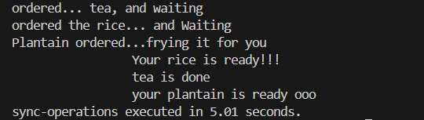

# Asyncronous and Multithreading in Python

## Asyncronous Programming

This is a way of run program where functions are run not in the sequential manner but simultaneous, i.e at the same time.

This is good for when a program requires or requesting from external resources and there might be downtime, wait time etc.

```py
import time
import asyncio

async def order_tea():
    print("ordered... tea, and waiting")
    await asyncio.sleep(3)
    print("\t\t tea is done")

async def order_rice():
    print("ordered the rice... and Waiting")
    await asyncio.sleep(2)
    print("\t\t Your rice is ready!!!")

async def order_plantain():
    print("Plantain ordered...frying it for you")
    await asyncio.sleep(4)
    print("\t\t your plantain is ready ooo")

async def main():
    await asyncio.gather(order_tea(),order_rice(), order_plantain())


if __name__ == "__main__":
    s = time.perf_counter()
    asyncio.run(main())
    elapsed = time.perf_counter() - s

    print(f"sync-operations executed in {elapsed:0.2f} seconds.")
```



