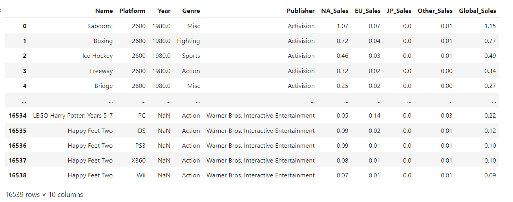
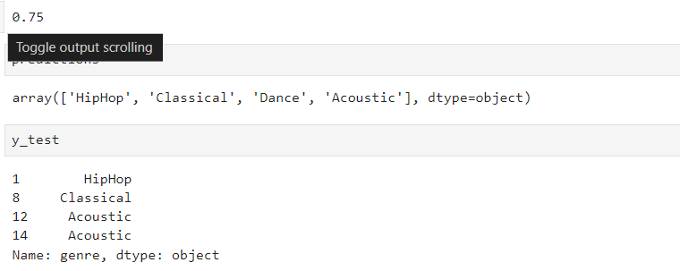
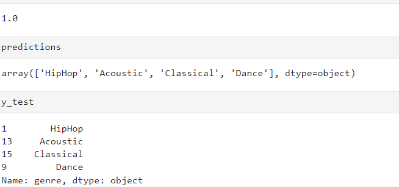

# Basics of Machine Learning

## Import files using Pandas and Jupyter notebook

```python
import pandas as pd
df = pd.read_csv('vgsales.csv')
df2 = pd.read_excel('bookkeeping2.xlsx') # read excel file
df

df.shape # Result: (16539, 10)
```

Result :


`df.describe()` This returns a summary values of the record, basic statistics

`df.values` this returns all the records as two dimension arrays

### Loading the data

```python
# Loading our data
import pandas as pd
music_data = pd.read_csv('music.csv')
```

Here is the data [music.csv](data/music.csv)
(NOTE : Data from Mosh Tutorial on youtube)

### Split the data into X(input) and y(output)

```python
# INPUT : Remove a column from record
X = music_data.drop(columns=['genre'])

# OUTPUT : genre
y =music_data['genre']
```

### Learning and training with DecisionTree

```python
from sklearn.tree import DecisionTreeClassifier

# Training our model
model = DecisionTreeClassifier()
model.fit(X, y)

# Predicting
predictions = model.predict([[27, 1], [32,0]])
predictions
```

### Testing the accuracy of our Predictions

Here we introduce a new module from sklearn. That is the `train_test_split`  and `accurracy_score` function to help with this.

```python
import pandas as pd
from sklearn.tree import DecisionTreeClassifier
from sklearn.model_selection import train_test_split
from sklearn.metrics import accuracy_score

music_data = pd.read_csv('music.csv')
X = music_data.drop(columns=['genre'])
y =music_data['genre']

# Split our data into train data and test data
X_train, X_test, y_train, y_test = train_test_split(X, y, test_size=0.2)

# Training our model
model = DecisionTreeClassifier()
model.fit(X_train, y_train)

# Predicting
predictions = model.predict(X_test)

# Check for accuracy
score = accuracy_score(y_test, predictions)
score
```

Here are some of the outputs:

