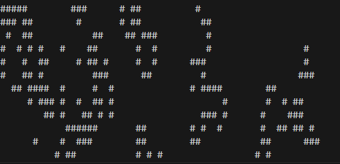

# Code Examples

## Conway's Game of Life

```py
# Conway's Game of Life

import random, time, copy

WIDTH = 60
HEIGHT = 20

# create a list of list for the cells:
nextCells = []
for x in range(WIDTH):
    column = [] # Create a new column
    for y in range(HEIGHT):
        if random.randint(0,1) == 0:
            column.append('#') # Add a living cell
        else:
            column.append(' ') # Add a dead cell
    nextCells.append(column) # nextCells is a list of column lists.

while True: # Main program loop
    print('\n'*5) # Seperate each step with newlines
    currentCells = copy.deepcopy(nextCells)

    # Print currentCells on the screen:
    for y in range(HEIGHT):
        for x in range(WIDTH):
            print(currentCells[x][y], end='') # Print # or space
        print() # Print a newline at the end of the row

    # Calculate the next step's cell based on current step's cells:
    for x in range(WIDTH):
        for y in range(HEIGHT):
            # Get neighbouring coordinates
            # '% WIDTH' ensures leftCoord is always between 0 and WIDTH - 1
            leftCoord = (x - 1) % WIDTH
            rightCoord = (x + 1) % WIDTH
            aboveCoord = (y - 1) % HEIGHT
            belowCoord = (y + 1) % HEIGHT

            # Count number of living neighbors
            numNeighbours = 0
            if currentCells[leftCoord][aboveCoord] == '#':
                numNeighbours += 1 # Top left neighbor is alive
            if currentCells[x][aboveCoord] == '#':
                numNeighbours += 1 # Top neighbor is alive
            if currentCells[rightCoord][aboveCoord] == '#':
                numNeighbours += 1 # Top right neighbor is alive
            if currentCells[leftCoord][y] == '#':
                numNeighbours += 1 # Left neighbor is alive
            if currentCells [rightCoord][y] == '#':
                numNeighbours += 1 # right neighbor is alive
            if currentCells[leftCoord][belowCoord] == '#':
                numNeighbours += 1 # Bottom-left neighbor is alive
            if currentCells[x][belowCoord] == '#':
                numNeighbours += 1 # Bottom neighbor is alive
            if currentCells[rightCoord][belowCoord] == '#':
                numNeighbours += 1 # Bottom-right neighbor is alive

            # Set cell based on Conway's Game of life rules:
            if currentCells[x][y] == '#' and (numNeighbours == 2 or numNeighbours == 3):
                # living cells with 2 or 3 neighbors stay alive
                nextCells[x][y] = '#'
            elif currentCells[x][y] == ' ' and numNeighbours == 3:
                # Dead cells with 3 neighbors become alive:
                nextCells[x][y] = '#'
            else:
                # Everything else dies or stays dead:
                nextCells[x][y] = ' '

    time.sleep(1) # Add a 1-second pause or reduce flickering
```



## Ceaser Cypher

This is based on tutorial offered by Angela Yu

### Version 1:

```py
alphabet = ['a', 'b', 'c', 'd', 'e', 'f', 'g', 'h', 'i', 'j', 'k', 'l', 
            'm', 'n', 'o', 'p', 'q', 'r', 's', 't', 'u', 'v', 'w', 'x', 'y', 'z',' ']


# function 'encrypt' that takes the 'text' and 'shift' as inputs.
def encrypt(plain_text, shift_amount):

    #shift each letter of the 'text' forwards in the alphabet by the shift 
    # amount and print the encrypted text.  
    encode_text=""
    for letter in plain_text:
        new_index = alphabet.index(letter) + shift_amount # shift the index
        
        if(new_index > len(alphabet)-1): # if index is out of range
            new_index = (new_index % (len(alphabet))) # circle back to begin index
        
        encode_text += alphabet[new_index]

    print(encode_text)

# function 'decrypt' takes text and shift amount
def decrypt(cipher_text, shift_amount):
     
     decode_text=""
     for letter in cipher_text:
        orig_index = alphabet.index(letter) - shift_amount # shift the index
        
        if(orig_index < 0): # index in -ve
            orig_index = (len(alphabet)) + orig_index # go to end index
        
        decode_text += alphabet[orig_index]
    
     print(decode_text)

def user_direction():

    direction = input("Type 'encode' to encrypt, type 'decode' to decrypt:\n")
    text = input("Type your message:\n").lower()
    shift = int(input("Type the shift number:\n"))

    if direction == "encode":
        encrypt(plain_text=text, shift_amount=shift) 
    elif direction == "decode":
        decrypt(cipher_text=text, shift_amount=shift)

user_direction()

```

### Version 2 : My version

```py
alphabet = ['a', 'b', 'c', 'd', 'e', 'f', 'g', 'h', 'i', 'j', 'k', 'l', 
            'm', 'n', 'o', 'p', 'q', 'r', 's', 't', 'u', 'v', 'w', 'x', 'y', 'z',' ']

# ceaser function 'encrpyt' and 'decrpyt' text
def ceasar(cipher_direction, input_text, shift_amount):

    cypher_text=""

    for letter in input_text:
        if cipher_direction == "encode":
            new_index = alphabet.index(letter) + shift_amount # shift the index
        
            if(new_index > len(alphabet)-1): # if index is out of range
                new_index = (new_index % (len(alphabet))) # circle back to begin index
        
    
        elif cipher_direction == "decode":
            new_index = alphabet.index(letter) - shift_amount # shift the index
        
            if(new_index < 0): # index in -ve
                new_index = (len(alphabet)) + new_index # go to end index
        
        cypher_text += alphabet[new_index]
   
    print(f"The {cipher_direction}d text is {cypher_text}")


def user_direction():

    direction = input("Type 'encode' to encrypt, type 'decode' to decrypt:\n")
    text = input("Type your message:\n").lower()
    shift = int(input("Type the shift number:\n"))

    ceasar(direction, input_text=text, shift_amount=shift) 
    
user_direction()
```

### Version 3: Final

```py

alphabet = ['a', 'b', 'c', 'd', 'e', 'f', 'g', 'h', 'i', 'j', 'k', 'l', 
            'm', 'n', 'o', 'p', 'q', 'r', 's', 't', 'u', 'v', 'w', 'x', 'y', 'z',' ']

from art import ceaser_logo


# ceaser function 'encrpyt' and 'decrpyt' text
def ceasar(cipher_direction, input_text, shift_amount):

    cypher_text=""

    for char in input_text:

        if char in alphabet: 
            position = alphabet.index(char) 

            if cipher_direction == "decode": 
                new_position = position - shift_amount
                if(new_position < 0): # index in -ve
                    new_position = (len(alphabet)) + new_position # go to end index

            elif cipher_direction == "encode":
                new_position = position + shift_amount
                if(new_position > len(alphabet)-1): # if index is out of range
                    new_position = (new_position % (len(alphabet))) # circle back to begin index
                
            cypher_text += alphabet[new_position]
        else:
            cypher_text += char
   
    print(f"The {cipher_direction}d text is <<{cypher_text}>>")


def main():
    print(ceaser_logo)

    terminal="Y"
    while(terminal != "N" ):
        direction = input("Type 'encode' to encrypt, type 'decode' to decrypt:\n")
        if(direction != "encode" and direction != "decode"):
            print(f"{direction} is not acceptable type 'encode' or 'decode'" )
            continue

        text = input("Type your message:\n").lower()

        shift = int(input("Type the shift number:\n")) % len(alphabet)

        ceasar(direction, input_text=text, shift_amount=shift) 

        terminal= input("Type 'Y' to start or 'N' to exit:\n ").upper()
    
main()

```

## Black Jack Card game

```py
import random
import os 
from art import blackjack_logo

# cards
def deal_card():
    """Deal random cards"""
    cards = [11, 2, 3, 4, 5, 6, 7, 8, 9, 10, 10, 10]
    card = random.choice(cards)
    return card

def calculate_score(cards):
    """Take a list of cards and returns the score cal. from cards """
    if sum(cards) == 21 and len(cards) == 2:
        return 0 # score of blackjack
    
    # Ace card use case
    if 11 in cards and sum(cards) > 21:
        cards.remove(11)
        cards.append(1)
    return sum(cards)

def compare(user_sc, computer_sc):
    if user_sc == computer_sc:
        return "Draw Scores"
    elif computer_sc == 0:
        return "You Lose, opponent has blackjack"
    elif user_sc == 0:
        return "You Win with a blackjack"
    elif user_sc > 21:
        return "You went over, you lose"
    elif computer_sc > 21:
        return "Opponent went over, You win"
    elif user_sc > computer_sc:
        return "You win"
    else:
        return "You lose"


def play_game():

    print(blackjack_logo)

    user_cards = []
    computer_cards = []
    is_game_over = False

    for _ in range(2):
        user_cards.append(deal_card())
        computer_cards.append(deal_card())

    # for the users
    while not is_game_over:
        # if the user or computer has blackjack(0) or if the score is over 21, game ends
        user_score = calculate_score(user_cards)
        computer_score = calculate_score(computer_cards)
        print(f"  Your cards: {user_cards}, current score: {user_score}")
        print(f"  Computer's first card: {computer_cards[0]}")

        if user_score == 0 or computer_score == 0 or user_score > 21:
            is_game_over = True 
        else:
            user_should_deal = input(" Type 'y' to get another card, type 'n' to pass: ")
            if user_should_deal == 'y':
                user_cards.append(deal_card())
            else:
                is_game_over = True


    # case of computer card deal
    while computer_score != 0 and computer_score < 17:
        computer_cards.append(deal_card())
        computer_score = calculate_score(computer_cards)

    # print game details
    print(f" Your final hand: {user_cards}, final score: {user_score}")
    print(f" Computer's final hand: {computer_cards}, final score: {computer_score}")
    # compare the computer and user score
    print(compare(user_sc=user_score, computer_sc=computer_score))

play_game()

while input("Do you want to keep playing the game? y/n:") == 'y':
    os.system('cls')
    play_game()

```

## Guess Game

```py

from random import randint

EASY_LEVEL_LIFE = 10
HARD_LEVEL_LIFE = 5

def check_answer(guess, answer, turns):
    """check answer angainst guess, return the 'turns' """
    if guess > answer:
        print("Too high")
        return turns - 1

    elif guess < answer:
        print("Too low")
        return turns - 1
    else:
        print(f"You got it! The answer is {answer}")
        return turns


def set_difficulty():
    level = input("Choose a difficulty, Type 'easy' or 'hard'")
    if level == 'easy':
        return EASY_LEVEL_LIFE
    else:
        return HARD_LEVEL_LIFE

    

def guess_game():
    print("Welcome to the Number Guessing Game!")
    print("I'm thinking of a number between 1 and 100")
    # let computer guess
    computer_ans = randint(1, 100)
    # print(f"DEV::the correct answer is {computer_ans}")

    turns = set_difficulty()

    # repeat the guessing functionality 
    user_guess = 0
    while user_guess != computer_ans:
        # Notify the number of life left
        print(f"You have {turns} turns left")

        #Let the user guess a number
        user_guess = int(input("What is the number: "))

        # Check if the number guessed is correct
        turns = check_answer(turns=turns, guess=user_guess, answer=computer_ans)

        if turns == 0:
            print("You run out of guesses, Your Loss")
            return
        elif user_guess != computer_ans:
            print("Guess again!\n")

guess_game()
```

## HigherLower My Version

```py


from game_data import hl_data
import random


# fetch ig data at random
def gen_random_account():
    """Generate two ig account at random, returns the data"""
    return random.choice(hl_data)


# function to check whose data is greater
def check_user_guess(data1, data2, guess):
    """Check whose followers is greater and returns the greater data"""

    if guess == 'H' and data2["follower_count"] > data1["follower_count"]:
        print(f"Correct, {data2['name']}, followers: {data2['follower_count']} > {data1['name']}, followers: {data1['follower_count']}\n")
    
    elif guess == 'L' and data2["follower_count"] < data1["follower_count"]:
        print(f"Correct, {data2['name']}, followers: {data2['follower_count']} < {data1['name']}, followers: {data1['follower_count']}\n")
    
    elif guess == 'H' and data2["follower_count"] < data1["follower_count"]:
        print(f"Wrong, {data2['name']}, followers: {data2['follower_count']} < {data1['name']}, followers: {data1['follower_count']}\n")
        return
    
    elif guess == 'L' and data2["follower_count"] > data1["follower_count"]:
        print(f"Wrong, {data2['name']}, followers: {data2['follower_count']} > {data1['name']}, followers: {data1['follower_count']}\n")
        return
    
    return data2


user_score = 0
   
# data 1, data 2
current_data = gen_random_account()

while current_data != None:

    next_data = gen_random_account()

    # Case of same data, get new random acct.
    if current_data == next_data:
        next_data = gen_random_account()

    # Ask user which is greater data1 or data 2
    user_suggest = input(f"\nthe acct. A=>  {current_data['name']} has {current_data['follower_count']} Million follwers,\nand acct. B=> is {next_data['name']}, is B Higer or Lower(H\L): ").upper()

    current_data = check_user_guess(data1=current_data, data2=next_data, guess=user_suggest)
    if current_data == None:
        print("sorry! You Lose, Your score is ", user_score )
    else:
        user_score+= 1

```
